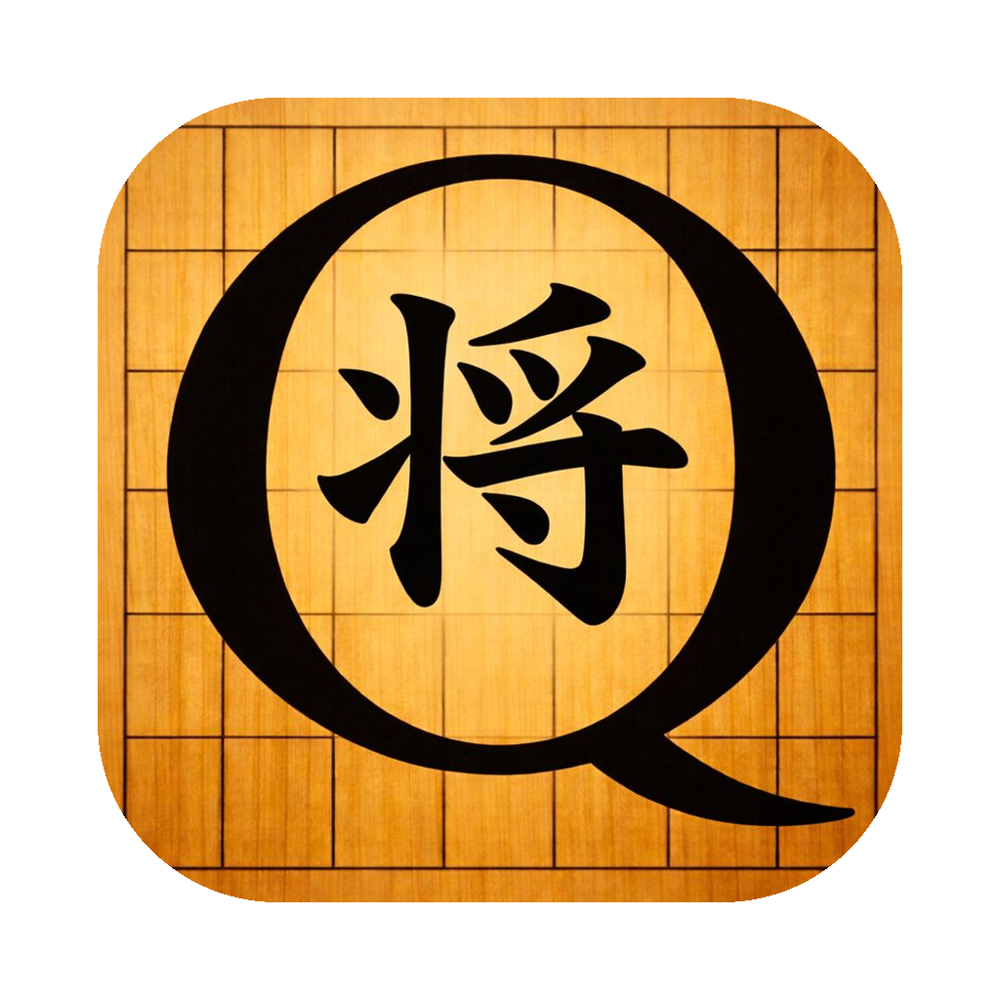

<p align="center">
  
</p>

<h1 align="center">ShogiBoardQ</h1>

<p align="center">Qt6で作られた将棋対局・解析ソフト</p>

<p align="center">
  <code>Qt 6</code>&nbsp;
  <code>C++17</code>&nbsp;
  <code>USI対応</code>&nbsp;
  <code>CSA通信対局</code>&nbsp;
  <code>日本語 / English</code>
</p>

## 画面イメージ

将棋盤・棋譜・解析情報を一画面に統合


メイン画面：将棋盤・棋譜一覧・エンジン解析（検討モード）を統合表示


読み筋表示ウィンドウ：エンジンの読み筋を将棋盤上で再生

## 主な機能

将棋の対局・研究に必要な機能を幅広くサポート

- **対局機能** - 人間 vs エンジン、エンジン vs エンジン、人間 vs 人間の対局に対応。USIプロトコル準拠のエンジンを利用できます。
- **棋譜管理** - KIF / KI2 / CSA / USI / SFEN / JKF など主要な棋譜フォーマットの読み込み・書き出しに対応。分岐棋譜も扱えます。
- **棋譜解析** - USIエンジンによる棋譜解析機能。各手の評価値をグラフ表示し、形勢の推移を視覚的に把握できます。
- **検討モード** - 任意の局面でエンジンに候補手を検討させるモード。複数の読み筋を同時に表示できます。
- **詰将棋探索** - エンジンによる詰み探索機能。詰みがある局面で詰み手順を表示します。
- **CSA通信対局** - CSAプロトコルに対応したサーバーとのネットワーク対局が可能。floodgateなどに接続できます。
- **盤面編集** - 自由に駒を配置して任意の局面を作成。作成した局面から対局や解析を開始できます。
- **画像エクスポート** - 現在の盤面を画像ファイルとしてエクスポート。ブログや解説記事への掲載に便利です。
- **多言語対応** - 日本語と英語のUIに対応。アプリケーションの言語設定で切り替えられます。

## 動作環境・ビルド方法

### 必要な環境

| 項目 | 内容 |
|------|------|
| **Qt 6** | Widgets, Charts, Network, LinguistTools |
| **C++17** | 対応コンパイラ |
| **CMake 3.16+** | ビルドシステム |

### ビルド手順

```bash
# ソースの取得
git clone https://github.com/hnakada123/ShogiBoardQ.git
cd ShogiBoardQ

# ビルド
cmake -B build -S .
cmake --build build

# 実行
./build/ShogiBoardQ
```
