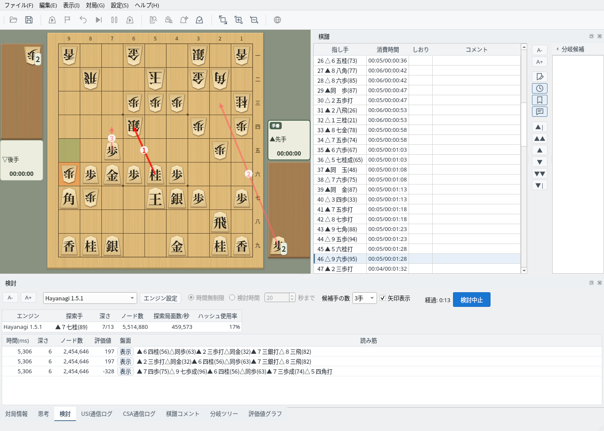
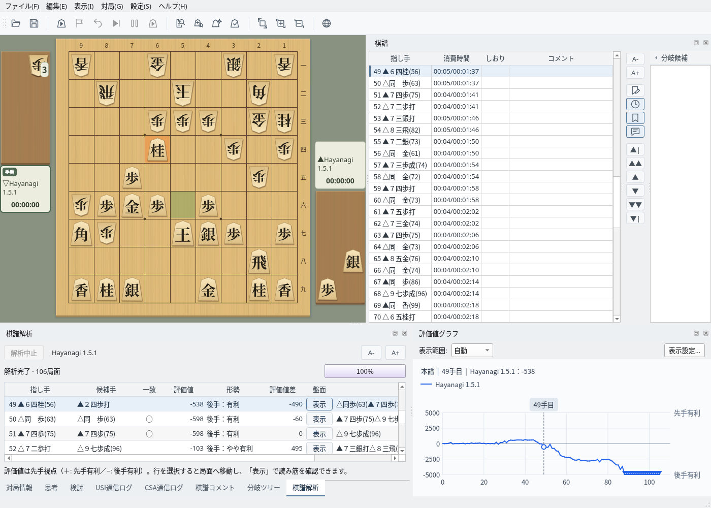
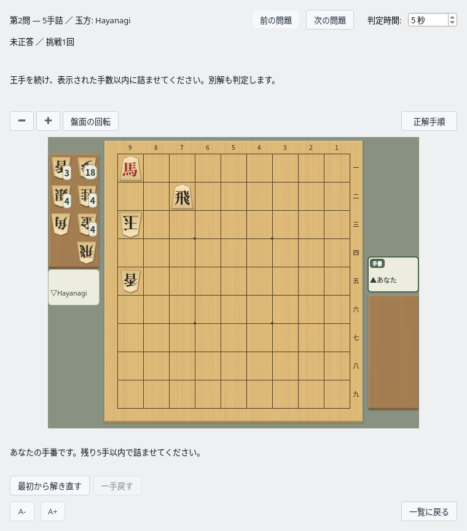

<p align="center">
  
</p>

<h1 align="center">ShogiBoardQ</h1>

<p align="center">将棋の対局・検討・棋譜解析・詰将棋ソフト</p>

<p align="center">
  <a href="https://hnakada123.github.io/ShogiBoardQ/">Webサイト</a>&nbsp;|&nbsp;
  <a href="https://hnakada123.github.io/ShogiBoardQ/guide/index.html">利用ガイド</a>&nbsp;|&nbsp;
  <a href="https://github.com/hnakada123/ShogiBoardQ/releases">ダウンロード（リリース）</a>
</p>

<p align="center">
  <code>Qt 6.7+</code>&nbsp;
  <code>C++17</code>&nbsp;
  <code>USI対応</code>&nbsp;
  <code>CSA通信対局</code>&nbsp;
  <code>Windows / macOS / Linux</code>&nbsp;
  <code>日本語 / English / 简体中文 / 繁體中文</code>
</p>

ShogiBoardQ は、USI エンジンとの対局・検討・棋譜解析、6,000題の詰将棋、40種類の駒と自由な盤面デザインに対応した無料の将棋ソフトです。Windows・macOS・Linux で動作します。

## 画面イメージ


検討モード：エンジンの候補手を盤上の番号付きの矢印と、検討タブの読み筋で確認できます


棋譜解析：各手の評価値・候補手の一覧と評価値グラフを並べて表示します


詰将棋対局：内蔵エンジン Hayanagi が玉方を務める問題を盤上で解きます

## 主な機能

各機能の使い方は[利用ガイド](https://hnakada123.github.io/ShogiBoardQ/guide/index.html)で解説しています。対局・検討・解析には、USI プロトコルに対応した将棋エンジンを登録して使います。各 OS の配布パッケージには将棋エンジン Hayanagi を同梱しています。

### 対局

- **[対局機能](https://hnakada123.github.io/ShogiBoardQ/guide/game-play.html)** - 人間対エンジン・エンジン同士・人間同士で対局できます。駒を選ぶと移動できるマスを表示し、中断した対局は局面と残り時間を保ったまま再開できます。
- **[将棋エンジン Hayanagi](https://hnakada123.github.io/ShogiBoardQ/guide/hayanagi.html)** - ShogiBoardQ と一緒に開発している USI エンジンです。登録すれば対局・検討・解析に使え、詰将棋対局では玉方を務めます。
- **[CSA通信対局](https://hnakada123.github.io/ShogiBoardQ/guide/csa-game.html)** - floodgate など CSA プロトコルに対応したサーバーに接続し、人間またはエンジンで通信対局できます。
- **[入玉宣言](https://hnakada123.github.io/ShogiBoardQ/guide/nyugyoku.html)** - 持将棋の点数を計算し、24点法・27点法に基づく入玉宣言を判定します。

### 研究・解析

- **[検討モード](https://hnakada123.github.io/ShogiBoardQ/guide/consideration.html)** - 任意の局面でエンジンに候補手を考えさせ、複数の読み筋を盤上の矢印で比較します。持駒を打つ手は駒台から矢印が伸びます。
- **[棋譜解析](https://hnakada123.github.io/ShogiBoardQ/guide/kifu-analysis.html)** - 棋譜全体をエンジンで解析し、各手の評価値・最善手との一致・評価値差を一覧表示します。評価値グラフで形勢の推移を確認できます。
- **[定跡機能](https://hnakada123.github.io/ShogiBoardQ/guide/joseki.html)** - 定跡ファイルを読み込み、局面に合う定跡手の表示・着手・編集・追加・削除ができます。
- **[局面集ビューア](https://hnakada123.github.io/ShogiBoardQ/guide/kyokumenshu-viewer.html)** - SFEN 形式の局面集を盤面で閲覧し、選んだ局面をメイン画面に取り込んで検討・解析できます。

### 棋譜・局面の操作

- **[棋譜表示](https://hnakada123.github.io/ShogiBoardQ/guide/kifu-display.html)** - 指し手・消費時間・しおり・コメント・分岐を表示します。分岐ツリーやナビゲーションボタンで棋譜を自在に閲覧できます。
- **[棋譜管理](https://hnakada123.github.io/ShogiBoardQ/guide/kifu-management.html)** - KIF・KI2・CSA・JKF・USI・SFEN・USEN の読み込みと保存、クリップボード経由のコピー・貼り付けに対応しています。分岐棋譜も扱えます。
- **[盤面編集](https://hnakada123.github.io/ShogiBoardQ/guide/board-edit.html)** - 駒箱を使って自由に駒を配置し、作った局面から対局や検討を始められます。
- **[画像エクスポート](https://hnakada123.github.io/ShogiBoardQ/guide/image-export.html)** - 盤面や評価値グラフを画像として保存・コピーできます。

### 詰将棋

- **[詰将棋対局](https://hnakada123.github.io/ShogiBoardQ/guide/tsume-play.html)** - 3・5・7・9・11・13手詰を各1,000題収録した問題集から選び、Hayanagi が務める玉方を相手に盤上で解きます。成立する別解も正解として判定し、挑戦・正答の履歴と正解手順の再生で振り返れます。長手数の問題の詰み判定には、komori-n 氏が開発する [KomoringHeights](https://github.com/komori-n/KomoringHeights) を利用できます。
- **[詰み探索](https://hnakada123.github.io/ShogiBoardQ/guide/tsumi-search.html)** - USI エンジンで詰みを探し、詰み手順を表示します。
- **[詰将棋局面生成](https://hnakada123.github.io/ShogiBoardQ/guide/tsumeshogi-generator.html)** - 条件に合う詰将棋を GUI や CLI で自動生成し、余詰を検査して保存します。詰み探索には KomoringHeights も利用できます。

### 外観・画面設定

- **[駒の種類](https://hnakada123.github.io/ShogiBoardQ/guide/piece-style.html)** - 標準の駒に加え、虎斑・木肌・淡色・深色・戦国文字・チェス風・アルファベットなど全40種類から選べます。
- **[対局画面の外観](https://hnakada123.github.io/ShogiBoardQ/guide/board-colors.html)** - 「表示」→「対局画面の外観…」で、駒・将棋盤・背景・駒台・対局者情報を見本から自由に組み合わせます。選んだ外観は読み筋盤・詰将棋・画像出力にも反映されます。
- **[ドック機能](https://hnakada123.github.io/ShogiBoardQ/guide/dock.html)** - 棋譜・思考・評価値グラフなどのパネルをドッキング・フローティング・タブ化して自由に配置し、レイアウトを保存できます。
- **[メニュー機能](https://hnakada123.github.io/ShogiBoardQ/guide/menu.html)** - アイコン付きのメニューパネルから各操作へすばやくアクセスできます。お気に入りも登録できます。
- **[駒音](https://hnakada123.github.io/ShogiBoardQ/guide/piece-sound.html)** - 駒を指したときの駒音のオン・オフと、音量・音の高さ・音質（3バンドイコライザー）を調整できます。
- **[多言語対応](https://hnakada123.github.io/ShogiBoardQ/guide/multilanguage.html)** - 日本語・英語・中国語（簡体字／繁体字）の UI に対応しています。棋譜と盤の座標は、UI の言語とは別に日本語表記（`▲７六歩`、段は一〜九）と英語表記（`▲P-7f`、段は a〜i）を選べます。表記の設定は表示だけに適用し、保存形式や対局者名・コメントなどの原文は変えません。
- **[クロスプラットフォーム](https://hnakada123.github.io/ShogiBoardQ/guide/multi-os.html)** - Qt 6 で開発し、Linux・macOS・Windows で動作します。

### AI 連携

- **[AI クライアント連携（MCP）](https://hnakada123.github.io/ShogiBoardQ/guide/mcp-server.html)** - Model Context Protocol サーバーを同梱しています。Claude Desktop / Claude Code / Cursor / VS Code / Gemini CLI / Codex CLI などから、棋譜変換・エンジン解析・詰将棋生成・アプリ操作を依頼できます。設定方法は [mcp/README.md](mcp/README.md) を参照してください。

## ダウンロード

最新版は [GitHub のリリースページ](https://github.com/hnakada123/ShogiBoardQ/releases)から入手できます。

| OS | ファイル | 動作環境 | 起動方法 |
|----|----------|----------|----------|
| Windows | `ShogiBoardQ-windows.zip` | Windows 10 / 11（64ビット） | ZIP をすべて展開し、`ShogiBoardQ.exe` を起動 |
| macOS | `ShogiBoardQ-macos.zip` | Apple Silicon 搭載の Mac | ZIP を展開して DMG を開き、`ShogiBoardQ.app` をアプリケーションフォルダへ。初回起動が止められたら「システム設定」→「プライバシーとセキュリティ」で許可 |
| Linux | `ShogiBoardQ-linux.zip` | x86_64、glibc 2.38 以降（Ubuntu 24.04 以降、Debian 13、Fedora 39 以降など） | ZIP を展開し、AppImage に実行権限を付けて起動（下記） |

各パッケージには、詰将棋問題集（6,000題）と将棋エンジン Hayanagi（定跡を含む）を同梱しています。

```bash
unzip ShogiBoardQ-linux.zip
cd ShogiBoardQ-linux
chmod +x ShogiBoardQ-linux-x86_64.AppImage Hayanagi/hayanagi
./ShogiBoardQ-linux-x86_64.AppImage
```

FUSE がない環境では、`--appimage-extract-and-run` を付けて起動できます。

## ソースからのビルド

### 必要な環境

| 項目 | 内容 |
|------|------|
| **Qt** | 6.7 以上（Widgets・Charts・Network・Concurrent・Multimedia・Sql（SQLite ドライバ）・LinguistTools）。駒とアイコンは SVG なので、実行には Qt SVG のプラグインも必要 |
| **コンパイラ** | C++17 対応（GCC 9 以降、Clang 10 以降、MSVC 2019 以降など） |
| **CMake** | 3.16 以上（Ninja を推奨） |

日本語・中国語の表示には、インストール済みの CJK フォント（Noto Sans CJK JP／SC／TC など）を優先します。Linux ではこれらのフォントが必要です。見つからない場合は OS の既定のフォントを使います。GUI 全体の書体は「表示」→「GUI全体のフォント…」で変更できます。

### ビルド手順

```bash
# ソースの取得（Hayanagi サブモジュールを含む）
git clone --recurse-submodules https://github.com/hnakada123/ShogiBoardQ.git
cd ShogiBoardQ

# ビルド
cmake -B build -S .
cmake --build build

# 実行
./build/ShogiBoardQ

# GUI を使わないコマンドライン版（MCP サーバーが利用。棋譜変換・解析・詰将棋生成など）
./build/shogiboardq-cli version
```

すでに clone 済みの場合や更新を取り込んだ後は、ビルド前に以下を実行してください。

```bash
git submodule update --init --recursive
```

詰将棋対局には、独立リポジトリ [Hayanagi](https://github.com/hnakada123/Hayanagi) の詰将棋コアを静的リンクして使用します。`Hayanagi/` はサブモジュールとして管理し、ShogiBoardQ が記録したコミットを使用します。管理・更新手順は[詰将棋対局の開発ドキュメント](docs/dev/tsume-play.md#hayanagiの管理と更新)を参照してください。

各 OS のビルドと配布パッケージの作成手順は、利用ガイドで解説しています。

- [Linux ビルド手順](https://hnakada123.github.io/ShogiBoardQ/guide/linux-build-and-release.html) - 配布用の AppImage と ZIP は、古い Arch Linux の Docker コンテナで作ります（`./scripts/build-linux-container.sh`）。
- [Windows ビルド手順](https://hnakada123.github.io/ShogiBoardQ/guide/windows-build-and-release.html)
- [macOS ビルド手順](https://hnakada123.github.io/ShogiBoardQ/guide/macos-build-and-release.html)

### Linux のアプリケーションメニューへの登録

GNOME や KDE などのメニュー用ファイルは [`resources/platform/shogiboardq.desktop`](resources/platform/shogiboardq.desktop) です。ビルド後、リポジトリのルートで次を実行すると、本体・`shogiboardq-cli`・翻訳ファイル・デスクトップエントリ・アイコン・ライセンス文書をインストールできます（システム全体へのインストールには管理者権限が必要です）。

```bash
sudo cmake --install build --prefix /usr/local
```

標準のインストール先は、本体が `/usr/local/bin/ShogiBoardQ`、メニュー用ファイルが `/usr/local/share/applications/shogiboardq.desktop`、アイコンが `/usr/local/share/icons/hicolor/512x512/apps/shogiboardq.png` です。メニューの「ゲーム」カテゴリ直下や「ShogiBoardQ」「将棋」の検索から起動できます。KDE で表示が更新されない場合は、ログイン中のユーザーで次を実行してください（`sudo` は付けません。Plasma 5 では `kbuildsycoca5` を使用します）。

```bash
kbuildsycoca6 --noincremental
```

それでも表示が更新されない場合は、ログアウトして再ログインしてください。

`.desktop` ファイルを手動で登録する場合は、`Exec=ShogiBoardQ` の実行ファイルがデスクトップ環境の `PATH` に含まれている必要があります。ビルドした実行ファイルや AppImage を直接使う場合は、`Exec` を実行ファイルの絶対パスに変更し、空白を含むパスはダブルクォートで囲んでください。`Icon` もアイコン画像の絶対パスに変更し、ファイルを `${XDG_DATA_HOME:-$HOME/.local/share}/applications/shogiboardq.desktop` に配置します。

## 開発・運用ドキュメント

- [開発者ガイド](docs/dev/developer-guide.md)
- [版番号とリリースの運用](docs/dev/versioning.md)
- [Linux](docs/dev/linux-build-and-release.md)・[Windows](docs/dev/windows-build-and-release.md)・[macOS](docs/dev/macos-build-and-release.md) のビルドとリリース
- [Qt 文書とリリース添付の方針](docs/dev/qt-licensing.md)
- [サポートポリシー](docs/dev/support-policy.md)
- [障害対応フロー](docs/dev/incident-response.md)
- [定期メンテナンスチェックリスト](docs/dev/maintenance-checklist.md)
- [翻訳品質ポリシー](docs/dev/translation-quality-policy.md)
- [MCP サーバー設計](docs/dev/mcp-server.md)

## ライセンス

本ソフトウェアは [GNU General Public License v3.0 (GPL-3.0)](LICENSE) のもとで公開されています。

Qt を使用しています。Qt Charts は GPLv3、その他の Qt モジュールは LGPLv3/GPL の条件に従います。ライセンス本文と著作権表示は、アプリの「バージョン情報」で確認できます。Linux の AppImage には、Qt とあわせて同梱するほかのライブラリのライセンス文書も収録しています。

[GitHub Release](https://github.com/hnakada123/ShogiBoardQ/releases) の添付ファイルは各 OS の実行用パッケージだけです。各 OS の ZIP には、アプリ本体・詰将棋問題集・通常対局用の Hayanagi（定跡を含む）を収録します。問題集と Hayanagi は ZIP を展開してすぐ選べる外部ファイルとして置きます（Linux の AppImage や macOS の DMG には入れません）。Linux のライセンス文書は AppImage の中に収録します。Qt のソースなどを別に添付することはしません。配布物を作る方は [Qt 文書とリリース添付の方針](docs/dev/qt-licensing.md)を参照してください。

- ソフトウェアの利用・改変・再配布は自由です。改変・利用にあたって作者への連絡は不要です。
- 改変して配布する場合は、同じGPL-3.0ライセンスのもとでソースコードを公開する必要があります。
- 本ソフトウェアは**無保証**で提供されます。いかなる場合においても、作者は本ソフトウェアの使用によって生じた損害について一切の責任を負いません。
