<!-- chapter-0-start -->
# ShogiBoardQ 開発者向けソースコード解説マニュアル

## 本マニュアルについて

**対象読者**: ShogiBoardQプロジェクトに新規参加する開発者

**前提知識**:
- C++17 の基本的な文法（`std::function`、構造化束縛、`std::optional` 等）
- Qt 6 の基礎（シグナル/スロット、`QWidget`、`QObject` の親子関係）
- CMake によるビルド経験
- 将棋のルールについては第2章で解説するため、事前知識は不要

**関連ドキュメント**:
- [CLAUDE.md](../CLAUDE.md) — プロジェクトの開発ガイドライン（ビルド手順、アーキテクチャ概要、コーディング規約）
- [commenting-style-guide.md](commenting-style-guide.md) — コメント記述のスタイルガイド

---

## 目次

| 章 | タイトル | 概要 |
|----|---------|------|
| [第0章](#第0章-表紙目次) | 表紙・目次 | 本ページ |
| [第1章](#第1章-プロジェクト概要とビルド手順) | プロジェクト概要とビルド手順 | 機能紹介、ビルド方法、ディレクトリ構造 |
| [第2章](#第2章-将棋のドメイン知識) | 将棋のドメイン知識 | SFEN、USI記法、駒表現、座標系 |
| [第3章](#第3章-アーキテクチャ全体図) | アーキテクチャ全体図 | レイヤー構造、データフロー、MainWindowの位置づけ |
| [第4章](#第4章-設計パターンとコーディング規約) | 設計パターンとコーディング規約 | Deps構造体、ensure*()、Wiring、MVP、コード規約 |
| [第5章](#第5章-core層純粋なゲームロジック) | core層：純粋なゲームロジック | ShogiBoard、ShogiMove、FastMoveValidator |
| [第6章](#第6章-game層対局管理) | game層：対局管理 | MatchCoordinator、TurnManager、GameStateController |
| [第7章](#第7章-engine層usiエンジン連携) | engine層：USIエンジン連携 | Usiファサード、プロトコルハンドラ、思考情報表示 |
| [第8章](#第8章-kifu層棋譜管理) | kifu層：棋譜管理 | 分岐ツリー、棋譜モデル、フォーマット変換 |
| [第9章](#第9章-analysis層解析機能) | analysis層：解析機能 | 検討・棋譜解析・詰将棋探索の3モード |
| [第10章](#第10章-ui層プレゼンテーション) | UI層：プレゼンテーション | Presenters/Controllers/Wiring/Coordinators |
| [第11章](#第11章-viewswidgetsdialogs層qt-ui部品) | views/widgets/dialogs層：Qt UI部品 | ShogiView描画、ウィジェット、ダイアログ |
| [第12章](#第12章-network層とservices層) | network層とservices層 | CSA通信、設定サービス、時間管理 |
| [第13章](#第13章-navigation層とboard層) | navigation層とboard層 | 棋譜ナビゲーション、盤面操作 |
| [第14章](#第14章-mainwindowの役割と構造) | MainWindowの役割と構造 | ensure*()群、委譲パターン、リファクタリング経緯 |
| [第15章](#第15章-機能フロー詳解) | 機能フロー詳解 | 5大ユースケースのシーケンス図 |
| [第16章](#第16章-国際化i18nと翻訳) | 国際化（i18n）と翻訳 | Qt Linguist、LanguageController |
| [第17章](#第17章-新機能の追加ガイド) | 新機能の追加ガイド | 実践チュートリアル |
| [第18章](#第18章-用語集索引) | 用語集・索引 | 将棋用語日英対応、クラス名逆引き |

---

## 改訂履歴

| 日付 | 内容 |
|------|------|
| 2026-02-08 | 初版作成（第0章・第1章） |
| 2026-02-08 | 第2章「将棋のドメイン知識」作成 |
| 2026-02-08 | 第3章「アーキテクチャ全体図」作成 |
| 2026-02-08 | 第4章「設計パターンとコーディング規約」作成 |
| 2026-02-08 | 第5章「core層：純粋なゲームロジック」作成 |
| 2026-02-08 | 第6章「game層：対局管理」作成 |
| 2026-02-08 | 第7章「engine層：USIエンジン連携」作成 |
| 2026-02-08 | 第8章「kifu層：棋譜管理」作成 |
| 2026-02-08 | 第9章「analysis層：解析機能」作成 |
| 2026-02-08 | 第10章「UI層：プレゼンテーション」作成 |
| 2026-02-08 | 第11章「views/widgets/dialogs層：Qt UI部品」作成 |
| 2026-02-08 | 第12章「network層とservices層」作成 |
| 2026-02-08 | 第13章「navigation層とboard層」作成 |
| 2026-02-08 | 第14章「MainWindowの役割と構造」作成 |
| 2026-02-08 | 第15章「機能フロー詳解」作成 |
| 2026-02-08 | 第16章「国際化（i18n）と翻訳」作成 |
| 2026-02-08 | 第17章「新機能の追加ガイド」作成 |
| 2026-02-08 | 第18章「用語集・索引」作成 |

<!-- chapter-0-end -->

---

<!-- chapter-1-start -->
## 第1章 プロジェクト概要とビルド手順

### 1.1 ShogiBoardQとは

ShogiBoardQは、Qt 6とC++17で構築された将棋盤アプリケーションである。以下の主要機能を持つ。

| 機能カテゴリ | 内容 |
|-------------|------|
| **対局** | 人間 vs エンジン、エンジン vs エンジン、人間同士の対局。連続対局にも対応 |
| **棋譜管理** | KIF/KI2/CSA/JKF/USEN/USI形式の読み込み・保存、分岐棋譜の管理 |
| **エンジン解析** | USI対応エンジンによる局面検討、棋譜解析、詰将棋探索 |
| **CSA通信対局** | CSAプロトコルによるネットワーク対局 |
| **局面編集** | 任意の局面をGUIで作成、SFEN文字列からの読み込み |
| **盤面画像出力** | 現在の局面を画像ファイルとしてエクスポート |
| **定跡管理** | 定跡データの閲覧、結合、移動 |
| **国際化** | 日本語・英語の2言語対応（実行時切替可能） |

### 1.2 技術スタック

| 項目 | バージョン/仕様 |
|------|---------------|
| C++規格 | C++17（必須） |
| GUIフレームワーク | Qt 6（Qt 5 非対応） |
| Qt モジュール | Widgets, Charts, Network, LinguistTools |
| ビルドシステム | CMake 3.16以上 |
| エンジン通信 | USI（Universal Shogi Interface）プロトコル |
| ネットワーク対局 | CSA（Computer Shogi Association）プロトコル |

### 1.3 ビルド手順

#### 前提条件

- CMake 3.16 以上
- Qt 6 の開発パッケージ（Widgets, Charts, Network, LinguistTools）
- C++17 対応コンパイラ（GCC, Clang）

#### 基本ビルド

```bash
# 構成
cmake -B build -S .

# ビルド
cmake --build build

# Ninja使用（高速）
cmake -B build -S . -G Ninja
ninja -C build

# 実行
./build/ShogiBoardQ
```

#### 静的解析付きビルド

```bash
# clang-tidy（未使用コード検出）
cmake -B build -S . -DENABLE_CLANG_TIDY=ON
cmake --build build

# cppcheck（未使用関数検出）
cmake -B build -S . -DENABLE_CPPCHECK=ON
cmake --build build
```

clang-tidyは以下のチェックを実行する:
- `clang-diagnostic-unused-*` — 未使用の警告
- `misc-unused-*` — 未使用コードの検出
- `clang-analyzer-deadcode.*` — デッドコード解析
- `readability-redundant-*` — 冗長なコードの検出

cppcheckは `--enable=warning,unusedFunction` で未使用関数を検出する。

#### テストビルド

```bash
cmake -B build -S . -DBUILD_TESTING=ON
cmake --build build
ctest --test-dir build
```

#### 翻訳ファイルの更新

`tr()` でラップされた文字列を追加・変更した後に実行する:

```bash
lupdate src -ts resources/translations/ShogiBoardQ_ja_JP.ts resources/translations/ShogiBoardQ_en.ts
```

### 1.4 CMakeビルド構成の概要

`CMakeLists.txt` の主要な設定:

```cmake
# Qt自動処理（.ui, MOC, リソース）
set(CMAKE_AUTOUIC ON)
set(CMAKE_AUTOMOC ON)
set(CMAKE_AUTORCC ON)

# ソースファイルの自動収集（ディレクトリ別）
file(GLOB_RECURSE SRC_APP    CONFIGURE_DEPENDS src/app/*.cpp)
file(GLOB_RECURSE SRC_CORE   CONFIGURE_DEPENDS src/core/*.cpp)
# ... 全16ディレクトリ
```

**`GLOB_RECURSE`** を使用しているため、新しいソースファイルを追加する際に `CMakeLists.txt` を編集する必要はない。ファイルを適切なディレクトリに配置すれば自動的にビルド対象となる（CMake再構成時に検出される）。

**コンパイラ警告**: 以下の警告オプションが有効化されている:

```
-Wall -Wextra -Wpedantic -Wshadow -Wconversion -Wsign-conversion
-Wnon-virtual-dtor -Woverloaded-virtual -Wformat=2 -Wimplicit-fallthrough
-Wunused -Wunused-function -Wunused-variable -Wunused-parameter
```

### 1.5 ディレクトリ構造

#### プロジェクトルート

```
ShogiBoardQ/
├── CMakeLists.txt          # トップレベルビルド構成
├── CLAUDE.md               # 開発ガイドライン
├── README.md               # プロジェクト概要
├── .clang-tidy             # 静的解析設定
├── src/                    # ソースコード（後述）
├── tests/                  # テストコード
├── resources/              # リソースファイル
│   ├── shogiboardq.qrc     # Qt リソース定義ファイル
│   ├── icons/              # アプリケーションアイコン
│   ├── images/
│   │   ├── actions/        # メニュー/ツールバーアイコン
│   │   └── pieces/         # 駒画像
│   ├── platform/           # プラットフォーム固有ファイル
│   └── translations/       # 翻訳ファイル（.ts）
├── docs/                   # ドキュメント
├── scripts/                # ユーティリティスクリプト
└── build/                  # ビルド出力（git管理外）
```

#### ソースコード（`src/`）

ヘッダファイル（`.h`）は対応するソースファイル（`.cpp`）と同じディレクトリに配置される。

```
src/
├── app/                            # アプリケーションエントリーポイント
│   ├── main.cpp                    #   エントリーポイント
│   ├── mainwindow.cpp/.h/.ui       #   メインウィンドウ（ハブ/ファサード）
│   ├── commentcoordinator.cpp/.h   #   コメント機能の調整
│   ├── dockcreationservice.cpp/.h  #   ドックウィジェット生成
│   └── testautomationhelper.cpp/.h #   テスト自動化ヘルパー
│
├── core/                           # 純粋なゲームロジック（Qt GUI非依存）
│   ├── shogiboard.cpp/.h           #   盤面状態・駒管理
│   ├── shogimove.cpp/.h            #   指し手の表現
│   ├── fastmovevalidator.cpp/.h        #   合法手判定
│   ├── shogiclock.cpp/.h           #   対局時計
│   ├── shogiutils.cpp/.h           #   ユーティリティ関数
│   ├── sfenutils.h                 #   SFEN文字列操作
│   ├── playmode.h                  #   プレイモード定義
│   └── legalmovestatus.h           #   合法手判定の状態
│
├── game/                           # 対局管理
│   ├── matchcoordinator.cpp/.h     #   対局全体の司令塔
│   ├── shogigamecontroller.cpp/.h  #   ゲームフロー制御
│   ├── gamestartcoordinator.cpp/.h #   対局開始フロー
│   ├── gamestatecontroller.cpp/.h  #   ゲーム状態制御
│   ├── turnmanager.cpp/.h          #   手番管理
│   ├── turnsyncbridge.cpp/.h       #   手番同期ブリッジ
│   ├── promotionflow.cpp/.h        #   成/不成の選択フロー
│   ├── prestartcleanuphandler.cpp/.h # 対局前クリーンアップ
│   └── consecutivegamescontroller.cpp/.h # 連続対局制御
│
├── kifu/                           # 棋譜管理
│   ├── gamerecordmodel.cpp/.h      #   棋譜データモデル
│   ├── kifubranchnode.cpp/.h       #   分岐ノード
│   ├── kifubranchtree.cpp/.h       #   分岐ツリー
│   ├── kifubranchtreebuilder.cpp/.h#   分岐ツリー構築
│   ├── livegamesession.cpp/.h      #   リアルタイム記録セッション
│   ├── kifuloadcoordinator.cpp/.h  #   棋譜読み込み調整
│   ├── kifusavecoordinator.cpp/.h  #   棋譜保存調整
│   ├── kifuioservice.cpp/.h        #   棋譜ファイルI/O
│   ├── kifuexportcontroller.cpp/.h #   棋譜エクスポート制御
│   ├── kifuclipboardservice.cpp/.h #   クリップボード操作
│   ├── kifucontentbuilder.cpp/.h   #   棋譜コンテンツ構築
│   ├── kifunavigationstate.cpp/.h  #   ナビゲーション状態
│   ├── kifreader.cpp/.h            #   棋譜ファイル読み込み
│   ├── shogiinforecord.cpp/.h      #   対局情報レコード
│   ├── kifdisplayitem.h            #   棋譜表示アイテム定義
│   ├── kifparsetypes.h             #   棋譜パース型定義
│   ├── kifutypes.h                 #   棋譜共通型定義
│   └── formats/                    #   フォーマット変換器
│       ├── kiftosfenconverter.cpp/.h   #   KIF → SFEN
│       ├── ki2tosfenconverter.cpp/.h   #   KI2 → SFEN
│       ├── csatosfenconverter.cpp/.h   #   CSA → SFEN
│       ├── jkftosfenconverter.cpp/.h   #   JKF → SFEN
│       ├── usentosfenconverter.cpp/.h  #   USEN → SFEN
│       └── usitosfenconverter.cpp/.h   #   USI → SFEN
│
├── analysis/                       # 解析機能
│   ├── analysiscoordinator.cpp/.h  #   解析オーケストレーション
│   ├── analysisflowcontroller.cpp/.h # 解析フロー制御
│   ├── considerationflowcontroller.cpp/.h # 検討モード制御
│   ├── considerationmodeuicontroller.cpp/.h # 検討UI制御
│   ├── tsumesearchflowcontroller.cpp/.h # 詰将棋探索制御
│   ├── analysisresultspresenter.cpp/.h # 解析結果表示
│   └── kifuanalysislistmodel.cpp/.h # 棋譜解析リストモデル
│
├── engine/                         # USIエンジン連携
│   ├── usi.cpp/.h                  #   エンジンファサード
│   ├── usiprotocolhandler.cpp/.h   #   USIプロトコル処理
│   ├── engineprocessmanager.cpp/.h #   エンジンプロセス管理
│   ├── enginesettingscoordinator.cpp/.h # エンジン設定調整
│   ├── shogiengineinfoparser.cpp/.h # エンジン情報パース
│   ├── shogienginethinkingmodel.cpp/.h # 思考情報Qtモデル
│   ├── thinkinginfopresenter.cpp/.h # 思考情報表示
│   ├── usicommlogmodel.cpp/.h      #   USI通信ログモデル
│   ├── engineoptiondescriptions.cpp/.h # エンジンオプション説明
│   ├── engineoptions.h             #   エンジンオプション定義
│   └── enginesettingsconstants.h   #   エンジン設定定数
│
├── network/                        # CSA通信対局
│   ├── csaclient.cpp/.h            #   CSAプロトコルクライアント
│   └── csagamecoordinator.cpp/.h   #   CSA対局調整
│
├── navigation/                     # ナビゲーション
│   ├── kifunavigationcontroller.cpp/.h # 棋譜ナビゲーション制御
│   └── recordnavigationhandler.cpp/.h # レコードペイン行変更ハンドラ
│
├── board/                          # 盤面操作
│   ├── boardinteractioncontroller.cpp/.h # 盤面インタラクション制御
│   ├── positioneditcontroller.cpp/.h # 局面編集制御
│   ├── boardimageexporter.cpp/.h   #   盤面画像エクスポート
│   └── sfenpositiontracer.cpp/.h   #   SFEN局面追跡
│
├── ui/                             # UI層
│   ├── presenters/                 #   MVPプレゼンター層
│   │   ├── boardsyncpresenter.cpp/.h   # 盤面同期
│   │   ├── evalgraphpresenter.cpp/.h   # 評価グラフ
│   │   ├── navigationpresenter.cpp/.h  # ナビゲーション表示
│   │   ├── recordpresenter.cpp/.h      # 棋譜表示
│   │   └── timedisplaypresenter.cpp/.h # 時間表示
│   ├── controllers/                #   UIイベントハンドラ
│   │   ├── boardsetupcontroller.cpp/.h     # 盤面セットアップ
│   │   ├── evaluationgraphcontroller.cpp/.h # 評価グラフ制御
│   │   ├── languagecontroller.cpp/.h       # 言語切替制御
│   │   ├── playerinfocontroller.cpp/.h     # 対局者情報制御
│   │   ├── pvclickcontroller.cpp/.h        # PVクリック制御
│   │   ├── replaycontroller.cpp/.h         # リプレイ制御
│   │   ├── timecontrolcontroller.cpp/.h    # 時間制御
│   │   ├── usicommandcontroller.cpp/.h     # USIコマンド制御
│   │   ├── nyugyokudeclarationhandler.cpp/.h # 入玉宣言処理
│   │   └── jishogiscoredialogcontroller.cpp/.h # 持将棋スコア
│   ├── wiring/                     #   シグナル/スロット接続
│   │   ├── uiactionswiring.cpp/.h      # UIアクション接続
│   │   ├── analysistabwiring.cpp/.h    # 解析タブ接続
│   │   ├── considerationwiring.cpp/.h  # 検討モード接続
│   │   ├── csagamewiring.cpp/.h        # CSA対局接続
│   │   ├── playerinfowiring.cpp/.h     # 対局者情報接続
│   │   ├── recordpanewiring.cpp/.h     # 棋譜ペイン接続
│   │   ├── menuwindowwiring.cpp/.h     # メニューウィンドウ接続
│   │   └── josekiwindowwiring.cpp/.h   # 定跡ウィンドウ接続
│   └── coordinators/               #   UI調整
│       ├── dialogcoordinator.cpp/.h     # ダイアログ調整
│       ├── gamelayoutbuilder.cpp/.h     # ゲームレイアウト構築
│       ├── docklayoutmanager.cpp/.h     # ドックレイアウト管理
│       ├── kifudisplaycoordinator.cpp/.h # 棋譜表示調整
│       ├── positioneditcoordinator.cpp/.h # 局面編集調整
│       └── aboutcoordinator.cpp/.h      # バージョン情報調整
│
├── views/                          # Qt Graphics View
│   └── shogiview.cpp/.h            #   将棋盤描画ビュー
│
├── widgets/                        # カスタムQtウィジェット
│   ├── recordpane.cpp/.h           #   棋譜表示ペイン
│   ├── engineanalysistab.cpp/.h    #   エンジン解析タブ
│   ├── evaluationchartwidget.cpp/.h #  評価値グラフウィジェット
│   ├── kifudisplay.cpp/.h          #   棋譜表示ウィジェット
│   ├── kifubranchdisplay.cpp/.h    #   分岐表示ウィジェット
│   ├── branchtreewidget.cpp/.h     #   分岐ツリーウィジェット
│   ├── gameinfopanecontroller.cpp/.h # 対局情報ペイン制御
│   ├── engineinfowidget.cpp/.h     #   エンジン情報ウィジェット
│   ├── kifuanalysisresultsdisplay.cpp/.h # 棋譜解析結果表示
│   ├── menubuttonwidget.cpp/.h     #   メニューボタン
│   ├── collapsiblegroupbox.cpp/.h  #   折りたたみグループボックス
│   ├── elidelabel.cpp/.h           #   省略ラベル
│   ├── flowlayout.cpp/.h           #   フローレイアウト
│   ├── globaltooltip.cpp/.h        #   グローバルツールチップ
│   ├── apptooltipfilter.cpp/.h     #   ツールチップフィルタ
│   ├── branchrowdelegate.cpp/.h    #   分岐行デリゲート
│   ├── longlongspinbox.cpp/.h      #   long long対応スピンボックス
│   └── numericrightaligncommadelegate.h # 数値右寄せデリゲート
│
├── dialogs/                        # ダイアログ実装
│   ├── startgamedialog.cpp/.h/.ui  #   対局開始ダイアログ
│   ├── considerationdialog.cpp/.h/.ui # 検討設定ダイアログ
│   ├── kifuanalysisdialog.cpp/.h/.ui # 棋譜解析ダイアログ
│   ├── csagamedialog.cpp/.h/.ui    #   CSA対局接続ダイアログ
│   ├── engineregistrationdialog.cpp/.h/.ui # エンジン登録ダイアログ
│   ├── changeenginesettingsdialog.cpp/.h/.ui # エンジン設定変更
│   ├── promotedialog.cpp/.h/.ui    #   成/不成選択ダイアログ
│   ├── versiondialog.cpp/.h/.ui    #   バージョン情報ダイアログ
│   ├── tsumeshogisearchdialog.cpp/.h # 詰将棋探索ダイアログ
│   ├── pvboarddialog.cpp/.h        #   読み筋盤面ダイアログ
│   ├── kifupastedialog.cpp/.h      #   棋譜貼り付けダイアログ
│   ├── csawaitingdialog.cpp/.h     #   CSA待機ダイアログ
│   ├── menuwindow.cpp/.h           #   メニューウィンドウ
│   ├── josekiwindow.cpp/.h         #   定跡ウィンドウ
│   ├── josekimergedialog.cpp/.h    #   定跡結合ダイアログ
│   └── josekimovedialog.cpp/.h     #   定跡移動ダイアログ
│
├── models/                         # Qtモデル
│   ├── abstractlistmodel.h         #   抽象リストモデル基底
│   ├── kifurecordlistmodel.cpp/.h  #   棋譜レコードリストモデル
│   └── kifubranchlistmodel.cpp/.h  #   分岐リストモデル
│
├── services/                       # クロスカッティングサービス
│   ├── settingsservice.cpp/.h      #   INI設定の読み書き
│   ├── timekeepingservice.cpp/.h   #   時間管理サービス
│   ├── playernameservice.cpp/.h    #   対局者名解決サービス
│   └── timecontrolutil.cpp/.h      #   時間制御ユーティリティ
│
└── common/                         # 共有ユーティリティ
    ├── errorbus.cpp/.h             #   エラー通知バス
    ├── jishogicalculator.cpp/.h    #   持将棋点数計算
    └── tsumepositionutil.cpp/.h    #   詰将棋局面ユーティリティ
```

### 1.6 コード規模

| ディレクトリ | ファイル数 | 行数 | 概要 |
|-------------|-----------|------|------|
| `app/` | 9 | 7,271 | メインウィンドウ、エントリーポイント |
| `core/` | 13 | 3,950 | 純粋ゲームロジック |
| `game/` | 18 | 7,887 | 対局管理 |
| `kifu/` | 31 | 10,282 | 棋譜管理（formatsを除く） |
| `kifu/formats/` | 12 | 7,651 | フォーマット変換器 |
| `engine/` | 20 | 5,709 | USIエンジン連携 |
| `analysis/` | 14 | 3,564 | 解析機能 |
| `network/` | 4 | 3,033 | CSA通信対局 |
| `navigation/` | 4 | 953 | ナビゲーション |
| `board/` | 8 | 1,536 | 盤面操作 |
| `ui/presenters/` | 10 | 1,380 | MVPプレゼンター |
| `ui/controllers/` | 20 | 3,466 | UIコントローラ |
| `ui/wiring/` | 16 | 2,921 | シグナル/スロット接続 |
| `ui/coordinators/` | 12 | 3,407 | UI調整 |
| `views/` | 2 | 4,158 | 将棋盤描画 |
| `widgets/` | 35 | 9,543 | カスタムウィジェット |
| `dialogs/` | 32 | 11,427 | ダイアログ |
| `models/` | 5 | 838 | Qtモデル |
| `services/` | 8 | 2,151 | 横断サービス |
| `common/` | 6 | 478 | 共有ユーティリティ |
| **合計** | **279** | **約91,600** | |

### 1.7 リソース構成

```
resources/
├── shogiboardq.qrc             # Qtリソース定義（画像・翻訳のバンドル）
├── icons/
│   ├── shogiboardq.icns        # macOS用アイコン
│   ├── shogiboardq.ico         # Windows用アイコン
│   └── shogiboardq.png         # 汎用アイコン
├── images/
│   ├── actions/                # ツールバー・メニューのアクションアイコン
│   └── pieces/                 # 駒画像（先手/後手、各駒種）
├── platform/
│   └── app.rc                  # Windows用リソーススクリプト
└── translations/
    ├── ShogiBoardQ_ja_JP.ts    # 日本語翻訳ソース
    └── ShogiBoardQ_en.ts       # 英語翻訳ソース
```

### 1.8 テスト構成

```
tests/
├── CMakeLists.txt                      # テスト用ビルド構成
├── fakes/                              # テスト用モック/フェイク実装
├── tst_kifudisplaycoordinator.cpp      # 棋譜表示調整テスト
├── tst_livegamesession.cpp             # ライブゲームセッションテスト
└── tst_prestartcleanuphandler.cpp      # 対局前クリーンアップテスト
```

テストの詳細はテストファイル（`tests/`）を参照。

### 1.9 開発環境

- **IDE**: Qt Creator を使用
- **ビルドジェネレータ**: Ninja 推奨（Makeより高速）
- **compile_commands.json**: `CMAKE_EXPORT_COMPILE_COMMANDS=ON` で自動生成（clang-tidy、IDE連携に利用）

<!-- chapter-1-end -->

---

<!-- chapter-2-start -->
## 第2章 将棋のドメイン知識

本章では、ShogiBoardQの開発に必要な将棋のデータ表現を解説する。将棋のルール自体の説明は省略し、コード上の座標系・文字列フォーマット・駒表現に焦点を当てる。

### 2.1 盤面座標系

将棋盤は9×9の81マスで構成される。座標は**筋**（file, 縦列）と**段**（rank, 横行）で表現される。

#### 筋と段の番号

```
  9   8   7   6   5   4   3   2   1    ← 筋（file）: 右から左へ 1〜9
┌───┬───┬───┬───┬───┬───┬───┬───┬───┐
│   │   │   │   │   │   │   │   │   │ 一段（rank 1）
├───┼───┼───┼───┼───┼───┼───┼───┼───┤
│   │   │   │   │   │   │   │   │   │ 二段（rank 2）
├───┼───┼───┼───┼───┼───┼───┼───┼───┤
│   │   │   │   │   │   │   │   │   │ 三段（rank 3）
├───┼───┼───┼───┼───┼───┼───┼───┼───┤
│   │   │   │   │   │   │   │   │   │ ...
├───┼───┼───┼───┼───┼───┼───┼───┼───┤
│   │   │   │   │   │   │   │   │   │ 九段（rank 9）
└───┴───┴───┴───┴───┴───┴───┴───┴───┘
```

- **筋（file）**: 1〜9。盤を先手側から見て**右から左**へ番号が増える
- **段（rank）**: 1〜9。盤を先手側から見て**上から下**へ番号が増える
- 先手の陣地は7〜9段目、後手の陣地は1〜3段目

#### 座標表記の変換

日本語の棋譜表記では筋を全角数字、段を漢数字で表す。`shogiutils.cpp` に変換関数がある。

```cpp
// src/core/shogiutils.cpp

// 段番号（1〜9）→ 漢字（"一"〜"九"）
QString transRankTo(const int rankTo)
{
    static const QStringList rankStrings = { "", "一", "二", "三", "四", "五", "六", "七", "八", "九" };
    // ...
    return rankStrings.at(rankTo);
}

// 筋番号（1〜9）→ 全角数字（"１"〜"９"）
QString transFileTo(const int fileTo)
{
    static const QStringList fileStrings = { "", "１", "２", "３", "４", "５", "６", "７", "８", "９" };
    // ...
    return fileStrings.at(fileTo);
}
```

例: 7筋六段 → `"７六"` (7筋=`"７"`, 6段=`"六"`)

#### 内部インデックスとの対応

コード内部では、`ShogiMove` の座標値は **0-indexed**（0〜8）で管理される。

```cpp
// src/core/shogimove.h
struct ShogiMove {
    QPoint fromSquare;   // 移動元（盤上:0-8、駒台:9=先手,10=後手）
    QPoint toSquare;     // 移動先（0-8）
    QChar movingPiece;   // 動かした駒（SFEN表記）
    QChar capturedPiece; // 取った駒（なければ ' '）
    bool isPromotion;    // 成りフラグ
};
```

| 表記系 | 筋の範囲 | 段の範囲 | 用途 |
|--------|---------|---------|------|
| 外部（SFEN/USI/棋譜） | 1〜9 | 1〜9（USIでは a〜i） | ファイルI/O、エンジン通信 |
| 内部（`ShogiMove`） | 0〜8 | 0〜8 | コード内の座標計算 |
| 駒台 | 9=先手, 10=後手 | 駒種別に割当 | 持ち駒管理 |

**変換式**: 内部値 + 1 = 外部値

```cpp
// src/core/shogiutils.cpp — moveToUsi() より
const int toFile = toX + 1;          // 0-indexed → 1-indexed
const QChar toRank = QChar('a' + toY); // 0 → 'a', 8 → 'i'
```

`ShogiBoard` の盤面データは1次元配列 `QVector<QChar> m_boardData`（81要素）で保持される。

```cpp
// src/core/shogiboard.cpp — インデックス計算
int index = (rank - 1) * files() + (file - 1);  // 1-indexed の file, rank から算出
```

| マス | file（筋） | rank（段） | 配列インデックス |
|------|-----------|-----------|---------------|
| 9一 | 9 | 1 | (1-1)*9 + (9-1) = 8 |
| 1一 | 1 | 1 | (1-1)*9 + (1-1) = 0 |
| 5五 | 5 | 5 | (5-1)*9 + (5-1) = 40 |
| 1九 | 1 | 9 | (9-1)*9 + (1-1) = 72 |

> **注意**: SFEN文字列の盤面パートは9一（左上）から1一（右上）へ左から右に読む。つまり筋が**9→1**の降順で並ぶ。`setPiecePlacementFromSfen()` ではこれに合わせて `file = fileCount; file > 0; --file` とループしている。

### 2.2 駒の表現方法

#### SFEN駒文字

駒は1文字のアルファベットで表現される。**大文字=先手（Black）**、**小文字=後手（White）**。

| 駒名 | 日本語 | 先手 | 後手 | 最大枚数 |
|------|--------|------|------|---------|
| 歩兵 | Pawn | `P` | `p` | 各9枚 |
| 香車 | Lance | `L` | `l` | 各2枚 |
| 桂馬 | Knight | `N` | `n` | 各2枚 |
| 銀将 | Silver | `S` | `s` | 各2枚 |
| 金将 | Gold | `G` | `g` | 各2枚 |
| 角行 | Bishop | `B` | `b` | 各1枚 |
| 飛車 | Rook | `R` | `r` | 各1枚 |
| 玉将 | King | `K` | `k` | 各1枚 |

#### 成駒の表現

SFEN標準では成駒を `+` 接頭辞で表すが、本プロジェクトではコード内部で1文字に変換して扱う。

| 成駒名 | 日本語 | SFEN標準 | 内部文字（先手） | 内部文字（後手） |
|--------|--------|---------|----------------|----------------|
| と金 | Promoted Pawn | `+P` / `+p` | `Q` | `q` |
| 成香 | Promoted Lance | `+L` / `+l` | `M` | `m` |
| 成桂 | Promoted Knight | `+N` / `+n` | `O` | `o` |
| 成銀 | Promoted Silver | `+S` / `+s` | `T` | `t` |
| 馬 | Horse (Promoted Bishop) | `+B` / `+b` | `C` | `c` |
| 龍 | Dragon (Promoted Rook) | `+R` / `+r` | `U` | `u` |

> **金将と玉将には成駒がない。**

この変換は `ShogiBoard::validateAndConvertSfenBoardStr()` で行われる。

```cpp
// src/core/shogiboard.cpp

const QStringList promotions = {"+P", "+L", "+N", "+S", "+B", "+R",
                                "+p", "+l", "+n", "+s", "+b", "+r"};
const QString replacements = "QMOTCUqmotcu";

for (qsizetype i = 0; i < promotions.size(); ++i) {
    initialSfenStr.replace(promotions[i], replacements[i]);
}
```

逆変換（内部文字 → SFEN文字列）は `convertPieceToSfen()` が担う。

```cpp
// src/core/shogiboard.cpp
QString ShogiBoard::convertPieceToSfen(const QChar piece) const
{
    static const QMap<QChar, QString> sfenMap = {
        {'Q', "+P"}, {'M', "+L"}, {'O', "+N"}, {'T', "+S"},
        {'C', "+B"}, {'U', "+R"}, {'q', "+p"}, {'m', "+l"},
        {'o', "+n"}, {'t', "+s"}, {'c', "+b"}, {'u', "+r"}
    };
    return sfenMap.contains(piece) ? sfenMap.value(piece) : QString(piece);
}
```

#### 駒台（持ち駒）

駒台は `QMap<QChar, int>` で管理される。キーは駒文字、値は枚数。

```cpp
// src/core/shogiboard.cpp — initStand()
static const QList<QChar> pieces = {'p', 'l', 'n', 's', 'g', 'b', 'r', 'k',
                                    'P', 'L', 'N', 'S', 'G', 'B', 'R', 'K'};
```

駒を取ったとき、成駒は元の駒に変換して相手の駒台に加える。

```cpp
// src/core/shogiboard.cpp — convertPieceChar()
// 成駒は相手の生駒に変換し、それ以外は大文字/小文字を反転する
static const QMap<QChar, QChar> conversionMap = {
    {'Q', 'p'}, {'M', 'l'}, {'O', 'n'}, {'T', 's'}, {'C', 'b'}, {'U', 'r'},
    {'q', 'P'}, {'m', 'L'}, {'o', 'N'}, {'t', 'S'}, {'c', 'B'}, {'u', 'R'}
};
```

#### 全駒リストと PieceType 列挙

`FastMoveValidator` では駒種を列挙型で定義している。

```cpp
// src/core/fastmovevalidator.h
enum PieceType {
    PAWN,             // 歩   (P/p)
    LANCE,            // 香   (L/l)
    KNIGHT,           // 桂   (N/n)
    SILVER,           // 銀   (S/s)
    GOLD,             // 金   (G/g)
    BISHOP,           // 角   (B/b)
    ROOK,             // 飛   (R/r)
    KING,             // 玉   (K/k)
    PROMOTED_PAWN,    // と金 (Q/q)
    PROMOTED_LANCE,   // 成香 (M/m)
    PROMOTED_KNIGHT,  // 成桂 (O/o)
    PROMOTED_SILVER,  // 成銀 (T/t)
    HORSE,            // 馬   (C/c)
    DRAGON,           // 龍   (U/u)
    PIECE_TYPE_SIZE   // 駒種の総数 = 14
};
```

全28文字（先手14種 + 後手14種）がビットボード管理の対象となる。

```cpp
// src/core/fastmovevalidator.cpp — コンストラクタ
m_allPieces = {'P', 'L', 'N', 'S', 'G', 'B', 'R', 'K', 'Q', 'M', 'O', 'T', 'C', 'U',
               'p', 'l', 'n', 's', 'g', 'b', 'r', 'k', 'q', 'm', 'o', 't', 'c', 'u'};
```

### 2.3 SFEN文字列フォーマット

SFEN（Shogi Forsyth-Edwards Notation）は局面を1行の文字列で表現するフォーマットである。チェスのFEN記法を将棋向けに拡張したもの。

#### 構造

SFEN文字列は**スペース区切り**の4つのフィールドからなる。

```
<盤面> <手番> <持ち駒> <手数>
```

**例**: 初期配置

```
lnsgkgsnl/1r5b1/ppppppppp/9/9/9/PPPPPPPPP/1B5R1/LNSGKGSNL b - 1
```

| フィールド | 値 | 説明 |
|-----------|-----|------|
| 盤面 | `lnsgkgsnl/1r5b1/...` | 駒配置（後述） |
| 手番 | `b` | `b`=先手（Black）、`w`=後手（White） |
| 持ち駒 | `-` | `-`=なし、それ以外は駒文字＋枚数 |
| 手数 | `1` | 次の手の番号（1以上の正整数） |

```cpp
// src/core/sfenutils.h — "startpos" を初期配置SFENに展開
inline QString normalizeStart(const QString& startPositionStr)
{
    if (startPositionStr == QStringLiteral("startpos")) {
        return QStringLiteral("lnsgkgsnl/1r5b1/ppppppppp/9/9/9/PPPPPPPPP/1B5R1/LNSGKGSNL b - 1");
    }
    return startPositionStr;
}
```

#### 盤面フィールド

盤面は `/` で9段に区切られ、各段は9一（左上、筋9）から1一（右上、筋1）へ**右から左**に読む。

- アルファベット文字: 駒（大文字=先手、小文字=後手）
- 数字（1〜9）: 連続する空マスの数
- `+`: 直後の駒文字が成駒であることを示す（`+P` = と金）

```
lnsgkgsnl    ← 1段目: 後手の 香桂銀金玉金銀桂香
/1r5b1/      ← 2段目: 空1 飛 空5 角 空1
ppppppppp    ← 3段目: 後手の歩×9
/9/9/9/      ← 4〜6段目: 全て空
PPPPPPPPP    ← 7段目: 先手の歩×9
/1B5R1/      ← 8段目: 空1 角 空5 飛 空1
LNSGKGSNL    ← 9段目: 先手の 香桂銀金玉金銀桂香
```

SFEN文字列の検証は `ShogiBoard::validateSfenString()` で行われる。

```cpp
// src/core/shogiboard.cpp
void ShogiBoard::validateSfenString(const QString& sfenStr,
                                     QString& sfenBoardStr, QString& sfenStandStr)
{
    QStringList sfenComponents = sfenStr.split(" ");
    if (sfenComponents.size() != 4) {
        // エラー: SFEN文字列は4要素で構成される必要がある
    }
    sfenBoardStr = sfenComponents.at(0);         // 盤面
    m_currentPlayer = sfenComponents.at(1);       // 手番 "b" or "w"
    sfenStandStr = sfenComponents.at(2);          // 持ち駒
    m_currentMoveNumber = sfenComponents.at(3).toInt(); // 手数
}
```

#### 持ち駒フィールド

持ち駒がない場合は `-`。ある場合は枚数＋駒文字を連結する（1枚の場合は数字を省略）。

| 持ち駒文字列 | 意味 |
|-------------|------|
| `-` | 持ち駒なし |
| `P` | 先手の歩1枚 |
| `2P` | 先手の歩2枚 |
| `RB2S3P2p` | 先手: 飛1 角1 銀2 歩3、後手: 歩2 |
| `10P` | 先手の歩10枚（2桁にも対応） |

出力順序は `R B G S N L P`（先手 → 後手）の順。

```cpp
// src/core/shogiboard.cpp — convertStandToSfen()
QList<QChar> keys = {'R', 'B', 'G', 'S', 'N', 'L', 'P'};
for (const auto& key : keys) {
    // 先手
    int value = m_pieceStand.value(key, 0);
    if (value > 0) {
        handPiece += (value > 1 ? QString::number(value) : "") + convertPieceToSfen(key);
    }
    // 後手（小文字）
    value = m_pieceStand.value(key.toLower(), 0);
    if (value > 0) {
        handPiece += (value > 1 ? QString::number(value) : "") + convertPieceToSfen(key.toLower());
    }
}
return handPiece.isEmpty() ? "-" : handPiece;
```

### 2.4 USI指し手表記

USI（Universal Shogi Interface）プロトコルで使用される指し手表記。座標は **筋=1〜9**（数字）、**段=a〜i**（アルファベット）で表す。

#### 座標系

| 段（rank） | 1段 | 2段 | 3段 | 4段 | 5段 | 6段 | 7段 | 8段 | 9段 |
|-----------|-----|-----|-----|-----|-----|-----|-----|-----|-----|
| USI表記 | a | b | c | d | e | f | g | h | i |

#### 指し手の3パターン

| 種類 | 書式 | 例 | 意味 |
|------|------|-----|------|
| 通常移動 | `<from_file><from_rank><to_file><to_rank>` | `7g7f` | 7七(7g)の駒を7六(7f)へ |
| 成り | `<from><to>+` | `8h2b+` | 8八(8h)から2二(2b)へ移動し成る |
| 駒打ち | `<PIECE>*<to_file><to_rank>` | `P*5e` | 歩を5五(5e)に打つ |

- 駒打ちの駒文字は常に**大文字**（先手・後手問わず）
- 駒打ちでは `fromSquare.x()` が `9`（先手駒台）または `10`（後手駒台）

```cpp
// src/core/shogiutils.cpp — moveToUsi()

QString moveToUsi(const ShogiMove& move)
{
    const int toFile = toX + 1;
    const QChar toRank = QChar('a' + toY);

    // 駒打ち: fromXが9（先手駒台）または10（後手駒台）
    if (fromX == 9 || fromX == 10) {
        QChar piece = move.movingPiece.toUpper();
        return QStringLiteral("%1*%2%3").arg(piece).arg(toFile).arg(toRank);
    }

    // 通常移動
    const int fromFile = fromX + 1;
    const QChar fromRank = QChar('a' + fromY);
    QString usi = QStringLiteral("%1%2%3%4")
                      .arg(fromFile).arg(fromRank).arg(toFile).arg(toRank);

    if (move.isPromotion) {
        usi += QLatin1Char('+');
    }
    return usi;
}
```

#### 変換の具体例

| 指し手 | 日本語表記 | USI表記 | ShogiMove の値 |
|--------|-----------|---------|---------------|
| ７六歩 | ▲７六歩 | `7g7f` | from=(6,6) to=(6,5) piece='P' |
| ８八角成 | ▲８八角成 | `2b8h+` | from=(1,1) to=(7,7) piece='b' promo=true |
| 歩打ち５五 | ▲５五歩打 | `P*5e` | from=(9,0) to=(4,4) piece='P' |

> **注意**: `ShogiMove` の座標は0-indexedなので、USI出力時に+1する。

### 2.5 棋譜フォーマットの比較

ShogiBoardQは6種類の棋譜フォーマットを読み込める。いずれも内部的にSFEN＋USI指し手列に変換される。変換器は `src/kifu/formats/` に配置されている。

#### 各フォーマットの概要

| フォーマット | 正式名称 | 種別 | 主な用途 |
|-------------|---------|------|---------|
| **KIF** | KIF（棋譜ファイル） | テキスト（日本語） | プロ棋譜、一般的な棋譜保存 |
| **KI2** | KI2（棋譜ファイル簡略版） | テキスト（日本語） | 書籍・雑誌向け簡略表記 |
| **CSA** | CSA（コンピュータ将棋協会） | テキスト（機械向け） | コンピュータ将棋大会 |
| **JKF** | JSON Kifu Format | JSON | Webアプリ、現代的なツール |
| **USEN** | URL Safe sfen-Extended Notation | Base36エンコード | Shogi Playground等のURL共有 |
| **USI** | Universal Shogi Interface | テキスト（プロトコル） | エンジン通信、解析記録 |

#### 指し手表記の比較

同じ指し手「先手が7七の歩を7六に進める」を各フォーマットで表すと:

| フォーマット | 表記例 | 特徴 |
|-------------|--------|------|
| KIF | `▲７六歩(77)` | 移動元を括弧内に記載 |
| KI2 | `▲７六歩` | 移動元なし（盤面から推定が必要） |
| CSA | `+7776FU` | `+`=先手、座標4桁、駒種2文字 |
| JKF | `{"to":{"x":7,"y":6},"piece":"FU"}` | JSON形式 |
| USEN | 3文字のBase36コード | `code = (from*81+to)*2 + promo` |
| USI | `7g7f` | 座標4文字（筋=数字、段=a-i） |

#### 詳細比較表

| 特性 | KIF | KI2 | CSA | JKF | USEN | USI |
|------|-----|-----|-----|-----|------|-----|
| **可読性** | 高（日本語） | 高（日本語） | 中 | 中（JSON） | 低 | 中 |
| **移動元情報** | あり | **なし** | あり | あり | あり | あり |
| **対局情報** | あり | あり | あり | あり | **なし** | **なし** |
| **時間情報** | あり | あり | あり | あり | **なし** | **なし** |
| **コメント** | あり | あり | あり | あり | **なし** | **なし** |
| **分岐** | あり | あり | なし | あり | あり | あり |
| **文字エンコーディング** | Shift-JIS/UTF-8 | Shift-JIS/UTF-8 | Shift-JIS/UTF-8 | UTF-8 | ASCII | ASCII |
| **パース難易度** | 中 | **高** | 中 | 中 | **高** | 低 |
| **拡張子** | `.kif` | `.ki2` | `.csa` | `.jkf` | (URL) | (なし) |
| **変換器** | `kiftosfenconverter` | `ki2tosfenconverter` | `csatosfenconverter` | `jkftosfenconverter` | `usentosfenconverter` | `usitosfenconverter` |

#### 各フォーマットの特記事項

**KIF**: 最も広く使われる棋譜フォーマット。移動先は全角数字＋漢数字（`７六`）、移動元は括弧内に半角数字（`(77)`）で記す。同じマスへの移動は「同」と表記する。コメントは `*` で始まる行。ヘッダにはKIFフォーマット固有の情報（対局日、棋戦名、対局者名等）を含む。

**KI2**: KIFの簡略版。移動元座標が省略されるため、パーサは現在の盤面を追跡し合法手から移動元を推定する必要がある（`inferSourceSquare()` ロジック）。複数の駒が同じマスに移動できる場合は「右」「左」「上」「引」「寄」「直」等の修飾語で区別する。

**CSA**: コンピュータ将棋大会の標準フォーマット。駒は2文字コード（`FU`=歩, `KY`=香, `KE`=桂, `GI`=銀, `KI`=金, `KA`=角, `HI`=飛, `OU`=玉, `TO`=と, `NY`=成香, `NK`=成桂, `NG`=成銀, `UM`=馬, `RY`=龍）。初期配置は `PI` 行または `P1`〜`P9` 行で記述。終了コードは `%TORYO`（投了）、`%SENNICHITE`（千日手）等。ネットワーク対局（CSAプロトコル）でも使用される。

**JKF**: JSON形式の現代的フォーマット。駒台（handicap）プリセット名 `HIRATE`（平手）、`KY`（香落ち）等をサポート。分岐もJSON配列で自然に表現できる。仕様は [json-kifu-format](https://github.com/na2hiro/json-kifu-format) を参照。

**USEN**: URLに埋め込み可能な超コンパクトフォーマット。指し手をBase36で3文字にエンコードする。計算式: `code = (from_sq * 81 + to_sq) * 2 + (promotion ? 1 : 0)`。マス番号は `(rank-1)*9 + (file-1)` で0〜80。駒打ちは `from_sq = 81 + 駒種番号`。バージョンプレフィックス `~0.` または `~.` で始まる。

**USI**: エンジン通信プロトコルの指し手部分をそのまま棋譜として保存する形式。`position startpos moves 2g2f 3c3d 7g7f` または `position sfen <SFEN> moves ...` の形式。終了コードは `resign`、`win`、`draw` 等。

#### 変換器の共通API

全変換器は以下の共通メソッドを持つ:

| メソッド | 説明 |
|---------|------|
| `detectInitialSfenFromFile()` | 初期局面のSFEN文字列を取得 |
| `convertFile()` | USI指し手列を抽出 |
| `extractMovesWithTimes()` | 時間情報付き指し手を抽出 |
| `parseWithVariations()` | 分岐を含む完全な棋譜ツリーを取得 |
| `extractGameInfo()` | 対局情報（対局者名、日時等）を抽出 |

### 2.6 座標変換の早見表

開発中に頻出する座標変換をまとめる。

| 変換 | 方法 | コード例 |
|------|------|---------|
| 内部(0-8) → USI筋 | +1 | `file + 1` → `1`〜`9` |
| 内部(0-8) → USI段 | 'a'+値 | `QChar('a' + rank)` → `a`〜`i` |
| 内部(0-8) → 日本語筋 | `transFileTo(file+1)` | → `"１"`〜`"９"` |
| 内部(0-8) → 日本語段 | `transRankTo(rank+1)` | → `"一"`〜`"九"` |
| 全角数字 → 数値 | `parseFullwidthFile(ch)` | `"１"` → `1` |
| 漢数字 → 数値 | `parseKanjiRank(ch)` | `"一"` → `1` |
| file,rank → 配列index | `(rank-1)*9 + (file-1)` | 1-indexed入力 |

<!-- chapter-2-end -->

---

<!-- chapter-3-start -->
## 第3章 アーキテクチャ全体図

本章では、ShogiBoardQのレイヤー構造、各層の責務、MainWindowの位置づけ、PlayModeによる動作分岐、およびデータフローの全体像を解説する。

### 3.1 レイヤー構造

ShogiBoardQは以下の5つのレイヤーで構成される。下位レイヤーは上位レイヤーに依存しない。

```mermaid
graph TB
    subgraph "プレゼンテーション層"
        MW["MainWindow<br/>(ハブ/ファサード)"]
        UI["ui/<br/>presenters / controllers<br/>wiring / coordinators"]
        VWD["views/ widgets/ dialogs/"]
    end

    subgraph "ドメインサービス層"
        GAME["game/<br/>対局管理"]
        KIFU["kifu/<br/>棋譜管理"]
        ANALYSIS["analysis/<br/>解析機能"]
        ENGINE["engine/<br/>USIエンジン連携"]
        NETWORK["network/<br/>CSA通信対局"]
        NAV["navigation/<br/>ナビゲーション"]
        BOARD["board/<br/>盤面操作"]
    end

    subgraph "横断サービス層"
        SVC["services/<br/>設定・時間管理"]
        COMMON["common/<br/>共有ユーティリティ"]
        MODELS["models/<br/>Qtモデル"]
    end

    subgraph "コア層"
        CORE["core/<br/>純粋なゲームロジック"]
    end

    MW --> UI
    MW --> VWD
    MW --> GAME
    MW --> KIFU
    MW --> ANALYSIS
    MW --> ENGINE
    MW --> NETWORK

    UI --> VWD
    UI --> GAME
    UI --> KIFU
    UI --> ANALYSIS
    UI --> ENGINE

    GAME --> CORE
    KIFU --> CORE
    ANALYSIS --> ENGINE
    ANALYSIS --> CORE
    BOARD --> CORE
    NAV --> KIFU
    NETWORK --> ENGINE
    NETWORK --> CORE

    GAME --> SVC
    KIFU --> SVC
    ENGINE --> SVC
    UI --> MODELS

    GAME --> COMMON
    ANALYSIS --> COMMON
```



#### 各レイヤーの責務

| レイヤー | ディレクトリ | 責務 |
|---------|------------|------|
| **コア層** | `core/` | 将棋のルール・盤面・駒・指し手を純粋なC++で表現する（Qt GUI非依存） |
| **ドメインサービス層** | `game/`, `kifu/`, `analysis/`, `engine/`, `network/`, `navigation/`, `board/` | 対局進行・棋譜管理・解析・エンジン通信などのビジネスロジックを提供する |
| **横断サービス層** | `services/`, `common/`, `models/` | 設定永続化・時間管理・エラー通知など、層を横断して利用される共通機能を提供する |
| **プレゼンテーション層** | `app/`, `ui/`, `views/`, `widgets/`, `dialogs/` | ユーザー操作の受付、画面描画、シグナル/スロット配線を行う |

### 3.2 層間の依存ルール

依存は**上位→下位**の一方向のみ許可される。同一レイヤー内の横方向依存は限定的に許可される。

| 参照元（依存する側） | 参照可能な層 | 参照禁止 |
|-------------------|------------|---------|
| **コア層** (`core/`) | なし（外部依存なし） | 他の全層 |
| **ドメインサービス層** (`game/`, `kifu/` 等) | コア層、横断サービス層 | プレゼンテーション層 |
| **横断サービス層** (`services/`, `common/`) | コア層（必要時のみ） | ドメインサービス層、プレゼンテーション層 |
| **プレゼンテーション層** (`ui/`, `views/` 等) | 全層 | — |

**同一レイヤー内の依存例**:

- `analysis/` → `engine/`: 解析機能がUSIエンジンを利用する
- `network/` → `engine/`: CSA通信対局がUSIエンジンを利用する
- `navigation/` → `kifu/`: ナビゲーションが棋譜データにアクセスする
- `ui/presenters/` → `ui/controllers/`: プレゼンターがコントローラを参照する

**禁止される依存の例**:

- `core/` → `game/`: コア層がドメインサービス層のクラスを参照してはならない
- `game/` → `ui/`: ドメインサービス層がUI部品を直接操作してはならない
- `services/` → `game/`: 横断サービスがドメインロジックに依存してはならない

> **例外**: MainWindowは全層を横断するハブであるため、全てのレイヤーへの参照を持つ。これは設計上の意図的な選択であり、MainWindowがファサードとして各層を接続する役割を担うためである（3.3節参照）。

### 3.3 MainWindowの「ハブ/ファサード」としての位置づけ

MainWindow（`src/app/mainwindow.h/.cpp`）は、ShogiBoardQ全体のUI起点であると同時に、各レイヤーのコンポーネントを接続するハブとして動作する。


#### MainWindowの設計原則

1. **直接ロジックは最小化**: MainWindow自身にはビジネスロジックを書かず、`ensure*()` で遅延生成した専用クラスへ委譲する
2. **接続ハブ**: 各コントローラ/コーディネータ間のシグナル/スロット接続を MainWindow に集約する
3. **同期点**: 盤面、棋譜行、手番、評価値グラフの同期処理を MainWindow で行う
4. **遅延初期化**: 約40個の `ensure*()` メソッドで、必要になるまでオブジェクトを生成しない

#### MainWindowが接続する主要コンポーネント

| カテゴリ | コンポーネント | 役割 |
|---------|-------------|------|
| **対局進行** | `MatchCoordinator` | 対局全体の司令塔（手番管理、勝敗判定） |
| **対局開始** | `GameStartCoordinator` | ダイアログ表示→設定→対局開始の一連のフロー |
| **棋譜読込** | `KifuLoadCoordinator` | 棋譜ファイルの読み込みと盤面反映 |
| **ゲーム制御** | `ShogiGameController` | 指し手の適用、成り判定、合法手チェック |
| **盤面操作** | `BoardInteractionController` | マウスクリック→駒選択→移動の変換 |
| **UI配線** | `*Wiring` 群（8種） | 機能別のシグナル/スロット接続をカプセル化 |
| **プレゼンター** | `*Presenter` 群（5種） | Model→View の表示更新を仲介 |
| **UI調整** | `*Coordinator` 群（6種） | 複数ウィジェットにまたがるUI操作を調整 |

### 3.4 PlayMode列挙型

`PlayMode`（`src/core/playmode.h`）はアプリケーション全体の動作モードを定義する列挙型で、UIの有効/無効状態、エンジン通信の開始/停止、ナビゲーションの可否など、アプリ全体の振る舞いを切り替える最も重要な状態変数である。

#### 全PlayMode値

| PlayMode値 | 意味 | 分類 |
|------------|------|------|
| `NotStarted` | 起動直後、対局未開始。棋譜閲覧・編集のみ可能 | 初期状態 |
| `HumanVsHuman` | 人間 vs 人間（平手・駒落ち） | 対局モード |
| `EvenHumanVsEngine` | 平手・先手:人間 vs 後手:エンジン | 対局モード |
| `EvenEngineVsHuman` | 平手・先手:エンジン vs 後手:人間 | 対局モード |
| `EvenEngineVsEngine` | 平手・駒落ち・エンジン vs エンジン | 対局モード |
| `HandicapEngineVsHuman` | 駒落ち・下手:エンジン vs 上手:人間 | 対局モード |
| `HandicapHumanVsEngine` | 駒落ち・下手:人間 vs 上手:エンジン | 対局モード |
| `HandicapEngineVsEngine` | 駒落ち・エンジン vs エンジン | 対局モード |
| `AnalysisMode` | 棋譜解析モード（全指し手を自動評価） | 解析モード |
| `ConsiderationMode` | 検討モード（任意の局面をリアルタイム解析） | 解析モード |
| `TsumiSearchMode` | 詰将棋探索モード（詰み手順の探索） | 解析モード |
| `CsaNetworkMode` | CSA通信対局モード（ネットワーク越しの対局） | 通信モード |
| `PlayModeError` | エラー状態（不正な設定値の検出用） | エラー |

#### PlayModeによる動作分岐

PlayModeはアプリケーション全体の振る舞いを決定する中心的な状態変数であり、以下の領域に影響する。

**1. 盤面操作の制御**

| PlayMode | 人間の駒操作 | 備考 |
|----------|------------|------|
| `NotStarted` | 不可 | 棋譜閲覧モード |
| `HumanVsHuman` | 両手番で可能 | — |
| `*HumanVsEngine` | 人間側の手番のみ | エンジン側の手番では操作不可 |
| `*EngineVsHuman` | 人間側の手番のみ | エンジン側の手番では操作不可 |
| `*EngineVsEngine` | 不可 | エンジン同士の自動対局 |
| `ConsiderationMode` | 不可 | 棋譜ナビゲーションのみ |
| `CsaNetworkMode` | 自分の手番のみ | ネットワーク対戦 |

**2. エンジンの使用**

| PlayMode | エンジン1 | エンジン2 | 用途 |
|----------|----------|----------|------|
| `HumanVsHuman` | 不使用 | 不使用 | — |
| `EvenHumanVsEngine` | 不使用 | 対局用 | 後手エンジン |
| `EvenEngineVsHuman` | 対局用 | 不使用 | 先手エンジン |
| `*EngineVsEngine` | 対局用 | 対局用 | 両方対局用 |
| `ConsiderationMode` | 解析用 | — | 局面評価 |
| `AnalysisMode` | 解析用 | — | 全局面自動評価 |
| `TsumiSearchMode` | 探索用 | — | 詰み手順探索 |
| `CsaNetworkMode` | 対局用 | — | 通信対局 |

**3. ナビゲーション・UI状態**

| PlayMode | 棋譜ナビゲーション | 対局開始メニュー | 棋譜読込 |
|----------|-----------------|----------------|---------|
| `NotStarted` | 有効 | 有効 | 有効 |
| 対局モード全般 | **無効** | **無効** | **無効** |
| `ConsiderationMode` | 有効（局面移動で再解析） | **無効** | **無効** |
| `AnalysisMode` | **無効**（自動進行中） | **無効** | **無効** |

**4. PlayModeの遷移パターン**

```
NotStarted ──→ HumanVsHuman / *VsEngine / *VsHuman / *VsEngine
    ↑              │
    └──── 対局終了 ←┘

NotStarted ──→ ConsiderationMode / AnalysisMode / TsumiSearchMode
    ↑              │
    └──── 解析終了 ←┘

NotStarted ──→ CsaNetworkMode
    ↑              │
    └──── 通信終了 ←┘
```

全てのモードは終了時に `NotStarted` に戻る。PlayModeの遷移は `MainWindow::m_playMode` で管理され、`GameStartCoordinator` や `MatchCoordinator` が遷移をトリガーする。

### 3.5 データフロー概要

以下は、ユーザーが盤面上で駒を動かしてから表示が更新されるまでの主要なデータフローである。


#### フロー解説

1. **ユーザー操作**: `ShogiView` がマウスクリックを受け、`BoardInteractionController` に座標を通知する
2. **合法手判定**: `BoardInteractionController` が `FastMoveValidator` を使って合法手かどうかを判定する。成り/不成の選択が必要な場合は `PromotionFlow` が介入する
3. **指し手の適用**: `MainWindow` 経由で `ShogiGameController` に指し手が渡され、`ShogiBoard` の盤面状態が更新される
4. **表示の同期**: `moveCommitted` シグナルをトリガーに、MainWindowが以下を並行して更新する:
   - `ShogiView`: 駒の再描画とハイライト表示（`BoardSyncPresenter` 経由）
   - `RecordPane`: 棋譜行の追加と選択行の更新（`RecordPresenter` 経由）
   - `EvaluationChartWidget`: 評価値グラフの更新
5. **エンジン応答**: 対局モードの場合、`MatchCoordinator` がUSIエンジンに `position` + `go` コマンドを送信し、`bestmove` を受け取って次の指し手を適用する

#### 棋譜読み込みのデータフロー


棋譜ファイルは6種類のフォーマット（KIF/KI2/CSA/JKF/USEN/USI）のいずれかを自動判別し、対応する変換器（`*ToSfenConverter`）で内部表現（SFEN + USI指し手列）に統一変換される。

### 3.6 アーキテクチャの設計判断

#### なぜMainWindowがハブなのか

Qt Widgetsアプリケーションでは、`QMainWindow` がメニューバー、ツールバー、ドックウィジェット、セントラルウィジェットの所有者であるため、UI操作の起点が自然とMainWindowに集中する。ShogiBoardQでは、この構造を活かしつつ以下の戦略で複雑さを管理している:

- **Wiring クラス**: 機能別のシグナル/スロット接続をカプセル化（`CsaGameWiring`, `PlayerInfoWiring` 等）
- **Coordinator クラス**: 複数コンポーネントにまたがる操作を調整（`GameStartCoordinator`, `DialogCoordinator` 等）
- **Presenter クラス**: Model→View の表示更新ロジックを分離（`BoardSyncPresenter`, `RecordPresenter` 等）
- **ensure*() パターン**: 遅延初期化により、必要になるまでオブジェクトを生成しない

これらのパターンの詳細は[第4章](#第4章-設計パターンとコーディング規約)で解説する。

#### コア層の独立性

`core/` ディレクトリのコードは Qt GUI（`QWidget`, `QGraphicsView` 等）に依存せず、純粋なC++とQtのユーティリティクラス（`QString`, `QPoint`, `QMap` 等）のみを使用する。これにより:

- ゲームロジックの単体テストが容易になる
- UI変更がルールエンジンに影響しない
- 将来的にCLI版やWebバックエンドへの再利用が可能になる

<!-- chapter-3-end -->

---

<!-- chapter-4-start -->
## 第4章 設計パターンとコーディング規約

本章では、ShogiBoardQ全体で繰り返し使われる設計パターンと、守るべきコーディング規約を解説する。新規コードを書く際はこれらのパターンに従うこと。

### 4.1 Deps構造体パターン

#### 目的

クラスが必要とする外部オブジェクト（依存）を1つの構造体にまとめ、コンストラクタや `updateDeps()` メソッドで一括注入する。これにより以下の利点が得られる:

- **依存の明示化**: クラスが何に依存しているかがヘッダの `Deps` 定義を見るだけで分かる
- **遅延初期化との親和性**: MainWindowの `ensure*()` でオブジェクトが段階的に生成されるため、後から依存を差し替える必要がある
- **テスト容易性**: テスト時にモックやスタブを `Deps` 経由で注入できる

#### 基本構造

```cpp
class SomeClass : public QObject {
    Q_OBJECT
public:
    struct Deps {
        ObjectA* objA = nullptr;     ///< 説明（非所有）
        ObjectB* objB = nullptr;     ///< 説明（非所有）
        int*     sharedValue = nullptr;  ///< 共有状態（非所有）
    };

    explicit SomeClass(const Deps& deps, QObject* parent = nullptr);

    /// 依存オブジェクトを再設定する
    void updateDeps(const Deps& deps);

private:
    ObjectA* m_objA = nullptr;
    ObjectB* m_objB = nullptr;
    int*     m_sharedValue = nullptr;
};
```

**要点**:
- `Deps` はクラス内の `public` セクションに定義する
- 全フィールドに `nullptr` または適切なデフォルト値を設定する
- ポインタは全て**非所有**（`Deps` を受け取る側は所有権を持たない）
- `///<` でフィールドの説明を付ける

#### 実例: ConsiderationWiring

```cpp
// src/ui/wiring/considerationwiring.h

class ConsiderationWiring : public QObject {
    Q_OBJECT
public:
    struct Deps {
        QWidget* parentWidget = nullptr;
        EngineAnalysisTab* analysisTab = nullptr;
        ShogiView* shogiView = nullptr;
        MatchCoordinator* match = nullptr;
        DialogCoordinator* dialogCoordinator = nullptr;
        ShogiEngineThinkingModel* considerationModel = nullptr;
        UsiCommLogModel* commLogModel = nullptr;
        PlayMode* playMode = nullptr;
        QString* currentSfenStr = nullptr;
        std::function<void()> ensureDialogCoordinator;  // 遅延初期化コールバック
    };

    explicit ConsiderationWiring(const Deps& deps, QObject* parent = nullptr);
    void updateDeps(const Deps& deps);
    // ...
};
```

> **注目**: `std::function<void()> ensureDialogCoordinator` は遅延初期化コールバックである。Wiringクラスが自分では `ensureDialogCoordinator()` を呼べないため、MainWindow側の遅延初期化関数を `std::function` 経由で注入する。このパターンについては [4.3節](#43-hooksstdfunction-コールバックパターン) で詳述する。

#### updateDeps() メソッドの実装

`updateDeps()` は全フィールドを新しい値で上書きする。遅延初期化により依存オブジェクトが後から生成された場合に呼ばれる。

```cpp
// src/ui/wiring/considerationwiring.cpp

void ConsiderationWiring::updateDeps(const Deps& deps)
{
    m_parentWidget = deps.parentWidget;
    m_analysisTab = deps.analysisTab;
    m_shogiView = deps.shogiView;
    m_match = deps.match;
    m_dialogCoordinator = deps.dialogCoordinator;
    m_considerationModel = deps.considerationModel;
    m_commLogModel = deps.commLogModel;
    m_playMode = deps.playMode;
    m_currentSfenStr = deps.currentSfenStr;
    if (deps.ensureDialogCoordinator) {
        m_ensureDialogCoordinator = deps.ensureDialogCoordinator;
    }
}
```

#### 実例: MatchCoordinator::Deps

大規模なクラスでは `Deps` に加えて `Hooks` 構造体（コールバック群）も持つ:

```cpp
// src/game/matchcoordinator.h

struct Deps {
    ShogiGameController* gc = nullptr;         ///< ゲームコントローラ（非所有）
    ShogiClock*          clock = nullptr;       ///< 将棋時計（非所有）
    ShogiView*           view = nullptr;        ///< 盤面ビュー（非所有）
    Usi*                 usi1 = nullptr;         ///< エンジン1（非所有）
    Usi*                 usi2 = nullptr;         ///< エンジン2（非所有）
    UsiCommLogModel*           comm1 = nullptr;  ///< エンジン1通信ログ（非所有）
    ShogiEngineThinkingModel*  think1 = nullptr; ///< エンジン1思考情報（非所有）
    UsiCommLogModel*           comm2 = nullptr;  ///< エンジン2通信ログ（非所有）
    ShogiEngineThinkingModel*  think2 = nullptr; ///< エンジン2思考情報（非所有）
    Hooks                hooks;                  ///< UIコールバック群
    QStringList* sfenRecord = nullptr;           ///< SFEN履歴（非所有）
};
```

### 4.2 ensure*() 遅延初期化パターン

#### 目的

MainWindowは約40個の `ensure*()` メソッドを持ち、各コンポーネントを**初めて必要になった時点**で生成する。これにより:

- **起動時間の短縮**: 全オブジェクトを起動時に生成しない
- **循環依存の回避**: AがBに依存し、BがAに依存する場合も、使用時点で双方が存在すれば問題ない
- **メモリ節約**: 使用しない機能のオブジェクトは生成されない

#### ガードパターン

全ての `ensure*()` メソッドは同じパターンに従う:

```
1. ガード: 既に存在すれば即 return
2. 生成: new でオブジェクトを作成（親を this にして Qt の親子関係で寿命管理）
3. 依存設定: setter や Deps で依存オブジェクトを注入
```

#### 実例: MainWindowの ensure*() メソッド群

```cpp
// src/app/mainwindow.cpp

void MainWindow::ensureEvaluationGraphController()
{
    if (m_evalGraphController) return;  // ガード: 既に存在すればスキップ

    m_evalGraphController = new EvaluationGraphController(this);
    m_evalGraphController->setEvalChart(m_evalChart);
    m_evalGraphController->setMatchCoordinator(m_match);
    m_evalGraphController->setSfenRecord(m_sfenHistory);
    m_evalGraphController->setEngine1Name(m_engineName1);
}
```

```cpp
void MainWindow::ensureDialogCoordinator()
{
    if (m_dialogCoordinator) return;  // ガード

    m_dialogCoordinator = new DialogCoordinator(this, this);
    m_dialogCoordinator->setMatchCoordinator(m_match);
    m_dialogCoordinator->setGameController(m_gameController);
    // ... 追加の依存設定
}
```

```cpp
void MainWindow::ensureTimeController()
{
    if (m_timeController) return;  // ガード

    m_timeController = new TimeControlController(this);
    m_timeController->setTimeDisplayPresenter(m_timePresenter);
    m_timeController->ensureClock();
}
```

#### MainWindowの ensure*() 一覧（主要なもの）

| メソッド | 生成するクラス | 分類 |
|---------|-------------|------|
| `ensureBoardSyncPresenter()` | `BoardSyncPresenter` | Presenter |
| `ensureRecordPresenter()` | `GameRecordPresenter` | Presenter |
| `ensureAnalysisPresenter()` | `AnalysisResultsPresenter` | Presenter |
| `ensureGameStartCoordinator()` | `GameStartCoordinator` | Coordinator |
| `ensureDialogCoordinator()` | `DialogCoordinator` | Coordinator |
| `ensurePositionEditCoordinator()` | `PositionEditCoordinator` | Coordinator |
| `ensureConsiderationWiring()` | `ConsiderationWiring` | Wiring |
| `ensureCsaGameWiring()` | `CsaGameWiring` | Wiring |
| `ensurePlayerInfoWiring()` | `PlayerInfoWiring` | Wiring |
| `ensureGameStateController()` | `GameStateController` | Controller |
| `ensureReplayController()` | `ReplayController` | Controller |
| `ensureLanguageController()` | `LanguageController` | Controller |
| `ensureLiveGameSessionStarted()` | `LiveGameSession` | データモデル |
| `ensureGameRecordModel()` | `GameRecordModel` | データモデル |

#### Wiringクラス内での ensure*() パターン

Wiringクラスが内部で所有するコントローラにも同じパターンを適用する:

```cpp
// src/ui/wiring/considerationwiring.cpp

void ConsiderationWiring::ensureUIController()
{
    if (m_uiController) return;  // ガード

    m_uiController = new ConsiderationModeUIController(this);
    m_uiController->setAnalysisTab(m_analysisTab);
    m_uiController->setShogiView(m_shogiView);
    m_uiController->setMatchCoordinator(m_match);
    m_uiController->setConsiderationModel(m_considerationModel);
    m_uiController->setCommLogModel(m_commLogModel);

    // コントローラからのシグナルを接続
    connect(m_uiController, &ConsiderationModeUIController::stopRequested,
            this, &ConsiderationWiring::stopRequested);
    connect(m_uiController, &ConsiderationModeUIController::startRequested,
            this, &ConsiderationWiring::displayConsiderationDialog);
}
```

#### 遅延初期化の依存ギャップ問題

コードをMainWindowからWiringクラスへ抽出する際、元のメソッド内にあった `ensure*()` 呼び出しがWiringクラスからはアクセスできなくなる。この問題は `Deps` に `std::function` コールバックを追加することで解決する:

```cpp
// Deps に遅延初期化コールバックを定義
struct Deps {
    // ...
    std::function<void()> ensureDialogCoordinator;  // 遅延初期化コールバック
};

// 使用側（Wiringクラス）
void ConsiderationWiring::displayConsiderationDialog()
{
    // m_dialogCoordinator が未初期化の場合、コールバックで遅延初期化を実行
    if (!m_dialogCoordinator && m_ensureDialogCoordinator) {
        m_ensureDialogCoordinator();  // MainWindow::ensureDialogCoordinator() が呼ばれる
    }
    // ... 以降、m_dialogCoordinator を使用
}
```

MainWindow側で `Deps` を構築する際にコールバックをバインドする:

```cpp
// MainWindow側
ConsiderationWiring::Deps deps;
deps.ensureDialogCoordinator = [this]() {
    ensureDialogCoordinator();
    // updateDeps() で最新のポインタを反映
};
```

> **注意**: この `std::function` は `connect()` のラムダ禁止ルールとは無関係である。`connect()` でのラムダ禁止はシグナル/スロット接続に限定されたルールであり、`Deps` 構造体内のコールバック注入は許容される。

### 4.3 Hooks/std::function コールバックパターン

#### 目的

ドメインサービス層（`game/`, `analysis/` 等）のクラスがUI操作を行う必要がある場合、直接UIクラスに依存せずに `std::function` コールバック群（Hooks）を通じてUI操作を要求する。これにより:

- **層間の依存ルールを維持**: ドメインサービス層がプレゼンテーション層に依存しない
- **柔軟な差し替え**: テスト時にUI操作をモックに差し替えられる
- **責務の分離**: 「何をすべきか」はドメイン層が決定し、「どう表示するか」はUI層が決定する

#### 実例: MatchCoordinator::Hooks

```cpp
// src/game/matchcoordinator.h

/// UI/描画系の委譲コールバック群
struct Hooks {
    // --- UI/描画系 ---
    std::function<void(Player cur)> updateTurnDisplay;      ///< 手番表示/ハイライト更新
    std::function<void(const QString& p1, const QString& p2)> setPlayersNames; ///< 対局者名設定
    std::function<void(const QString& e1, const QString& e2)> setEngineNames;  ///< エンジン名設定
    std::function<void(bool inProgress)> setGameActions;    ///< NewGame/Resign等のON/OFF
    std::function<void()> renderBoardFromGc;                ///< gc→view反映
    std::function<void(const QString& title, const QString& message)> showGameOverDialog;
    std::function<void(const QString& msg)> log;            ///< ログ出力
    std::function<void(const QPoint& from, const QPoint& to)> showMoveHighlights;

    // --- 時計読み出し ---
    std::function<qint64(Player)> remainingMsFor;           ///< 残り時間（ms）
    std::function<qint64(Player)> incrementMsFor;           ///< フィッシャー加算（ms）
    std::function<qint64()> byoyomiMs;                      ///< 秒読み（共通、ms）

    // --- USI送受 ---
    std::function<void(Usi* which, const GoTimes& t)> sendGoToEngine;
    std::function<void(Usi* which)> sendStopToEngine;

    // --- 棋譜 ---
    std::function<void(const QString& text, const QString& elapsed)> appendKifuLine;
    std::function<void()> appendEvalP1;
    std::function<void()> appendEvalP2;

    // --- 棋譜自動保存 ---
    std::function<void(const QString& saveDir, PlayMode playMode,
                       const QString& humanName1, const QString& humanName2,
                       const QString& engineName1, const QString& engineName2)> autoSaveKifu;
};
```

#### Hooks と Deps の使い分け

| 構造体 | 格納するもの | 特徴 |
|--------|------------|------|
| **Deps** | 依存オブジェクトのポインタ | 参照を保持するだけ。`updateDeps()` で差し替え可能 |
| **Hooks** | `std::function` コールバック | 動作を注入する。UI操作やAPI差異の吸収に使用 |

`MatchCoordinator` は `Deps` 内に `Hooks` を含む形で両方を使用する:

```cpp
struct Deps {
    ShogiGameController* gc = nullptr;
    ShogiClock*          clock = nullptr;
    // ...
    Hooks                hooks;    ///< UIコールバック群（Deps の一部として格納）
};
```

### 4.4 Wiringクラスパターン

#### 目的

シグナル/スロット接続のコードはMainWindowに集中しがちである。Wiringクラスは、**機能単位**の接続ロジックをMainWindowから分離してカプセル化する。

#### 全Wiringクラス一覧

| クラス | ファイル | 責務 |
|-------|---------|------|
| `UiActionsWiring` | `ui/wiring/uiactionswiring.h` | メニュー/ツールバーのQAction→MainWindowスロット接続 |
| `ConsiderationWiring` | `ui/wiring/considerationwiring.h` | 検討モードの開始/停止/設定変更フロー |
| `CsaGameWiring` | `ui/wiring/csagamewiring.h` | CSA通信対局関連の接続 |
| `PlayerInfoWiring` | `ui/wiring/playerinfowiring.h` | 対局者情報/エンジン名の設定と表示 |
| `AnalysisTabWiring` | `ui/wiring/analysistabwiring.h` | 解析タブ関連の接続 |
| `RecordPaneWiring` | `ui/wiring/recordpanewiring.h` | 棋譜ペイン関連の接続 |
| `MenuWindowWiring` | `ui/wiring/menuwindowwiring.h` | メニューウィンドウ関連の接続 |
| `JosekiWindowWiring` | `ui/wiring/josekiwindowwiring.h` | 定跡ウィンドウ関連の接続 |

#### Wiringクラスの典型的な構造

```
Wiringクラス
├── Deps 構造体（依存オブジェクト群）
├── コンストラクタ（Deps を受け取って内部に保持）
├── updateDeps()（依存の差し替え）
├── wire() メソッド（一括接続を実行）
│   └── connect() 呼び出し群
└── public slots（接続先のスロットメソッド群）
```

#### 実例: UiActionsWiring

シンプルなWiringクラスの例。`wire()` メソッドで全接続を一括実行する:

```cpp
// src/ui/wiring/uiactionswiring.h

class UiActionsWiring : public QObject {
    Q_OBJECT
public:
    struct Deps {
        Ui::MainWindow* ui = nullptr;       ///< UIオブジェクト
        ShogiView*      shogiView = nullptr; ///< 盤面ビュー
        QObject*        ctx = nullptr;       ///< 受け側オブジェクト（MainWindow*）
    };

    explicit UiActionsWiring(const Deps& d, QObject* parent = nullptr);

    /// 全アクションのシグナル/スロット接続を実行する
    void wire();

private:
    Deps m_d;
};
```

```cpp
// src/ui/wiring/uiactionswiring.cpp（抜粋）

void UiActionsWiring::wire()
{
    auto* mw = qobject_cast<MainWindow*>(m_d.ctx);
    auto* ui = m_d.ui;

    // ファイル操作
    QObject::connect(ui->actionQuit,        &QAction::triggered,
                     mw, &MainWindow::saveSettingsAndClose, Qt::UniqueConnection);
    QObject::connect(ui->actionOpenKifuFile,&QAction::triggered,
                     mw, &MainWindow::chooseAndLoadKifuFile, Qt::UniqueConnection);
    QObject::connect(ui->actionSaveAs,      &QAction::triggered,
                     mw, &MainWindow::saveKifuToFile,       Qt::UniqueConnection);

    // 対局操作
    QObject::connect(ui->actionStartGame,   &QAction::triggered,
                     mw, &MainWindow::initializeGame,       Qt::UniqueConnection);
    QObject::connect(ui->actionResign,      &QAction::triggered,
                     mw, &MainWindow::handleResignation,    Qt::UniqueConnection);
}
```

#### 実例: ConsiderationWiring（スロットを持つWiring）

検討モードのように複雑なフローを扱うWiringクラスは、`wire()` だけでなく独自のスロットメソッドを持つ:

```cpp
// src/ui/wiring/considerationwiring.h（スロット部分）

public slots:
    void displayConsiderationDialog();           // 検討開始
    void onEngineSettingsRequested(int engineNumber, const QString& engineName);
    void onEngineChanged(int engineIndex, const QString& engineName);
    void onModeStarted();                        // 検討モード開始時
    void onTimeSettingsReady(bool unlimited, int byoyomiSec);
    void onMultiPVChangeRequested(int value);    // MultiPV変更
    void updateArrows();                         // 矢印更新
    void onShowArrowsChanged(bool checked);      // 矢印表示切替
```

このように、Wiringクラスは単なる接続コード置き場ではなく、接続のターゲットとなるスロットメソッド自体も保持できる。

### 4.5 MVPパターン: Presenter/Controller/Coordinator の使い分け

ShogiBoardQの `ui/` ディレクトリには3種類のクラスが存在する。それぞれの責務と命名規則を以下にまとめる。

#### 役割の比較

| 種類 | 命名規則 | 責務 | 例 |
|------|---------|------|-----|
| **Presenter** | `*Presenter` | **Model→View の表示更新**。データを受け取り、ウィジェットの表示を更新する | `BoardSyncPresenter`, `GameRecordPresenter` |
| **Controller** | `*Controller` | **ユーザー操作のハンドリング**。UIイベントを受け取り、適切なアクションを実行する | `EvaluationGraphController`, `LanguageController` |
| **Coordinator** | `*Coordinator` | **複数コンポーネントの調整**。複数のウィジェットやコントローラにまたがる操作を司る | `DialogCoordinator`, `KifuDisplayCoordinator` |

#### データフローの方向

```
  ユーザー操作 ──→ Controller ──→ ドメイン層
                                      │
                                      ↓
              View ←── Presenter ←── Model/データ変更
                                      │
                                      ↓
                   Coordinator ──→ 複数ウィジェット同期
```

#### Presenter の実例

**BoardSyncPresenter** — 盤面の表示同期を担当:

```cpp
// src/ui/presenters/boardsyncpresenter.h

class BoardSyncPresenter : public QObject {
    Q_OBJECT
public:
    struct Deps {
        ShogiGameController* gc = nullptr;
        ShogiView* view = nullptr;
        BoardInteractionController* bic = nullptr;
        const QStringList* sfenRecord = nullptr;
        const QVector<ShogiMove>* gameMoves = nullptr;
    };

    explicit BoardSyncPresenter(const Deps& deps, QObject* parent = nullptr);

    void applySfenAtPly(int ply) const;                // SFEN適用→盤描画
    void syncBoardAndHighlightsAtRow(int ply) const;   // 盤描画＋ハイライト一括
    void clearHighlights() const;                       // ハイライトクリア
    void loadBoardWithHighlights(const QString& currentSfen,
                                  const QString& prevSfen) const; // 分岐ナビゲーション用
};
```

**GameRecordPresenter** — 棋譜表示の更新を担当:

```cpp
// src/ui/presenters/gamerecordpresenter.h

class GameRecordPresenter : public QObject {
    Q_OBJECT
public:
    struct Deps {
        KifuRecordListModel* model {nullptr};
        RecordPane*          recordPane {nullptr};
    };

    explicit GameRecordPresenter(const Deps& d, QObject* parent = nullptr);
    void updateDeps(const Deps& d);

    void clear();
    void presentGameRecord(const QList<KifDisplayItem>& disp);  // 棋譜全体を描画
    void appendMoveLine(const QString& prettyMove,
                        const QString& elapsedTime);             // 1手追記
};
```

**EvalGraphPresenter** — 名前空間として実装されたPresenter（状態を持たない場合）:

```cpp
// src/ui/presenters/evalgraphpresenter.h

namespace EvalGraphPresenter {
    void appendPrimaryScore(QList<int>& scoreCp, MatchCoordinator* match);
    void appendSecondaryScore(QList<int>& scoreCp, MatchCoordinator* match);
}
```

#### Controller の実例

**EvaluationGraphController** — 評価値グラフのUIイベントを処理
**LanguageController** — 言語切替操作を処理
**BoardSetupController** — 盤面セットアップ操作を処理

#### Coordinator の実例

**DialogCoordinator** — 各種ダイアログの表示を管理:

```cpp
// src/ui/coordinators/dialogcoordinator.h

class DialogCoordinator : public QObject {
    Q_OBJECT
public:
    explicit DialogCoordinator(QWidget* parentWidget, QObject* parent = nullptr);
    // バージョン情報、エンジン設定、成り選択、検討、詰み探索、
    // 棋譜解析、ゲームオーバー表示などのダイアログを統括
};
```

**KifuDisplayCoordinator** — 棋譜表示・分岐候補の再構築を管理
**GameLayoutBuilder** — ゲーム画面のレイアウト構築を管理

#### 命名ガイドライン

| やりたいこと | 使うべきクラス種 | 命名例 |
|-------------|---------------|--------|
| データをウィジェットに反映したい | Presenter | `FooPresenter` |
| ユーザー操作に反応したい | Controller | `FooController` |
| 複数コンポーネントを同期したい | Coordinator | `FooCoordinator` |
| シグナル/スロット接続を整理したい | Wiring | `FooWiring` |

### 4.6 ErrorBus: グローバルエラー通知

#### 仕組み

`ErrorBus` はシングルトンパターンのイベントバスで、アプリケーション内のどこからでもエラーを発行し、購読者に一斉配信する。

```cpp
// src/common/errorbus.h

class ErrorBus final : public QObject {
    Q_OBJECT
public:
    static ErrorBus& instance();

    /// エラーメッセージを発行する
    void postError(const QString& message) {
        emit errorOccurred(message);
    }

signals:
    /// エラーが発生した（→ MainWindow::onErrorBusOccurred）
    void errorOccurred(const QString& message);

private:
    explicit ErrorBus(QObject* parent = nullptr) : QObject(parent) {}
    Q_DISABLE_COPY_MOVE(ErrorBus)
};
```

```cpp
// src/common/errorbus.cpp

ErrorBus& ErrorBus::instance() {
    static ErrorBus inst;  // Meyers' Singleton
    return inst;
}
```

#### 使い方

**エラーの発行**（どのレイヤーからでも可能）:

```cpp
ErrorBus::instance().postError(tr("エンジンの起動に失敗しました"));
```

**エラーの受信**（MainWindowで接続）:

```cpp
connect(&ErrorBus::instance(), &ErrorBus::errorOccurred,
        this, &MainWindow::displayErrorMessage);
```

#### 設計上のポイント

- ドメインサービス層（`engine/`, `kifu/` 等）がUIに依存せずにエラーを通知できる
- MainWindowが `errorOccurred` シグナルを受けてダイアログ表示を行う
- `Q_DISABLE_COPY_MOVE` でコピー/ムーブを禁止し、シングルトンの一意性を保証する

### 4.7 コーディング規約

#### コンパイラ警告

全てのソースコードは以下の警告オプション付きでコンパイルされる:

```
-Wall -Wextra -Wpedantic -Wshadow -Wconversion -Wsign-conversion
-Wnon-virtual-dtor -Woverloaded-virtual -Wformat=2 -Wimplicit-fallthrough
-Wunused -Wunused-function -Wunused-variable -Wunused-parameter
```

**警告をエラーとして扱わないが、0警告を目標とする。**

#### connect() でのラムダ禁止

本プロジェクトでは `connect()` 文でのラムダ式使用を禁止している。

```cpp
// 正しい: メンバ関数ポインタ構文
connect(sender, &Sender::signal, receiver, &Receiver::slot);

// 禁止: ラムダ式
connect(sender, &Sender::signal, [this]() { /* ... */ });
```

**理由**:
- ラムダ内で `this` をキャプチャした場合、`sender` より先に `receiver` が破棄されるとダングリングポインタになる
- メンバ関数ポインタ構文では、`receiver` が破棄されると Qt が自動的に接続を切断する
- コードの追跡性（どこに接続されているかの `grep` による検索）が向上する
- デバッガでのスタックトレースが読みやすくなる

> **例外**: `Deps` 構造体内の `std::function` コールバックや `Hooks` の `std::function` はこのルールの対象外である。ラムダ禁止はあくまでも `connect()` に限定される。

#### std::as_const() の使用

Qt コンテナ（`QList`, `QMap` 等）を range-for ループで走査する際、暗黙的なデタッチ（コピー）を防ぐために `std::as_const()` を使用する:

```cpp
// 正しい: デタッチ防止
for (const auto& item : std::as_const(list)) { /* ... */ }

// 警告: clazy-range-loop-detach
for (const auto& item : list) { /* ... */ }
```

**理由**: Qt のコンテナは暗黙共有（implicit sharing）を採用しており、非const参照で走査するとコピーオンライトが発生する場合がある。`std::as_const()` で const 参照を強制することで、不要なコピーを確実に防止する。

#### 静的解析

`.clang-tidy` で以下のチェックが有効化されている:

| チェック | 検出対象 |
|---------|---------|
| `clang-diagnostic-unused-*` | 未使用の警告 |
| `misc-unused-*` | 未使用コードの検出 |
| `clang-analyzer-deadcode.*` | デッドコード解析 |
| `readability-redundant-*` | 冗長なコードの検出 |

cppcheck は `--enable=warning,unusedFunction` で未使用関数を検出する。

### 4.8 コメントスタイル

コメントの記述方針の詳細は [commenting-style-guide.md](commenting-style-guide.md) を参照。以下に要点を要約する。

#### 基本方針

| 項目 | 規約 |
|------|------|
| **言語** | 日本語 |
| **記法** | Doxygen 形式（`/** */`, `///`, `///<`） |
| **記述場所** | ヘッダファイル（`.h`）。`.cpp` には実装上の補足のみ |
| **原則** | **Why（なぜ）を書く。What（何）はコードが語る** |

#### 記法の使い分け

| 記法 | 用途 |
|------|------|
| `/** ... */` | クラス、メソッド、構造体のDoxygen複数行ドキュメント |
| `///` | 1行で収まるDoxygenドキュメント |
| `///<` | enum値・メンバ変数の行末コメント |
| `// ---` | セクション区切り内の小見出し |

#### 書かないコメント

- `// コンストラクタ`、`// デストラクタ` — 見れば分かる
- `// getter` / `// setter` — 命名規約から自明
- 変更履歴・日付コメント — Git で管理する
- コメントアウトしたコード — 削除して Git に任せる

#### 適用タグ

スタイルガイドを適用したファイルには以下のタグを付ける:

```cpp
/// @todo remove コメントスタイルガイド適用済み
```

リリース時に一括検出・除去する:
```bash
grep -rn "@todo remove コメントスタイルガイド適用済み" src/
```

詳細は [commenting-style-guide.md](commenting-style-guide.md) を参照。

<!-- chapter-4-end -->

---

<!-- chapter-5-start -->
## 第5章 core層：純粋なゲームロジック

core層（`src/core/`）は将棋のルールと盤面状態を表現する純粋なゲームロジック層である。Qt の GUI モジュール（`QtWidgets`、`QtCharts` 等）に依存せず、`QObject`・`QString`・`QVector` 等の QtCore モジュールのみを使用する。

### 5.1 core層の設計思想

#### GUI非依存の意義

core層が GUI に依存しないことで、以下のメリットが得られる。

| メリット | 説明 |
|---------|------|
| **テスタビリティ** | ウィンドウ生成なしで盤面操作・合法手判定をテストできる |
| **再利用性** | CLI ツール、別の GUI フレームワーク、エンジン内部などに転用可能 |
| **コンパイル高速化** | GUI ヘッダへの依存がないため、変更時の再コンパイル範囲が限定される |
| **関心の分離** | 「ルール」と「表示」が明確に分かれ、どちらかの変更が他方に波及しない |

#### ファイル構成

```
src/core/
├── shogiboard.h / .cpp      盤面データ管理
├── shogimove.h / .cpp        指し手データ構造
├── fastmovevalidator.h / .cpp    合法手判定
├── shogiclock.h / .cpp       対局時計
├── playmode.h                対局モード列挙
├── legalmovestatus.h         合法手存在状態
├── sfenutils.h               SFEN文字列ユーティリティ
└── shogiutils.h / .cpp       座標変換・USI変換等の共通関数
```

### 5.2 ShogiBoard — 盤面データ管理

`ShogiBoard` は将棋盤の現在局面（駒配置・駒台・手番・手数）を保持し、SFEN文字列との相互変換を行う中核クラスである。

**ソース**: `src/core/shogiboard.h`, `src/core/shogiboard.cpp`

#### データ構造

```
┌──────────────────────────────────────────────┐
│  ShogiBoard                                  │
│                                              │
│  m_boardData : QVector<QChar>  [81要素]       │
│  ┌─────────────────────────┐                 │
│  │ index = rank * 9 + file │                 │
│  │ file: 0-8 (9筋→1筋)     │                 │
│  │ rank: 0-8 (1段→9段)     │                 │
│  └─────────────────────────┘                 │
│                                              │
│  m_pieceStand : QMap<QChar, int>             │
│  ┌─────────────────────────┐                 │
│  │ 'P'→3, 'L'→1, ...      │ (先手: 大文字)   │
│  │ 'p'→0, 'l'→0, ...      │ (後手: 小文字)   │
│  └─────────────────────────┘                 │
│                                              │
│  m_currentPlayer : QString   "b" or "w"      │
│  m_currentMoveNumber : int   手数             │
└──────────────────────────────────────────────┘
```

**盤面配列 `m_boardData`** は81要素の `QVector<QChar>` で、各マスの駒を1文字で表す。SFEN表記に準拠し、先手の駒は大文字（`P`, `L`, `N`, `S`, `G`, `B`, `R`, `K`）、後手の駒は小文字（`p`, `l`, `n`, `s`, `g`, `b`, `r`, `k`）、成駒はプレフィクス無しの別文字（`Q`=と金, `M`=成香, `O`=成桂, `T`=成銀, `C`=馬, `U`=龍 / 後手は対応する小文字）で表される。空きマスは空白文字 `' '` である。

**駒台 `m_pieceStand`** は `QMap<QChar, int>` で、駒文字をキーに所持枚数を値として持つ。先手・後手の駒は大文字/小文字で区別される。

#### 主要メソッド一覧

| カテゴリ | メソッド | 説明 |
|---------|---------|------|
| **SFEN変換** | `setSfen(sfenStr)` | SFEN文字列から盤面全体を復元する |
| | `convertBoardToSfen()` | 現在の盤面をSFEN形式の文字列に変換する |
| | `convertStandToSfen()` | 駒台をSFEN形式に変換する |
| | `addSfenRecord(...)` | 現局面のSFENレコードをリストに追加する |
| **盤面参照** | `getPieceCharacter(file, rank)` | 指定マスの駒文字を返す |
| | `boardData()` | 81マスの配列への const 参照を返す |
| | `getPieceStand()` | 駒台データへの const 参照を返す |
| | `currentPlayer()` | 現在の手番（`"b"` or `"w"`）を返す |
| **駒操作** | `movePieceToSquare(...)` | 盤上の駒を移動する（盤面配列のみ更新） |
| | `updateBoardAndPieceStand(...)` | 盤面と駒台を同時に更新する（局面編集用） |
| | `addPieceToStand(dest)` | 取った駒を駒台に追加する（成駒→元駒に変換） |
| | `decrementPieceOnStand(piece)` | 駒台から1枚減らす（駒打ち時） |
| **盤面リセット** | `resetGameBoard()` | 全駒を駒台に配置する（局面編集用） |
| | `flipSides()` | 先後の配置を反転する |

#### シグナル

| シグナル | 接続先 | 用途 |
|---------|-------|------|
| `boardReset()` | ShogiView | 盤面全体の再描画を要求する |
| `dataChanged(file, rank)` | ShogiView | 特定マスの再描画を要求する |
| `errorOccurred(msg)` | （未接続） | エラー通知（将来の拡張用） |

#### setSfen() の処理フロー

```
setSfen("lnsgkgsnl/1r5b1/ppppppppp/9/9/9/PPPPPPPPP/1B5R1/LNSGKGSNL b - 1")
  │
  ├── validateSfenString()       … SFEN文字列を盤面/駒台/手番/手数に分割・検証
  │     ├── sfenBoardStr = "lnsgkgsnl/1r5b1/..."
  │     └── sfenStandStr = "-"
  │
  ├── setPiecePlacementFromSfen()  … 盤面文字列を解析し m_boardData[0..80] に配置
  │     └── validateAndConvertSfenBoardStr() で1文字ずつパース
  │
  ├── setPieceStandFromSfen()      … 駒台文字列をパースし m_pieceStand に反映
  │
  └── emit boardReset()            … 盤面描画の全体更新を通知
```

### 5.3 ShogiMove — 指し手データ構造

`ShogiMove` は1手分の指し手情報を保持する構造体である。

**ソース**: `src/core/shogimove.h`, `src/core/shogimove.cpp`

#### フィールド

| フィールド | 型 | 説明 |
|-----------|-----|------|
| `fromSquare` | `QPoint` | 移動元座標。盤上: x,y = 0〜8。駒台: x = 9（先手）/ 10（後手） |
| `toSquare` | `QPoint` | 移動先座標（x,y = 0〜8） |
| `movingPiece` | `QChar` | 動かした駒のSFEN文字（例: `'P'`, `'r'`） |
| `capturedPiece` | `QChar` | 取った相手の駒（なければ空白 `' '`） |
| `isPromotion` | `bool` | 成りフラグ |

#### 座標体系

```
         盤上 (0-indexed)                   駒台
   file: 0  1  2  3  4  5  6  7  8
         ↓  ↓                     ↓     file=9 : 先手駒台
rank 0 [ ][l][n][s][g][k][g][s][n][l]   file=10: 後手駒台
rank 1 [ ][ ][r][ ][ ][ ][ ][b][ ][ ]   (rankは駒種のインデックス)
  ...
rank 8 [L][N][S][G][K][G][S][N][L]

  SFEN座標とのマッピング:
  USI file = 9 - QPoint.x()    (1-9)
  USI rank = 'a' + QPoint.y()  (a-i)
```

盤上の移動は `fromSquare` と `toSquare` がともに盤上座標（0〜8）となる。駒打ちの場合は `fromSquare.x()` が 9（先手駒台）または 10（後手駒台）となり、`toSquare` に打つ先の座標が入る。

#### USI文字列との変換

USI形式への変換は `ShogiUtils::moveToUsi()` が担当する。

| 指し手の種類 | USI表記例 | fromSquare | toSquare |
|-------------|----------|------------|----------|
| 盤上移動（不成） | `7g7f` | (2, 6) | (2, 5) |
| 盤上移動（成り） | `8h2b+` | (1, 7) | (7, 1) |
| 駒打ち | `P*3d` | (9, ※) | (6, 3) |

`moveToUsi()` は内部で座標系を0-indexed から USI の1-indexed/a-i表記に変換する。成りの場合は末尾に `+` を付加し、駒打ちの場合は `駒文字*移動先` の形式を生成する。

### 5.4 FastMoveValidator — 合法手判定

`FastMoveValidator` はビットボードを用いて駒の利きを計算し、合法手の判定・生成を行うクラスである。将棋の全ルール（王手回避、二歩、打ち歩詰め、行き所のない駒の禁止等）を考慮した完全な合法手判定を提供する。

**ソース**: `src/core/fastmovevalidator.h`, `src/core/fastmovevalidator.cpp`

#### 主要API

| メソッド | 戻り値 | 説明 |
|---------|--------|------|
| `isLegalMove(turn, boardData, pieceStand, move)` | `LegalMoveStatus` | 指定した指し手が合法かどうかを判定する |
| `generateLegalMoves(turn, boardData, pieceStand)` | `int` | 現局面の全合法手を生成し、総数を返す |
| `checkIfKingInCheck(turn, boardData)` | `int` | 王手の数を返す（0=なし, 1=王手, 2=両王手） |

#### LegalMoveStatus

`isLegalMove()` の戻り値は `LegalMoveStatus` 構造体で、「成り」と「不成」それぞれの合法性を表す。

```cpp
struct LegalMoveStatus {
    bool nonPromotingMoveExists;  // 不成での合法手が存在するか
    bool promotingMoveExists;     // 成りでの合法手が存在するか
};
```

この分離により、UI層では「成りますか？」ダイアログの表示判定を自然に行える。両方が `true` なら選択ダイアログを表示し、片方のみ `true` ならその手を自動適用する。

#### ビットボードによる合法手判定アルゴリズム

FastMoveValidator は `std::bitset<81>` をビットボードとして使用し、以下の手順で合法手を判定する。

```
isLegalMove(turn, boardData, pieceStand, move)
  │
  ├── [1] validateMoveComponents()
  │     入力値の整合性チェック（座標範囲、駒の存在、手番一致等）
  │
  ├── [2] generateBitboard()
  │     盤面配列 → 先手/後手 × 14駒種のビットボード配列を構築
  │     BoardStateArray = array<array<bitset<81>, 14>, 2>
  │
  ├── [3] isKingInCheck()
  │     相手駒の利きから自玉への王手判定
  │     ├── 王手なし → necessaryMovesBitboard = 全1（制約なし）
  │     ├── 王手1本 → 合駒/王手駒取りの必要マスをbitsetで算出
  │     └── 両王手  → 玉の移動のみ許可
  │
  ├── [4] 盤上移動 or 駒打ちで分岐
  │     ├── isBoardMoveValid(): 利きbitboardとnecessaryMovesの論理積で判定
  │     └── isHandPieceMoveValid(): 空きマスbitboard・二歩チェック
  │
  └── [5] filterLegalMovesList()
        仮適用後に自玉が王手されないかを検証（ピンの考慮）
        ├── applyMovesToBoard() で盤面コピーに指し手を適用
        ├── 適用後の盤面で相手の利きを再計算
        └── 自玉に利きがあれば非合法と判定
```

#### 駒種定義

```cpp
enum PieceType {
    PAWN, LANCE, KNIGHT, SILVER, GOLD,     // 歩, 香, 桂, 銀, 金
    BISHOP, ROOK, KING,                     // 角, 飛, 玉
    PROMOTED_PAWN, PROMOTED_LANCE,          // と金, 成香
    PROMOTED_KNIGHT, PROMOTED_SILVER,       // 成桂, 成銀
    HORSE, DRAGON,                          // 馬, 龍
    PIECE_TYPE_SIZE                          // 14種
};
```

各駒種に対してビットボードが生成され、個別の利き計算が行われる。飛び駒（香・角・飛・馬・龍）は方向リストと遮蔽判定による反復計算、跳び駒（桂）と短距離駒は固定オフセットで利きを求める。

#### 主な合法性チェック

| チェック項目 | 実装箇所 | 説明 |
|-------------|---------|------|
| **王手回避** | `isKingInCheck()` → `necessaryMovesBitboard` | 王手時は回避手のみ許可 |
| **ピン（釘付け）** | `filterLegalMovesList()` | 移動後に自玉が取られないか検証 |
| **二歩** | `generateBitboardForEmptyFiles()` | 同筋に自歩がない列のみ歩打ち許可 |
| **打ち歩詰め** | `isPawnInFrontOfKing()` + 後続チェック | 相手玉の直前への歩打ちで詰む場合は禁止 |
| **行き所なし** | `generateAllPromotions()` | 移動先で進めなくなる駒（1段目の歩・香、1-2段目の桂）は成りを強制 |

### 5.5 ShogiClock — 対局時計

`ShogiClock` は対局中の時間管理を行う。持ち時間制・秒読み制・フィッシャー制の3モードに対応し、着手ごとの考慮時間の記録と「待った」による巻き戻しも提供する。

**ソース**: `src/core/shogiclock.h`, `src/core/shogiclock.cpp`

#### 3つの時間制モード

```
┌─────────────────────────────────────────────────────────────┐
│  setPlayerTimes(time, time, byoyomi, byoyomi, binc, winc,  │
│                 isLimitedTime)                               │
│                                                             │
│  ┌──────────────┐  ┌──────────────┐  ┌──────────────┐      │
│  │ 持ち時間制   │  │ 秒読み制     │  │ フィッシャー │      │
│  │              │  │              │  │              │      │
│  │ time > 0     │  │ time ≥ 0     │  │ time ≥ 0     │      │
│  │ byoyomi = 0  │  │ byoyomi > 0  │  │ byoyomi = 0  │      │
│  │ binc = 0     │  │ binc = 0     │  │ binc > 0     │      │
│  │              │  │              │  │              │      │
│  │ 切れたら負け │  │ 切れたら     │  │ 着手ごとに   │      │
│  │              │  │ 秒読みへ移行 │  │ binc秒加算   │      │
│  └──────────────┘  └──────────────┘  └──────────────┘      │
└─────────────────────────────────────────────────────────────┘
```

| モード | 設定条件 | 動作 |
|--------|---------|------|
| **持ち時間制** | `time > 0`, `byoyomi = 0`, `binc = 0` | 持ち時間を消費し、0になった時点で時間切れ負け |
| **秒読み制** | `byoyomi > 0` | 持ち時間消費後、毎手 byoyomi 秒の秒読みに移行。秒読み内に着手すればリセット |
| **フィッシャー制** | `binc > 0` | 着手確定時に binc 秒が加算される。持ち時間が0以下で時間切れ |

秒読みとフィッシャーは排他的であり、両方を同時に指定することはできない。

#### 時間管理の仕組み

```
startClock()
  │
  ├── QTimer (50ms間隔) → updateClock() を定期呼び出し
  │
  └── QElapsedTimer でモノトニック時刻を計測
        │
        updateClock()
          ├── delta = 現在時刻 - m_lastTickMs
          ├── m_playerNTimeMs -= delta         (現手番の残り時間を減算)
          ├── m_playerNConsiderationTimeMs += delta  (考慮時間を加算)
          ├── 残り時間 ≤ 0 なら
          │     ├── 秒読みあり → m_byoyomiNApplied = true（1回目のみ）
          │     └── 秒読みなし → emit playerNTimeOut() → 時間切れ処理
          └── emit timeUpdated()              (表示更新通知)
```

`QTimer`（50ms刻み）と `QElapsedTimer`（モノトニッククロック）を組み合わせることで、システム時刻変更の影響を受けない精密な時間計測を実現している。

#### 着手確定時の処理

```
applyByoyomiAndResetConsideration1()  ← 先手が着手を確定
  │
  ├── 考慮時間を確定: m_player1TotalConsiderationTimeMs += m_player1ConsiderationTimeMs
  │
  ├── saveState()                     ← undo用に現在の全状態をスタックに保存
  │
  ├── 秒読みモード → m_player1TimeMs = m_byoyomi1TimeMs  (秒読みリセット)
  │
  ├── フィッシャーモード → m_player1TimeMs += m_bincMs    (加算)
  │
  └── m_player1ConsiderationTimeMs = 0  (次の手の考慮時間をリセット)
```

#### undo（待った）

`ShogiClock` は各着手時の状態を `QStack` に保存しており、`undo()` で2手分（自分と相手の1手ずつ）を巻き戻す。保存される状態は以下の通り。

| 保存対象 | 用途 |
|---------|------|
| `m_playerNTimeMs` | 残り時間 |
| `m_playerNConsiderationTimeMs` | 直近手の考慮時間 |
| `m_playerNTotalConsiderationTimeMs` | 総考慮時間 |
| `m_byoyomiNApplied` | 秒読み突入フラグ |
| `m_pNLastMoveShownSec` | GUI表示用キャッシュ |

#### シグナル

| シグナル | 接続先 | 用途 |
|---------|-------|------|
| `timeUpdated()` | TimeDisplayPresenter | 残り時間の表示更新 |
| `player1TimeOut()` | MatchCoordinator | 先手の時間切れ通知 |
| `player2TimeOut()` | MatchCoordinator | 後手の時間切れ通知 |
| `resignationTriggered()` | MatchCoordinator | 時間切れによる投了 |

### 5.6 PlayMode — 対局モード列挙

`PlayMode` はアプリケーション全体の現在の動作モードを表す列挙型（`enum class`）である。

**ソース**: `src/core/playmode.h`

```cpp
enum class PlayMode {
    NotStarted,               // 起動直後、対局未開始
    HumanVsHuman,             // 人間 vs 人間
    EvenHumanVsEngine,        // 平手 人間(先手) vs エンジン(後手)
    EvenEngineVsHuman,        // 平手 エンジン(先手) vs 人間(後手)
    EvenEngineVsEngine,       // 平手/駒落ち エンジン vs エンジン
    HandicapEngineVsHuman,    // 駒落ち エンジン(下手) vs 人間(上手)
    HandicapHumanVsEngine,    // 駒落ち 人間(下手) vs エンジン(上手)
    HandicapEngineVsEngine,   // 駒落ち エンジン vs エンジン
    AnalysisMode,             // 棋譜解析モード
    ConsiderationMode,        // 検討モード
    TsumiSearchMode,          // 詰将棋探索モード
    CsaNetworkMode,           // CSA通信対局モード
    PlayModeError             // エラー（不正な設定値の検出用）
};
```

この列挙型は game層・UI層・engine層の各所で参照され、「現在の対局形態がどれか」に応じて振る舞いを切り替えるキーとなる。たとえば、`MatchCoordinator` は着手後に次の手番がエンジンか人間かを `PlayMode` で判定し、エンジンへの思考開始指示や手番表示の切替を行う。

### 5.7 SfenUtils / ShogiUtils — ユーティリティ

#### SfenUtils

**ソース**: `src/core/sfenutils.h`（ヘッダオンリー）

`normalizeStart()` 関数のみを提供する。文字列 `"startpos"` を標準初期配置のSFEN文字列に展開し、既にSFEN形式であればそのまま返す。

```cpp
SfenUtils::normalizeStart("startpos")
// → "lnsgkgsnl/1r5b1/ppppppppp/9/9/9/PPPPPPPPP/1B5R1/LNSGKGSNL b - 1"
```

#### ShogiUtils

**ソース**: `src/core/shogiutils.h`, `src/core/shogiutils.cpp`

座標表記の変換、USI形式への指し手変換、棋譜ラベルの解析などの共通関数をまとめた名前空間である。

| 関数 | 説明 |
|------|------|
| `transRankTo(rank)` | 段番号（1〜9）→ 漢字（"一"〜"九"） |
| `transFileTo(file)` | 筋番号（1〜9）→ 全角数字（"１"〜"９"） |
| `moveToUsi(move)` | `ShogiMove` → USI文字列（例: `"7g7f"`, `"P*3d"`） |
| `parseFullwidthFile(ch)` | 全角数字 → 1-9 |
| `parseKanjiRank(ch)` | 漢数字 → 1-9 |
| `parseMoveLabel(label, &file, &rank)` | 指し手ラベルから移動先座標を解析 |
| `parseMoveCoordinateFromModel(model, row, &file, &rank)` | 棋譜モデルから座標を解析（「同」の遡り対応） |
| `startGameEpoch()` / `nowMs()` | 対局タイマーのリセット・経過時間取得（モノトニック） |

### 5.8 core層の他層との関係

core層は他の全層から参照されるが、core層自身は他層を参照しない。

```
             ┌──────────┐
             │  UI 層   │
             │ views/   │
             │ widgets/ │
             └────┬─────┘
                  │ uses
    ┌─────────┐   │   ┌───────────┐
    │ game 層 │───┼───│ engine 層 │
    └────┬────┘   │   └─────┬─────┘
         │        │         │
         ▼        ▼         ▼
    ┌─────────────────────────────┐
    │         core 層             │
    │  ShogiBoard  ShogiMove     │
    │  FastMoveValidator  ShogiClock │
    │  PlayMode  ShogiUtils      │
    └─────────────────────────────┘
         ↑ 依存なし（QtCore のみ）
```

| 参照元 | 使用するcore部品 | 用途 |
|--------|-----------------|------|
| **game層** | ShogiBoard, ShogiMove, FastMoveValidator, ShogiClock, PlayMode | 対局進行・合法手判定・時間管理 |
| **engine層** | ShogiMove, PlayMode | USI コマンド生成時の指し手変換 |
| **kifu層** | ShogiBoard, ShogiMove | 棋譜の読み込み・再生時に盤面を更新 |
| **analysis層** | PlayMode | 解析モードの判定 |
| **UI層** | ShogiBoard, ShogiClock | 盤面描画データの取得・時間表示 |
| **board層** | ShogiBoard, FastMoveValidator | 盤面編集・インタラクション |

<!-- chapter-5-end -->

---

<!-- chapter-6-start -->
## 第6章 game層：対局管理

game層（`src/game/`）は対局のライフサイクル全体を管理する層である。対局開始の準備から、指し手の実行、手番の切替、終局判定、連続対局まで、対局に関わるすべてのフローをこの層のクラス群が担う。

### 6.1 game層の全体像

```
┌─────────────────────────────────────────────────────────────────┐
│                        game 層                                  │
│                                                                 │
│  ┌───────────────────────┐    ┌──────────────────────┐         │
│  │  GameStartCoordinator │───▶│  PreStartCleanup     │         │
│  │  (対局開始フロー)      │    │  Handler             │         │
│  └───────────┬───────────┘    │  (開始前クリーンアップ)│         │
│              │                └──────────────────────┘         │
│              ▼                                                  │
│  ┌───────────────────────┐    ┌──────────────────────┐         │
│  │  MatchCoordinator     │◀──▶│  ShogiGameController │         │
│  │  (司令塔)             │    │  (盤面・ルール管理)   │         │
│  └───────────┬───────────┘    └──────────┬───────────┘         │
│              │                           │                      │
│     ┌────────┼────────┐                  │                      │
│     ▼        ▼        ▼                  ▼                      │
│  ┌──────┐┌──────┐┌──────────────┐ ┌──────────────┐             │
│  │ Usi  ││Clock ││GameState     │ │PromotionFlow │             │
│  │(E/G) ││(時計)││Controller    │ │(成/不成選択) │             │
│  └──────┘└──────┘│(終局処理)    │ └──────────────┘             │
│                  └──────────────┘                               │
│                                                                 │
│  ┌──────────────────────┐    ┌──────────────────────┐          │
│  │  TurnManager         │◀──▶│  TurnSyncBridge      │          │
│  │  (手番の単一ソース)   │    │  (手番同期配線)       │          │
│  └──────────────────────┘    └──────────────────────┘          │
│                                                                 │
│  ┌──────────────────────────────┐                               │
│  │  ConsecutiveGamesController  │                               │
│  │  (連続対局制御)              │                               │
│  └──────────────────────────────┘                               │
└─────────────────────────────────────────────────────────────────┘
```

| クラス | ソース | 責務 |
|--------|--------|------|
| **MatchCoordinator** | `matchcoordinator.h/.cpp` | 対局進行の司令塔。エンジン通信・時計・棋譜記録・終局判定を統括 |
| **ShogiGameController** | `shogigamecontroller.h/.cpp` | 盤面状態の管理、指し手の合法性検証と適用 |
| **GameStartCoordinator** | `gamestartcoordinator.h/.cpp` | 対局開始フローのオーケストレーション |
| **PreStartCleanupHandler** | `prestartcleanuphandler.h/.cpp` | 対局開始前のUI/状態クリーンアップ |
| **GameStateController** | `gamestatecontroller.h/.cpp` | 終局処理・投了/中断・人間/エンジン判定 |
| **TurnManager** | `turnmanager.h/.cpp` | 手番の単一ソース（Single Source of Truth） |
| **TurnSyncBridge** | `turnsyncbridge.h/.cpp` | GC ↔ TurnManager ↔ UI の手番同期配線 |
| **PromotionFlow** | `promotionflow.h/.cpp` | 成り/不成の選択ダイアログ表示 |
| **ConsecutiveGamesController** | `consecutivegamescontroller.h/.cpp` | 連続対局の進行管理と手番入れ替え |

### 6.2 MatchCoordinator — 司令塔

`MatchCoordinator` は対局全体のライフサイクルを管理するハブクラスであり、game層の中核を成す。寿命は MainWindow 側で管理される。

**ソース**: `src/game/matchcoordinator.h`, `src/game/matchcoordinator.cpp`

#### 司令塔の責務

| 責務 | 内容 |
|------|------|
| **対局開始** | `configureAndStart()` でモード別の初期化と開始処理を実行 |
| **エンジン管理** | USIエンジンの生成・初期化・破棄（`initializeAndStartEngineFor()`, `destroyEngines()`） |
| **手番管理** | 内部手番 `m_cur`（P1/P2）の管理と表示更新 |
| **時間管理** | ShogiClock との連携、USI go コマンド用の時間計算 |
| **指し手進行** | エンジン着手の適用（`engineMoveOnce()`）、人間着手後の処理（`onHumanMove_HvE()`, `onHumanMove_HvH()`） |
| **終局判定** | 投了・時間切れ・中断・入玉宣言・持将棋の各終局パターンの処理 |
| **棋譜記録** | 着手ごとの棋譜行追記、評価値追記の委譲 |
| **UNDO** | 2手分（自分＋相手）の巻き戻し |
| **検討モード** | 検討/詰み探索エンジンの開始・停止・MultiPV変更 |

#### 内部型定義

MatchCoordinator は多くの内部型を定義しており、対局に関する設定・状態・コールバックを構造化している。

```cpp
// 対局者を表す列挙値
enum Player : int { P1 = 1, P2 = 2 };

// 終局原因
enum class Cause : int {
    Resignation = 0,  // 投了
    Timeout     = 1,  // 時間切れ
    BreakOff    = 2,  // 中断
    Jishogi     = 3,  // 持将棋／最大手数到達
    NyugyokuWin = 4,  // 入玉宣言勝ち
    IllegalMove = 5   // 反則負け
};
```

**StartOptions** — 対局開始のための設定パラメータ:

| フィールド | 説明 |
|-----------|------|
| `mode` | 対局モード（`PlayMode`） |
| `sfenStart` | 開始局面のSFEN文字列 |
| `engineName1/2`, `enginePath1/2` | エンジンの表示名と実行パス |
| `engineIsP1`, `engineIsP2` | エンジンの先手/後手フラグ（HvE用） |
| `maxMoves` | 最大手数（0＝無制限） |
| `autoSaveKifu`, `kifuSaveDir` | 棋譜自動保存の設定 |
| `humanName1/2` | 人間対局者名 |

**GameEndInfo** — 終局情報:

```cpp
struct GameEndInfo {
    Cause  cause = Cause::Resignation;  // 終局原因
    Player loser = P1;                  // 敗者
};
```

**GameOverState** — 直近の終局状態:

```cpp
struct GameOverState {
    bool        isOver       = false;   // 終局済みか
    bool        moveAppended = false;   // 棋譜に終局手を追記済みか
    bool        hasLast      = false;   // 直近の終局情報があるか
    bool        lastLoserIsP1= false;   // 直近の敗者が先手か
    GameEndInfo lastInfo;               // 直近の終局情報
    QDateTime   when;                   // 終局日時
};
```

`moveAppended` フラグは棋譜への終局手（「投了」「中断」等）の二重追記を防ぐガードとして機能する。

#### Hooks — コールバック注入パターン

MatchCoordinator は UI 層やその他の層への依存を `Hooks` 構造体に定義された `std::function` コールバック群で解決する。これにより司令塔自体は UI の具象型に依存しない。

```cpp
struct Hooks {
    // UI/描画系
    std::function<void(Player cur)> updateTurnDisplay;       // 手番表示更新
    std::function<void(const QString&, const QString&)> setPlayersNames; // 対局者名設定
    std::function<void(const QString&, const QString&)> setEngineNames;  // エンジン名設定
    std::function<void(bool)> setGameActions;                // UI操作の有効/無効切替
    std::function<void()> renderBoardFromGc;                 // GC→盤面ビューの反映
    std::function<void(const QString&, const QString&)> showGameOverDialog; // 終局ダイアログ

    // 時計読み出し（ShogiClock API差異の吸収）
    std::function<qint64(Player)> remainingMsFor;            // 残り時間
    std::function<qint64(Player)> incrementMsFor;            // フィッシャー加算
    std::function<qint64()> byoyomiMs;                       // 秒読み

    // USI送受
    std::function<void(Usi*, const GoTimes&)> sendGoToEngine;   // go送信
    std::function<void(Usi*)> sendStopToEngine;                 // stop送信
    std::function<void(Usi*, const QString&)> sendRawToEngine;  // 任意コマンド送信

    // 棋譜関連
    std::function<void(const QString&)> initializeNewGame;      // 新規対局GUI初期化
    std::function<void(const QString&, const QString&)> appendKifuLine; // 棋譜行追記
    std::function<void()> appendEvalP1;  // P1着手後に評価値追記
    std::function<void()> appendEvalP2;  // P2着手後に評価値追記
    std::function<void(...)> autoSaveKifu; // 棋譜自動保存
};
```

Hooks はコンストラクタで `Deps` 構造体経由で注入される。MainWindow が司令塔を生成する際に、自身のメソッドやUIオブジェクトへの参照をラップして設定する。

> **Note**: `Hooks` の `std::function` はシグナル/スロットの `connect()` とは異なるコールバック注入パターンである。CLAUDE.md の「connect() でラムダを使わない」ルールは `connect()` の話であり、Deps/Hooks 構造体への `std::function` 注入は許容されている。

#### Deps — 依存オブジェクト

```cpp
struct Deps {
    ShogiGameController* gc = nullptr;    // ゲームコントローラ
    ShogiClock*          clock = nullptr; // 将棋時計
    ShogiView*           view = nullptr;  // 盤面ビュー
    Usi*                 usi1 = nullptr;   // エンジン1
    Usi*                 usi2 = nullptr;   // エンジン2
    UsiCommLogModel*     comm1 = nullptr;  // エンジン1通信ログ
    ShogiEngineThinkingModel* think1 = nullptr; // エンジン1思考情報
    UsiCommLogModel*     comm2 = nullptr;  // エンジン2通信ログ
    ShogiEngineThinkingModel* think2 = nullptr; // エンジン2思考情報
    Hooks                hooks;            // UIコールバック群
    QStringList*         sfenRecord = nullptr; // SFEN履歴（共有）
};
```

すべてのポインタは非所有（non-owning）であり、寿命は MainWindow 側で管理される。

#### configureAndStart() — モード別起動ルーティング

`configureAndStart()` は `StartOptions` を受け取り、対局モードに応じて適切な起動処理に分岐する中核メソッドである。

```
configureAndStart(opt)
  │
  ├── 1. 前回対局の position 履歴を保存
  ├── 2. 過去対局履歴から一致する開始局面を探索
  ├── 3. GameOverState をクリア
  ├── 4. Hooks 経由で GUI 初期化
  │     ├── initializeNewGame(sfenStart)
  │     ├── setPlayersNames()
  │     ├── setEngineNames()
  │     └── setGameActions(true)
  ├── 5. SFEN から開始手番を決定 → GC に設定
  ├── 6. position 文字列の初期化
  │
  └── 7. PlayMode に応じた起動ルート
        ├── EvE → initEnginesForEvE() → startEngineVsEngine()
        ├── HvE → startHumanVsEngine(engineIsP1)
        ├── EvH → startHumanVsEngine(engineIsP1=true)
        └── HvH → startHumanVsHuman()
```

各起動ルートの処理内容:

| 起動ルート | メソッド | 処理内容 |
|-----------|---------|---------|
| **HvH** | `startHumanVsHuman()` | GC の手番を確認し、盤面描画と手番表示を更新するだけ |
| **HvE** | `startHumanVsEngine()` | 既存エンジン破棄→USI生成→投了/宣言勝ち配線→エンジン起動→手番設定 |
| **EvE** | `startEngineVsEngine()` | 両エンジン起動→時計開始→手番に応じて先手/後手から初手 go を送信 |

#### 主要シグナル

| シグナル | 接続先 | 用途 |
|---------|-------|------|
| `gameEnded(GameEndInfo)` | GameStartCoordinator, GameStateController | 終局通知 |
| `gameOverStateChanged(GameOverState)` | GameStateController | 終局状態変更通知 |
| `timeUpdated(p1ms, p2ms, p1turn, urgencyMs)` | UI層（時計表示） | 残り時間の定期更新 |
| `timesForUSIUpdated(bMs, wMs)` | MainWindow | USI計算時間の更新 |
| `boardFlipped(bool)` | GameStartCoordinator | 盤面反転通知 |
| `requestAppendGameOverMove(GameEndInfo)` | GameStateController | 終局手の棋譜追記要求 |
| `considerationModeEnded()` | UI層 | 検討モード終了通知 |

### 6.3 対局開始シーケンス

対局開始は `GameStartCoordinator` → `PreStartCleanupHandler` → `MatchCoordinator` の3段階で進行する。


### 6.4 GameStartCoordinator — 対局開始コーディネータ

`GameStartCoordinator` は対局開始フロー全体を司るコーディネータである。

**ソース**: `src/game/gamestartcoordinator.h`, `src/game/gamestartcoordinator.cpp`

#### 責務

- `StartOptions` を受け取り、`MatchCoordinator` へ対局開始を指示する
- 時計の初期化をシグナルで UI 層に依頼する（自身は `ShogiClock` API を直接呼ばない）
- 対局開始前の UI/内部状態クリアをシグナルで通知する
- 初手がエンジン手番の場合に go をトリガする

#### 主要な型定義

**StartParams** — 対局開始パラメータ:

```cpp
struct StartParams {
    MatchCoordinator::StartOptions opt;  // 対局設定
    TimeControl                    tc;   // 時計設定
    bool autoStartEngineMove = true;     // 先手がエンジンなら初手 go を起動
};
```

**TimeControl** — 時間制御:

```cpp
struct TimeControl {
    bool     enabled = false;  // 時間制御が有効か
    TimeSide p1;               // 先手: { baseMs, byoyomiMs, incrementMs }
    TimeSide p2;               // 後手: 同上
};
```

**Ctx** — 段階実行 API 用のコンテキスト:

`Ctx` は `initializeGame()` や `setTimerAndStart()` などの段階実行 API に渡される。ビュー、GC、時計、ダイアログ、SFEN文字列への参照をまとめて保持する。「現在の局面から開始」のケースも `selectedPly` / `resumeFromCurrent` フラグで扱う。

#### API

| メソッド | 説明 |
|---------|------|
| `prepare(Request)` | 開始前の時計/表示ポリシーを適用。`requestPreStartCleanup` シグナルを発行 |
| `start(StartParams)` | バリデーション→TimeControl正規化→時計適用→`configureAndStart()`→完了通知 |
| `initializeGame(Ctx)` | ダイアログ表示→対局開始までの一連のフロー |
| `setTimerAndStart(Ctx)` | 時計を設定し対局を開始 |
| `createAndWireMatch(Deps, parent)` | MatchCoordinatorの生成と初期配線をまとめて実施 |

`start()` メソッドの時間制御正規化では、秒読みとフィッシャーが同時に指定された場合に秒読みを優先してフィッシャー加算を0にクリアする。

### 6.5 PreStartCleanupHandler — 対局開始前クリーンアップ

`PreStartCleanupHandler` は対局開始前に UI とデータモデルを初期状態にリセットする。

**ソース**: `src/game/prestartcleanuphandler.h`, `src/game/prestartcleanuphandler.cpp`

#### 接続方法

```
GameStartCoordinator::requestPreStartCleanup [signal]
    └──▶ PreStartCleanupHandler::performCleanup() [slot]
```

#### performCleanup() の処理フロー

```
performCleanup()
  │
  ├── 現在の SFEN・選択手数・選択ノードを一時保存
  │    （後続の selectStartRow() で上書きされる前に保存）
  │
  ├── clearBoardAndHighlights()
  │     盤面のハイライトをすべて消去
  │
  ├── clearClockDisplay()
  │     時計表示を "00:00:00" にリセット
  │
  ├── cleanupKifuModel(startFromCurrentPos, keepRow)
  │     ├── 途中局面から開始 → 分岐ツリーのパスを辿り棋譜を再構築
  │     └── 新規対局          → 棋譜モデルを全消去し「=== 開始局面 ===」を追加
  │
  ├── updatePlyTracking(startFromCurrentPos, keepRow)
  │     手数インデックス（activePly, selectedPly, moveIndex）を更新
  │
  ├── clearBranchModel()
  │     分岐モデルをクリア
  │
  ├── broadcastCommentRequested("", true) [signal]
  │     コメント欄をクリア
  │
  ├── resetUsiLogModels()
  │     エンジン通信ログ・思考情報・予測手等をすべて初期化
  │
  ├── resetTimeControl()
  │     時間制御コントローラの開始時刻をクリア
  │
  ├── resetEvaluationGraph()
  │     ├── 新規対局          → 評価値グラフを全消去
  │     └── 途中局面から開始 → 指定手数でトリム
  │
  ├── selectStartRow()
  │     棋譜欄の先頭行を選択（黄色ハイライト）
  │
  ├── ensureBranchTreeRoot()
  │     分岐ツリーのルートノードが存在しなければ作成
  │
  └── startLiveGameSession()
        ├── 途中局面から → 保存したノードを分岐点としてセッション開始
        └── 新規対局     → ルートからセッション開始
```

#### 「現在の局面から開始」の判定

```cpp
static bool shouldStartFromCurrentPosition(
    const QString& startSfen,
    const QString& currentSfen,
    int selectedPly)
{
    // currentSfen が空なら false
    // startSfen が空なら true（何らかの棋譜が読み込まれている）
    // selectedPly > 0 かつ currentSfen != "startpos" なら true
}
```

この判定により、棋譜を途中まで進めた局面から対局を開始する場合と、初手から新規に開始する場合を区別する。

### 6.6 ShogiGameController — 盤面とルールの橋渡し

`ShogiGameController` は `ShogiBoard`（盤面状態）と `FastMoveValidator`（合法性検証）を統合し、指し手の実行を管理するコントローラである。

**ソース**: `src/game/shogigamecontroller.h`, `src/game/shogigamecontroller.cpp`

#### 指し手実行フロー

人間の着手時、`validateAndMove()` が呼ばれる。

```
validateAndMove(outFrom, outTo, record, playMode, moveNumber, sfenRecord, gameMoves)
  │
  ├── 1. 禁じ手チェック
  │     ├── checkTwoPawn()         — 二歩の検出
  │     ├── checkWhetherAllyPiece() — 味方駒への着手
  │     ├── checkNumberStandPiece() — 駒台の駒数チェック
  │     └── checkGetKingOpponentPiece() — 相手玉の取得禁止
  │
  ├── 2. FastMoveValidator で合法性を検証
  │     getCurrentTurnForValidator() → validator.isLegalMove()
  │
  ├── 3. 成り判定
  │     decidePromotion()
  │       ├── 行き所なし → setMandatoryPromotionFlag() で強制成り
  │       ├── 強制成りモード → setForcedPromotion() の値を使用
  │       └── 成り可能ゾーン → showPromotionDialog シグナル → PromotionFlow
  │
  ├── 4. 盤面を更新
  │     board()->movePiece(from, to)
  │
  ├── 5. ShogiMove を構築して gameMoves に追加
  │
  ├── 6. SFEN 履歴を更新
  │     sfenRecord->append(board()->boardToSfen(...))
  │
  ├── 7. 棋譜文字列を生成
  │     record = convertMoveToKanjiStr(piece, from, to)
  │
  ├── 8. 手番を切替
  │     changeCurrentPlayer()
  │     emit currentPlayerChanged(newPlayer)
  │     emit moveCommitted(mover, ply)
  │
  └── return true（成功）
```

#### 主要なシグナル

| シグナル | 接続先 | 用途 |
|---------|-------|------|
| `boardChanged(ShogiBoard*)` | ShogiView | 盤面変更後の描画更新 |
| `gameOver(Result)` | MatchCoordinator | 対局結果確定 |
| `showPromotionDialog()` | PromotionFlow | 成り/不成選択の表示要求 |
| `currentPlayerChanged(Player)` | TurnManager | 手番変更通知 |
| `moveCommitted(Player, int)` | TurnSyncBridge | 着手確定通知 |

### 6.7 TurnManager / TurnSyncBridge — 手番管理

#### TurnManager — 手番の単一ソース

`TurnManager` は手番の「Single Source of Truth」として機能し、異なるサブシステム間の手番表現を変換する。

**ソース**: `src/game/turnmanager.h`, `src/game/turnmanager.cpp`

```
                    ┌───────────────────┐
  GC.Player ─set()──▶│   TurnManager    │──toSfenToken()──▶ "b" / "w"
                    │                   │
  GC.Player ◀─toGc()─│   m_side         │──toClockPlayer()─▶ 1 / 2
                    │ (Player1/Player2) │
                    └─────────┬─────────┘
                              │
                         changed() [signal]
                              │
                              ▼
                         MainWindow::onTurnManagerChanged()
```

各変換メソッド:

| メソッド | 方向 | 変換内容 |
|---------|------|---------|
| `setFromGc(Player)` | GC → TM | GC の Player 値を設定 |
| `toGc()` | TM → GC | TM の値を GC の Player 形式で取得 |
| `setFromSfenToken("b"/"w")` | SFEN → TM | SFEN の手番文字から設定 |
| `toSfenToken()` | TM → SFEN | `"b"` または `"w"` を返す |
| `setFromClockPlayer(1/2)` | Clock → TM | 時計の player 番号から設定 |
| `toClockPlayer()` | TM → Clock | 1 または 2 を返す |
| `toggle()` | — | 手番を反転（Player1 ↔ Player2） |

`set()` メソッドは Player2 以外を Player1 に正規化し、変更があった場合のみ `changed()` シグナルを発行する。

#### TurnSyncBridge — 手番同期の配線

`TurnSyncBridge` は GC・TurnManager・MainWindow 間の手番同期を一箇所に集約する静的ユーティリティクラスである。

**ソース**: `src/game/turnsyncbridge.h`, `src/game/turnsyncbridge.cpp`

```cpp
// TurnSyncBridge::wire() が構築する接続
GC::currentPlayerChanged ──▶ TurnManager::setFromGc
TurnManager::changed     ──▶ MainWindow::onTurnManagerChanged
```

`wire()` は `Qt::UniqueConnection` を使用して重複接続を防止し、呼び出し時に初期同期（`tm->setFromGc(gc->currentPlayer())`）も行う。

#### 人間/エンジンの手番切替

人間とエンジンの手番切替は MatchCoordinator が `PlayMode` に基づいて制御する。

```
                         対局中の指し手進行
                              │
                   ┌──────────┴──────────┐
                   │                     │
              人間の着手              エンジンの着手
                   │                     │
          validateAndMove()      engineMoveOnce()
                   │                     │
          changeCurrentPlayer()   changeCurrentPlayer()
                   │                     │
          GC::currentPlayerChanged  GC::currentPlayerChanged
                   │                     │
          TurnManager::setFromGc    TurnManager::setFromGc
                   │                     │
                   └──────────┬──────────┘
                              │
               次の手番は誰か？（PlayMode で判定）
                              │
                   ┌──────────┴──────────┐
                   │                     │
              人間の手番            エンジンの手番
                   │                     │
          盤面クリック待ち      go コマンド送信
          タイマー起動          bestmove 待ち
```

### 6.8 PromotionFlow — 成り/不成の選択

`PromotionFlow` は駒の成り/不成をユーザーに問い合わせるシンプルなユーティリティクラスである。

**ソース**: `src/game/promotionflow.h`, `src/game/promotionflow.cpp`

```cpp
class PromotionFlow final {
public:
    /// @return 成る: true / 不成: false
    static bool askPromote(QWidget* parent);
};
```

実装は `PromoteDialog`（成り/不成選択ダイアログ）を表示し、ユーザーの選択結果を返す。`QDialog::Accepted`（OK/成る）なら `true`、それ以外（Cancel/不成）なら `false` を返す。

このクラスは `ShogiGameController` の `decidePromotion()` から呼ばれる。ただし以下の場合はダイアログを表示せずに自動判定される:

- **行き所のない駒**: 歩・桂・香が進めなくなる段に到達した場合は強制成り（`setMandatoryPromotionFlag()`）
- **強制成りモード**: 定跡手からの着手時など、`setForcedPromotion()` で事前に成り/不成が決定されている場合

### 6.9 GameStateController — ゲーム状態管理

`GameStateController` は終局処理・投了/中断・人間/エンジン判定を担うコントローラである。MainWindow から終局関連の処理を分離する目的で作られた。

**ソース**: `src/game/gamestatecontroller.h`, `src/game/gamestatecontroller.cpp`

#### 責務

| 責務 | 内容 |
|------|------|
| **投了処理** | `handleResignation()` → `MatchCoordinator::handleResign()` に委譲 |
| **中断処理** | `handleBreakOffGame()` → `MatchCoordinator::handleBreakOff()` に委譲 |
| **終局後処理** | 棋譜追記、UIの閲覧モードへの遷移、矢印ボタン有効化 |
| **人間/エンジン判定** | `isHvH()`, `isHumanSide(Player)` を `PlayMode` から判定 |
| **終局判定** | `isGameOver()` で `MatchCoordinator` の状態を参照 |

#### シグナル接続

```
MatchCoordinator::gameEnded
    └──▶ GameStateController::onMatchGameEnded()
            ├── gameOverStyleLock を有効化
            ├── タイマー停止・マウス操作無効化
            ├── setGameOverMove() で棋譜追記
            └── 矢印ボタン有効化

MatchCoordinator::gameOverStateChanged
    └──▶ GameStateController::onGameOverStateChanged()
            ├── ライブ追記モード終了
            ├── 分岐コンテキストリセット
            ├── 分岐ツリー再構築
            ├── 手数状態更新
            └── UIを閲覧モードへ遷移

MatchCoordinator::requestAppendGameOverMove
    └──▶ GameStateController::onRequestAppendGameOverMove()
            └── setGameOverMove() で棋譜追記
```

#### コールバック設定

GameStateController は MainWindow への委譲を4種類の `std::function` コールバックで行う:

| コールバック | 用途 |
|-------------|------|
| `EnableArrowButtonsCallback` | 矢印ボタン（前の手/次の手）の有効化 |
| `SetReplayModeCallback` | リプレイモードへの切替 |
| `RefreshBranchTreeCallback` | 分岐ツリーの再構築 |
| `UpdatePlyStateCallback` | 手数状態（activePly, selectedPly, moveIndex）の更新 |

#### isHumanSide() の判定ロジック

```cpp
bool isHumanSide(ShogiGameController::Player p) const {
    switch (m_playMode) {
    case HumanVsHuman:          return true;           // 両方人間
    case EvenHumanVsEngine:
    case HandicapHumanVsEngine: return (p == Player1); // 先手のみ人間
    case EvenEngineVsHuman:
    case HandicapEngineVsHuman: return (p == Player2); // 後手のみ人間
    case EvenEngineVsEngine:
    case HandicapEngineVsEngine:return false;           // 両方エンジン
    default:                    return true;
    }
}
```

### 6.10 ConsecutiveGamesController — 連続対局制御

`ConsecutiveGamesController` はエンジン同士（EvE）の連続対局を管理する。

**ソース**: `src/game/consecutivegamescontroller.h`, `src/game/consecutivegamescontroller.cpp`

#### 仕組み

```
GameStartCoordinator::consecutiveGamesConfigured(totalGames, switchTurn)
    └──▶ ConsecutiveGamesController::configure(totalGames, switchTurn)

MatchCoordinator::gameEnded
    └──▶ shouldStartNextGame() ? → startNextGame()

startNextGame()
  │
  ├── prepareNextGameOptions()
  │     ├── m_remainingGames--
  │     ├── m_gameNumber++
  │     └── switchTurn → swap(engineName1, engineName2), swap(enginePath1, enginePath2)
  │
  ├── emit requestPreStartCleanup()
  │
  └── QTimer::singleShot(100ms)
        ├── TimeControlUtil::applyToClock(clock, lastTimeControl, ...)
        └── emit requestStartNextGame(lastStartOptions, lastTimeControl)
```

連続対局では `m_lastStartOptions` と `m_lastTimeControl` を保存しておき、次局開始時に再利用する。手番入れ替え（`m_switchTurnEachGame`）が有効な場合、`prepareNextGameOptions()` でエンジン1とエンジン2の名前・パスを `std::swap()` で入れ替える。

次局開始前に 100ms の遅延を入れるのは、UI更新（クリーンアップ結果の描画）を確実に完了させるためである。

| メソッド | 説明 |
|---------|------|
| `configure(totalGames, switchTurn)` | 合計対局数と手番入替の設定を受け取る |
| `onGameStarted(opt, tc)` | 対局開始時のオプションを保存 |
| `shouldStartNextGame()` | 残り対局数 > 0 なら true |
| `startNextGame()` | 次の対局を開始する |
| `reset()` | 全状態をリセット（連続対局の中断時） |

### 6.11 game層のクラス間関係まとめ

```
┌──────────────────────────────────────────────────────────────────────┐
│                                                                      │
│  UI (MainWindow)                                                     │
│    │ ensure*() で生成                                                 │
│    │                                                                  │
│    ├── GameStartCoordinator                                          │
│    │     │                                                            │
│    │     ├── requestPreStartCleanup ──▶ PreStartCleanupHandler       │
│    │     │                                                            │
│    │     ├── start() ──▶ MatchCoordinator.configureAndStart()        │
│    │     │                                                            │
│    │     └── started ──▶ MainWindow (UI切替)                          │
│    │                                                                  │
│    ├── MatchCoordinator  (司令塔)                                     │
│    │     ├── ShogiGameController (盤面/ルール)                        │
│    │     ├── ShogiClock (時計)                                        │
│    │     ├── Usi × 2 (エンジン)                                       │
│    │     └── gameEnded ──▶ GameStateController, ConsecutiveGamesCtl  │
│    │                                                                  │
│    ├── GameStateController (終局処理)                                  │
│    │     └── MatchCoordinator の終局シグナルをハンドリング             │
│    │                                                                  │
│    ├── TurnManager / TurnSyncBridge (手番同期)                        │
│    │     └── GC ↔ TurnManager ↔ MainWindow                           │
│    │                                                                  │
│    └── ConsecutiveGamesController (連続対局)                           │
│          └── shouldStartNextGame() で次局判定                          │
│                                                                      │
└──────────────────────────────────────────────────────────────────────┘
```

<!-- chapter-6-end -->

---

<!-- chapter-7-start -->
## 第7章 engine層：USIエンジン連携

engine層は、外部の USI（Universal Shogi Interface）対応エンジンとのプロセス間通信を担当する。エンジンの起動・終了、USIプロトコルのコマンド送受信、思考情報の解析と表示モデルへの反映、およびエンジン設定の管理を包括的に扱う。

### 7.1 3層アーキテクチャ

engine層は **単一責任原則（SRP）** に基づき、以下の3つのクラスに分離されている。

```
┌─────────────────────────────────────────────────────┐
│                   Usi（ファサード）                    │
│  外部公開インターフェース、シグナル中継、モデル更新       │
│                                                     │
│  m_processManager ──────┐                           │
│  m_protocolHandler ─────┤  std::unique_ptr で所有    │
│  m_presenter ───────────┘                           │
├─────────────────────────────────────────────────────┤
│         ▲ シグナル/スロット接続 ▼                      │
├──────────┬──────────────────┬────────────────────────┤
│EngineProcess│UsiProtocol    │ThinkingInfo           │
│Manager      │Handler        │Presenter              │
│             │               │                       │
│QProcess管理 │USIコマンド     │info行解析             │
│起動/終了    │送受信・待機    │読み筋漢字変換         │
│標準入出力   │状態管理       │評価値計算             │
│シャットダウン│bestmove解析   │通信ログ整形           │
└──────────┴──────────────────┴────────────────────────┘
```

#### 各クラスの責務

| クラス | ソース | 責務 |
|--------|--------|------|
| `EngineProcessManager` | `src/engine/engineprocessmanager.h/.cpp` | QProcess のライフサイクル管理。コマンド送信、標準出力/エラーの行単位読み取り、シャットダウン状態の管理 |
| `UsiProtocolHandler` | `src/engine/usiprotocolhandler.h/.cpp` | USI コマンドの生成・送信、レスポンス（usiok, readyok, bestmove, info, checkmate）の解析、待機処理 |
| `ThinkingInfoPresenter` | `src/engine/thinkinginfopresenter.h/.cpp` | info 行の解析結果を GUI 向けシグナルに変換。評価値の計算、漢字読み筋の生成、通信ログの整形 |

#### シグナル伝搬の流れ

```
エンジンプロセス (stdout)
    │
    ▼
EngineProcessManager::onReadyReadStdout()
    │ emit dataReceived(line)
    ├──────────────────────────────────────┐
    ▼                                      ▼
UsiProtocolHandler::onDataReceived()    Usi::onDataReceived()
    │                                      │
    ├─ "usiok"  → emit usiOkReceived()     └─ Presenter::logReceivedData()
    ├─ "readyok"→ emit readyOkReceived()         │ emit commLogAppended()
    ├─ "bestmove"→ emit bestMoveReceived()        ▼
    ├─ "info"   → emit infoLineReceived()   UsiCommLogModel
    │              Presenter::onInfoReceived()
    │                   │ (50msバッファリング後)
    │                   ▼
    │              processInfoLineInternal()
    │                   │ emit thinkingInfoUpdated()
    │                   ▼
    │              Usi::onThinkingInfoUpdated()
    │                   ├─ ThinkingModel::prependItem()
    │                   ├─ ConsiderationModel::updateByMultipv()
    │                   └─ emit thinkingInfoUpdated() [外部通知]
    │
    └─ "checkmate" → emit checkmateSolved/NoMate/NotImplemented/Unknown()
```

### 7.2 USIプロトコルの状態遷移

USI プロトコルは、エンジンの起動から対局終了までの一連の状態遷移を定義する。以下に主要な状態遷移を示す。


#### initializeEngine() の初期化シーケンス

```
initializeEngine(engineName)
  │
  ├── 1. loadEngineOptions(engineName)
  │     └── QSettingsからsetoptionコマンド群を読み込み
  │         USI_Ponderがtrueならm_isPonderEnabled = true
  │
  ├── 2. sendUsi()
  │     └── "usi" を送信
  │
  ├── 3. waitForUsiOk(5000ms)
  │     └── QEventLoopで "usiok" を待機（タイムアウト5秒）
  │
  ├── 4. setoptionコマンド群を順次送信
  │     └── "setoption name Hash value 256" 等
  │
  ├── 5. sendIsReady()
  │     └── "isready" を送信
  │
  ├── 6. waitForReadyOk(5000ms)
  │     └── QEventLoopで "readyok" を待機
  │
  └── 7. sendUsiNewGame()
        └── "usinewgame" を送信
```

### 7.3 EngineProcessManager — プロセス管理

**ソース**: `src/engine/engineprocessmanager.h`, `src/engine/engineprocessmanager.cpp`

QProcess を直接管理し、USI プロトコルの詳細を知らない純粋なプロセス管理クラスである。

#### シャットダウン状態

```cpp
enum class ShutdownState {
    Running,                    // 通常動作中
    IgnoreAll,                  // 全ての受信を無視
    IgnoreAllExceptInfoString   // info string以外を無視
};
```

quit コマンド送信後、エンジンが出力する残りの応答を制御するために使用される。`IgnoreAllExceptInfoString` 状態では、指定行数分の `info string` 応答のみを許可し、残行数が 0 になると `IgnoreAll` に遷移する。

#### 主要メソッド

| メソッド | 説明 |
|---------|------|
| `startProcess(engineFile)` | ファイル存在チェック → QProcess 作成 → 作業ディレクトリ設定 → 起動 |
| `stopProcess()` | waitForFinished(3s) → terminate → kill の段階的シャットダウン |
| `sendCommand(command)` | コマンド文字列を UTF-8 で書き込み、`commandSent` シグナルを発行 |
| `setLogIdentity(tag, side, name)` | ログ出力用の識別情報を設定（例: `[E1/▲] YaneuraOu`） |

#### 標準出力の読み取り

`onReadyReadStdout()` はチャンク単位（最大64行）で標準出力を読み取る。1チャンクの処理後、未読データが残っていれば `QTimer::singleShot(0, ...)` でイベントループ経由で再スケジュールし、UI の応答性を維持する。

```
onReadyReadStdout()
  │
  ├── 行ごとに読み取り（最大 kMaxLinesPerChunk = 64）
  │     ├── "id name ..." → エンジン名を検出、engineNameDetected シグナル
  │     ├── ShutdownState::IgnoreAll → 破棄
  │     ├── ShutdownState::IgnoreAllExceptInfoString
  │     │     └── "info string" のみ通過、残行数をデクリメント
  │     └── Running → dataReceived シグナルを発行
  │
  └── 未読データあり → scheduleMoreReading()
```

### 7.4 UsiProtocolHandler — プロトコル処理

**ソース**: `src/engine/usiprotocolhandler.h`, `src/engine/usiprotocolhandler.cpp`

USI プロトコルのコマンド生成・レスポンス解析・待機処理を担当する。

#### 思考フェーズ

```cpp
enum class SearchPhase {
    Idle,    // 待機中
    Main,    // 本探索中（go送信後）
    Ponder   // 先読み中（go ponder送信後）
};
```

`sendGo()` で `Main` に、`sendGoPonder()` で `Ponder` に遷移する。`sendPonderHit()` は `Ponder` → `Main` に切り替える（予想手が的中した場合）。

#### 主要コマンド送信メソッド

| メソッド | 生成されるコマンド |
|---------|------------------|
| `sendUsi()` | `usi` |
| `sendIsReady()` | `isready` |
| `sendUsiNewGame()` | `usinewgame` |
| `sendPosition(str)` | `position startpos moves ...` |
| `sendGo(byoyomi, btime, wtime, binc, winc, useByoyomi)` | `go btime X wtime Y byoyomi Z` / `go btime X wtime Y binc A winc B` |
| `sendGoPonder()` | `go ponder` |
| `sendGoMate(timeMs, infinite)` | `go mate X` / `go mate infinite` |
| `sendGoDepth(depth)` | `go depth X` |
| `sendGoNodes(nodes)` | `go nodes X` |
| `sendGoMovetime(timeMs)` | `go movetime X` |
| `sendGoSearchmoves(moves, infinite)` | `go searchmoves 7g7f 8h2b+ infinite` |
| `sendStop()` | `stop` |
| `sendPonderHit()` | `ponderhit` |
| `sendGameOver(result)` | `gameover win` / `gameover lose` / `gameover draw` |
| `sendQuit()` | `quit`（+ シャットダウン状態遷移） |
| `sendSetOption(name, value)` | `setoption name X value Y` |

#### レスポンス処理（onDataReceived）

```
onDataReceived(line)
  │
  ├── タイムアウト宣言済み → 破棄
  │
  ├── "checkmate ..." → handleCheckmateLine()
  │     ├── "nomate"         → emit checkmateNoMate()
  │     ├── "notimplemented" → emit checkmateNotImplemented()
  │     ├── 空/"unknown"     → emit checkmateUnknown()
  │     └── 手順あり          → emit checkmateSolved(pvMoves)
  │
  ├── "bestmove ..." → handleBestMoveLine()
  │     ├── "resign" → emit bestMoveResignReceived()（重複防止付き）
  │     ├── "win"    → emit bestMoveWinReceived()（重複防止付き）
  │     └── 通常手   → m_bestMove に格納、ponder手も取得
  │     └── emit bestMoveReceived()
  │
  ├── "info ..." → emit infoLineReceived()
  │                 Presenter::onInfoReceived()
  │
  ├── "readyok" → m_readyOkReceived = true, emit readyOkReceived()
  │
  └── "usiok"   → m_usiOkReceived = true, emit usiOkReceived()
```

#### 待機メソッド

| メソッド | 待機対象 | タイムアウト |
|---------|---------|------------|
| `waitForUsiOk(ms)` | `usiOkReceived` シグナル | デフォルト 5000ms |
| `waitForReadyOk(ms)` | `readyOkReceived` シグナル | デフォルト 5000ms |
| `waitForBestMove(ms)` | `m_bestMoveReceived` フラグ | 指定 ms |
| `waitForBestMoveWithGrace(budget, grace)` | 同上 | budget + grace ms |
| `keepWaitingForBestMove()` | 同上 | 無制限（中断条件あり） |

待機処理は `QEventLoop` で実装されており、`shouldAbortWait()` がタイムアウト宣言・シャットダウン状態・プロセス停止を検出して待機を中断する。

#### 経過時間の計測

`QElapsedTimer m_goTimer` で `go` コマンド送信から `bestmove` 受信までの経過時間を計測し、`m_lastGoToBestmoveMs` に記録する。この値は時間制御で消費時間として使用される。

### 7.5 Usi クラス — ファサード

**ソース**: `src/engine/usi.h`, `src/engine/usi.cpp`

`Usi` クラスは外部（MatchCoordinator、AnalysisCoordinator 等）に対する唯一のインターフェースとして機能する。内部の3コンポーネントを `std::unique_ptr` で所有し、シグナルの中継とモデル更新を行う。

#### コンストラクタと依存関係

```cpp
Usi(UsiCommLogModel* model,              // 通信ログモデル（非所有）
    ShogiEngineThinkingModel* thinking,   // 思考情報モデル（非所有）
    ShogiGameController* gameController,  // ゲームコントローラ（非所有）
    PlayMode& playMode,                   // 対局モード参照
    QObject* parent = nullptr);
```

コンストラクタで3コンポーネントを生成し、`setupConnections()` で全シグナル/スロットを接続する。

#### setupConnections() の接続構造

```
ProcessManager → Usi
  ├── processError      → onProcessError
  ├── commandSent       → onCommandSent      → Presenter::logSentCommand
  ├── dataReceived      → onDataReceived      → Presenter::logReceivedData
  └── stderrReceived    → onStderrReceived    → Presenter::logStderrData

ProtocolHandler → Usi（シグナル再発行）
  ├── usiOkReceived     → usiOkReceived
  ├── readyOkReceived   → readyOkReceived
  ├── bestMoveReceived  → bestMoveReceived
  ├── bestMoveResignReceived → bestMoveResignReceived
  ├── bestMoveWinReceived    → bestMoveWinReceived
  ├── errorOccurred     → errorOccurred
  ├── infoLineReceived  → infoLineReceived
  └── checkmate*        → checkmate*（4種）

Presenter → Usi（モデル更新の中継）
  ├── thinkingInfoUpdated      → onThinkingInfoUpdated
  ├── searchedMoveUpdated      → onSearchedMoveUpdated  → CommLogModel
  ├── searchDepthUpdated       → onSearchDepthUpdated   → CommLogModel
  ├── nodeCountUpdated         → onNodeCountUpdated     → CommLogModel
  ├── npsUpdated               → onNpsUpdated           → CommLogModel
  ├── hashUsageUpdated         → onHashUsageUpdated     → CommLogModel
  ├── commLogAppended          → onCommLogAppended      → CommLogModel
  └── clearThinkingInfoRequested → onClearThinkingInfoRequested → ThinkingModel
```

#### 主要シグナル一覧

| シグナル | 用途 | 主な接続先 |
|---------|------|----------|
| `usiOkReceived()` | usiok 受信完了 | waitForUsiOk の QEventLoop |
| `readyOkReceived()` | readyok 受信完了 | waitForReadyOk の QEventLoop |
| `bestMoveReceived()` | bestmove 受信 | MatchCoordinator |
| `bestMoveResignReceived()` | 投了 | MatchCoordinator |
| `bestMoveWinReceived()` | 入玉宣言勝ち | MatchCoordinator |
| `errorOccurred(message)` | エンジンエラー | MainWindow（エラーダイアログ） |
| `infoLineReceived(line)` | info 行受信 | AnalysisCoordinator |
| `thinkingInfoUpdated(...)` | 思考情報更新 | 評価値グラフ、UI |
| `checkmateSolved(pvMoves)` | 詰みあり | TsumeSearchFlowController |
| `checkmateNoMate()` | 不詰 | TsumeSearchFlowController |

#### onThinkingInfoUpdated() のモデル更新

```
onThinkingInfoUpdated(time, depth, nodes, score, pvKanjiStr, usiPv, baseSfen, multipv, scoreCp)
  │
  ├── 思考タブ: m_thinkingModel->prependItem(record)
  │     └── 新しい思考情報を先頭に追加（時系列の逆順）
  │
  ├── 検討タブ: m_considerationModel->updateByMultipv(record, maxMultiPV)
  │     └── MultiPV番号に基づいて行を更新/挿入
  │
  └── emit thinkingInfoUpdated(...)  ← 外部への通知
```

### 7.6 ThinkingInfoPresenter — 思考情報の解析と表示

**ソース**: `src/engine/thinkinginfopresenter.h`, `src/engine/thinkinginfopresenter.cpp`

#### info行のバッファリング

高頻度で到着する info 行を 50ms 間隔でバッチ処理し、GUI の更新頻度を抑える。

```
onInfoReceived(line)                     ← UsiProtocolHandler から呼ばれる
  │
  ├── m_infoBuffer に追加
  │
  └── フラッシュ未予約なら
        QTimer::singleShot(50ms, flushInfoBuffer)

flushInfoBuffer()
  │
  ├── バッファを swap で取り出し
  └── 各行に対して processInfoLineInternal() を実行
```

#### processInfoLineInternal() の処理フロー

```
processInfoLineInternal(line)
  │
  ├── 1. ShogiEngineInfoParser を生成
  │     ├── 前回指し手の座標を設定
  │     └── 思考開始時の手番を設定（SFENから抽出済み）
  │
  ├── 2. parseEngineOutputAndUpdateState() でinfo行を解析
  │     └── 盤面コピー上で指し手をシミュレートし、漢字読み筋を生成
  │
  ├── 3. GUI項目のシグナルを発行
  │     ├── searchedMoveUpdated  → 探索手
  │     ├── searchDepthUpdated   → 深さ（depth/seldepth）
  │     ├── nodeCountUpdated     → ノード数（カンマ区切り）
  │     ├── npsUpdated           → NPS（カンマ区切り）
  │     └── hashUsageUpdated     → ハッシュ使用率（%表示）
  │
  ├── 4. 評価値の更新
  │     └── updateEvaluationInfo()
  │           ├── score cp → 解析モードなら後手側で符号反転
  │           └── score mate → 詰み評価値（±31111）を設定
  │
  └── 5. thinkingInfoUpdated シグナルを発行
        └── multipv=1 のみ評価値グラフを更新
```

#### 通信ログの整形

送信・受信・エラーの各ログを、エンジンタグ付きのフォーマットで整形する。

```
▶ E1: position startpos moves 7g7f     （送信：▶）
◀ E1: info depth 15 score cp 120 ...   （受信：◀）
⚠ E1: warning: ...                     （エラー：⚠）
```

### 7.7 ShogiEngineInfoParser — info行パーサ

**ソース**: `src/engine/shogiengineinfoparser.h`, `src/engine/shogiengineinfoparser.cpp`

USI エンジンが出力する `info` 行のトークンを順に解析し、各サブコマンド（depth, score cp, pv 等）の値を取得するとともに、読み筋（PV）を漢字表記に変換するクラスである。

#### 解析対象のサブコマンド

| サブコマンド | アクセサ | 説明 |
|-------------|---------|------|
| `depth` | `depth()` | 探索深さ |
| `seldepth` | `seldepth()` | 選択的探索深さ |
| `multipv` | `multipv()` | MultiPV インデックス（1が最良） |
| `nodes` | `nodes()` | 探索ノード数 |
| `nps` | `nps()` | Nodes Per Second |
| `time` | `time()` | 経過時間（ms） |
| `score cp` | `scoreCp()` | 評価値（centipawn） |
| `score mate` | `scoreMate()` | 詰み手数 |
| `hashfull` | `hashfull()` | ハッシュ使用率（千分率） |
| `pv` | `pvKanjiStr()` / `pvUsiStr()` | 読み筋（漢字/USI形式） |
| `currmove` | `currmove()` | 現在探索中の手 |

#### 評価値の境界

```cpp
enum class EvaluationBound {
    None,        // 確定値
    LowerBound,  // 下限値（lowerbound）: 表示に "++" を付加
    UpperBound   // 上限値（upperbound）: 表示に "--" を付加
};
```

#### 読み筋（PV）の漢字変換処理

`parseEngineOutputAndUpdateState()` の中で `parsePvAndSimulateMoves()` が呼ばれ、USI 形式の読み筋を漢字表記に変換する。

```
入力: "7g7f 3c3d 2g2f 8c8d"

変換処理:
  各指し手について:
    1. parseMoveString() で座標と成フラグを取得
       "7g7f" → file=7, rank=7 → file=7, rank=6, promote=false
    2. getPieceCharacter() で移動元の駒を取得
    3. getPieceKanjiName() で漢字の駒名を取得（P→歩, R→飛, ...）
    4. getMoveSymbol() で手番マーク（▲/△）を決定
    5. getFormattedMove() で「同」判定を行う
    6. convertMoveToShogiString() で最終的な漢字文字列を生成
    7. movePieceToSquare() で盤面コピーを更新（次の手に備える）

出力: "▲７六歩(77)△３四歩(33)▲２六歩(27)△８四歩(83)"
```

駒打ちの場合（USI形式で `P*3d` のように `*` を含む）は、`file=STAND_FILE(99)` として駒台からの打ちと認識し、`打` を付加する（例: `▲３四歩打`）。

#### 盤面コピー上でのシミュレーション

漢字変換時は実際の盤面ではなく `clonedBoardData`（`QVector<QChar>`）上で指し手をシミュレートする。これにより、複数手先の読み筋でも正しい駒名を取得できる。

### 7.8 ShogiEngineThinkingModel — 思考情報テーブルモデル

**ソース**: `src/engine/shogienginethinkingmodel.h`, `src/engine/shogienginethinkingmodel.cpp`

`AbstractListModel<ShogiInfoRecord>` を継承した Qt モデルクラスで、思考タブ・検討タブの `QTableView` にバインドされる。

#### 列構成（6列）

| 列番号 | ヘッダ | データソース | 備考 |
|--------|--------|-------------|------|
| 0 | 時間 | `ShogiInfoRecord::time()` | 経過時間 |
| 1 | 深さ | `ShogiInfoRecord::depth()` | depth/seldepth |
| 2 | ノード数 | `ShogiInfoRecord::nodes()` | カンマ区切り |
| 3 | 評価値 | `ShogiInfoRecord::score()` | cp値または詰み手数 |
| 4 | 盤面 | 固定文字列「表示」 | ボタン風セル（青背景・白文字） |
| 5 | 読み筋 | `ShogiInfoRecord::pv()` | 漢字表記の読み筋 |

列4（盤面）はクリックすると、その読み筋の局面を盤面に表示する機能に対応する。`baseSfen` と `usiPv` から局面を再現する。

#### 2つの更新モード

| モード | メソッド | 用途 |
|--------|---------|------|
| 通常モード | `prependItem(record)` | 思考タブ：新しい情報を先頭に追加（時系列の逆順表示） |
| MultiPVモード | `updateByMultipv(record, maxMultiPV)` | 検討タブ：multipv 番号に基づいて行を更新/挿入 |

#### updateByMultipv() のロジック

```
updateByMultipv(record, maxMultiPV)
  │
  ├── multipv が範囲外（< 1 or > maxMultiPV）→ 破棄
  │
  ├── 同じ multipv 値の既存行を検索
  │     ├── 見つかった → その行を上書き（dataChanged シグナル）
  │     └── 見つからない → multipv 順にソートした位置に挿入
  │
  └── 行数が maxMultiPV を超えたら末尾から削除
```

#### ShogiInfoRecord — 思考情報レコード

**ソース**: `src/kifu/shogiinforecord.h`, `src/kifu/shogiinforecord.cpp`

1行分の思考情報を保持する QObject 派生クラスである。

| フィールド | 型 | 説明 |
|-----------|-----|------|
| `m_time` | QString | 思考時間 |
| `m_depth` | QString | 探索深さ |
| `m_nodes` | QString | ノード数 |
| `m_score` | QString | 評価値（表示用文字列） |
| `m_pv` | QString | 漢字表記の読み筋 |
| `m_usiPv` | QString | USI 形式の読み筋 |
| `m_baseSfen` | QString | 読み筋の開始局面 SFEN |
| `m_lastUsiMove` | QString | 開始局面に至った最後の指し手（ハイライト用） |
| `m_multipv` | int | MultiPV 番号（1〜） |
| `m_scoreCp` | int | 評価値（整数、ソート用） |

### 7.9 EngineSettingsCoordinator — エンジン登録・設定

**ソース**: `src/engine/enginesettingscoordinator.h`, `src/engine/enginesettingscoordinator.cpp`

エンジン設定ダイアログを起動する名前空間関数で、`EngineRegistrationDialog` をモーダル表示する薄いラッパーである。

```cpp
namespace EngineSettingsCoordinator {
    void openDialog(QWidget* parent);
    // → EngineRegistrationDialog dlg(parent); dlg.exec();
}
```

#### EngineRegistrationDialog — エンジン登録ダイアログ

**ソース**: `src/dialogs/engineregistrationdialog.h`, `src/dialogs/engineregistrationdialog.cpp`

エンジンの追加・削除・設定変更を行うダイアログ。以下のフローでエンジンを登録する。

```
エンジン追加フロー:
  │
  ├── 1. addEngineFromFileSelection()
  │     └── ファイル選択ダイアログで実行ファイルを選択
  │
  ├── 2. startEngine(engineFile)
  │     └── QProcess でエンジンを起動
  │
  ├── 3. sendUsiCommand()
  │     └── "usi" を送信
  │
  ├── 4. processEngineOutput()（readyRead シグナルで繰り返し呼ばれる）
  │     ├── "id name ..." → エンジン名を取得
  │     ├── "id author ..." → 作者名を取得
  │     ├── "option name ..." → オプション行をリストに保存
  │     └── "usiok" → 解析完了
  │
  ├── 5. parseEngineOptionsFromUsiOutput()
  │     └── option行を解析し EngineOption リストを構築
  │
  ├── 6. saveEnginesToSettingsFile()
  │     └── QSettings に Engine 情報を保存
  │
  ├── 7. saveEngineOptionsToSettings()
  │     └── QSettings にオプション値を保存
  │
  └── 8. sendQuitCommand() → cleanupEngineProcess()
```

#### EngineOption 構造体

**ソース**: `src/engine/engineoptions.h`

```cpp
struct EngineOption {
    QString name;          // オプション名
    QString type;          // 型: spin, check, combo, button, filename, string
    QString defaultValue;  // デフォルト値
    QString min;           // 最小値（spin型）
    QString max;           // 最大値（spin型）
    QString currentValue;  // 現在の値
    QStringList valueList; // 選択肢（combo型）
};
```

USI プロトコルの `option` コマンドで報告される情報を格納する。型に応じてダイアログ上で適切な入力ウィジェット（スピンボックス、チェックボックス、コンボボックス等）が生成される。

#### 設定の永続化

エンジン情報とオプション値は `QSettings`（INI ファイル）に保存される。

```
[Engines]
1\name=YaneuraOu
1\path=/path/to/yaneuraou

[YaneuraOu]           ← エンジン名がグループ名
1\name=Threads
1\value=4
1\type=spin
2\name=Hash
2\value=256
2\type=spin
3\name=USI_Ponder
3\value=true
3\type=check
```

`UsiProtocolHandler::loadEngineOptions()` が起動時にこの設定を読み込み、`setoption` コマンド群を構築する。

### 7.10 UsiCommLogModel — 通信ログモデル

**ソース**: `src/engine/usicommlogmodel.h`, `src/engine/usicommlogmodel.cpp`

USI エンジンの思考情報と通信ログを保持し、`Q_PROPERTY` バインディングで GUI ウィジェット（`EngineInfoWidget`, `EngineAnalysisTab`）に自動反映するモデルである。

#### プロパティ一覧

| プロパティ | 変更シグナル | 説明 |
|-----------|------------|------|
| `engineName` | `engineNameChanged` | エンジン名 |
| `predictiveMove` | `predictiveMoveChanged` | 予想手（ponder手） |
| `searchedMove` | `searchedMoveChanged` | 現在探索中の手 |
| `searchDepth` | `searchDepthChanged` | 探索深さ |
| `nodeCount` | `nodeCountChanged` | ノード数 |
| `nodesPerSecond` | `nodesPerSecondChanged` | NPS |
| `hashUsage` | `hashUsageChanged` | ハッシュ使用率 |
| `usiCommLog` | `usiCommLogChanged` | 通信ログ行 |

#### 更新の流れ

```
ThinkingInfoPresenter                  Usi                    UsiCommLogModel
  │                                     │                        │
  │ emit searchedMoveUpdated("▲７六歩") │                        │
  │ ──────────────────────────────────▶ │                        │
  │                                     │ setSearchedMove(...)   │
  │                                     │ ──────────────────────▶│
  │                                     │                        │ emit searchedMoveChanged()
  │                                     │                        │ ──────────▶ GUI更新
```

各 setter は値が実際に変更された場合のみシグナルを発火する（変更検出パターン）。`clear()` メソッドは全プロパティを空にし、対局開始時のリセットに使用される。

`appendUsiCommLog()` は通信ログの1行を設定する。`ThinkingInfoPresenter` が送受信コマンドにエンジンタグ（`▶ E1:`, `◀ E1:`）を付与した文字列を渡す。

### 7.11 クラス関係図

```
                    ┌───────────────────────┐
                    │    MatchCoordinator    │
                    │  AnalysisCoordinator  │
                    │  TsumeSearchFlow...   │
                    └───────────┬───────────┘
                                │ シグナル/スロット
                                ▼
┌───────────────────────────────────────────────────────┐
│                     Usi（ファサード）                    │
│                                                       │
│  ┌─────────────────┐ ┌──────────────────┐ ┌─────────┐ │
│  │EngineProcess    │ │UsiProtocol       │ │Thinking │ │
│  │Manager          │ │Handler           │ │Info     │ │
│  │                 │ │                  │ │Presenter│ │
│  │  QProcess       │ │  SearchPhase     │ │         │ │
│  │  ShutdownState  │ │  waitFor*()      │ │  Info   │ │
│  └────────┬────────┘ └────────┬─────────┘ │  Parser │ │
│           │                   │            └────┬────┘ │
└───────────┼───────────────────┼─────────────────┼──────┘
            │                   │                 │
            ▼                   │                 ▼
    エンジンプロセス              │        ┌───────────────┐
   （標準入出力）                 │        │ShogiEngine    │
                                │        │InfoParser     │
                                │        │               │
                                │        │ PV漢字変換    │
                                │        │ 盤面シミュレート│
                                │        └───────────────┘
                                │
                    ┌───────────┴───────────┐
                    ▼                       ▼
        ┌──────────────────┐    ┌──────────────────────┐
        │UsiCommLogModel   │    │ShogiEngineThinking   │
        │                  │    │Model                 │
        │ Q_PROPERTY       │    │                      │
        │ バインディング     │    │ 思考タブTableView    │
        │ → EngineInfo     │    │ 検討タブTableView    │
        │   Widget         │    │ (MultiPV対応)        │
        └──────────────────┘    └──────────────────────┘
```

<!-- chapter-7-end -->

---

<!-- chapter-8-start -->
## 第8章 kifu層：棋譜管理

kifu層は、棋譜データの読み込み・保存・分岐管理・ナビゲーション・エクスポートを担当するレイヤーである。棋譜の「1局の記録全体」を扱い、core層の `ShogiMove` やSFEN文字列を組み合わせて分岐ツリーという上位構造を構築する。

### 8.1 全体構成

```
┌─────────────────────────────────────────────────────────────────┐
│                        kifu 層                                  │
│                                                                 │
│  ┌─────────────────────┐   ┌─────────────────────────────┐      │
│  │  KifuBranchTree     │   │  GameRecordModel            │      │
│  │  ┌───────────────┐  │   │  コメント管理（Single Source │      │
│  │  │KifuBranchNode │  │   │  of Truth）、棋譜出力        │      │
│  │  │ ply, sfen,    │  │   │  （KIF/KI2/CSA/JKF/USEN/USI）│      │
│  │  │ move, comment │  │   └──────────┬──────────────────┘      │
│  │  └───────────────┘  │              │ 参照                    │
│  └──────────┬──────────┘              │                         │
│             │ 構築                     │                         │
│  ┌──────────┴──────────┐   ┌──────────┴──────────────────┐      │
│  │KifuBranchTreeBuilder│   │  KifuNavigationState        │      │
│  │  fromKifParseResult  │   │  現在位置追跡、分岐記憶      │      │
│  │  fromResolvedRows    │   └─────────────────────────────┘      │
│  └─────────────────────┘                                        │
│                                                                 │
│  ┌─────────────────────┐   ┌─────────────────────────────┐      │
│  │KifuLoadCoordinator  │   │  LiveGameSession            │      │
│  │  ファイル読み込み     │   │  ライブ対局の一時記録        │      │
│  │  形式自動判定        │   │  commit/discard パターン    │      │
│  └─────────────────────┘   └─────────────────────────────┘      │
│                                                                 │
│  ┌─────────────────────┐   ┌─────────────────────────────┐      │
│  │KifuSaveCoordinator  │   │  KifuExportController       │      │
│  │  ダイアログ保存       │   │  クリップボード/ファイル出力  │      │
│  └─────────────────────┘   └─────────────────────────────┘      │
│                                                                 │
│  ┌─────────────────────────────────────────────────────────┐    │
│  │ formats/  フォーマット変換器                              │    │
│  │  KifToSfenConverter, Ki2ToSfenConverter,                │    │
│  │  CsaToSfenConverter, JkfToSfenConverter,                │    │
│  │  UsenToSfenConverter, UsiToSfenConverter                │    │
│  └─────────────────────────────────────────────────────────┘    │
└─────────────────────────────────────────────────────────────────┘
```

### 8.2 KifuBranchTree / KifuBranchNode — 分岐ツリー

**ソース**: `src/kifu/kifubranchtree.h/.cpp`, `src/kifu/kifubranchnode.h/.cpp`

棋譜の分岐構造をツリーで表現するデータモデルである。UIとは独立しており、純粋なデータ層として機能する。

#### ノードが保持する情報

| フィールド | 型 | 説明 |
|-----------|-----|------|
| `m_nodeId` | `int` | ツリー内で一意のID（`QHash` で O(1) 検索可能） |
| `m_ply` | `int` | 手数（0=開始局面、1以降=指し手） |
| `m_displayText` | `QString` | 表示テキスト（例: `"▲７六歩(77)"`） |
| `m_sfen` | `QString` | この局面のSFEN文字列 |
| `m_move` | `ShogiMove` | 指し手データ（core層の構造体） |
| `m_comment` | `QString` | この手に対するコメント |
| `m_timeText` | `QString` | 消費時間テキスト |
| `m_terminalType` | `TerminalType` | 終局手の種類（投了、詰み、千日手など） |
| `m_parent` | `KifuBranchNode*` | 親ノードへのポインタ（非所有） |
| `m_children` | `QVector<KifuBranchNode*>` | 子ノードリスト（非所有、ツリーが所有） |

#### 所有権モデル

`KifuBranchTree` が全ノードを `m_nodeById`（`QHash<int, KifuBranchNode*>`）で所有する。ノード間の `parent` / `children` ポインタは非所有の参照であり、ツリーのデストラクタで全ノードが一括解放される。

#### ツリー構造図

以下は、本譜から2つの分岐が派生した棋譜の例である。


**本譜**はルートから各ノードの `children[0]`（最初の子）を辿った経路である。`children[1]` 以降が分岐を表す。`isMainLine()` は「親の最初の子であるか」で判定する。

#### TerminalType — 終局手の種類

```cpp
enum class TerminalType {
    None,           // 通常の指し手
    Resign,         // 投了
    Checkmate,      // 詰み
    Repetition,     // 千日手
    Impasse,        // 持将棋
    Timeout,        // 切れ負け
    IllegalWin,     // 反則勝ち
    IllegalLoss,    // 反則負け
    Forfeit,        // 不戦敗
    Interrupt,      // 中断
    NoCheckmate     // 不詰（詰将棋用）
};
```

終局手ノードは `isTerminal() == true` であり、SFENや `ShogiMove` は持たない。`detectTerminalType()` 関数により表示テキスト（例: `"△投了"`）から種類を判定できる。

#### BranchLine — ライン情報

```cpp
struct BranchLine {
    int lineIndex;                      // 0=本譜、1以降=分岐
    QString name;                       // "本譜", "分岐1", ...
    QVector<KifuBranchNode*> nodes;     // ルートから終端までのノード列
    int branchPly;                      // 分岐開始手数
    KifuBranchNode* branchPoint;        // 分岐点のノード
};
```

`allLines()` で全ラインを取得でき、`getDisplayItemsForLine(lineIndex)` / `getSfenListForLine(lineIndex)` でライン単位のデータ抽出が可能。

#### KifuBranchTree の主要API

| カテゴリ | メソッド | 説明 |
|---------|---------|------|
| 構築 | `setRootSfen(sfen)` | ルートノードを作成 |
| 構築 | `addMove(parent, move, text, sfen)` | 指し手ノードを追加（`treeChanged` 発火） |
| 構築 | `addMoveQuiet(...)` | 指し手追加（`nodeAdded` のみ発火、ライブ対局用） |
| 構築 | `addTerminalMove(parent, type, text)` | 終局手ノードを追加 |
| 検索 | `nodeAt(nodeId)` | IDで O(1) 検索 |
| 検索 | `findByPlyOnMainLine(ply)` | 本譜のN手目を取得 |
| 検索 | `findBySfen(sfen)` | SFEN一致検索 |
| ライン | `mainLine()` | 本譜のノード列を取得 |
| ライン | `pathToNode(node)` | ルートから指定ノードまでの経路 |
| ライン | `allLines()` | 全 `BranchLine` のリスト |
| 分岐 | `hasBranch(node)` | 分岐の有無判定 |
| 分岐 | `branchesAt(node)` | 分岐候補（兄弟ノード）の取得 |
| コメント | `setComment(nodeId, comment)` | コメント設定（`commentChanged` 発火） |

#### シグナル

| シグナル | 発火タイミング |
|---------|--------------|
| `treeChanged()` | ツリー構造が変更された時（addMove等） |
| `nodeAdded(node)` | ノードが追加された時（addMoveQuietでも発火） |
| `nodeRemoved(nodeId)` | ノードが削除された時 |
| `commentChanged(nodeId, comment)` | コメントが変更された時 |

### 8.3 KifuBranchTreeBuilder — ツリー構築

**ソース**: `src/kifu/kifubranchtreebuilder.h/.cpp`

各種データソースから `KifuBranchTree` を構築する静的ビルダークラスである。コンストラクタは private で、全メソッドが static。

#### 構築フロー

```
入力データ
  │
  ├── KifParseResult（推奨パス）
  │     └── fromKifParseResult(result, startSfen)
  │           │
  │           ├── tree->setRootSfen(startSfen)
  │           ├── addKifLineToTree(tree, mainline, startPly=1)
  │           │     └── 本譜の各手を addMove() で追加
  │           └── for each variation:
  │                 └── addKifLineToTree(tree, line, startPly)
  │                       └── 分岐点を findByPlyOnMainLine() で特定
  │                           → 親ノードに addMove() で分岐追加
  │
  ├── ResolvedRows（移行用パス）
  │     └── fromResolvedRows(rows, startSfen)
  │           └── 行ごとに addLineToTree() で構築
  │
  └── KifLine（単一ライン、分岐なし）
        └── fromKifLine(line, startSfen)
```

- **`fromKifParseResult`**: フォーマット変換器の `parseWithVariations()` 結果から構築する推奨パス。`KifParseResult` は本譜（`mainline`）と変化リスト（`variations`）を持つ
- **`fromResolvedRows`**: 旧システムの `ResolvedRow` 配列からの移行用パス
- **`buildFromKifParseResult`**: 既存ツリーをクリアして再構築する in-place 版

### 8.4 KifDisplayItem / KifParseTypes — 基本データ型

#### KifDisplayItem

**ソース**: `src/kifu/kifdisplayitem.h`

棋譜の1手分の表示情報を保持する軽量構造体。UIモデル（`KifuRecordListModel`）やフォーマット変換器で広く使用される。

```cpp
struct KifDisplayItem {
    QString prettyMove;  // "▲７六歩" — 表示用指し手テキスト
    QString timeText;    // "00:05/00:00:15" — 消費時間
    QString comment;     // コメント
    int     ply = 0;     // 手数（0始まり）
};
```

`Q_DECLARE_METATYPE` でQt メタタイプに登録されており、シグナル/スロットで直接受け渡し可能。

#### KifParseResult / KifLine / KifVariation

**ソース**: `src/kifu/kifparsetypes.h`

フォーマット変換器が棋譜をパースした結果を格納する構造体群。

```cpp
struct KifLine {
    int startPly;               // 開始手数
    QString baseSfen;           // 分岐開始局面のSFEN
    QStringList usiMoves;       // USI形式の指し手列
    QList<KifDisplayItem> disp; // 表示用データ
    QStringList sfenList;       // 各手後の局面SFEN列
    QVector<ShogiMove> gameMoves; // GUI用指し手列
    bool endsWithTerminal;      // 終局手で終わるか
};

struct KifVariation {
    int startPly;   // 変化開始手数
    KifLine line;   // 変化の手順
};

struct KifParseResult {
    KifLine mainline;                  // 本譜
    QVector<KifVariation> variations;  // 変化リスト
};
```

#### ResolvedRow / LiveGameState

**ソース**: `src/kifu/kifutypes.h`

`ResolvedRow` は分岐を含む棋譜を行単位で平坦化した旧システムのデータ構造。`LiveGameState` はライブ対局の進行状態を保持する。

```cpp
struct ResolvedRow {
    int startPly;              // 開始手数
    int parent;                // 親行のインデックス（本譜は -1）
    QList<KifDisplayItem> disp; // 表示用アイテム
    QStringList sfen;          // SFENリスト
    QVector<ShogiMove> gm;    // 指し手リスト
    int varIndex;              // 変化インデックス（本譜 = -1）
    QStringList comments;      // コメント
};
```

### 8.5 GameRecordModel — 棋譜データの中央管理

**ソース**: `src/kifu/gamerecordmodel.h/.cpp`

棋譜データの **Single Source of Truth** として機能するクラス。コメントの一元管理と、各種フォーマットへの出力を担当する。

#### 責務

1. **コメント管理**: `setComment(ply, comment)` で内部配列・`KifuBranchTree` ノード・`liveDisp` の3箇所を同期更新
2. **変更追跡**: `isDirty()` で未保存の変更を検出
3. **棋譜出力**: 6つのフォーマットへの変換メソッドを提供

#### データフロー

```
setComment(ply, comment)
  │
  ├── m_comments[ply] = comment        … 内部配列（権威）
  ├── m_branchTree->setComment(...)     … ツリーノードに同期
  ├── m_liveDisp[ply].comment = comment … 表示データに同期
  ├── m_commentUpdateCallback(ply, comment) … 外部通知
  └── emit commentChanged(ply, comment) … シグナル発火
```

#### ExportContext — 出力コンテキスト

棋譜出力に必要な情報を一つにまとめた構造体:

```cpp
struct ExportContext {
    const QTableWidget* gameInfoTable;  // 対局情報テーブル
    const KifuRecordListModel* recordModel; // 棋譜表示モデル
    QString startSfen;                  // 開始局面SFEN
    PlayMode playMode;                  // 対局モード
    QString human1, human2;             // 人間プレイヤー名
    QString engine1, engine2;           // エンジン名
    // 時間制御情報（CSA出力用）
    bool hasTimeControl;
    int initialTimeMs, byoyomiMs, fischerIncrementMs;
    QDateTime gameStartDateTime, gameEndDateTime;
};
```

#### 出力フォーマット

| メソッド | 形式 | 分岐対応 | 備考 |
|---------|------|---------|------|
| `toKifLines(ctx)` | KIF | あり | 日本将棋連盟標準形式。消費時間・コメント含む |
| `toKi2Lines(ctx)` | KI2 | あり | 移動元座標省略形式。消費時間なし |
| `toCsaLines(ctx, usiMoves)` | CSA | なし | コンピュータ将棋協会形式。本譜のみ |
| `toJkfLines(ctx)` | JKF | あり | JSON棋譜フォーマット |
| `toUsenLines(ctx, usiMoves)` | USEN | あり | URLセーフ短縮形式 |
| `toUsiLines(ctx, usiMoves)` | USI | なし | position コマンド文字列。本譜のみ |

### 8.6 LiveGameSession — ライブ対局セッション

**ソース**: `src/kifu/livegamesession.h/.cpp`

進行中の対局を一時的に記録し、対局終了時に `KifuBranchTree` にコミットするセッション管理クラス。途中局面からの対局開始にも対応する。

#### commit/discard パターン

```
  startFromNode(branchPoint)          startFromRoot()
        │                                   │
        ▼                                   ▼
   ┌────────────────────────────────────────────┐
   │           m_active = true                  │
   │  ┌──────────────────────────────┐          │
   │  │ addMove(move, text, sfen)    │ ← 繰返し │
   │  │ addTerminalMove(type, text)  │          │
   │  └──────────────────────────────┘          │
   └────────────┬──────────────────┬────────────┘
                │                  │
         commit()             discard()
                │                  │
                ▼                  ▼
   ┌─────────────────┐  ┌──────────────────┐
   │ツリーに分岐追加   │  │セッション破棄     │
   │sessionCommitted  │  │sessionDiscarded  │
   │シグナル発火       │  │シグナル発火       │
   └─────────────────┘  └──────────────────┘
```

#### 動作の詳細

1. **`startFromNode(branchPoint)`**: 途中局面から対局を開始。`branchPoint` が分岐の起点となる
2. **`startFromRoot()`**: 開始局面から新規対局を開始
3. **`addMove(...)`**: 指し手を一時バッファ（`m_moves`）に記録しつつ、`addMoveQuiet()` でツリーにも即座にノードを追加（リアルタイムUI更新のため）
4. **`addTerminalMove(...)`**: 終局手を追加。以後 `canAddMove()` は `false` を返す
5. **`commit()`**: セッションの内容を確定。`sessionCommitted` シグナルで新しいラインの終端ノードを通知
6. **`discard()`**: セッションを破棄。ツリーには変更を加えない

#### 途中局面からの分岐

`willCreateBranch()` は途中局面からの対局（`branchPoint != nullptr`）の場合に `true` を返す。確定時には `newLineName()` で `"分岐N"` という名前が付与される。

#### 主要シグナル

| シグナル | 発火タイミング |
|---------|--------------|
| `sessionStarted(branchPoint)` | セッション開始時 |
| `moveAdded(ply, displayText)` | 指し手追加時 |
| `terminalAdded(type)` | 終局手追加時 |
| `sessionCommitted(newLineEnd)` | 確定時（新ラインの終端ノードを通知） |
| `sessionDiscarded()` | 破棄時 |
| `branchMarksUpdated(branchPlys)` | 分岐マーカーの更新時 |
| `recordModelUpdateRequired()` | 棋譜欄モデルの更新が必要な時 |

### 8.7 KifuLoadCoordinator — 棋譜読み込みフロー

**ソース**: `src/kifu/kifuloadcoordinator.h/.cpp`

棋譜ファイルの読み込みからUI反映までを統括するコーディネータ。6つのファイル形式と、テキスト貼り付けによる自動判定読み込みに対応する。

#### 読み込みフロー

```
ユーザーがファイルを開く
  │
  ▼
loadKifuFromFile(filePath) / loadKi2FromFile / loadCsaFromFile / ...
  │
  ▼
loadKifuCommon(filePath, parseFunc, detectSfenFunc, extractGameInfoFunc)
  │
  ├── 1. 初期SFEN検出
  │     └── detectSfenFunc(filePath) → 手合割ラベル + 開始SFEN
  │
  ├── 2. 棋譜パース
  │     └── parseFunc(filePath, result) → KifParseResult（本譜 + 変化）
  │
  ├── 3. 対局情報抽出
  │     └── extractGameInfoFunc(filePath) → KifGameInfoItem リスト
  │
  └── 4. applyParsedResultCommon(filePath, initialSfen, result, ...)
        │
        ├── 4a. 内部データ構築
        │     ├── gameMoves, positionStrList, sfenRecord を再構築
        │     ├── m_dispMain / m_sfenMain / m_gmMain にスナップショット保存
        │     └── KifuBranchTreeBuilder::fromKifParseResult() でツリー構築
        │
        ├── 4b. UI モデル更新
        │     ├── populateGameInfo() → 対局情報テーブルに反映
        │     ├── emit displayGameRecord(disp) → 棋譜欄に反映
        │     └── emit syncBoardAndHighlightsAtRow(0) → 盤面を初期局面に同期
        │
        ├── 4c. ナビゲーション初期化
        │     ├── emit enableArrowButtons()
        │     └── emit setReplayMode(true)
        │
        └── 4d. 分岐マーカー設定
              ├── ensureBranchRowDelegateInstalled()
              ├── applyBranchMarksForCurrentLine()
              └── emit branchTreeBuilt()
```

#### テキスト貼り付け

`loadKifuFromString(content)` は `KifuClipboardService::detectFormat()` で形式を自動判定し、適切なパーサーにディスパッチする。

#### BranchRowDelegate — 分岐マーカー表示

棋譜一覧テーブルに分岐のある手をオレンジ背景で表示するカスタムデリゲート。`QStyledItemDelegate` を継承し、`m_branchablePlySet` に含まれる手数の行を視覚的にマーク表示する。

### 8.8 KifuSaveCoordinator / KifuIoService — 保存

**ソース**: `src/kifu/kifusavecoordinator.h/.cpp`, `src/kifu/kifuioservice.h/.cpp`

#### KifuSaveCoordinator

棋譜の保存ダイアログ表示とファイル書き込みを担当する名前空間。対応フォーマットの組み合わせに応じて複数のダイアログ関数を提供する。

| 関数 | 対応形式 |
|------|---------|
| `saveViaDialog` | KIF |
| `saveViaDialogWithKi2` | KIF, KI2 |
| `saveViaDialogWithAllFormats` | KIF, KI2, CSA |
| `saveViaDialogWithJkf` | KIF, KI2, CSA, JKF |
| `saveViaDialogWithUsen` | KIF, KI2, CSA, JKF, USEN |
| `saveViaDialogWithUsi` | KIF, KI2, CSA, JKF, USEN, USI |
| `overwriteExisting` | 既存ファイルへの上書き |

すべての関数は保存に成功した場合にファイルパスを返し、キャンセルまたはエラーの場合は空文字を返す。

#### KifuIoService

低レベルのファイルI/Oを担当する名前空間。

- **`makeDefaultSaveFileName`**: 対局モード・プレイヤー名・日時からデフォルトファイル名を生成
- **`writeKifuFile`**: 行リストをUTF-8テキストファイルとして書き込み

### 8.9 KifuExportController — エクスポート管理

**ソース**: `src/kifu/kifuexportcontroller.h/.cpp`

`GameRecordModel` の出力メソッドと `KifuSaveCoordinator` / `KifuClipboardService` を統合し、MainWindow のアクション（メニュー項目）からエクスポートを実行するコントローラ。

#### 依存構造（Dependencies）

```cpp
struct Dependencies {
    GameRecordModel* gameRecord;
    KifuRecordListModel* kifuRecordModel;
    GameInfoPaneController* gameInfoController;
    TimeControlController* timeController;
    KifuLoadCoordinator* kifuLoadCoordinator;
    // ... 他のデータソースと状態値
};
```

`setPrepareCallback()` で設定されたコールバックが、保存・コピー操作の直前に呼ばれ、依存オブジェクトの最新状態を反映する。

#### 主要メソッド

| カテゴリ | メソッド | 説明 |
|---------|---------|------|
| ファイル保存 | `saveToFile()` | ダイアログ表示 → 全形式で保存 |
| ファイル保存 | `overwriteFile(path)` | 上書き保存 |
| ファイル保存 | `autoSaveToDir(dir)` | 指定ディレクトリへ自動保存 |
| クリップボード | `copyKifToClipboard()` | KIF形式でコピー |
| クリップボード | `copyKi2ToClipboard()` | KI2形式でコピー |
| クリップボード | `copyCsaToClipboard()` | CSA形式でコピー |
| クリップボード | `copyJkfToClipboard()` | JKF形式でコピー |
| クリップボード | `copyUsenToClipboard()` | USEN形式でコピー |
| クリップボード | `copyUsiToClipboard()` | USI形式（全手）でコピー |
| クリップボード | `copyUsiCurrentToClipboard()` | USI形式（現在の手まで）でコピー |
| クリップボード | `copySfenToClipboard()` | SFEN（現在局面）をコピー |
| クリップボード | `copyBodToClipboard()` | BOD形式（現在局面）をコピー |

### 8.10 KifuNavigationState — ナビゲーション状態

**ソース**: `src/kifu/kifunavigationstate.h/.cpp`

`KifuBranchTree` 上の現在位置と、分岐点での選択履歴を管理するクラス。

#### 状態管理

```
KifuNavigationState
  │
  ├── m_currentNode          … 現在表示中のノード
  ├── m_preferredLineIndex   … 優先ライン（-1=未設定）
  └── m_lastSelectedLineAtBranch  … QHash<nodeId, lineIndex>
                                    分岐点ごとの最後の選択を記憶
```

#### 優先ライン（Preferred Line）

分岐を選択した時に `setPreferredLineIndex(lineIndex)` で設定される。分岐点より前に戻っても維持されるため、「進む」操作時に以前選択した分岐を辿ることができる。`resetPreferredLineIndex()` で本譜に戻る。

#### 分岐選択の記憶

```
手順例:
  1. 3手目で「分岐1」を選択
     → rememberLineSelection(node3, 1) で記憶
  2. 1手目に戻る
  3. 「進む」で3手目に到達
     → lastSelectedLineAt(node3) が 1 を返す
     → 自動的に「分岐1」を選択
```

`clearLineSelectionMemory()` ですべての記憶をクリアし、ナビゲーションを本譜に戻す。

#### 主要メソッド

| カテゴリ | メソッド | 説明 |
|---------|---------|------|
| 位置 | `currentNode()` | 現在のノードを取得 |
| 位置 | `currentPly()` | 現在の手数を取得 |
| 位置 | `currentLineIndex()` | 現在のラインインデックスを取得 |
| 位置 | `currentSfen()` | 現在位置のSFENを取得 |
| 設定 | `setCurrentNode(node)` | 現在位置を設定 |
| 設定 | `goToRoot()` | ルートに移動 |
| クエリ | `isOnMainLine()` | 本譜にいるか |
| クエリ | `canGoForward()` / `canGoBack()` | 進める/戻れるか |
| 分岐 | `branchCandidatesAtCurrent()` | 現在位置の分岐候補 |
| 分岐 | `hasBranchAtCurrent()` | 現在位置に分岐があるか |
| 記憶 | `rememberLineSelection(node, lineIndex)` | 分岐点での選択を記憶 |
| 記憶 | `lastSelectedLineAt(node)` | 分岐点での最後の選択を取得 |

#### シグナル

| シグナル | 説明 |
|---------|------|
| `currentNodeChanged(newNode, oldNode)` | 現在ノード変更時 |
| `lineChanged(newLineIndex, oldLineIndex)` | ライン変更時 |

### 8.11 フォーマット変換器一覧

`src/kifu/formats/` に配置された変換器群は、各棋譜フォーマットを統一的なインターフェースで読み込む。

| クラス | 入力形式 | 概要 | 分岐対応 |
|--------|---------|------|---------|
| `KifToSfenConverter` | KIF (.kif, .kifu) | 日本将棋連盟標準形式。移動元座標付き指し手、消費時間、コメント、BOD盤面図を解析 | あり |
| `Ki2ToSfenConverter` | KI2 (.ki2) | 移動元座標省略形式。盤面状態を追跡し「右」「左」「直」等の修飾語から移動元を推測 | あり |
| `CsaToSfenConverter` | CSA (.csa) | コンピュータ将棋協会形式。PI/P1..P9による初期局面、`+`/`-` による指し手、`$` による対局情報を解析 | なし |
| `JkfToSfenConverter` | JKF (.jkf) | JSON棋譜フォーマット。`header` / `initial` / `moves` の3セクション構造。分岐は `forks` 配列で表現 | あり |
| `UsenToSfenConverter` | USEN (.usen) | URLセーフ短縮形式。base36エンコードされた指し手列（3文字=1手）。`~(startPly).` で分岐区切り | あり |
| `UsiToSfenConverter` | USI (.usi) | USI position コマンド文字列。`startpos moves ...` または `sfen ... moves ...` 形式 | なし |

#### 共通API

すべての変換器は以下の統一インターフェースを持つ:

```cpp
// 初期局面SFENの検出
static QString detectInitialSfenFromFile(const QString& path, QString* detectedLabel = nullptr);

// USI指し手列の抽出（本譜のみ）
static QStringList convertFile(const QString& path, QString* errorMessage = nullptr);

// 表示用データの抽出（コメント含む）
static QList<KifDisplayItem> extractMovesWithTimes(const QString& path, QString* errorMessage = nullptr);

// 本譜＋全変化の一括抽出（推奨API）
static bool parseWithVariations(const QString& path, KifParseResult& out, QString* errorMessage = nullptr);

// 対局情報の抽出
static QList<KifGameInfoItem> extractGameInfo(const QString& filePath);
```

`parseWithVariations()` が最も包括的なAPIであり、`KifuLoadCoordinator` はこのメソッドを経由して棋譜を読み込む。

#### KI2形式の移動元推測

KI2形式は移動元座標がないため、`Ki2ToSfenConverter` は内部で盤面状態（`boardState[9][9]`）を保持し、各指し手で以下の処理を行う:

1. 駒種と移動先を解析
2. 修飾語（「右」「左」「上」「引」「寄」「直」）を抽出
3. `inferSourceSquare()` で盤面上の同種駒の位置と修飾語から移動元を一意に特定
4. USI形式の指し手を生成し、`applyMoveToBoard()` で盤面を更新

### 8.12 補助クラス

#### KifuContentBuilder

**ソース**: `src/kifu/kifucontentbuilder.h/.cpp`

棋譜データから KIF 形式の行リストを構築するユーティリティクラス。`toRichHtmlWithStarBreaksAndLinks()` でコメント中のURLをリンク化する機能も持つ。

#### KifuClipboardService

**ソース**: `src/kifu/kifuclipboardservice.h/.cpp`

クリップボード操作を担当する名前空間。各形式でのコピー、貼り付けテキストの取得、形式の自動判定（`detectFormat()`）を提供する。`KifuFormat` 列挙型で Kif / Ki2 / Csa / Usi / Jkf / Usen / Sfen の7形式を判別する。

#### KifReader

**ソース**: `src/kifu/kifreader.h/.cpp`

KIF形式ファイルの低レベル読み込みを担当するクラス。

#### ShogiInfoRecord

**ソース**: `src/kifu/shogiinforecord.h/.cpp`

USIエンジンの思考情報（時間・深さ・ノード数・評価値・読み筋）を1レコードとして保持するクラス。engine層の `ThinkingInfoPresenter` と連携して思考タブに表示される。

<!-- chapter-8-end -->

---

<!-- chapter-9-start -->
## 第9章 analysis層：解析機能

analysis層は、USIエンジンを用いた局面・棋譜の解析機能を提供するレイヤーである。**検討（Consideration）**・**棋譜解析（KifuAnalysis）**・**詰将棋探索（TsumeSearch）** の3つのモードを持ち、それぞれ異なるユースケースに対応する。

### 9.1 3モードの比較

| 項目 | 検討（Consideration） | 棋譜解析（KifuAnalysis） | 詰将棋探索（TsumeSearch） |
|------|----------------------|------------------------|--------------------------|
| **目的** | 現在の1局面をリアルタイムで深く分析する | 棋譜の指定範囲を1手ずつ自動解析し、各手の評価値と候補手を算出する | 現在の局面から詰み手順を探索する |
| **PlayMode** | `ConsiderationMode` | `AnalysisMode` | `TsumiSearchMode` |
| **USIコマンド** | `go infinite`（無制限）/ `go byoyomi`（秒読み） | `go infinite` + タイマーで `stop`（1手あたり固定時間） | `go mate <time>` / `go mate infinite` |
| **エンジン管理** | `MatchCoordinator` 経由（対局用エンジンと同じ管理） | `AnalysisFlowController` が専用 `Usi` を作成・管理 | `MatchCoordinator` 経由 |
| **結果表示** | 思考タブにリアルタイム表示、盤面に矢印オーバーレイ | 結果一覧テーブル（ドックウィジェット）、評価値グラフ | 思考タブに詰み手順を表示 |
| **MultiPV** | 対応（複数候補手を同時表示） | 対応（`setoption name MultiPV`） | 非対応（1手順のみ） |
| **フロー制御** | `ConsiderationFlowController` | `AnalysisFlowController` + `AnalysisCoordinator` | `TsumeSearchFlowController` |
| **UI制御** | `ConsiderationModeUIController` | `AnalysisResultsPresenter` | なし（思考タブのみ） |

### 9.2 全体構成

```
┌─────────────────────────────────────────────────────────────────────────┐
│                          analysis 層                                     │
│                                                                         │
│  ┌──────────────────────────────┐  ┌──────────────────────────────┐     │
│  │ ConsiderationFlowController  │  │ ConsiderationModeUIController│     │
│  │ 検討モードの開始              │  │ 検討モードのUI状態管理        │     │
│  │ DirectParams → 即座に開始     │  │ 矢印表示、タイマー、MultiPV  │     │
│  └───────────┬──────────────────┘  └──────────────────────────────┘     │
│              │ MatchCoordinator::startAnalysis()                        │
│              ▼                                                          │
│  ┌──────────────────────────────┐                                       │
│  │    MatchCoordinator          │◄── game層（エンジン管理を委譲）        │
│  │    PlayMode に応じてエンジン   │                                       │
│  │    起動・go コマンド送信       │                                       │
│  └──────────────────────────────┘                                       │
│                                                                         │
│  ┌──────────────────────────────┐  ┌──────────────────────────────┐     │
│  │ AnalysisFlowController       │  │ TsumeSearchFlowController    │     │
│  │ 棋譜解析の全体フロー管理       │  │ 詰将棋探索の開始              │     │
│  │ ダイアログ→エンジン→結果表示   │  │ go mate コマンド             │     │
│  └───────────┬──────────────────┘  └──────────────────────────────┘     │
│              │ 所有                                                      │
│              ▼                                                          │
│  ┌──────────────────────────────┐  ┌──────────────────────────────┐     │
│  │ AnalysisCoordinator          │  │ AnalysisResultsPresenter     │     │
│  │ 局面逐次送信とinfo行解析      │  │ 解析結果テーブルのUI構築      │     │
│  │ Idle/Single/Range 状態管理   │  │ 自動スクロール、フォント管理  │     │
│  └──────────────────────────────┘  └──────────────────────────────┘     │
│                                                                         │
│  ┌──────────────────────────────┐                                       │
│  │ KifuAnalysisListModel        │                                       │
│  │ 解析結果の8列テーブルモデル    │                                       │
│  │ 形勢判断・一致判定の計算      │                                       │
│  └──────────────────────────────┘                                       │
└─────────────────────────────────────────────────────────────────────────┘
```

### 9.3 AnalysisCoordinator — エンジン解析の逐次制御

**ソース**: `src/analysis/analysiscoordinator.h`, `src/analysis/analysiscoordinator.cpp`

AnalysisCoordinator は、USIエンジンへの局面送信・思考開始・停止を逐次的に制御する低レベルコーディネータである。エンジンプロセスそのものは所有せず、`requestSendUsiCommand` シグナル経由でコマンドを外部に委譲する。

#### 解析モード（Mode）

```cpp
enum Mode {
    Idle,            // 解析停止中
    SinglePosition,  // 単一局面の解析（検討モードから利用）
    RangePositions   // 範囲解析（棋譜解析から利用）
};
```

#### 状態遷移


#### Options 構造体

```cpp
struct Options {
    int startPly = 0;       // 解析開始手数
    int endPly = -1;        // 解析終了手数（-1=最終手まで）
    int movetimeMs = 1000;  // 1手あたりの思考時間（ミリ秒）
    int multiPV = 1;        // 候補手の数
    bool centerTree = true; // 分岐ツリーウィジェットの自動中央寄せ
};
```

#### 1手の解析サイクル

```
sendAnalyzeForPly(ply)
  │
  ├── sfenRecord[ply] から position コマンドを構築
  ├── m_pendingPosCmd に保存
  └── emit positionPrepared(ply, sfen)
        │  （GUI が盤面を更新する猶予を与える）
        ▼
sendGoCommand()           ←── FlowController が positionPrepared 受信後に呼ぶ
  │
  ├── send(m_pendingPosCmd)     // "position sfen ..." を送信
  ├── send("go infinite")       // 思考開始
  └── m_stopTimer.start(movetimeMs)  // タイマー開始
        │
        ▼ movetimeMs 経過
onStopTimerTimeout()
  │
  └── send("stop")              // 思考停止を要求
        │
        ▼ エンジンが応答
onEngineBestmoveReceived()
  │
  └── nextPlyOrFinish()
        ├── 次の手あり → sendAnalyzeForPly(ply + 1)
        └── 全手完了   → emit analysisFinished(Idle)
```

#### info 行の解析

`onEngineInfoLine()` でUSIの `info` 行を正規表現で解析し、`analysisProgress` シグナルで結果を伝搬する。

```cpp
// 解析される主要フィールド
struct ParsedInfo {
    int depth;      // 探索深さ
    int seldepth;   // 選択的探索深さ
    int scoreCp;    // 評価値（centipawn）
    int mate;       // 詰み手数（正=自分の勝ち、負=相手の勝ち）
    QString pv;     // 読み筋（USI形式の指し手列）
};
```

5つの `QRegularExpression` を `Q_GLOBAL_STATIC_WITH_ARGS` で静的に定義し、パフォーマンスを最適化している。

#### シグナル一覧

| シグナル | 発火タイミング | 用途 |
|---------|--------------|------|
| `requestSendUsiCommand(line)` | USIコマンド送信時 | 外部の `Usi::sendRaw()` に接続 |
| `analysisStarted(startPly, endPly, mode)` | 解析開始時 | UI の状態更新 |
| `analysisFinished(mode)` | 解析完了・中止時 | UI のリセット |
| `analysisProgress(ply, depth, seldepth, scoreCp, mate, pv, rawInfoLine)` | info 行受信時 | 結果の蓄積 |
| `positionPrepared(ply, positionCmd)` | 局面準備完了時 | 盤面表示の更新 |

### 9.4 ConsiderationFlowController — 検討モードのフロー制御

**ソース**: `src/analysis/considerationflowcontroller.h`, `src/analysis/considerationflowcontroller.cpp`

検討モード（Consideration）の開始処理を担う薄いフローコントローラである。AnalysisCoordinator は使用せず、`MatchCoordinator::startAnalysis()` に直接委譲する点が棋譜解析との大きな違いである。

#### 検討モードの開始フロー

```
ConsiderationFlowController::runDirect(deps, params, positionStr)
  │
  ├── 1. バリデーション
  │     ├── match が null → エラー通知して return
  │     └── positionStr が空 → エラー通知して return
  │
  ├── 2. エンジンパス取得
  │     └── QSettings からエンジン実行ファイルパスを読み込み
  │
  ├── 3. 秒読み設定
  │     └── byoyomiSec → byoyomiMs 変換（0 = 無制限）
  │
  ├── 4. コールバック通知
  │     ├── onTimeSettingsReady(unlimited, byoyomiSec)
  │     └── onMultiPVReady(multiPV)
  │
  └── 5. startAnalysis()
        │
        └── MatchCoordinator::startAnalysis(AnalysisOptions)
              │
              ├── enginePath, engineName  ← エンジン設定
              ├── positionStr             ← "position sfen ..."
              ├── byoyomiMs              ← 思考時間
              ├── multiPV                ← 候補手数
              ├── mode = ConsiderationMode
              ├── considerationModel     ← 思考情報モデル
              ├── previousFileTo/RankTo  ← 「同」表記用の前手座標
              └── lastUsiMove            ← ハイライト用の最終手
```

#### DirectParams 構造体

```cpp
struct DirectParams {
    int engineIndex = 0;      // エンジン番号（QSettings内のインデックス）
    QString engineName;        // 表示用エンジン名
    bool unlimitedTime = true; // 無制限思考
    int byoyomiSec = 20;      // 秒読み時間（秒）
    int multiPV = 1;           // 候補手数
    int previousFileTo = 0;    // 前手の移動先の筋（1-9）
    int previousRankTo = 0;    // 前手の移動先の段（1-9）
    QString lastUsiMove;       // 最終手（USI形式、ハイライト用）
};
```

#### 検討モードと対局エンジンの関係

検討モードは `MatchCoordinator` を通じてエンジンを管理する。これは対局時と同じエンジン管理機構を使うことで、エンジンの起動・初期化・シャットダウンを一元化している。`PlayMode::ConsiderationMode` を設定することで、`MatchCoordinator` が検討専用の動作（`go infinite` / `go byoyomi` の使い分け）を行う。

### 9.5 ConsiderationModeUIController — 検討モードのUI制御

**ソース**: `src/analysis/considerationmodeuicontroller.h`, `src/analysis/considerationmodeuicontroller.cpp`

検討モードのUI状態（ボタン表示、経過時間、MultiPV、矢印表示）を管理するコントローラである。MainWindow から抽出され、`EngineAnalysisTab`（解析タブウィジェット）と `ShogiView`（盤面ビュー）を操作する。

#### UI状態遷移

```
onModeStarted()
  │ 思考モデルをタブにセット、矢印更新シグナル接続
  ▼
onTimeSettingsReady(unlimited, byoyomiSec)
  │ 時間表示設定、タイマー開始、ボタンを「停止」に切替
  │ MultiPV/停止/開始シグナル接続
  ▼
  ├── （ユーザーが棋譜ナビゲーション）
  │     └── updatePositionIfInConsiderationMode()
  │           MatchCoordinator::updateConsiderationPosition() を呼び出し
  │
  ├── （ユーザーがMultiPV変更）
  │     └── onMultiPVChanged() → emit multiPVChangeRequested
  │
  └── onModeEnded()
        タイマー停止、ボタンを「開始」に戻す、矢印クリア
```

#### 矢印表示のロジック

`updateArrows()` は `ShogiEngineThinkingModel`（検討モデル）の各行から読み筋の最初の指し手を取得し、盤面上に矢印を描画する。

```
updateArrows()
  │
  ├── 矢印表示が無効 or モデルが空 → clearArrows() して return
  │
  └── モデルの各行をイテレーション
        │
        ├── PV文字列から最初のUSI指し手を抽出（スペース区切りの先頭）
        │
        ├── parseUsiMove() で座標に変換
        │     ├── 通常手: "7g7f" → from(7,7), to(7,6)
        │     └── 駒打ち: "P*3c" → from=なし, to(3,3), dropPiece='P'/'p'
        │           └── 手番判定: SFEN の " b " / " w " で大文字/小文字を決定
        │
        └── Arrow オブジェクト生成
              ├── row 0: QColor(255, 0, 0, 200)   — 最善手（濃い赤）
              └── row 1+: QColor(255, 100, 100, 150) — 次善手以降（薄い赤）
```

#### 棋譜ナビゲーション中の検討位置更新

`updatePositionIfInConsiderationMode()` は、ユーザーが棋譜リスト上で手を選択した際に呼ばれ、検討対象の局面を切り替える。前手の移動先座標を抽出して「同」表記の正しい判定を保持しつつ、`MatchCoordinator::updateConsiderationPosition()` で新しい局面をエンジンに送信する。

### 9.6 AnalysisFlowController — 棋譜解析の全体フロー

**ソース**: `src/analysis/analysisflowcontroller.h`, `src/analysis/analysisflowcontroller.cpp`

棋譜解析モードの全体ワークフローを管理する最上位のフローコントローラである。ダイアログ表示からエンジン起動、`AnalysisCoordinator` による逐次解析、結果のモデルへの蓄積、完了通知までの全工程を統括する。

#### Deps 構造体（主要メンバー）

| メンバー | 型 | 必須 | 説明 |
|---------|-----|------|------|
| `sfenRecord` | `QStringList*` | 必須 | 各手の position コマンド文字列 |
| `analysisModel` | `KifuAnalysisListModel*` | 必須 | 結果蓄積用モデル |
| `usi` | `Usi*` | 任意 | 外部提供のUSIエンジン（null なら内部で作成） |
| `presenter` | `AnalysisResultsPresenter*` | 任意 | 結果表示プレゼンター |
| `displayError` | `std::function<void(const QString&)>` | 必須 | エラー表示コールバック |
| `moveRecords` | `QList<KifuDisplay*>*` | 任意 | 棋譜表示データ（指し手ラベル抽出用） |
| `usiMoves` | `QStringList*` | 任意 | USI形式の指し手リスト |
| `activePly` | `int` | — | 解析開始時の表示手数 |
| `blackPlayerName` | `QString` | — | 先手棋士名（結果ダイアログ用） |
| `whitePlayerName` | `QString` | — | 後手棋士名（結果ダイアログ用） |

#### 棋譜解析の全体シーケンス

```
runWithDialog(deps, parent)
  │
  ├── 1. KifuAnalysisDialog を表示（モーダル）
  │     ├── エンジン選択
  │     ├── 解析範囲（開始手〜終了手）
  │     ├── 1手あたりの思考時間
  │     └── MultiPV 設定
  │
  ├── 2. deps.usi が null なら専用 Usi インスタンスを作成
  │
  └── 3. start(deps, dialog)
        │
        ├── 前回の結果をクリア
        ├── AnalysisCoordinator を作成（または再利用）
        │
        ├── シグナル接続
        │     ├── AC::requestSendUsiCommand → Usi::sendRaw
        │     ├── AC::analysisProgress → this::onAnalysisProgress
        │     ├── AC::positionPrepared → this::onPositionPrepared
        │     ├── AC::analysisFinished → this::onAnalysisFinished
        │     ├── Usi::bestMoveReceived → this::onBestMoveReceived
        │     ├── Usi::infoLineReceived → AC::onEngineInfoLine
        │     ├── Usi::thinkingInfoUpdated → this::onThinkingInfoUpdated
        │     ├── Presenter::stopRequested → this::stop
        │     └── Presenter::rowDoubleClicked → this::onResultRowDoubleClicked
        │
        ├── Usi::startAndInitializeEngine()
        └── AC::startAnalyzeRange()
              │
              ▼ （以下、AnalysisCoordinator の解析サイクル）
              ┌─────────────────────────────────────────┐
              │ positionPrepared(ply, sfen)              │
              │   → onPositionPrepared()                 │
              │     盤面データを Usi にセット              │
              │     前手座標を抽出                        │
              │     sendGoCommand() を呼び出し            │
              ├─────────────────────────────────────────┤
              │ info行受信 → onAnalysisProgress()        │
              │   pending結果を更新（最新の評価値を保持）  │
              ├─────────────────────────────────────────┤
              │ bestmove受信 → onBestMoveReceived()      │
              │   commitPendingResult()                  │
              │     → KifuAnalysisListModel に1行追加    │
              │   nextPlyOrFinish()                      │
              └─────────────────────────────────────────┘
              （startPly〜endPly まで繰り返し）
              │
              ▼
        onAnalysisFinished()
          └── 完了メッセージ表示、stopButton 無効化
```

#### commitPendingResult() — 解析結果の確定

`commitPendingResult()` は1手分の解析が完了した（`bestmove` 受信）タイミングで呼ばれ、蓄積した思考情報を `KifuAnalysisResultsDisplay` オブジェクトに変換して `KifuAnalysisListModel` に追加する。

| 処理 | 説明 |
|------|------|
| 定跡手判定 | info 行が0件（`m_pendingScoreCp == INT_MIN`）なら「定跡」として処理 |
| 評価値符号反転 | 後手番（奇数手）の場合、エンジン出力の評価値符号を反転して先手基準に統一 |
| 詰み表示 | `mate` 値がある場合、`"詰み N手"` 形式に変換（符号も調整） |
| 読み筋選択 | 漢字PV（`m_pendingPvKanji`）を優先、なければUSI PVを使用 |
| 候補手抽出 | 前行の読み筋の最初の指し手を候補手として設定（エンジンが推奨した手） |
| 「同」表記の正規化 | 候補手の "同" の後のスペースを除去して一致判定を正確に |
| 評価値差 | 前手の評価値との差分を計算 |

#### PV盤面ダイアログ

結果テーブルの「盤面」列（列6）をクリックすると `onResultRowDoubleClicked()` が発火し、`PvBoardDialog` を開く。このダイアログは、その局面のSFENから読み筋の指し手を順に再生できるミニ盤面ビューアである。

### 9.7 TsumeSearchFlowController — 詰将棋探索

**ソース**: `src/analysis/tsumesearchflowcontroller.h`, `src/analysis/tsumesearchflowcontroller.cpp`

詰将棋探索モードのフローコントローラである。現在の局面を `go mate` コマンドで解析し、詰み手順を探索する。

#### 探索開始フロー

```
runWithDialog(deps, parent)
  │
  ├── 1. バリデーション
  │     └── match が null → return
  │
  ├── 2. 局面文字列の構築
  │     └── buildPositionForMate(deps)
  │           ├── usiMoves あり → TsumePositionUtil::buildPositionWithMoves()
  │           │     └── "position startpos moves 7g7f 3c3d ..." 形式
  │           └── フォールバック → TsumePositionUtil::buildPositionForMate()
  │                 └── "position sfen ..." 形式
  │
  ├── 3. TsumeShogiSearchDialog を表示（モーダル）
  │     ├── エンジン選択
  │     └── 探索時間設定
  │
  └── 4. startAnalysis()
        │
        └── MatchCoordinator::startAnalysis(AnalysisOptions)
              ├── mode = TsumiSearchMode
              ├── enginePath, engineName
              ├── positionStr  ← 構築した局面文字列
              └── byoyomiMs   ← 探索制限時間
```

#### USIコマンドの違い

通常の解析が `go infinite` + タイマーで `stop` を送信するのに対し、詰将棋探索は `go mate <time>` コマンドを使用する。エンジンは以下の3種類の応答を返す。

| 応答 | 意味 | 対応シグナル |
|------|------|------------|
| `checkmate <moves>` | 詰み発見、手順を返す | `checkmateSolved` |
| `checkmate nomate` | 不詰（詰みなし） | `checkmateNoMate` |
| `checkmate notimplemented` | go mate 未対応 | `checkmateNotImplemented` |

#### position 文字列の構築戦略

`buildPositionForMate()` は2つの方式を持つ。

1. **moves形式（優先）**: `usiMoves` リストと `startPositionCmd` が利用可能な場合、`"position startpos moves 7g7f 3c3d ..."` のように指し手列で局面を表現する。エンジンが局面の履歴情報（千日手判定等）を利用できる。

2. **SFEN形式（フォールバック）**: `sfenRecord` や `positionStrList` からSFEN文字列を取得し、`"position sfen <sfen>"` で局面を直接指定する。

### 9.8 AnalysisResultsPresenter — 解析結果の表示

**ソース**: `src/analysis/analysisresultspresenter.h`, `src/analysis/analysisresultspresenter.cpp`

棋譜解析結果を表示するドックウィジェットのMVPプレゼンターである。テーブルビューの構築、列幅管理、自動スクロール、フォントサイズ調整を担当する。

#### UIコンポーネント構成

```
QDockWidget
  └── QWidget (container)
        └── QVBoxLayout
              ├── QHBoxLayout
              │     ├── QPushButton "A-"  (フォント縮小)
              │     └── QPushButton "A+"  (フォント拡大)
              ├── QTableView
              │     ├── 交互行色、単一選択
              │     ├── 列 3,5: NumericRightAlignCommaDelegate（数値右寄せ）
              │     └── 列 6: BoardButtonDelegate（「表示」ボタン）
              └── QPushButton "棋譜解析中止"
```

#### 解析中の動作制御

| 状態 | テーブル選択 | 自動スクロール | 「表示」ボタン | 停止ボタン |
|------|------------|--------------|--------------|----------|
| 解析中（`m_isAnalyzing = true`） | `NoSelection` | 最新行に自動スクロール＆選択 | クリック無効 | 有効 |
| 解析完了（`m_isAnalyzing = false`） | `SingleSelection` | なし | クリック有効 | 無効 |

解析中は `NoSelection` モードでユーザーの選択操作を抑制しつつ、`onRowsInserted()` で一時的に `SingleSelection` に切り替えて最新行を選択・スクロールし、すぐに `NoSelection` に戻す。`m_autoSelecting` フラグにより、この自動選択が `rowSelected` シグナルを発火しないよう制御する。

#### 列幅の自動調整

`reflowNow()` はタイマー（`QTimer::singleShot(0)`）で遅延実行され、モデル変更のバーストに対して効率的にリフロー処理を行う。各列に最小幅（列0: 100, 列1: 100, 列2: 40, 列3: 70, 列4: 90, 列5: 50, 列6: 50）を設定し、最終列（列7: 読み筋）はストレッチモードで残りの幅を使い切る。

#### フォントサイズの永続化

A-/A+ ボタンで8pt〜24ptの範囲でフォントサイズを調整でき、`SettingsService` で永続化される。ダイアログのサイズも同様に保存・復元される。

### 9.9 KifuAnalysisListModel — 解析結果テーブルモデル

**ソース**: `src/analysis/kifuanalysislistmodel.h`, `src/analysis/kifuanalysislistmodel.cpp`

`AbstractListModel<KifuAnalysisResultsDisplay>` を継承した8列テーブルモデルである。解析結果の各行を `KifuAnalysisResultsDisplay` オブジェクトとして保持する。

#### 列定義

| 列 | ヘッダー（日本語） | ヘッダー（英語） | データソース | 配置 |
|----|------------------|-----------------|-------------|------|
| 0 | 指し手 | Move | `currentMove()` | 左寄せ |
| 1 | 候補手 | Candidate | `candidateMove()` | 左寄せ |
| 2 | 一致 | Match | `isMoveMatch()` で計算 | 中央 |
| 3 | 評価値 | Eval | `evaluationValue()` | 右寄せ |
| 4 | 形勢 | Judgment | `getJudgementString()` で計算 | 左寄せ |
| 5 | 差 | Diff | `evaluationDifference()` | 右寄せ |
| 6 | 盤面 | Board | 固定文字列 "表示" | — |
| 7 | 読み筋 | PV | `principalVariation()` | 左寄せ |

#### isMoveMatch() — 一致判定

指し手（列0）と候補手（列1）が同じかを判定するヘルパー関数。手番マーカー（▲/△）を除去し、"同" の後のスペース差異を正規化した上で文字列比較する。エンジンの最善手と実際の指し手が一致していれば "○" が表示される。

#### getJudgementString() — 形勢判断

評価値（centipawn）から日本語の形勢判断文字列を生成する。

```
|score| <= 100  → "互角"           （Even）
|score| <= 300  → "[side]やや有利"   （Slightly better）
|score| <= 600  → "[side]有利"      （Better）
|score| <= 1000 → "[side]優勢"      （Superior）
|score| > 1000  → "[side]勝勢"      （Winning）
詰み            → "[side]勝ち"      （Checkmate win）
```

`[side]` は "先手" または "後手" であり、評価値の符号で判定する（正=先手有利、負=後手有利）。

#### KifuAnalysisResultsDisplay — 結果データクラス

**ソース**: `src/widgets/kifuanalysisresultsdisplay.h`

1手分の解析結果を保持するデータオブジェクト。`QObject` を継承し、`KifuAnalysisListModel` のアイテムとして使用される。

| フィールド | 型 | 説明 |
|-----------|-----|------|
| `m_currentMove` | `QString` | 実際の指し手（漢字表記） |
| `m_candidateMove` | `QString` | エンジン推奨手（前行の読み筋の先頭手） |
| `m_evaluationValue` | `QString` | 評価値（centipawn、先手基準に統一済み） |
| `m_evaluationDifference` | `QString` | 前手との評価値差 |
| `m_principalVariation` | `QString` | 読み筋（漢字表記優先） |
| `m_usiPv` | `QString` | 読み筋（USI形式、PvBoardDialog用） |
| `m_sfen` | `QString` | この局面のSFEN文字列 |
| `m_lastUsiMove` | `QString` | 盤面ハイライト用の最終手 |
| `m_candidateUsiMove` | `QString` | 候補手のUSI形式（矢印表示等に利用可能） |

### 9.10 エンジン管理の違い：MatchCoordinator 経由 vs 直接 Usi

analysis層のフローコントローラは、エンジンとの通信経路が2つに分かれている。

```
検討モード / 詰将棋探索
  │
  └── FlowController → MatchCoordinator::startAnalysis()
                          │
                          └── 内部で Usi を起動・管理
                              go infinite / go mate を送信

棋譜解析モード
  │
  └── AnalysisFlowController
        │
        ├── 専用 Usi インスタンスを作成・所有（または外部提供）
        ├── AnalysisCoordinator::requestSendUsiCommand → Usi::sendRaw
        └── 独自の position/go infinite/stop サイクルを実行
```

**検討・詰将棋探索**: `MatchCoordinator` 経由でエンジンを管理する。対局時と同じエンジン管理機構を利用するため、エンジンの起動・初期化・シャットダウンが統一されている。

**棋譜解析**: 複数局面を逐次解析する必要があり、`AnalysisCoordinator` が独自の position/go/stop サイクルを制御する。エンジンは `AnalysisFlowController` が直接 `Usi` クラスを作成・管理するか、外部から注入されたものを使用する。

<!-- chapter-9-end -->

---

<!-- chapter-10-start -->
## 第10章 UI層：プレゼンテーション

`src/ui/` 配下には、MainWindow からビジネスロジックを分離するための4カテゴリのクラス群が配置されている。本章ではそれぞれの役割分担と、各クラスの責務を解説する。

### 10.1 4カテゴリの役割分担

UI層は **Presenters**（データ→表示変換）、**Controllers**（UIイベント処理）、**Wiring**（シグナル/スロット接続の一括管理）、**Coordinators**（複数オブジェクト間の調整）の4カテゴリで構成される。

```mermaid
graph TB
    subgraph UI層 4カテゴリ
        direction TB

        subgraph Presenters["Presenters（5クラス）"]
            direction LR
            P1[BoardSyncPresenter]
            P2[EvalGraphPresenter]
            P3[NavigationPresenter]
            P4[GameRecordPresenter]
            P5[TimeDisplayPresenter]
        end

        subgraph Controllers["Controllers（10クラス）"]
            direction LR
            C1[BoardSetupController]
            C2[PlayerInfoController]
            C3[EvaluationGraphController]
            C4[ReplayController]
            C5[TimeControlController]
            C6["... 他5クラス"]
        end

        subgraph Wiring["Wiring（8クラス）"]
            direction LR
            W1[UiActionsWiring]
            W2[CsaGameWiring]
            W3[ConsiderationWiring]
            W4[PlayerInfoWiring]
            W5["... 他4クラス"]
        end

        subgraph Coordinators["Coordinators（6クラス）"]
            direction LR
            Co1[DialogCoordinator]
            Co2[KifuDisplayCoordinator]
            Co3[PositionEditCoordinator]
            Co4[DockLayoutManager]
            Co5["... 他2クラス"]
        end
    end

    Model["Model層\n(GameController, MatchCoordinator,\nGameRecordModel 等)"]
    View["View層\n(ShogiView, RecordPane,\nEngineAnalysisTab 等)"]
    MW["MainWindow"]

    Model -->|データ変更| Presenters
    Presenters -->|表示更新| View
    View -->|ユーザー操作| Controllers
    Controllers -->|状態変更| Model
    Wiring -.->|connect()| Presenters
    Wiring -.->|connect()| Controllers
    MW -->|ensure*()で生成| Wiring
    MW -->|ensure*()で生成| Coordinators
    Coordinators -->|複数オブジェクト調整| Presenters
    Coordinators -->|複数オブジェクト調整| Controllers
```

#### 各カテゴリの責務

| カテゴリ | 責務 | 方向 | 典型的なパターン |
|---------|------|------|----------------|
| **Presenters** | Model のデータを View に反映する | Model → View | `applySfenAtPly()`, `appendMoveLine()` |
| **Controllers** | UI イベントを受け取り、Model の状態を変更する | View → Model | `onMoveRequested()`, `onPvRowClicked()` |
| **Wiring** | シグナル/スロット接続を一括で行う | 横断的 | `wire()`, `buildUiAndWire()` |
| **Coordinators** | 複数オブジェクト間の複雑な調整を行う | 横断的 | `showConsiderationDialog()`, `onNavigationCompleted()` |

### 10.2 Presenters — データの表示変換

Presenters は「Model → View」の単方向データフローを担当する。Model 側のデータ変更を受け取り、対応する View ウィジェットに反映する。

#### 一覧

| Presenter | ソース | 責務 |
|-----------|--------|------|
| `BoardSyncPresenter` | `boardsyncpresenter.h` | 盤面表示の同期。SFENから盤面を描画し、最終手のハイライトを表示する |
| `EvalGraphPresenter` | `evalgraphpresenter.h` | 評価値グラフのデータ収集。先手/後手エンジンの評価値をリストに蓄積する |
| `NavigationPresenter` | `navigationpresenter.h` | 分岐ツリーのハイライト更新。分岐候補の再構築後にツリー表示を同期する |
| `GameRecordPresenter` | `gamerecordpresenter.h` | 棋譜リスト表示の管理。棋譜全体の描画、ライブ対局中の1手追加、コメント管理を行う |
| `TimeDisplayPresenter` | `timedisplaypresenter.h` | 対局時計の表示。残り時間の表示、手番に応じたハイライト、秒読み時の緊急表示を行う |

#### BoardSyncPresenter — 盤面同期

**ソース**: `src/ui/presenters/boardsyncpresenter.h`, `src/ui/presenters/boardsyncpresenter.cpp`

盤面の状態とビューの描画を同期するプレゼンターである。コンストラクタで `Deps` 構造体を受け取り、`ShogiGameController` と `ShogiView` を内部に保持する。

| メソッド | 説明 |
|---------|------|
| `applySfenAtPly(int ply)` | 指定した手数のSFENを `ShogiGameController` にロードし、`ShogiView` に描画する |
| `syncBoardAndHighlightsAtRow(int ply)` | 盤面描画に加え、直前の指し手座標からハイライト（移動元・移動先のマーカー）を表示する。`ply=0`（開始局面）ではハイライトなし |
| `loadBoardWithHighlights(currentSfen, prevSfen)` | 分岐ナビゲーション用。2つのSFEN差分から移動先を検出してハイライト表示する |
| `clearHighlights()` | ハイライトを明示的にクリアする |

```
データフロー:

sfenRecord[ply] → ShogiGameController::loadSfen()
                    → ShogiView::loadBoard()
                       → ShogiView::highlightSquares()

gameMoves[ply-1] → 移動元/移動先座標を抽出
                    → ShogiView に from/to ハイライト設定
```

#### EvalGraphPresenter — 評価値グラフ

**ソース**: `src/ui/presenters/evalgraphpresenter.h`, `src/ui/presenters/evalgraphpresenter.cpp`

名前空間（namespace）として実装されたユーティリティ関数群で、クラスではない。`MatchCoordinator` から先手/後手の評価値（centipawn）を取得し、グラフ用のリストに蓄積する。

```cpp
// 使用例
EvalGraphPresenter::appendPrimaryScore(scoreCp, match);   // 先手エンジンの評価値を追加
EvalGraphPresenter::appendSecondaryScore(scoreCp, match);  // 後手エンジンの評価値を追加
```

`match` が `nullptr` の場合は 0 を追加する。`EvaluationGraphController`（後述）から呼び出される。

#### NavigationPresenter — 分岐ツリー表示

**ソース**: `src/ui/presenters/navigationpresenter.h`, `src/ui/presenters/navigationpresenter.cpp`

分岐ツリーのハイライトとUI更新通知を担当する。分岐候補の表示自体は `KifuDisplayCoordinator` が管理し、本クラスはツリーウィジェットのハイライトと更新完了シグナルの発行に特化する。

| メソッド | 説明 |
|---------|------|
| `refreshAll(row, ply)` | 分岐候補再構築 → ツリーハイライト → `branchUiUpdated` シグナル発行を一括実行 |
| `refreshBranchCandidates(row, ply)` | 分岐候補の再構築のみ |
| `updateAfterBranchListChanged(row, ply)` | `KifuDisplayCoordinator` 側でモデル更新が完了した後に呼ぶ。ハイライト更新 + シグナル発行 |

**シグナル**: `branchUiUpdated(int row, int ply)` — UI更新完了を外部に通知する。

#### GameRecordPresenter — 棋譜リスト表示

**ソース**: `src/ui/presenters/gamerecordpresenter.h`, `src/ui/presenters/gamerecordpresenter.cpp`

棋譜リストの表示と選択状態の管理を一手に担う、Presenters の中で最も多機能なクラスである。

| メソッド群 | 説明 |
|-----------|------|
| **全体描画** | `presentGameRecord(disp)` — `KifDisplayItem` のリストから棋譜全体を描画 |
| **ライブ追加** | `appendMoveLine(prettyMove, elapsedTime)` — 対局中に1手ずつ末尾に追加 |
| **コメント管理** | `setCommentsByRow()`, `commentForRow(row)` — 各手に対するコメントを保持・取得 |
| **選択通知** | `onKifuCurrentRowChanged()` → `currentRowChanged(row, comment)` シグナル発行 |
| **一括操作** | `displayAndWire()` — 棋譜反映 + コメント設定 + 選択変更配線を一度に実行 |

```
選択変更のデータフロー:

ユーザーが棋譜リストの行をクリック
  → QTableView::selectionModel()::currentChanged
     → GameRecordPresenter::onKifuCurrentRowChanged()
        → currentRowChanged(row, comment) シグナル
           → MainWindow::onRecordRowChanged()
              → 盤面更新、分岐候補更新、コメント表示
```

#### TimeDisplayPresenter — 対局時計

**ソース**: `src/ui/presenters/timedisplaypresenter.h`, `src/ui/presenters/timedisplaypresenter.cpp`

対局時計の表示を管理するプレゼンターである。`MatchCoordinator::timeUpdated` シグナルに接続され、残り時間のフォーマットと表示を行う。

| 処理 | 説明 |
|------|------|
| **時間フォーマット** | ミリ秒を `HH:MM:SS` 形式に変換して `ShogiView` に表示 |
| **手番ハイライト** | 現在の手番側のプレイヤー名・時計エリアを強調表示 |
| **秒読み緊急表示** | `ShogiClock` の秒読み状態を検出し、残り時間が少ない場合にスタイルを変更 |

```
MatchCoordinator::timeUpdated(p1ms, p2ms, p1turn, urgencyMs)
  → TimeDisplayPresenter::onMatchTimeUpdated()
     → fmt_hhmmss() で時間文字列に変換
     → applyTurnHighlights() で手番ハイライト
     → updateUrgencyStyles() で秒読み緊急表示
     → ShogiView に反映
```

### 10.3 Controllers — UIイベント処理

Controllers は「View → Model」方向のイベント処理を担当する。ユーザー操作やUIイベントを受け取り、対応するModel層の状態を変更する。全クラスが `QObject` を継承し、setter によるDI（依存性注入）パターンを使用する。

#### 一覧

| Controller | ソース | 責務 | 主な操作対象 |
|-----------|--------|------|------------|
| `BoardSetupController` | `boardsetupcontroller.h` | 盤面操作の配線と指し手処理 | `BoardInteractionController`, `ShogiView` |
| `PlayerInfoController` | `playerinfocontroller.h` | プレイヤー名・エンジン名の管理と表示 | `GameInfoPaneController`, `ShogiView` |
| `EvaluationGraphController` | `evaluationgraphcontroller.h` | 評価値グラフの蓄積と描画 | `EvaluationChartWidget`, `MatchCoordinator` |
| `ReplayController` | `replaycontroller.h` | リプレイモード・ライブ追加モードの管理 | `ShogiClock`, `RecordPane` |
| `TimeControlController` | `timecontrolcontroller.h` | 対局時計のライフサイクルと設定 | `ShogiClock`, `TimeDisplayPresenter` |
| `LanguageController` | `languagecontroller.h` | 言語設定の変更と再起動ダイアログ | `QAction`（言語メニュー） |
| `PvClickController` | `pvclickcontroller.h` | 読み筋行クリック時のPV盤面ダイアログ表示 | `ShogiEngineThinkingModel`, `PvBoardDialog` |
| `UsiCommandController` | `usicommandcontroller.h` | 手動USIコマンドの送信 | `MatchCoordinator`, `EngineAnalysisTab` |
| `NyugyokuDeclarationHandler` | `nyugyokudeclarationhandler.h` | 入玉宣言の判定と結果表示 | `ShogiBoard`, `MatchCoordinator` |
| `JishogiScoreDialogController` | `jishogiscoredialogcontroller.h` | 持将棋スコアダイアログの表示と判定 | `ShogiBoard` |

#### BoardSetupController — 盤面操作

**ソース**: `src/ui/controllers/boardsetupcontroller.h`, `src/ui/controllers/boardsetupcontroller.cpp`

`BoardInteractionController`（`src/board/` 配下の低レベル盤面操作クラス）のライフサイクル管理と、MainWindow への配線を担当する。

主な処理フロー:

```
setupBoardInteractionController()
  └── BoardInteractionController を作成
       └── ShogiView, GameController, PlayMode 等を注入

connectBoardClicks()
  └── ShogiView::squareClicked → BoardInteractionController::onSquareClicked を接続

connectMoveRequested()
  └── BoardInteractionController::moveRequested → this::onMoveRequested を接続

onMoveRequested(from, to)
  ├── PlayMode が CSA の場合 → csaMoveRequested シグナル発行
  └── それ以外 → ShogiGameController で指し手を適用
       └── onMoveCommitted(mover, ply)
            ├── 評価値グラフ更新（コールバック経由）
            ├── 棋譜表示更新（コールバック経由）
            └── 分岐ツリー更新（コールバック経由）
```

コールバック（`std::function`）は `setRedrawEngine1GraphCallback()` 等のメソッドで注入され、MainWindow の `ensure*()` による遅延初期化を経由してModel層にアクセスする。

#### EvaluationGraphController — 評価値グラフ

**ソース**: `src/ui/controllers/evaluationgraphcontroller.h`, `src/ui/controllers/evaluationgraphcontroller.cpp`

評価値スコアの蓄積と `EvaluationChartWidget` の再描画を管理する。`EvalGraphPresenter` から取得した評価値を `m_scoreCp` リストに保持し、タイマーを用いた遅延再描画で描画コストを抑制する。

| メソッド | 説明 |
|---------|------|
| `redrawEngine1Graph(ply)` | 先手エンジンの評価値を追加して再描画をスケジュール |
| `redrawEngine2Graph(ply)` | 後手エンジンの評価値を追加して再描画をスケジュール |
| `trimToPly(maxPly)` | 指定手数以降のスコアを切り捨て（局面戻し時に使用） |
| `clearScores()` | スコアリストを初期化 |

`redrawEngine1Graph()` / `redrawEngine2Graph()` は `QTimer::singleShot(0, ...)` で遅延実行される。連続呼び出しが発生しても、実際の再描画は1回にまとめられる。

#### TimeControlController — 対局時計管理

**ソース**: `src/ui/controllers/timecontrolcontroller.h`, `src/ui/controllers/timecontrolcontroller.cpp`

`ShogiClock` のライフサイクル管理、持ち時間設定の適用と永続化、タイムアウト処理を担当する。

```
ensureClock()
  └── ShogiClock が未作成なら作成
       └── player1TimeOut / player2TimeOut シグナルを接続

applyTimeControl(tc, match, startSfen, currentSfen, view)
  ├── ShogiClock に持ち時間を設定
  ├── MatchCoordinator に時計を設定
  └── TimeDisplayPresenter と接続（view 経由）

saveTimeControlSettings(enabled, baseMs, byoyomiMs, incrementMs)
  └── SettingsService に永続化
```

**ネストされた構造体**: `TimeControlSettings` — `enabled`, `baseMs`, `byoyomiMs`, `incrementMs` の4フィールドを持つ。

#### PvClickController — 読み筋クリック処理

**ソース**: `src/ui/controllers/pvclickcontroller.h`, `src/ui/controllers/pvclickcontroller.cpp`

`EngineAnalysisTab` 上の読み筋（PV）行をクリックした際の処理を担当する。クリックされた行から読み筋データを取得し、`PvBoardDialog`（ミニ盤面ビューア）を表示する。

```
onPvRowClicked(engineIndex, row)
  ├── ShogiEngineThinkingModel から PV データを取得
  ├── resolveCurrentSfen() で現在の局面 SFEN を解決
  ├── resolvePlayerNames() で先手/後手名を解決
  ├── resolveLastUsiMove() で最終手 USI 文字列を取得
  └── PvBoardDialog を作成・表示
       └── ダイアログ閉じた時 → pvDialogClosed シグナル
```

#### その他のControllers

| Controller | 説明 |
|-----------|------|
| `PlayerInfoController` | プレイヤー名（人間名・エンジン名）の保持と、プレイモードに応じた名前表示の切り替えを管理する。`onPlayerNamesResolved` スロットで名前確定イベントを受け取り、`ShogiView` と `GameInfoPaneController` に反映する |
| `ReplayController` | リプレイモード（対局中に過去の手を閲覧）とライブ追加モード（ライブ対局で新しい手を末尾に追加）の状態を管理する。モード遷移時に `ShogiClock` の一時停止・再開と `RecordPane` の選択制御を行う |
| `LanguageController` | 言語メニュー（システム/日本語/英語）のアクション処理と、言語変更後のアプリケーション再起動ダイアログの表示を担当する |
| `UsiCommandController` | `EngineAnalysisTab` の手動コマンド入力欄からのUSIコマンドを、`MatchCoordinator` 経由でエンジンに送信する。エンジン未起動時はステータスログにエラーを表示する |
| `NyugyokuDeclarationHandler` | 入玉宣言勝ちの判定を行う。24点法・27点法の2ルールで判定し、結果をダイアログで表示した後、`declarationCompleted` シグナルを発行する |
| `JishogiScoreDialogController` | 持将棋スコアの計算結果をダイアログで表示する。各プレイヤーの駒点数・敵陣駒数・王の位置などの条件判定結果を一覧表示する |

### 10.4 Wiring — シグナル/スロット接続の一括管理

#### なぜ Wiring クラスに分離するのか

ShogiBoardQ では多数のシグナル/スロット接続が必要であり、これを MainWindow の1メソッドに記述すると以下の問題が生じる。

1. **可読性**: 数十〜数百行の `connect()` 文が並ぶと、どの接続がどの機能に関係するのか把握しにくい
2. **ライフサイクル**: 機能ごとに接続の生成・解除タイミングが異なる（例: CSA対局中のみ有効な接続）
3. **テスト性**: 接続ロジックが独立したクラスにあれば、依存オブジェクトのモック差し替えが容易になる
4. **MainWindow の肥大化防止**: CLAUDE.md の設計原則「MainWindow should stay lean」に従う

Wiring クラスは、関連するシグナル/スロット接続を機能単位でグループ化し、`wire()` または `buildUiAndWire()` メソッドで一括実行する。

#### 共通パターン

```cpp
// 典型的な Wiring クラスの構造
class SomeWiring : public QObject {
public:
    struct Deps {
        QWidget* parentWidget;
        SomeController* controller;
        SomeView* view;
        // ...
    };

    explicit SomeWiring(const Deps& d, QObject* parent = nullptr);
    void wire();           // シグナル/スロット接続を実行
    // または
    SomeWidget* buildUiAndWire();  // UI部品を生成して接続
};
```

#### 一覧

| Wiring | ソース | 接続する対象 | 概要 |
|--------|--------|------------|------|
| `UiActionsWiring` | `uiactionswiring.h` | QAction → MainWindow スロット | メニュー/ツールバーの全アクションを一括接続 |
| `AnalysisTabWiring` | `analysistabwiring.h` | EngineAnalysisTab ↔ ThinkingModel | 解析タブの生成とモデル配線 |
| `ConsiderationWiring` | `considerationwiring.h` | 検討ダイアログ ↔ MatchCoordinator ↔ ShogiView | 検討モード開始/停止/矢印表示の全フロー |
| `CsaGameWiring` | `csagamewiring.h` | CsaGameCoordinator ↔ UI各部 | CSA通信対局のシグナル接続・解除 |
| `PlayerInfoWiring` | `playerinfowiring.h` | PlayerInfoController ↔ GameInfoPane ↔ ShogiView | プレイヤー情報・対局情報タブの管理 |
| `MenuWindowWiring` | `menuwindowwiring.h` | MenuBar → MenuWindow | メニューウィンドウの遅延生成と表示 |
| `JosekiWindowWiring` | `josekiwindowwiring.h` | JosekiWindow ↔ GameController ↔ BoardInteraction | 定跡ウィンドウの生成とUSI手→盤面操作の変換 |
| `RecordPaneWiring` | `recordpanewiring.h` | RecordPane ↔ KifuModels | 棋譜ペインの生成とモデル配線 |

#### UiActionsWiring — メニュー/ツールバー接続

**ソース**: `src/ui/wiring/uiactionswiring.h`, `src/ui/wiring/uiactionswiring.cpp`

`Ui::MainWindow` が持つ全ての `QAction`（ファイル操作、対局、盤操作、解析、表示など）を MainWindow のスロットに一括接続する。起動時に1回だけ `wire()` を呼び出す。

```
wire()
  ├── actionOpen     → MainWindow::onOpenKifu
  ├── actionSave     → MainWindow::onSaveKifu
  ├── actionNewGame  → MainWindow::onNewGame
  ├── actionZoomIn   → ShogiView::zoomIn
  ├── actionZoomOut  → ShogiView::zoomOut
  └── ... （数十のアクション）
```

#### ConsiderationWiring — 検討モード配線

**ソース**: `src/ui/wiring/considerationwiring.h`, `src/ui/wiring/considerationwiring.cpp`

検討モード（局面検討）に関するUI配線を集約した、Wiring クラスの中で最も複雑なクラスである。検討ダイアログの表示、エンジン設定変更、矢印表示の制御、局面変更時の再送信など、検討モードのUIフロー全体を管理する。

```
displayConsiderationDialog()
  ├── ensureDialogCoordinator() コールバック
  ├── DialogCoordinator::startConsiderationFromContext()
  └── シグナル接続
       ├── onModeStarted() → 検討モデルクリア、矢印表示初期化
       ├── onTimeSettingsReady() → エンジンへの go コマンド準備
       ├── onDialogMultiPVReady() → MultiPV 設定反映
       ├── onEngineChanged() → エンジン変更時の再初期化
       └── updateArrows() → 矢印表示更新
```

`updatePositionIfNeeded()` は棋譜ナビゲーション中に呼ばれ、検討対象の局面をエンジンに再送信する。

#### CsaGameWiring — CSA通信対局配線

**ソース**: `src/ui/wiring/csagamewiring.h`, `src/ui/wiring/csagamewiring.cpp`

CSA通信対局に特有のシグナル/スロット接続を管理する。`wire()` で対局開始時に接続し、`unwire()` で対局終了時に解除する動的な接続ライフサイクルを持つ。

```
wire()                              unwire()
  ├── onGameStarted                   └── 全ての connect() を disconnect()
  ├── onMoveMade
  ├── onTurnChanged
  ├── onGameEnded
  └── onLogMessage

startCsaGame(dialog, parent)
  ├── CsaGameCoordinator を生成（または再利用）
  ├── CsaGameDialog の設定を Coordinator に渡す
  ├── wire() で接続
  └── Coordinator::start() で対局開始
```

**シグナル群**: `disableNavigationRequested`, `enableNavigationRequested`, `appendKifuLineRequested` など、MainWindow 側のスロットに接続されるシグナルを発行する。

#### PlayerInfoWiring — プレイヤー情報配線

**ソース**: `src/ui/wiring/playerinfowiring.h`, `src/ui/wiring/playerinfowiring.cpp`

`PlayerInfoController` と `GameInfoPaneController` の初期化・管理を担当する。対局情報タブの追加・更新、プレイヤー名・エンジン名の設定フック処理を行う。

| メソッド | 説明 |
|---------|------|
| `addGameInfoTabAtStartup()` | 起動時に対局情報タブを追加 |
| `ensureGameInfoController()` | `GameInfoPaneController` を遅延生成 |
| `resolveNamesAndSetupGameInfo(...)` | 対局者名確定時に対局情報も一括設定 |
| `updateGameInfoForCurrentMatch()` | 現在の対局状態に基づいて対局情報タブを更新 |

#### その他の Wiring クラス

| Wiring | 説明 |
|--------|------|
| `AnalysisTabWiring` | `EngineAnalysisTab`（エンジン思考情報表示タブ）とその内部モデル（`ShogiEngineThinkingModel` x2、`UsiCommLogModel` x2）の生成と配線を行う。`buildUiAndWire()` でタブUI部品を作成し、モデルを設定して返す |
| `MenuWindowWiring` | メニューウィンドウの遅延生成と表示を管理する。`ensureMenuWindow()` で初回のみ `MenuWindow` を作成し、メニューバーからアクション情報を収集してカテゴリ別に分類する |
| `JosekiWindowWiring` | 定跡ウィンドウの生成・表示と、定跡手選択時のUSI文字列→盤面座標変換を行う。`onJosekiMoveSelected()` でUSI文字列（例: `"7g7f"`）を `QPoint` に変換し、`moveRequested` シグナルを発行する |
| `RecordPaneWiring` | `RecordPane`（棋譜表示パネル）の生成と、`KifuRecordListModel`・`KifuBranchListModel` のモデル配線を行う。`buildUiAndWire()` でパネルを作成し、モデルを設定する |

### 10.5 Coordinators — 複数オブジェクト間の調整

Coordinators は、複数のオブジェクトをまたぐ複雑な処理フローを調整する。単一の Controller や Presenter では対処できない、オブジェクト間の協調動作をカプセル化する。

#### 一覧

| Coordinator | ソース | 役割 |
|------------|--------|------|
| `DialogCoordinator` | `dialogcoordinator.h` | ダイアログ表示の統合窓口。検討・詰将棋探索・棋譜解析のダイアログ起動を管理 |
| `KifuDisplayCoordinator` | `kifudisplaycoordinator.h` | 棋譜表示の統合UI更新。棋譜リスト・分岐ツリー・分岐候補を同期的に更新 |
| `PositionEditCoordinator` | `positioneditcoordinator.h` | 局面編集モードの開始/終了フローと関連UIの状態管理 |
| `GameLayoutBuilder` | `gamelayoutbuilder.h` | メインウィンドウの水平スプリットレイアウト構築 |
| `AboutCoordinator` | `aboutcoordinator.h` | バージョン情報ダイアログとプロジェクトWebサイトの表示 |
| `DockLayoutManager` | `docklayoutmanager.h` | ドックウィジェットのレイアウト管理、保存・復元・ロック |

#### DialogCoordinator — ダイアログ統合窓口

**ソース**: `src/ui/coordinators/dialogcoordinator.h`, `src/ui/coordinators/dialogcoordinator.cpp`

各種ダイアログの表示を統合管理する Coordinator である。MainWindow から直接ダイアログを操作する代わりに、本クラスを経由することで、ダイアログの生成・パラメータ設定・シグナル接続を一元化する。

**管理するダイアログ群:**

| ダイアログ | メソッド | 説明 |
|-----------|---------|------|
| バージョン情報 | `showVersionInformation()` | `AboutCoordinator` に委譲 |
| エンジン設定 | `showEngineSettingsDialog()` | USIエンジンの設定ダイアログ |
| 成り確認 | `showPromotionDialog()` | 駒を成るかどうかの選択 |
| 対局終了 | `showGameOverMessage(title, msg)` | 対局結果の表示 |
| 検討 | `startConsiderationFromContext()` | Context構造体から検討ダイアログを起動 |
| 詰将棋探索 | `showTsumeSearchDialogFromContext()` | Context構造体から探索ダイアログを起動 |
| 棋譜解析 | `showKifuAnalysisDialogFromContext()` | Context構造体から解析ダイアログを起動 |
| エラー | `showErrorMessage(msg)` | エラーメッセージ表示 |

**Context パターン**: 検討・詰将棋探索・棋譜解析の3つの解析ダイアログは、`set*Context()` で必要な依存オブジェクトを事前に設定し、`show*FromContext()` で起動する2段階パターンを採用している。

```
// Context パターンの使用例
dialogCoordinator->setConsiderationContext({
    .match = match,
    .currentSfen = currentSfen,
    .enginePath = enginePath,
    // ...
});
dialogCoordinator->startConsiderationFromContext();
```

#### KifuDisplayCoordinator — 棋譜表示の統合UI更新

**ソース**: `src/ui/coordinators/kifudisplaycoordinator.h`, `src/ui/coordinators/kifudisplaycoordinator.cpp`

棋譜ナビゲーション時に、棋譜リスト・分岐ツリー・分岐候補リスト・盤面表示の4つのUI要素を同期的に更新する、Coordinators の中核クラスである。

```
KifuNavigationController からのシグナル
  │
  ▼
KifuDisplayCoordinator
  ├── onNavigationCompleted(node)
  │     ├── RecordPane: 棋譜リストの選択行を更新
  │     ├── BranchTreeWidget: ツリー上の強調表示を更新
  │     ├── KifuBranchListModel: 分岐候補を更新
  │     └── boardWithHighlightsRequired シグナル → 盤面更新
  │
  ├── onBranchCandidateActivated(index)
  │     └── 分岐候補リストの選択 → KifuNavigationController で分岐に移動
  │
  ├── onBranchTreeNodeClicked(lineIndex, ply)
  │     └── ツリーノードのクリック → KifuNavigationController で該当手に移動
  │
  └── ライブ対局更新
        ├── onLiveGameMoveAdded(ply, displayText) → 棋譜リストに1手追加
        ├── onLiveGameSessionStarted(branchPoint) → ライブモード開始
        ├── onLiveGameCommitted(newLineEnd) → 対局結果を棋譜ツリーに確定
        └── onLiveGameDiscarded() → 対局途中で中止
```

**整合性検証**: `verifyDisplayConsistency()` と `getConsistencyReport()` はデバッグ用メソッドで、棋譜リスト・分岐ツリー・分岐候補の表示状態が内部データと一致しているかを検証する。

#### PositionEditCoordinator — 局面編集フロー

**ソース**: `src/ui/coordinators/positioneditcoordinator.h`, `src/ui/coordinators/positioneditcoordinator.cpp`

局面編集モードの開始・終了フローを管理する。編集開始時のUI状態保存、編集用アクションの有効化、終了時の復元をコールバック注入パターンで実現する。

```
beginPositionEditing()
  ├── 現在の局面を保存（resumeSfenStr）
  ├── PositionEditController::enterEditMode() で編集モード開始
  ├── 編集用 QAction を有効化（EditActions 構造体）
  │     ├── actionReturnAllPiecesToStand（全駒台に戻す）
  │     ├── actionSetHiratePosition（平手初期配置）
  │     ├── actionSetTsumePosition（詰将棋配置）
  │     ├── actionChangeTurn（手番変更）
  │     └── actionSwapSides（先後入替）
  └── applyEditMenuStateCallback(true) でメニュー状態更新

finishPositionEditing()
  ├── PositionEditController::exitEditMode() で編集モード終了
  ├── 編集後の SFEN を取得 → sfenRecord, currentSfenStr に反映
  ├── 編集用 QAction を無効化
  └── applyEditMenuStateCallback(false) でメニュー状態復元
```

#### DockLayoutManager — ドックレイアウト管理

**ソース**: `src/ui/coordinators/docklayoutmanager.h`, `src/ui/coordinators/docklayoutmanager.cpp`

`QMainWindow` のドックウィジェットレイアウトを管理する。レイアウトの保存・復元・ロック機能を提供し、ユーザーが自由にカスタマイズしたウィンドウ配置を永続化する。

**管理するドック種別** (`DockType` enum):

| ドック | 説明 |
|--------|------|
| `Menu` | メニューウィンドウ |
| `Joseki` | 定跡ウィンドウ |
| `Record` | 棋譜ペイン |
| `GameInfo` | 対局情報 |
| `Thinking` | エンジン思考情報 |
| `Consideration` | 検討モデル |
| `UsiLog` | USI通信ログ |
| `CsaLog` | CSA通信ログ |
| `Comment` | コメント |
| `BranchTree` | 分岐ツリー |
| `EvalChart` | 評価値グラフ |
| `AnalysisResults` | 棋譜解析結果 |

| メソッド群 | 説明 |
|-----------|------|
| `saveLayoutAs()` | 現在のレイアウトに名前をつけて保存 |
| `restoreLayout(name)` | 名前付きレイアウトを復元 |
| `resetToDefault()` | デフォルトレイアウトにリセット |
| `setAsStartupLayout(name)` | 起動時に自動適用するレイアウトを設定 |
| `setDocksLocked(locked)` | ドックの移動・リサイズを禁止/許可 |
| `wireMenuActions(...)` | メニューアクションとの接続 |

#### GameLayoutBuilder — レイアウト構築

**ソース**: `src/ui/coordinators/gamelayoutbuilder.h`, `src/ui/coordinators/gamelayoutbuilder.cpp`

メインウィンドウの中央領域のレイアウトを構築するシンプルなビルダーである。盤面ビュー（左）と棋譜ペイン（右）を `QSplitter` で水平に分割し、下部に解析タブを配置する。

```
buildHorizontalSplit()
  └── QSplitter (Horizontal)
        ├── 左: ShogiView（盤面）
        └── 右: QSplitter (Vertical)
              ├── 上: RecordPane（棋譜ペイン）
              └── 下: QTabWidget（解析タブ）
```

#### AboutCoordinator — バージョン情報

**ソース**: `src/ui/coordinators/aboutcoordinator.h`, `src/ui/coordinators/aboutcoordinator.cpp`

名前空間（namespace）として実装された2つのユーティリティ関数を提供する。

| 関数 | 説明 |
|------|------|
| `showVersionDialog(parent)` | バージョン情報ダイアログを表示 |
| `openProjectWebsite()` | デフォルトブラウザでプロジェクトWebサイトを開く |

### 10.6 UI層全体のデータフロー

以下に、ユーザーが「対局中に指し手を実行する」場面での、UI層各カテゴリの連携を示す。

```
ユーザーが盤面をクリック
  │
  ▼ [View層]
ShogiView::squareClicked(point)
  │
  ▼ [Wiring: BoardSetupController が接続済み]
BoardInteractionController::onSquareClicked(point)
  │  （内部で移動元/移動先を判定）
  ▼
BoardInteractionController::moveRequested(from, to) シグナル
  │
  ▼ [Controller]
BoardSetupController::onMoveRequested(from, to)
  │  └── ShogiGameController::applyMove()  ← Model層
  ▼
BoardSetupController::onMoveCommitted(mover, ply)
  │
  ├── [Presenter] BoardSyncPresenter::syncBoardAndHighlightsAtRow(ply)
  │     └── ShogiView に盤面描画 + ハイライト
  │
  ├── [Presenter] GameRecordPresenter::appendMoveLine(move, time)
  │     └── RecordPane に棋譜行追加
  │
  ├── [Controller] EvaluationGraphController::redrawEngine1Graph(ply)
  │     └── EvaluationChartWidget を再描画
  │
  └── [Coordinator] NavigationPresenter::refreshAll(row, ply)
        └── 分岐ツリーのハイライト更新
```

<!-- chapter-10-end -->

---

<!-- chapter-11-start -->
## 第11章 views/widgets/dialogs層：Qt UI部品

本章では、ユーザーが直接目にする Qt ウィジェット群を解説する。第10章で扱った Presenter / Controller / Wiring 層が「何を表示するか」のロジックを担うのに対し、本章のクラスは「どう描画し、どう入力を受けるか」という **ビュー実体** にあたる。

### 11.1 ShogiView — 将棋盤の描画エンジン

`src/views/shogiview.h` / `shogiview.cpp`

#### 11.1.1 概要

ShogiView は QWidget を直接継承した **カスタムペイントウィジェット** であり、盤面・駒・駒台・ハイライト・矢印・ラベル等をすべて `paintEvent()` 内の QPainter で描画する。QGraphicsView は使用しない（EngineAnalysisTab の分岐ツリーでは QGraphicsView を使用する）。

主な責務は以下のとおり。

| 責務 | 内容 |
|------|------|
| 盤面描画 | 9×9マス、星印、段筋ラベル、将棋盤の影・余白 |
| 駒描画 | 駒アイコン（QIcon → QMap\<QChar, QIcon\>）、反転表示対応 |
| 駒台描画 | 先手・後手の持ち駒と枚数（疑似座標 file=10/11 を使用） |
| ハイライト | FieldHighlight による移動可能マスの色付け表示 |
| 矢印 | Arrow 構造体によるエンジン最善手の可視化 |
| ドラッグ&ドロップ | 駒のつまみ上げ・移動先判定 |
| ラベル | 時計（QLabel）・プレイヤー名（ElideLabel）を子ウィジェットとして配置 |
| リサイズ | `fitBoardToWidget()` でウィジェットサイズに自動追従 |

#### 11.1.2 レンダリングレイヤー順序

`paintEvent()` は以下の順番で背面から前面へ描画する。

```
レイヤー 0   : drawBackground()        — 背景グラデーション（最背面）
レイヤー 0.3 : drawBoardShadow()       — 将棋盤の影（立体感）
             : drawStandShadow()       — 駒台の影（立体感）
レイヤー 0.5 : drawBoardMargin()       — 将棋盤の余白（9×9の外枠）
レイヤー 1   : drawBoardFields()       — 盤面マス（背景・枠線）
レイヤー 2   : drawNormalModeStand()   — 駒台のマス背景
レイヤー 3   : drawFourStars()         — 4隅の星印（装飾）
レイヤー 4   : drawHighlights()        — ハイライト（選択/移動可能マス）
レイヤー 5   : drawPieces()            — 盤上の駒
レイヤー 5.5 : drawArrows()            — 矢印（検討機能の最善手表示）
レイヤー 6   : drawPiecesStandFeatures() — 駒台の駒と枚数
レイヤー 7   : drawRanks() / drawFiles() — 段・筋ラベル
レイヤー 8   : drawDraggingPiece()     — ドラッグ中の駒（最前面）
```

ハイライト（レイヤー 4）が駒（レイヤー 5）より先に描画される点に注意。これにより、ハイライトの上に駒が重なり、移動先マスが半透明の色で示される設計になっている。

#### 11.1.3 座標系とアスペクト比

```
盤座標: (file, rank)  file=1..9（右→左）, rank=1..9（上→下）
駒台座標: file=10（右側=先手）, file=11（左側=後手）
```

1マスのアスペクト比は実物の将棋盤に基づく。

```cpp
static constexpr double kSquareAspectRatio = 34.8 / 31.7;  // ≈ 1.098（縦/横）
```

`m_squareSize` が横幅の基準ピクセルで、縦は `m_squareSize * kSquareAspectRatio` で算出される。反転表示（`m_flipMode`）時は `getClickedSquareInFlippedState()` で座標変換を行う。

#### 11.1.4 主要メソッド

| メソッド | 説明 |
|---------|------|
| `setBoard(ShogiBoard*)` | モデル（局面）を差し替え |
| `applyBoardAndRender(ShogiBoard*)` | ボード適用＋駒画像読込＋再描画 |
| `addHighlight() / removeHighlightAllData()` | ハイライトの追加・全クリア |
| `setArrows() / clearArrows()` | 矢印（最善手表示）の設定・クリア |
| `setFlipMode(bool)` | 反転表示の切り替え |
| `setPositionEditMode(bool)` | 局面編集モードの ON/OFF |
| `setActiveSide(bool)` | 手番表示（名前ラベルの配色切替） |
| `applyClockUrgency(qint64)` | 残時間に応じた時計配色変更（10秒/5秒警告） |
| `enlargeBoard() / reduceBoard()` | 盤の拡大/縮小（±1px） |
| `toImage(qreal)` | 現在の盤面を QImage として出力 |

#### 11.1.5 ハイライトと矢印

**ハイライト** は `Highlight` 基底クラスとその派生クラス `FieldHighlight` で実装される。`FieldHighlight` は座標 (file, rank) と色を保持し、`drawHighlights()` で半透明の矩形として描画される。

**矢印** は `Arrow` 構造体で表現される。移動元・移動先座標、優先順位（1=最善手）、色を持ち、検討機能で複数の候補手を盤上に視覚化する。駒打ちの場合は `dropPiece` フィールドに駒種を格納する。

#### 11.1.6 時計と手番表示

時計テキストは `QLabel`（`m_blackClockLabel`, `m_whiteClockLabel`）、プレイヤー名は `ElideLabel`（`m_blackNameLabel`, `m_whiteNameLabel`）として子ウィジェットに配置される。手番側のラベルは黄色背景＋青文字でハイライトされ、残時間に応じて段階的に配色が変化する。

```
Urgency::Normal → 黄色背景 + 青文字（通常）
Urgency::Warn10 → 黄色背景 + 青文字 + 青枠（残10秒）
Urgency::Warn5  → 黄色背景 + 赤文字 + 赤枠（残5秒）
```

---

### 11.2 主要ウィジェット一覧

`src/widgets/` ディレクトリに配置されたウィジェット群の一覧を示す。

| クラス名 | 基底クラス | 配置場所 | 機能 |
|---------|-----------|---------|------|
| RecordPane | QWidget | MainWindow 左ペイン | 棋譜一覧（QTableView）＋分岐候補一覧＋ナビゲーションボタン＋コメント欄 |
| EngineAnalysisTab | QWidget | MainWindow 右ペイン（QTabWidget） | 思考情報・検討・USI/CSAログ・コメント・分岐ツリーの各タブ |
| EvaluationChartWidget | QWidget | MainWindow 下部（QDockWidget） | Qt Charts による評価値グラフ（2エンジン対応、ゼロライン、カーソル線） |
| BranchTreeWidget | QWidget | EngineAnalysisTab 内（分岐ツリータブ） | QGraphicsView/Scene による分岐ツリーの描画、ノードクリック検出 |
| EngineInfoWidget | QWidget | EngineAnalysisTab 内（各エンジン情報エリア） | エンジン情報表示（予想手列、探索深さ、ノード数、NPS、ハッシュ使用率） |
| GameInfoPaneController | QObject | MainWindow タブ（対局情報タブ） | 対局情報テーブルの管理（QTableWidget）、編集・Undo/Redo・フォント変更 |
| KifuDisplay | QObject | モデルデータ | 棋譜1手分のデータ保持（指し手・消費時間・コメント） |
| KifuBranchDisplay | QObject | モデルデータ | 分岐候補1手分のデータ保持（指し手テキスト） |
| KifuAnalysisResultsDisplay | QObject | モデルデータ | 棋譜解析結果の保持（評価値・読み筋・局面SFEN） |
| MenuWindow | QWidget | 独立ウィンドウ | メニュー項目をボタン形式で表示（タブ付き、お気に入り、カスタマイズモード） |
| MenuButtonWidget | QWidget | MenuWindow 内 | QAction をアイコン＋テキストで表示するカスタムボタン、D&D対応 |

#### 汎用部品

| クラス名 | 基底クラス | 機能 |
|---------|-----------|------|
| CollapsibleGroupBox | QWidget | クリックで展開/折りたたみ可能なグループボックス |
| ElideLabel | QLabel | テキスト省略表示ラベル（エリプシス＋ホバースクロール＋ドラッグパン） |
| GlobalToolTip | QFrame | 軽量なカスタムツールチップポップアップ（XSS対策済み） |
| AppToolTipFilter | QObject | Qt 標準ツールチップを GlobalToolTip に置き換えるイベントフィルタ |
| FlowLayout | QLayout | 自動折り返しレイアウト（Qt サンプルコード準拠） |
| LongLongSpinBox | QAbstractSpinBox | 64bit 整数対応スピンボックス（Qt 標準 QSpinBox は int 範囲のみ） |

#### デリゲート

| クラス名 | 基底クラス | 機能 |
|---------|-----------|------|
| BranchRowDelegate | QStyledItemDelegate | 棋譜表示の分岐マーカー（●）描画、選択行の背景色カスタマイズ |
| NumericRightAlignCommaDelegate | QStyledItemDelegate | テーブル内の数値を3桁カンマ区切り＋右寄せ表示 |

---

### 11.3 ダイアログ一覧

`src/dialogs/` ディレクトリに配置されたダイアログ群の一覧を示す。

| クラス名 | 基底クラス | .ui ファイル | 用途 |
|---------|-----------|------------|------|
| StartGameDialog | QDialog | startgamedialog.ui | 対局開始パラメータ収集（対局者・持ち時間・開始局面・連続対局設定） |
| ConsiderationDialog | QDialog | considerationdialog.ui | 検討パラメータ収集（エンジン選択・思考時間・MultiPV） |
| TsumeShogiSearchDialog | ConsiderationDialog | （親クラス経由） | 詰将棋探索用ダイアログ（ConsiderationDialog を継承） |
| KifuAnalysisDialog | QDialog | kifuanalysisdialog.ui | 棋譜解析パラメータ収集（解析範囲・エンジン・思考時間） |
| CsaGameDialog | QDialog | csagamedialog.ui | CSA通信対局設定（サーバー接続情報・対局者選択） |
| CsaWaitingDialog | QDialog | なし | CSA通信対局の接続待機表示（状態遷移・ログ表示） |
| EngineRegistrationDialog | QDialog | engineregistrationdialog.ui | USIエンジンの登録・削除・option自動取得 |
| ChangeEngineSettingsDialog | QDialog | changeenginesettingsdialog.ui | USI engine options の編集（テキスト/スピン/チェック/コンボ/ファイル選択） |
| PromoteDialog | QDialog | promotedialog.ui | 成り/不成の選択確認 |
| VersionDialog | QDialog | versiondialog.ui | バージョン情報表示 |
| PvBoardDialog | QDialog | なし | 読み筋（PV）再生ウィンドウ（ShogiView を内蔵、ナビゲーションボタン付き） |
| KifuPasteDialog | QDialog | なし | クリップボードからの棋譜テキスト取り込み（形式自動判定） |
| JosekiWindow | QWidget | なし | 定跡データベースの表示・編集・マージ（独立ウィンドウ） |
| JosekiMoveDialog | QDialog | なし | 定跡手の追加・編集（やねうら王形式、USIプレビュー） |
| JosekiMergeDialog | QDialog | なし | 棋譜データから定跡ファイルへのマージ（個別・一括登録） |
| MenuWindow | QWidget | なし | メニュー項目のボタン一覧表示（お気に入り・カテゴリ別タブ） |

---

### 11.4 .ui ファイルと C++ クラスの統合

#### 11.4.1 AUTOUIC の動作

本プロジェクトでは CMake の `set(CMAKE_AUTOUIC ON)` により、`.ui` ファイルの処理が自動化されている。

```
ビルド時の流れ:
  *.ui  →  uic  →  ui_*.h（ビルドディレクトリに生成）→  #include で取り込み
```

具体的には、`startgamedialog.ui` から `ui_startgamedialog.h` が生成され、`Ui::StartGameDialog` クラスが定義される。AUTOUIC が正しく動作するためには、`.ui` ファイルが対応する `.cpp` ファイルと同じディレクトリに存在する必要がある。

#### 11.4.2 ui->setupUi() の呼び出しパターン

`.ui` ファイルを使用するダイアログは、以下のパターンでUIを初期化する。

```cpp
// ヘッダー（前方宣言）
namespace Ui {
class StartGameDialog;
}

class StartGameDialog : public QDialog {
    Q_OBJECT
public:
    explicit StartGameDialog(QWidget *parent = nullptr);
    ~StartGameDialog() override;
private:
    Ui::StartGameDialog* ui;   // .ui から生成されたクラスへのポインタ
};

// ソース（コンストラクタ）
StartGameDialog::StartGameDialog(QWidget *parent)
    : QDialog(parent), ui(new Ui::StartGameDialog)
{
    ui->setupUi(this);         // UIウィジェットの生成と配置
    // ここで ui->pushButton, ui->comboBox 等にアクセス可能
    connectSignalsAndSlots();   // シグナル/スロット接続
    loadGameSettings();         // 設定の復元
}

StartGameDialog::~StartGameDialog()
{
    delete ui;                  // UIオブジェクトの解放
}
```

ポイント:
- `Ui::ClassName` はヘッダーで前方宣言し、PIMPL パターン風に `.cpp` でのみ `#include "ui_*.h"` する
- `ui->setupUi(this)` でウィジェットツリー全体が構築される
- デストラクタで `delete ui` を忘れないこと

#### 11.4.3 .ui なしのプログラマティック構築

`.ui` ファイルを使用しないダイアログ（CsaWaitingDialog、PvBoardDialog、KifuPasteDialog 等）は、コンストラクタ内またはプライベートメソッド `buildUi()` で直接ウィジェットを生成する。

```cpp
// buildUi() パターン（RecordPane、EngineAnalysisTab 等でも使用）
void CsaWaitingDialog::buildUi()
{
    auto* layout = new QVBoxLayout(this);
    m_statusLabel = new QLabel(this);
    m_cancelButton = new QPushButton(tr("キャンセル"), this);
    layout->addWidget(m_statusLabel);
    layout->addWidget(m_cancelButton);
}
```

`.ui` ファイルを使うか `buildUi()` を使うかの判断基準:

| 基準 | .ui ファイル | buildUi() |
|------|------------|-----------|
| レイアウトの複雑さ | 多数のウィジェットを配置する場合 | 動的にウィジェット数が変わる場合 |
| デザイン調整 | Qt Designer で視覚的に調整したい場合 | コードで制御する方が効率的な場合 |
| 既存慣例 | StartGameDialog, CsaGameDialog 等 | RecordPane, EngineAnalysisTab 等 |

---

### 11.5 カスタムウィジェットの設計指針

#### 11.5.1 CollapsibleGroupBox

```
src/widgets/collapsiblegroupbox.h / .cpp
```

折りたたみ可能なグループボックス。クリックでコンテンツエリアの展開/折りたたみを切り替える。

```
┌─ タイトル [▼] ────────┐     ┌─ タイトル [▶] ─┐
│  コンテンツエリア        │  →  └─────────────────┘
│  (QVBoxLayout)          │       （折りたたみ時）
└─────────────────────────┘
```

- `contentLayout()` でコンテンツエリアの QVBoxLayout を取得し、任意のウィジェットを追加
- `setExpanded(bool)` / `isExpanded()` で状態制御
- `expandedChanged(bool)` シグナルで外部に通知

#### 11.5.2 ElideLabel

```
src/widgets/elidelabel.h / .cpp
```

テキストがラベル幅に収まらない場合にエリプシス（...）を表示し、ホバー時に横スクロールで全文を閲覧可能にするカスタム QLabel。ShogiView のプレイヤー名表示で使用される。

機能:
- `setFullText()` でフルテキストを設定、幅超過時に自動省略
- `setElideMode(Qt::TextElideMode)` で省略位置を変更（デフォルト: 右端）
- `setSlideOnHover(true)` でマウスホバー時の自動横スクロールを有効化
- `setManualPanEnabled(true)` でドラッグによる手動パンを有効化

#### 11.5.3 GlobalToolTip と AppToolTipFilter

```
src/widgets/globaltooltip.h / .cpp
src/widgets/apptooltipfilter.h / .cpp
```

Qt 標準のツールチップは OS やテーマに依存して見た目が不統一になりやすい。本プロジェクトでは以下の構成で統一的なツールチップを実現している。

- **GlobalToolTip**: QFrame ベースの軽量ポップアップ。`showText(QPoint, QString)` でグローバル座標にプレーンテキストを表示。XSS 対策として HTML タグをエスケープする
- **AppToolTipFilter**: QObject のイベントフィルタ。`installOn(QWidget*)` でルート以下の全ウィジェットに一括装着し、`QEvent::ToolTip` を横取りして GlobalToolTip に差し替える

#### 11.5.4 LongLongSpinBox

```
src/widgets/longlongspinbox.h / .cpp
```

Qt の QSpinBox は `int` 範囲（約±21億）しか扱えないため、USI エンジンの option で `qlonglong` 範囲が必要な場合のためのカスタムスピンボックス。QAbstractSpinBox を継承し、`stepBy()` / `validate()` を自前実装している。

#### 11.5.5 FlowLayout

```
src/widgets/flowlayout.h / .cpp
```

Qt の公式サンプルコードを参考にした自動折り返しレイアウト。MenuWindow 内でメニューボタンを水平に並べ、ウィンドウ幅が不足すると自動で次の行に折り返す。`heightForWidth()` をオーバーライドして、QLayout のサイズヒント計算に対応している。

#### 11.5.6 カスタムウィジェット設計の共通パターン

本プロジェクトのカスタムウィジェットには以下の共通パターンが見られる。

**1. buildUi() による初期化**

コンストラクタで `buildUi()` を呼び出し、ウィジェットツリーの構築を分離する。RecordPane、EngineAnalysisTab、BranchTreeWidget 等が採用している。

**2. フォントサイズの永続化**

ほぼすべてのウィジェットとダイアログにフォントサイズ増減（A+/A-）機能がある。SettingsService を通じてサイズを保存・復元し、`applyFontSize()` で一括反映する。

**3. イベントフィルタの活用**

`eventFilter()` をオーバーライドし、子ウィジェットのイベントを横取りするパターンが多い。ShogiView ではホイールイベントで拡大縮小、EngineAnalysisTab では分岐ツリーのクリック検出、AppToolTipFilter ではツールチップの差し替えに使用される。

**4. デリゲートによる描画カスタマイズ**

QTableView / QTreeView の表示をカスタマイズする場合は QStyledItemDelegate を継承する。`BranchRowDelegate` は分岐マーカー（●）の描画、`NumericRightAlignCommaDelegate` は数値の3桁区切り右寄せを担当する。

<!-- chapter-11-end -->

---

<!-- chapter-12-start -->
## 第12章 network層とservices層

network層はCSA（Computer Shogi Association）プロトコルによるネットワーク通信対局を実装し、services層はアプリケーション全体で利用される横断的な設定管理・時間管理・名前解決のサービス群を提供する。

### 12.1 全体構成

```
┌─────────────────────────────────────────────────────────────────┐
│                      network 層                                  │
│                                                                 │
│  ┌─────────────────────┐   ┌─────────────────────────────┐      │
│  │  CsaClient          │   │  CsaGameCoordinator         │      │
│  │  TCP/IP通信           │   │  ゲームシステムとの橋渡し     │      │
│  │  CSAプロトコル解析     │   │  CSA↔USI形式変換            │      │
│  │  状態管理             │   │  時計・エンジン管理          │      │
│  └──────────┬──────────┘   └──────────┬──────────────────┘      │
│             │ signals                  │ signals                │
│             └──────────┬───────────────┘                        │
│                        ↓                                        │
│              CsaGameWiring (ui/wiring層)                        │
│              MainWindow UI要素への配線                           │
└─────────────────────────────────────────────────────────────────┘

┌─────────────────────────────────────────────────────────────────┐
│                      services 層                                 │
│                                                                 │
│  ┌─────────────────────┐   ┌─────────────────────────────┐      │
│  │  SettingsService     │   │  TimekeepingService         │      │
│  │  INI設定の永続化      │   │  秒読み・加算・時計制御      │      │
│  │  (namespace)         │   │  (static methods)           │      │
│  └─────────────────────┘   └─────────────────────────────┘      │
│                                                                 │
│  ┌─────────────────────┐   ┌─────────────────────────────┐      │
│  │  PlayerNameService   │   │  TimeControlUtil            │      │
│  │  対局者名解決         │   │  持ち時間→ShogiClock変換    │      │
│  │  (static methods)    │   │  (namespace)                │      │
│  └─────────────────────┘   └─────────────────────────────┘      │
└─────────────────────────────────────────────────────────────────┘
```

### 12.2 CsaClient — CSAプロトコルクライアント

**ソース**: `src/network/csaclient.h/.cpp`

CSAサーバー（[shogi-server](https://github.com/TadaoYamaoka/shogi-server)）との通信を担当するクラス。CSAプロトコル1.2.1を実装し、TCP/IP接続の管理、メッセージの送受信、対局進行の低レベル処理を行う。

#### 責務

- TCP/IPソケット（`QTcpSocket`）による接続の確立・切断
- CSAプロトコルメッセージの解析と状態遷移
- ログイン/ログアウト処理
- Game_Summaryの受信と解析（時間設定・局面情報を含む）
- 指し手の送受信と消費時間の抽出
- 対局結果の判定（結果行は2行連続で受信: 事象行 + 結果行）

#### ConnectionState — 接続状態

CsaClientは8つの接続状態を持ち、CSAプロトコルの各フェーズに対応する。

| 状態 | 説明 |
|------|------|
| `Disconnected` | 未接続。初期状態、または切断後の状態 |
| `Connecting` | `connectToHost()` 呼び出し後、TCP接続の確立を待機中 |
| `Connected` | TCP接続完了。ログインコマンドの送信が可能 |
| `LoggedIn` | ログイン成功。Game_Summaryの受信を待機 |
| `WaitingForGame` | 対局マッチング待ち（LoggedInの後、明示的に遷移） |
| `GameReady` | Game_Summary受信完了。AGREEまたはREJECTの送信が可能 |
| `InGame` | START:受信後の対局中。指し手の送受信が可能 |
| `GameOver` | 対局終了。結果行（#WIN/#LOSE/#DRAW等）の受信完了 |

#### 状態遷移図

```mermaid
stateDiagram-v2
    [*] --> Disconnected
    Disconnected --> Connecting : connectToServer()
    Connecting --> Connected : onSocketConnected()
    Connecting --> Disconnected : timeout / error
    Connected --> LoggedIn : LOGIN: OK
    Connected --> Disconnected : LOGIN: incorrect
    LoggedIn --> WaitingForGame : Game_Summary待ち
    WaitingForGame --> GameReady : END Game_Summary
    GameReady --> InGame : START:受信
    GameReady --> WaitingForGame : REJECT:受信
    InGame --> GameOver : #WIN / #LOSE / #DRAW
    GameOver --> Disconnected : 切断
    LoggedIn --> Disconnected : LOGOUT:
    WaitingForGame --> Disconnected : LOGOUT:
```

#### 受信処理のアーキテクチャ

TCPストリームはパケット境界と行境界が一致しないため、`m_receiveBuffer` にデータを蓄積し、改行文字（`\n`）で分割して1行ずつ `processLine()` に渡す。

```
QTcpSocket::readyRead → onReadyRead() → m_receiveBuffer に蓄積
                                        → 改行で分割
                                        → processLine(line)
                                            ├── processLoginResponse()    [Connected状態]
                                            ├── processGameSummary()      [Game_Summary解析中]
                                            └── processGameMessage()      [InGame状態]
                                                ├── processResultLine()   [#で始まる行]
                                                └── processMoveLine()    [+/-で始まる行]
```

#### Game_Summary解析

Game_Summaryはセクション構造を持つ複合メッセージで、解析はフラグ管理で行われる。

```
BEGIN Game_Summary
  Protocol_Version:1.2.1
  ...
  BEGIN Time
    Time_Unit:1sec
    Total_Time:600
    Byoyomi:10
    ...
  END Time
  BEGIN Position
    P1-KY-KE-GI-KI-OU-KI-GI-KE-KY
    ...
  END Position
END Game_Summary
```

3つの解析フラグ（`m_inGameSummary`, `m_inTimeSection`, `m_inPositionSection`）で現在の解析位置を追跡する。Time+ / Time- セクションは先手/後手の個別時間設定に対応し、`m_currentTimeSection` で区別する。

#### GameSummary構造体

サーバーから受信した対局条件を保持する。

| フィールド | 型 | 説明 |
|-----------|-----|------|
| `protocolVersion` | `QString` | プロトコルバージョン（例: "1.2.1"） |
| `protocolMode` | `QString` | "Server" または "Direct" |
| `gameId` | `QString` | 対局ID |
| `blackName` / `whiteName` | `QString` | 先手/後手の対局者名 |
| `myTurn` | `QString` | 自分の手番（"+" = 先手, "-" = 後手） |
| `toMove` | `QString` | 最初の手番（通常は "+"） |
| `totalTime` | `int` | 持時間（時間単位） |
| `byoyomi` | `int` | 秒読み（時間単位） |
| `increment` | `int` | 加算時間（フィッシャー方式） |
| `timeUnit` | `QString` | 時間単位（"1sec" / "1min" / "1msec"） |
| `positionLines` | `QStringList` | 初期局面（CSA形式） |
| `moves` | `QStringList` | 途中局面からの再開用指し手リスト |

`timeUnitMs()` メソッドで `timeUnit` をミリ秒に変換できる。

#### シグナル一覧

CsaClientが発行するシグナルはすべて `CsaGameCoordinator` のスロットに接続される（1対1対応）。

| シグナル | 接続先スロット |
|---------|---------------|
| `connectionStateChanged()` | `onConnectionStateChanged()` |
| `errorOccurred()` | `onClientError()` |
| `loginSucceeded()` | `onLoginSucceeded()` |
| `loginFailed()` | `onLoginFailed()` |
| `logoutCompleted()` | `onLogoutCompleted()` |
| `gameSummaryReceived()` | `onGameSummaryReceived()` |
| `gameStarted()` | `onGameStarted()` |
| `gameRejected()` | `onGameRejected()` |
| `moveReceived()` | `onMoveReceived()` |
| `moveConfirmed()` | `onMoveConfirmed()` |
| `gameEnded()` | `onClientGameEnded()` |
| `gameInterrupted()` | `onGameInterrupted()` |
| `rawMessageReceived()` | `onRawMessageReceived()` |
| `rawMessageSent()` | `onRawMessageSent()` |

#### 対局結果の列挙型

対局結果は2つの列挙型で表現される。

**GameResult** — 自分にとっての結果:

| 値 | 説明 |
|----|------|
| `Win` | 勝利 |
| `Lose` | 敗北 |
| `Draw` | 引き分け |
| `Censored` | 打ち切り |
| `Chudan` | 中断 |

**GameEndCause** — 終局の原因:

| 値 | CSAプロトコル | 説明 |
|----|-------------|------|
| `Resign` | `#RESIGN` | 投了 |
| `TimeUp` | `#TIME_UP` | 時間切れ |
| `IllegalMove` | `#ILLEGAL_MOVE` | 反則 |
| `Sennichite` | `#SENNICHITE` | 千日手 |
| `OuteSennichite` | `#OUTE_SENNICHITE` | 連続王手の千日手 |
| `Jishogi` | `#JISHOGI` | 入玉宣言 |
| `MaxMoves` | `#MAX_MOVES` | 手数制限 |
| `Chudan` | `#CHUDAN` | 中断 |
| `IllegalAction` | `#ILLEGAL_ACTION` | 不正行為 |

### 12.3 CsaGameCoordinator — CSA通信対局コーディネータ

**ソース**: `src/network/csagamecoordinator.h/.cpp`

CsaClientとゲームシステム（ShogiGameController, ShogiView, ShogiClock等）の橋渡し役。CSA通信対局の全体フローを制御する。

#### 責務

- CsaClient のシグナルを受け取り、ゲームシステムに反映
- CSA形式 ↔ USI形式の指し手変換
- 盤面への指し手適用（`applyMoveToBoard()`）
- GUI側の時計制御（サーバーの権威的な消費時間でGUI時計を補正）
- USIエンジンの起動・思考管理（エンジン vs サーバー対局時）
- 対局結果の日本語変換と表示

#### 対局形態

CsaGameCoordinatorは2種類の対局形態をサポートする。

| PlayerType | 説明 |
|-----------|------|
| `Human` | 人間がGUI経由で指す。`onHumanMove()` スロットで座標→CSA変換→サーバー送信 |
| `Engine` | USIエンジンが自動応答。`startEngineThinking()` でエンジンに思考→結果をCSA変換→送信 |

#### GameState — 対局状態

| 状態 | 説明 |
|------|------|
| `Idle` | 待機中（初期状態） |
| `Connecting` | サーバー接続中 |
| `LoggingIn` | ログイン中 |
| `WaitingForMatch` | マッチング待ち |
| `WaitingForAgree` | 対局条件確認中（自動AGREE） |
| `InGame` | 対局中 |
| `GameOver` | 対局終了 |
| `Error` | エラー状態 |

#### CSA通信対局の全体フロー


#### 時計管理の仕組み

CSA通信対局では、サーバーが権威的な消費時間（`T` に続く数値）を通知する。CsaGameCoordinatorはこの情報をもとにGUI側の時計を補正する。

1. **残り時間の追跡**: `m_blackRemainingMs` / `m_whiteRemainingMs` でサーバーからの累積消費時間を追跡
2. **時計の補正**: `onMoveReceived()` / `onMoveConfirmed()` で、サーバーの消費時間を反映して `ShogiClock::setPlayerTimes()` を呼び出し
3. **手番の切替**: 指し手確認後に `setCurrentPlayer()` で相手側の時計に切り替え、`startClock()` でGUI上のカウントダウンを開始

#### 指し手形式の変換

CsaGameCoordinatorは3つの指し手形式間の変換メソッドを持つ。

| メソッド | 変換元 → 変換先 | 例 |
|---------|----------------|-----|
| `csaToUsi()` | CSA → USI | `"+7776FU"` → `"7g7f"` |
| `usiToCsa()` | USI → CSA | `"7g7f"` → `"+7776FU"` |
| `boardToCSA()` | GUI座標 → CSA | `QPoint(7,7)→QPoint(7,6)` → `"+7776FU"` |
| `csaToPretty()` | CSA → 表示用 | `"+7776FU"` → `"▲７六歩(77)"` |

駒打ちの場合、CSA形式では移動元が `00`（例: `+0077FU`）となり、GUI座標では `from.x() >= 10`（10=先手駒台, 11=後手駒台）で表現される。

#### Dependencies構造体

```cpp
struct Dependencies {
    ShogiGameController* gameController = nullptr; // 対局制御（非所有）
    ShogiView* view = nullptr;                     // 盤面ビュー（非所有）
    ShogiClock* clock = nullptr;                   // 時計（非所有）
    BoardInteractionController* boardController = nullptr;
    KifuRecordListModel* recordModel = nullptr;
    QStringList* sfenRecord = nullptr;         // MainWindowと共有
    QVector<ShogiMove>* gameMoves = nullptr;   // MainWindowと共有
    UsiCommLogModel* usiCommLog = nullptr;     // USI通信ログ
    ShogiEngineThinkingModel* engineThinking = nullptr;
};
```

外部から渡されたモデル（`usiCommLog`, `engineThinking`）がある場合はそれを使用し、なければ内部で作成する（所有権フラグ `m_ownsCommLog`, `m_ownsThinking` で管理）。

### 12.4 CsaGameWiring — CSA通信対局のUI配線

**ソース**: `src/ui/wiring/csagamewiring.h/.cpp`

CsaGameCoordinatorのシグナルとMainWindowのUI要素を接続する配線クラス。第4章で解説したWiringパターンの典型例であり、MainWindowの肥大化を防ぐ。

#### 役割

- CsaGameCoordinatorの各シグナルをUIスロットに配線（`wire()` / `unwire()`）
- 指し手確定時の棋譜欄更新（`onMoveMade()`）
- 対局開始/終了時のナビゲーション無効化/有効化
- CsaGameDialogからの対局開始処理（`startCsaGame()`）
- 待機ダイアログ（CsaWaitingDialog）の管理

### 12.5 SettingsService — アプリケーション設定の永続化

**ソース**: `src/services/settingsservice.h/.cpp`

アプリケーション設定をINIファイル（`ShogiBoardQ.ini`）で永続化するサービス。`namespace SettingsService` として実装されており、すべての関数はフリー関数である（クラスインスタンスは不要）。

#### INIファイルの構造

設定は `QSettings`（INI形式）で管理される。INIファイルはアプリケーション実行ファイルと同じディレクトリに配置される（`QApplication::applicationDirPath()`）。

```ini
[SizeRelated]
mainWindowSize=@Size(1100 720)
squareSize=55

[General]
lastKifuDirectory=/home/user/kifu
language=system

[FontSize]
usiLog=10
comment=10
gameInfo=10
thinking=10
kifuPane=10
csaLog=10
engineSettings=12

[UI]
lastSelectedTabIndex=0
toolbarVisible=true

[EvalChart]
yLimit=2000
xLimit=500
xInterval=10
labelFontSize=7

[Consideration]
engineIndex=0
unlimitedTime=true
byoyomiSec=0
multiPV=1

[KifuAnalysis]
fontSize=10
byoyomiSec=3
engineIndex=0
fullRange=true

[EvalChartDock]
floating=false
visible=true

[RecordPaneDock]
floating=false
visible=true

[BoardDock]
floating=false
visible=true

[CustomDockLayouts]
layout1=<base64エンコードされた状態>
```

主要なグループと設定項目:

| INIグループ | 設定カテゴリ | 主な項目 |
|------------|------------|---------|
| `SizeRelated` | ウィンドウサイズ | メインウィンドウ、読み筋ダイアログ |
| `General` | 一般設定 | 最後の棋譜ディレクトリ、言語 |
| `FontSize` | フォントサイズ | 各タブ・ダイアログのフォントサイズ |
| `UI` | UI状態 | 最後に選択したタブ、ツールバー表示 |
| `EvalChart` | 評価値グラフ | Y軸上限、X軸上限、軸ラベルサイズ |
| `Consideration` | 検討設定 | エンジン番号、時間無制限フラグ、候補手数 |
| `KifuAnalysis` | 棋譜解析設定 | 思考時間、エンジン番号、解析範囲 |
| `*Dock` | ドック状態 | フローティング、ジオメトリ、表示状態 |
| `CustomDockLayouts` | カスタムレイアウト | 名前付きレイアウトの保存 |
| `MenuWindow` | メニューウィンドウ | お気に入り、サイズ、ボタンサイズ |

#### getter/setter パターン

SettingsServiceの全関数は同一パターンで実装されている。以下は実際のコードからの抜粋:

**スカラー値（int / bool / QString）の例:**

```cpp
// settingsservice.cpp より

// getter
int usiLogFontSize()
{
    QDir::setCurrent(QApplication::applicationDirPath());
    QSettings s(kIniName, QSettings::IniFormat);
    return s.value("FontSize/usiLog", 10).toInt();
}

// setter
void setUsiLogFontSize(int size)
{
    QDir::setCurrent(QApplication::applicationDirPath());
    QSettings s(kIniName, QSettings::IniFormat);
    s.setValue("FontSize/usiLog", size);
}
```

**QSize値の例:**

```cpp
// settingsservice.cpp より
QSize pvBoardDialogSize()
{
    QDir::setCurrent(QApplication::applicationDirPath());
    QSettings s(kIniName, QSettings::IniFormat);
    return s.value("SizeRelated/pvBoardDialogSize", QSize(620, 720)).toSize();
}

void setPvBoardDialogSize(const QSize& size)
{
    QDir::setCurrent(QApplication::applicationDirPath());
    QSettings s(kIniName, QSettings::IniFormat);
    s.setValue("SizeRelated/pvBoardDialogSize", size);
}
```

**配列値（QList）の例:**

```cpp
// settingsservice.cpp より
QList<int> engineInfoColumnWidths(int widgetIndex)
{
    QDir::setCurrent(QApplication::applicationDirPath());
    QSettings s(kIniName, QSettings::IniFormat);
    QString key = QString("EngineInfo/columnWidths%1").arg(widgetIndex);
    QList<int> widths;

    int size = s.beginReadArray(key);
    for (int i = 0; i < size; ++i) {
        s.setArrayIndex(i);
        widths.append(s.value("width", 0).toInt());
    }
    s.endArray();

    return widths;
}

void setEngineInfoColumnWidths(int widgetIndex, const QList<int>& widths)
{
    QDir::setCurrent(QApplication::applicationDirPath());
    QSettings s(kIniName, QSettings::IniFormat);
    QString key = QString("EngineInfo/columnWidths%1").arg(widgetIndex);

    s.beginWriteArray(key);
    for (qsizetype i = 0; i < widths.size(); ++i) {
        s.setArrayIndex(static_cast<int>(i));
        s.setValue("width", widths.at(i));
    }
    s.endArray();

    s.sync();  // 配列値は即座に書き込み
}
```

共通パターンのポイント:
1. 関数冒頭で `QDir::setCurrent(QApplication::applicationDirPath())` を呼び、INIファイルの相対パスを解決
2. `QSettings s(kIniName, QSettings::IniFormat)` で INIファイルを開く（`kIniName = "ShogiBoardQ.ini"`）
3. getter は `s.value("キー", デフォルト値)` でデフォルト付き読み取り
4. setter は `s.setValue("キー", 値)` で書き込み（`QSettings` のデストラクタで自動保存）

#### 設定項目の追加方法

新しいダイアログやウィンドウを追加する際は、CLAUDE.md の「SettingsService Update Guidelines」に従い、以下の手順で設定を追加する。

**1. settingsservice.h にgetter/setterを宣言:**

```cpp
/// 新機能ダイアログのフォントサイズを取得（デフォルト: 10）
int myDialogFontSize();
/// 新機能ダイアログのフォントサイズを保存
void setMyDialogFontSize(int size);

/// 新機能ダイアログのウィンドウサイズを取得（デフォルト: 800x600）
QSize myDialogSize();
/// 新機能ダイアログのウィンドウサイズを保存
void setMyDialogSize(const QSize& size);
```

**2. settingsservice.cpp に実装を追加:**

```cpp
int myDialogFontSize()
{
    QDir::setCurrent(QApplication::applicationDirPath());
    QSettings s(kIniName, QSettings::IniFormat);
    return s.value("FontSize/myDialog", 10).toInt();
}

void setMyDialogFontSize(int size)
{
    QDir::setCurrent(QApplication::applicationDirPath());
    QSettings s(kIniName, QSettings::IniFormat);
    s.setValue("FontSize/myDialog", size);
}

QSize myDialogSize()
{
    QDir::setCurrent(QApplication::applicationDirPath());
    QSettings s(kIniName, QSettings::IniFormat);
    return s.value("MyDialog/size", QSize(800, 600)).toSize();
}

void setMyDialogSize(const QSize& size)
{
    QDir::setCurrent(QApplication::applicationDirPath());
    QSettings s(kIniName, QSettings::IniFormat);
    s.setValue("MyDialog/size", size);
}
```

**3. ダイアログで読み込み/保存を行う:**

```cpp
// コンストラクタで設定を読み込み
MyDialog::MyDialog(QWidget* parent) : QDialog(parent)
{
    resize(SettingsService::myDialogSize());
    setFontSize(SettingsService::myDialogFontSize());
}

// デストラクタまたはcloseEventで保存
void MyDialog::closeEvent(QCloseEvent* event)
{
    SettingsService::setMyDialogSize(size());
    SettingsService::setMyDialogFontSize(fontSize());
    QDialog::closeEvent(event);
}
```

永続化すべき主な設定項目:
- **ウィンドウサイズ**: ユーザーがリサイズ可能なダイアログ
- **フォントサイズ**: A-/A+ ボタンによる調整機能がある場合
- **列幅**: テーブルやリストビューの列幅
- **最後に選択した項目**: コンボボックスの選択状態、最後に開いたファイルパス

### 12.6 TimekeepingService — 時間管理サービス

**ソース**: `src/services/timekeepingservice.h/.cpp`

対局中の時間管理を統合するサービス。ShogiClockへの秒読み/加算適用、MatchCoordinatorの時間エポック記録、UI手番表示の更新を一括で実行する静的メソッド群を提供する。

#### メソッド構成

TimekeepingServiceは3つの静的メソッドで構成される。下位2つが部品で、上位1つが統合APIという階層になっている。

```
updateTurnAndTimekeepingDisplay()  ← 統合API（通常はこちらを呼ぶ）
  ├── applyByoyomiAndCollectElapsed()  ← 秒読み適用
  └── finalizeTurnPresentation()       ← 時計制御・後処理
```

**applyByoyomiAndCollectElapsed()** — 秒読み適用と消費時間取得:

直前に指した側の秒読みを適用し、消費時間/累計時間を `"mm:ss/HH:MM:SS"` 形式の文字列で返す。`nextIsP1` が `true` のとき（次が先手の番 = 直前は後手が指した）、後手側の時計に秒読みを適用する。

**finalizeTurnPresentation()** — 時計制御の後処理:

1. `MatchCoordinator::pokeTimeUpdateNow()` でGUI表示を即時更新
2. 棋譜再生モードでなければ時計を開始（`startClock()`）
3. MatchCoordinatorの時間エポックを記録
4. 人間の手番なら `armHumanTimerIfNeeded()` で人間の持ち時間タイマーを作動

**updateTurnAndTimekeepingDisplay()** — 統合API:

指し手確定後に呼ばれる統合関数。以下の処理を一括で実行する。

```
1. KIF再生中 → 時計を止めてリターン
2. 終局後 → 時計を止めてリターン
3. 直前手の秒読み/加算を適用 → 消費時間を棋譜欄へ追記（コールバック）
4. UIの手番表示を更新（コールバック: 1=先手, 2=後手）
5. 時計/MatchCoordinatorの後処理
```

コールバックは `std::function` で受け取るため、呼び出し側はUI更新の具体的な方法を自由に選べる。

### 12.7 PlayerNameService — 対局者名解決サービス

**ソース**: `src/services/playernameservice.h/.cpp`

`PlayMode`（対局モード）に応じて、先手/後手の表示名とエンジン名のログ用割り当てを決定する静的メソッド群。

#### computePlayers() — 表示名の決定

対局モードと4つの名前候補（先手人間名、後手人間名、先手エンジン名、後手エンジン名）から、先手/後手の表示名を決定する。

| PlayMode | 先手(p1) | 後手(p2) |
|---------|----------|----------|
| `HumanVsHuman` | human1 | human2 |
| `EvenHumanVsEngine` | human1 | engine2 |
| `EvenEngineVsHuman` | engine1 | human2 |
| `EvenEngineVsEngine` | engine1 | engine2 |
| `HandicapHumanVsEngine` | human1 | engine2 |
| `HandicapEngineVsHuman` | engine1 | human2 |
| `HandicapEngineVsEngine` | engine1 | engine2 |
| その他（解析/検討等） | "先手" | "後手" |

戻り値は `PlayerNameMapping` 構造体（`p1`, `p2` フィールド）。

#### computeEngineModels() — エンジン名のログ割り当て

2つのエンジン情報表示欄（model1=上段, model2=下段）にどのエンジン名を表示するかを決定する。

| PlayMode | model1 | model2 |
|---------|--------|--------|
| `EvenHumanVsEngine` / `HandicapHumanVsEngine` | engine2 | (空) |
| `EvenEngineVsHuman` / `HandicapEngineVsHuman` | engine1 | (空) |
| `EvenEngineVsEngine` | engine1 | engine2 |
| `HandicapEngineVsEngine` | engine2 | engine1 |
| その他 | (空) | (空) |

戻り値は `EngineNameMapping` 構造体（`model1`, `model2` フィールド）。

### 12.8 TimeControlUtil — 持ち時間設定のユーティリティ

**ソース**: `src/services/timecontrolutil.h/.cpp`

`GameStartCoordinator::TimeControl` の設定値を `ShogiClock` に変換・適用するユーティリティ名前空間。

#### applyToClock()

```cpp
void applyToClock(ShogiClock* clock,
                  const GameStartCoordinator::TimeControl& tc,
                  const QString& startSfenStr,
                  const QString& currentSfenStr);
```

処理の流れ:

1. **持ち時間の有無判定**: `tc.enabled` が `false` でも、ベース時間・秒読み・加算のいずれかに値があれば「持ち時間あり」として扱う
2. **秒読みと加算の排他制御**: 秒読み（byoyomi）が指定されている場合は秒読みを優先し、加算（increment）は0扱い。両方未指定なら時間無制限
3. **ShogiClockへの適用**: `setPlayerTimes()` で先手/後手それぞれの持ち時間・秒読み・加算を設定
4. **初期手番の推定**: 開始局面のSFEN文字列から `" b "`（先手）/ `" w "`（後手）を探索して初期手番を決定

```
TimeControl {p1: {baseMs, byoyomiMs, incrementMs}, p2: {...}}
    ↓ ミリ秒→秒変換
    ↓ 秒読み/加算の排他判定
    ↓
ShogiClock::setPlayerTimes(p1Sec, p2Sec, byo1, byo2, inc1, inc2, isLimited)
ShogiClock::setCurrentPlayer(1 or 2)  ← SFENから推定
```

<!-- chapter-12-end -->

---

<!-- chapter-13-start -->
## 第13章 navigation層とboard層

本章では棋譜ナビゲーション（`src/navigation/`）と盤面操作（`src/board/`）の2層を解説する。ナビゲーション層は棋譜の手を辿るUI操作を統一管理し、盤面層はクリックによる駒操作・局面編集・画像エクスポート・SFEN追跡を担う。

### 13.1 KifuNavigationController — 棋譜ナビゲーションコントローラ

**ソース**: `src/navigation/kifunavigationcontroller.h/.cpp`

棋譜の閲覧操作（ボタン・クリック・分岐選択）を統一的に処理するコントローラ。ナビゲーション後は `emitUpdateSignals()` で盤面・棋譜欄・分岐ツリーへの更新シグナルを一括発行する。

#### 依存オブジェクト

| オブジェクト | 設定方法 | 役割 |
|-------------|---------|------|
| `KifuBranchTree` | `setTreeAndState()` | 分岐ツリーデータ（非所有） |
| `KifuNavigationState` | `setTreeAndState()` | 現在位置・分岐選択記憶の管理（非所有） |

#### 6つのナビゲーションボタン

`connectButtons()` で6つの `QPushButton` の `clicked` シグナルを対応スロットに接続する。

| ボタン | スロット | 動作 |
|-------|---------|------|
| 先頭（`|◁`） | `onFirstClicked` → `goToFirst()` | ルートノード（0手目）へ移動 |
| 10手戻る（`◁◁`） | `onBack10Clicked` → `goBack(10)` | 親ノードを10回辿る |
| 1手戻る（`◁`） | `onPrevClicked` → `goBack(1)` | 親ノードへ移動 |
| 1手進む（`▷`） | `onNextClicked` → `goForward(1)` | 子ノードへ移動（分岐選択記憶を優先） |
| 10手進む（`▷▷`） | `onFwd10Clicked` → `goForward(10)` | 子ノードを10回辿る |
| 末尾（`▷|`） | `onLastClicked` → `goToLast()` | 現在ラインの終端まで進む |

#### goForward() の分岐選択ロジック

「1手進む」/「10手進む」/「末尾」では、分岐がある場合に `findForwardNode()` で次のノードを決定する。

```
findForwardNode():
  1. currentNode の子ノード数が 0 → null（末尾）
  2. lastSelectedLineAt(currentNode) で以前の分岐選択を取得
     → 有効なインデックスなら、そのラインの子ノードを返す
  3. フォールバック: childAt(0)（本譜）を返す
```

この仕組みにより、一度分岐を選択してから「戻る→進む」した場合、以前選択した分岐パスを辿り直すことができる。

#### goToNode() — 分岐選択記憶の更新

指定ノードへ直接移動する際、ノードからルートまで遡って全分岐点での選択を `rememberLineSelection()` で記憶する。これにより後続の `goForward()` が正しいパスを辿れるようになる。

#### その他のナビゲーション操作

| メソッド | 動作 |
|---------|------|
| `goToPly(int ply)` | 現在ライン上の指定手数へ移動（内部で `goBack`/`goForward` を呼ぶ） |
| `switchToLine(int lineIndex)` | 全ライン一覧から指定ラインへ切替（同じ手数のノードを探索） |
| `selectBranchCandidate(int idx)` | 分岐候補欄から選択して移動、優先ラインを設定 |
| `goToMainLineAtCurrentPly()` | 本譜の同手数ノードへ戻る（優先ライン・選択記憶をリセット） |

#### handleBranchNodeActivated() — 分岐ツリークリック処理

分岐ツリーウィジェットのセルがクリックされたときに呼ばれるスロット。

```
handleBranchNodeActivated(row, ply):
  1. ply == 0 → ルートノードへ移動して終了
  2. 分岐前の共有ノードかチェック
     → 現在のラインの branchPly より前なら effectiveRow を現在ラインに維持
  3. effectiveRow > 0 → setPreferredLineIndex() で優先ラインを設定
  4. line.nodes から ply に一致するノードを検索
  5. goToNode() で移動
  6. branchNodeHandled シグナルで ply, sfen, 移動先座標, USI表記を通知
```

#### emitUpdateSignals() — 更新シグナルの一括発行

全ナビゲーション操作の末尾で呼ばれ、5つのシグナルを発行する。

| シグナル | 接続先 | 内容 |
|---------|-------|------|
| `navigationCompleted(node)` | MainWindow | ナビゲーション完了通知 |
| `boardUpdateRequired(sfen)` | BoardSyncPresenter | 盤面SFEN更新 |
| `recordHighlightRequired(ply)` | RecordPresenter | 棋譜欄ハイライト |
| `branchTreeHighlightRequired(lineIdx, ply)` | BranchTreeWidget | 分岐ツリーハイライト |
| `branchCandidatesUpdateRequired(candidates)` | KifuBranchDisplay | 分岐候補欄更新 |

### 13.2 KifuNavigationState — ナビゲーション状態管理

**ソース**: `src/kifu/kifunavigationstate.h/.cpp`

ナビゲーションの現在位置と分岐選択履歴を保持する状態オブジェクト。KifuNavigationController の操作対象となる。

#### 主要な状態

| メンバ | 型 | 役割 |
|-------|---|------|
| `m_currentNode` | `KifuBranchNode*` | 現在位置のノード |
| `m_tree` | `KifuBranchTree*` | 分岐ツリーへの参照 |
| `m_lastSelectedLineAtBranch` | `QHash<int, int>` | 分岐点ごとの選択記憶 |
| `m_preferredLineIndex` | `int` | 優先ラインインデックス（-1=未設定） |

#### 主要メソッド

| メソッド | 説明 |
|---------|------|
| `currentPly()` | 現在の手数 |
| `currentLineIndex()` | 現在のラインインデックス（0=本譜、1以上=分岐） |
| `isOnMainLine()` | 本譜上にいるか |
| `canGoForward()` / `canGoBack()` | 前進/後退可能か |
| `branchCandidatesAtCurrent()` | 現在位置の分岐候補ノード一覧 |
| `rememberLineSelection(node, idx)` | 分岐点での選択を記憶 |
| `lastSelectedLineAt(node)` | 記憶された選択を返す |

### 13.3 RecordNavigationHandler — 棋譜欄行変更ハンドラ

**ソース**: `src/navigation/recordnavigationhandler.h/.cpp`

棋譜欄（RecordPane）の行選択が変わったときの処理を担当する。MainWindow の `onRecordPaneMainRowChanged` から分離されたロジック。

#### Deps構造体

```cpp
struct Deps {
    KifuNavigationState* navState;          // ナビゲーション状態
    KifuBranchTree* branchTree;              // 分岐ツリー
    KifuDisplayCoordinator* displayCoordinator; // 棋譜表示調整
    KifuRecordListModel* kifuRecordModel;    // 棋譜リストモデル
    ShogiView* shogiView;                    // 盤面ビュー
    EvaluationGraphController* evalGraphController; // 評価値グラフ
    QStringList* sfenRecord;                  // SFEN記録
    int* activePly;                           // アクティブ手数
    int* currentSelectedPly;                  // 選択中手数
    int* currentMoveIndex;                    // 現在の手インデックス
    QString* currentSfenStr;                  // 現在局面SFEN
    bool* skipBoardSyncForBranchNav;          // 分岐ナビ同期スキップフラグ
    CsaGameCoordinator* csaGameCoordinator;  // CSA対局
    PlayMode* playMode;                       // 対局モード
    MatchCoordinator* match;                  // 対局調整
};
```

#### onMainRowChanged() の処理フロー

```
onMainRowChanged(row):
  1. 再入ガード（static bool でスキップ）
  2. 分岐ナビゲーション中フラグチェック → スキップ
  3. CSA対局進行中チェック → スキップ
  4. 盤面同期:
     a. 分岐ライン上 → branchBoardSyncRequired(sfen, prevSfen) を emit
     b. 本譜 → boardSyncRequired(row) を emit
  5. 手数トラッキング変数を更新（activePly, currentSelectedPly, currentMoveIndex）
  6. 棋譜モデルのハイライト行を更新
  7. 手番表示・評価値グラフカーソルを更新
  8. 矢印ボタン有効化を要求
  9. m_currentSfenStr を更新（本譜の場合）
  10. 定跡ウィンドウ更新を要求
  11. 検討モード中なら buildPositionRequired を emit
  12. KifuDisplayCoordinator に位置変更を通知
```

#### 発行するシグナル

| シグナル | 接続先 | 発火条件 |
|---------|-------|---------|
| `boardSyncRequired(ply)` | MainWindow | 本譜の盤面同期 |
| `branchBoardSyncRequired(sfen, prevSfen)` | MainWindow | 分岐ラインの盤面同期 |
| `enableArrowButtonsRequired()` | MainWindow | 矢印ボタンの有効化 |
| `turnUpdateRequired()` | MainWindow | 手番表示の更新 |
| `josekiUpdateRequired()` | MainWindow | 定跡ウィンドウの更新 |
| `buildPositionRequired(row)` | MainWindow | 検討モード用局面構築 |

### 13.4 ナビゲーションフロー図

ユーザの操作から盤面更新までの全体的なデータフローを示す。


**ポイント**: KifuNavigationController 経由の操作（ボタン・分岐ツリー・分岐候補）はすべて `emitUpdateSignals()` で統一的に更新シグナルを発行する。一方、棋譜欄クリックは RecordNavigationHandler が個別にシグナルを発行する。

### 13.5 BoardInteractionController — 盤面操作コントローラ

**ソース**: `src/board/boardinteractioncontroller.h/.cpp`

盤面上のマウスクリック操作とハイライト描画を制御するコントローラ。

#### 操作モード

```cpp
enum class Mode {
    HumanVsHuman,   // 対人対局
    HumanVsEngine,  // 対エンジン対局
    Edit             // 局面編集
};
```

モードに応じてクリック時の挙動が変わる。`Edit` モード以外では人間の手番判定コールバック（`IsHumanTurnCallback`）でガードされる。

#### 2クリック方式の駒移動

駒の移動は2段階のクリックで実行される。

```
1stクリック（onLeftClick）:
  1. 人間の手番チェック（Editモード以外）
  2. 駒台の枚数0チェック
  3. startDrag() でドラッグ開始
  4. selectPieceAndHighlight() で選択マスをオレンジハイライト
  5. m_waitingSecondClick = true

2ndクリック（onLeftClick）:
  1. m_waitingSecondClick = false
  2. 同一マスクリック → キャンセル（finalizeDrag）
  3. 異なるマス → moveRequested(from, to) シグナルを発火
```

右クリックは2クリック待ち中のキャンセル、または編集モード時の成/不成トグルに使用される。

#### ハイライト管理

3種類のハイライトを独立に管理する。

| ハイライト | 色 | 意味 | メンバ変数 |
|-----------|---|------|-----------|
| 選択中 | オレンジ（`rgba(255,128,0,70)`） | 現在選択中の駒 | `m_selectedField` |
| 移動元 | 薄い赤（`rgba(255,0,0,50)`） | 直前の着手の移動元 | `m_selectedField2` |
| 移動先 | 黄色（`rgb(255,255,0)`） | 直前の着手の移動先 | `m_movedField` |

```
onMoveApplied(from, to, success):
  成功時 → 移動元を赤、移動先を黄色で表示、選択ハイライトをクリア
  失敗時 → 全選択状態をクリア（finalizeDrag）
```

#### ダングリングポインタ防止

`ShogiView::highlightsCleared` シグナルに `onHighlightsCleared()` を接続し、`ShogiView::removeHighlightAllData()` が呼ばれた際にポインタを `nullptr` にリセットする。これにより、外部からハイライトが一括削除された場合の二重 `delete` を防止する。

#### 駒台の座標規約

| 定数 | 値 | 意味 |
|------|---|------|
| `kBlackStandFile` | 10 | 先手駒台のファイル番号 |
| `kWhiteStandFile` | 11 | 後手駒台のファイル番号 |

盤上は `file: 1-9`、`rank: 1-9` の座標を使用し、駒台は `file: 10-11` で区別する。

### 13.6 PositionEditController — 局面編集コントローラ

**ソース**: `src/board/positioneditcontroller.h/.cpp`

局面編集モードのライフサイクル（開始・終了）と盤面操作APIを提供する。

#### 編集開始 — beginPositionEditing()

`BeginEditContext` 構造体で必要な情報を受け取り、以下の手順で編集モードに入る。

```
beginPositionEditing(context):
  1. 編集開始SFENの決定:
     sfenRecord → currentSfenStr → resumeSfenStr → 盤面状態
     の優先順位で取得
  2. SFEN正規化: toMinimalSfen() で4フィールド形式に統一
  3. 手番/手数の強制上書き: forceTurnAndPly() で現在GCの手番に合わせる
  4. 盤面適用: board->setSfen(adjusted)
  5. 編集モード遷移: setPositionEditMode(true), setMouseClickMode(true)
  6. BIC を Edit モードに設定、ハイライトクリア
  7. GC の手番を盤面の手番に同期
  8. 「編集終了」ボタンを表示（コールバック）
```

#### 編集終了 — finishPositionEditing()

`FinishEditContext` 構造体で必要な情報を受け取り、編集結果を確定する。

```
finishPositionEditing(context):
  1. 盤面モデルから SFEN を再構成（convertBoardToSfen + convertStandToSfen）
  2. board->setSfen() で反映
  3. setPositionEditMode(false) で通常モードへ復帰
  4. sfenRecord を 0手局面として再保存（既存の棋譜をクリア）
  5. startSfenStr を更新
  6. ハイライトクリア、「編集終了」ボタン非表示
```

#### 盤面操作API

| メソッド | 対応アクション | 動作 |
|---------|-------------|------|
| `resetPiecesToStand()` | 「全駒台へ」 | `resetAndEqualizePiecesOnStands()` を呼ぶ |
| `setStandardStartPosition()` | 「平手初期配置」 | `initializeToFlatStartingPosition()` を呼ぶ |
| `setTsumeShogiStartPosition()` | 「詰将棋初期配置」 | `shogiProblemInitialPosition()` を呼ぶ |
| `onToggleSideToMoveTriggered()` | 「手番切替」 | Player1 ⇔ Player2 をトグル |

各操作はメニューアクションのスロットとしても提供され、編集セッション中に保持した `m_view`/`m_gc`/`m_bic` を利用する。

#### applyEditMove() — 編集中の着手適用

局面編集モードでの駒移動を処理する。

```cpp
bool applyEditMove(from, to, view, gc, bic):
  1. gc->editPosition(from, to) で駒を移動
  2. view->endDrag() でドラッグ状態を解除
  3. bic->onMoveApplied() でハイライトを更新
  4. 成功時は view->update() で再描画
```

### 13.7 BoardImageExporter — 盤面画像エクスポータ

**ソース**: `src/board/boardimageexporter.h/.cpp`

盤面ウィジェットのキャプチャ画像をクリップボードまたはファイルに保存する静的ユーティリティ。インスタンスを持たず、全メソッドが `static` である。

#### copyToClipboard()

```cpp
static void copyToClipboard(QWidget* boardWidget);
```

`boardWidget->grab()` で `QPixmap` を取得し、`QApplication::clipboard()->setPixmap()` でクリップボードにコピーする。

#### saveImage()

```cpp
static void saveImage(QWidget* parent, QWidget* boardWidget);
```

処理フロー:

1. `QImageWriter::supportedImageFormats()` でサポートフォーマットを収集
2. PNG/TIFF/JPEG/WebP/BMP 等からフィルタリスト作成
3. `QFileDialog::getSaveFileName()` でファイル名を取得（デフォルト名: `ShogiBoard_yyyyMMdd_HHmmss.png`）
4. 拡張子からフォーマットを決定（JPEG/WebP は品質95で書き出し）
5. `QImageWriter` で画像を保存

### 13.8 SfenPositionTracer — SFEN局面トレーサ

**ソース**: `src/board/sfenpositiontracer.h/.cpp`

USI形式の手を順に適用して各手後のSFEN局面文字列を生成する軽量トレーサ。合法手チェックを行わない簡易実装で、棋譜読み込み時のSFEN列構築に使用される。

#### 内部データ構造

```
盤面: m_board[9][9] — 各マスのトークン文字列
  空白 = ""
  先手歩 = "P"、後手歩 = "p"
  先手成銀 = "+S"、後手成桂 = "+n"

持ち駒: m_handB[7], m_handW[7] — P/L/N/S/G/B/R の枚数

手番: m_blackToMove（true=先手）
手数: m_plyNext（SFENの第4フィールド）
```

#### applyUsiMove() — USI手の適用

```
applyUsiMove(usi):
  駒打ち（"P*5e"形式）:
    1. '*' の位置で判定
    2. 持ち駒から1枚減らす（subHand）
    3. 指定マスにトークンを配置

  通常手（"7g7f" / "2b3c+"形式）:
    1. 移動元・移動先の座標を解析
    2. 移動先に駒があれば捕獲（addHand）
    3. 成り指定があれば成駒トークンに変換
    4. 移動元を空、移動先にトークン配置

  共通: 手番反転、手数インクリメント
```

#### 座標変換

```
SFEN座標 → 内部配列:
  file (1-9) → col: 9 - file  （9筋が左端 = col 0）
  rank (a-i) → row: 0-8

USI座標例: "7g" → file=7, rank='g' → col=2, row=6
```

#### 静的ユーティリティメソッド

| メソッド | 用途 |
|---------|------|
| `buildSfenRecord(initialSfen, usiMoves, hasTerminal)` | 初期SFENとUSI手列から局面列を構築。`hasTerminal` が `true` のとき末尾に同一局面を複製（終局/中断表示用） |
| `buildGameMoves(initialSfen, usiMoves)` | USI手列から可視化用の `ShogiMove` 列を構築。各手の移動元/先・移動駒・取った駒を解析 |
| `dropFromSquare(dropUpper, black)` | 駒打ち時の擬似座標を返す（先手駒台: x=9、後手駒台: x=10） |
| `tokenToOneChar(tok)` | `"+P"` → `'Q'` 等、複数文字の成駒トークンを1文字にマップ |

#### buildSfenRecord() の処理フロー

```
buildSfenRecord(initialSfen, usiMoves, hasTerminal):
  1. SfenPositionTracer を作成、initialSfen をセット
  2. 開始局面の SFEN を list に追加
  3. usiMoves を順に applyUsiMove() → toSfenString() で局面列を構築
  4. hasTerminal → 末尾局面をもう1つ追加
  戻り値: [開始局面, 1手目後, 2手目後, ..., (終局複製)]
```

### 13.9 navigation層とboard層の協調

ナビゲーションと盤面操作は独立した層だが、以下の箇所で協調する。

| 協調ポイント | 関与クラス | 内容 |
|-------------|-----------|------|
| 盤面SFEN更新 | KifuNavigationController → BoardSyncPresenter | ナビゲーション完了時に `boardUpdateRequired(sfen)` で盤面を更新 |
| ハイライト同期 | RecordNavigationHandler → BoardInteractionController | 行変更時に直前手のハイライトを `showMoveHighlights()` で表示 |
| 局面編集↔通常モード切替 | PositionEditController → BoardInteractionController | 編集開始で `setMode(Edit)`、終了で通常モードに復帰 |
| SFEN追跡 | SfenPositionTracer → KifuNavigationState | 棋譜読み込み時に局面列を構築し、ナビゲーション可能にする |
| 分岐ナビ二重更新防止 | RecordNavigationHandler | `skipBoardSyncForBranchNav` フラグで分岐ツリー経由の更新と棋譜欄の更新が重複しないよう制御 |

<!-- chapter-13-end -->

---

<!-- chapter-14-start -->
## 第14章 MainWindowの役割と構造

### 14.1 設計思想: "MainWindow should stay lean"

CLAUDE.md に明記されているとおり、ShogiBoardQ の設計原則は **「MainWindow は痩せた状態を保つ」** ことである。MainWindow は UI 表示の起点であり、各コントローラ/コーディネータへの処理委譲のハブとして機能する。直接ロジックは最小限にとどめ、具体的な処理は専用クラスへ移譲する。

```
MainWindow（ハブ / ファサード）
  ├─ ensure*() で遅延生成 → 専用コントローラ/コーディネータ
  ├─ connect() でシグナル配線 → 委譲先クラスのスロット
  └─ UI骨格の構築（ドック、タブ、ツールバー）
```

この原則に基づき、当初 5,368 行あった `mainwindow.cpp` はリファクタリングにより約 4,500 行まで削減されている（詳細は [14.7節](#147-リファクタリング経緯) を参照）。

---

### 14.2 メンバ変数のグループ分け

`mainwindow.h` のメンバ変数は機能別にグループ化されている。以下に主要なカテゴリを示す。

#### 基本状態 / ゲーム状態

対局の進行状況を追跡する変数群。

| 変数 | 型 | 役割 |
|------|----|------|
| `m_startSfenStr` | `QString` | 開始局面の SFEN 文字列 |
| `m_currentSfenStr` | `QString` | 現在の局面の SFEN 文字列 |
| `m_playMode` | `PlayMode` | 現在のプレイモード（NotStarted, HvE 等） |
| `m_currentMoveIndex` | `int` | 現在の手数インデックス |
| `m_lastMove` | `QString` | 直近の指し手（USI 形式） |
| `m_gameMoves` | `QVector<ShogiMove>` | 対局中の指し手列 |
| `m_gameUsiMoves` | `QStringList` | 対局中に生成した USI 指し手列 |

#### コントローラ / コーディネータ群

`ensure*()` で遅延生成される委譲先クラス群。すべて MainWindow が所有し（`this` を親に指定）、Qt の親子関係で寿命が管理される。代表的なものを以下に示す。

| 変数 | クラス | 責務 |
|------|--------|------|
| `m_gameStart` | `GameStartCoordinator` | 対局開始フロー全体の調整 |
| `m_dialogCoordinator` | `DialogCoordinator` | 各種ダイアログの表示と管理 |
| `m_kifuLoadCoordinator` | `KifuLoadCoordinator` | 棋譜読み込みフロー |
| `m_gameStateController` | `GameStateController` | ゲーム状態遷移の管理 |
| `m_evalGraphController` | `EvaluationGraphController` | 評価値グラフの管理 |
| `m_boardSync` | `BoardSyncPresenter` | 盤面と内部状態の同期 |
| `m_recordPresenter` | `GameRecordPresenter` | 棋譜表示の管理 |
| `m_csaGameWiring` | `CsaGameWiring` | CSA 通信対局の UI 配線 |
| `m_considerationWiring` | `ConsiderationWiring` | 検討モードの UI 配線 |
| `m_playerInfoWiring` | `PlayerInfoWiring` | 対局者情報の UI 配線 |
| `m_testHelper` | `TestAutomationHelper` | テスト自動化ヘルパー |
| `m_dockCreationService` | `DockCreationService` | ドックウィジェット生成 |
| `m_commentCoordinator` | `CommentCoordinator` | コメント機能の管理 |

#### モデル群

データバインディングに使用される Qt モデル。

| 変数 | クラス | 役割 |
|------|--------|------|
| `m_kifuRecordModel` | `KifuRecordListModel` | 棋譜レコードリスト |
| `m_kifuBranchModel` | `KifuBranchListModel` | 分岐リスト |
| `m_modelThinking1/2` | `ShogiEngineThinkingModel` | エンジン思考情報 |
| `m_considerationModel` | `ShogiEngineThinkingModel` | 検討タブ専用モデル |
| `m_analysisModel` | `KifuAnalysisListModel` | 棋譜解析結果 |
| `m_gameRecord` | `GameRecordModel` | 棋譜データの中央管理 |

#### UI ウィジェット / ドック

画面に表示される UI 部品とドックウィジェット。

| 変数 | 役割 |
|------|------|
| `m_shogiView` | 将棋盤ビュー |
| `m_tab` | メインタブウィジェット |
| `m_recordPane` | 棋譜欄ウィジェット |
| `m_analysisTab` | エンジン解析タブ |
| `m_evalChart` | 評価値グラフ |
| `m_evalChartDock` | 評価値グラフ用ドック |
| `m_recordPaneDock` | 棋譜欄用ドック |
| `m_gameInfoDock` | 対局情報ドック |
| `m_thinkingDock` | 思考ドック |
| `m_commentDock` | 棋譜コメントドック |
| `m_branchTreeDock` | 分岐ツリードック |

ドックウィジェットは合計 12 個あり、それぞれ `QDockWidget*` として保持される。

#### 分岐ナビゲーション

棋譜の分岐構造を管理するクラス群。

| 変数 | クラス | 役割 |
|------|--------|------|
| `m_branchTree` | `KifuBranchTree` | 分岐ツリーデータ |
| `m_navState` | `KifuNavigationState` | ナビゲーション状態 |
| `m_kifuNavController` | `KifuNavigationController` | ナビゲーション操作 |
| `m_displayCoordinator` | `KifuDisplayCoordinator` | 棋譜表示調整 |
| `m_liveGameSession` | `LiveGameSession` | リアルタイム対局セッション |

---

### 14.3 ensure*() による遅延生成パターン

MainWindow の設計で最も特徴的なパターンが `ensure*()` メソッドによる遅延初期化（Lazy Initialization）である。現在 **36 個**の `ensure*()` メソッドが存在する。

#### 基本形

最もシンプルなパターン。null チェック後にオブジェクトを生成する。

```cpp
// src/app/mainwindow.cpp — ensurePositionEditController
void MainWindow::ensurePositionEditController()
{
    if (m_posEdit) return;
    m_posEdit = new PositionEditController(this);
}
```

#### 依存注入型

生成後に依存オブジェクトを setter で設定するパターン。

```cpp
// src/app/mainwindow.cpp — ensureEvaluationGraphController
void MainWindow::ensureEvaluationGraphController()
{
    if (m_evalGraphController) return;

    m_evalGraphController = new EvaluationGraphController(this);
    m_evalGraphController->setEvalChart(m_evalChart);
    m_evalGraphController->setMatchCoordinator(m_match);
    m_evalGraphController->setSfenRecord(m_sfenHistory);
    m_evalGraphController->setEngine1Name(m_engineName1);
    m_evalGraphController->setEngine2Name(m_engineName2);

    if (m_playerInfoController) {
        m_playerInfoController->setEvalGraphController(m_evalGraphController);
    }
}
```

#### Deps 構造体 + updateDeps() 型

複雑な依存関係を持つクラスでは、`Deps` 構造体にまとめて渡す。

```cpp
// src/app/mainwindow.cpp — ensureBoardSyncPresenter
void MainWindow::ensureBoardSyncPresenter()
{
    if (m_boardSync) return;

    BoardSyncPresenter::Deps d;
    d.gc         = m_gameController;
    d.view       = m_shogiView;
    d.bic        = m_boardController;
    d.sfenRecord = m_sfenHistory;
    d.gameMoves  = &m_gameMoves;

    m_boardSync = new BoardSyncPresenter(d, this);
}
```

#### コンテキスト構造体型

`DialogCoordinator` のように複数のコンテキスト（検討・詰み探索・棋譜解析）を持つ場合、専用のコンテキスト構造体を使い分ける。

```cpp
// src/app/mainwindow.cpp — ensureDialogCoordinator（簡略版）
void MainWindow::ensureDialogCoordinator()
{
    if (m_dialogCoordinator) return;

    m_dialogCoordinator = new DialogCoordinator(this, this);
    m_dialogCoordinator->setMatchCoordinator(m_match);
    m_dialogCoordinator->setGameController(m_gameController);

    // 検討コンテキストを設定
    DialogCoordinator::ConsiderationContext conCtx;
    conCtx.gameController = m_gameController;
    conCtx.gameMoves = &m_gameMoves;
    // ... 他のフィールド設定 ...
    m_dialogCoordinator->setConsiderationContext(conCtx);

    // 詰み探索コンテキスト、棋譜解析コンテキストも同様に設定
    // ...

    // シグナル/スロット接続
    ensureConsiderationWiring();
    connect(m_dialogCoordinator, &DialogCoordinator::considerationModeStarted,
            m_considerationWiring, &ConsiderationWiring::onModeStarted);
    // ...
}
```

#### std::function コールバック型（遅延初期化ギャップの解決）

Wiring クラスなど外部に抽出したクラスが、MainWindow の `ensure*()` を呼び出す必要がある場合、`std::function` コールバックを `Deps` に含める。

```cpp
// src/app/mainwindow.cpp — ensureConsiderationWiring（抜粋）
void MainWindow::ensureConsiderationWiring()
{
    if (m_considerationWiring) return;

    ConsiderationWiring::Deps deps;
    deps.parentWidget = this;
    deps.analysisTab = m_analysisTab;
    // ... 他の依存 ...
    deps.ensureDialogCoordinator = [this]() {
        ensureDialogCoordinator();
        // 初期化後に最新の依存を反映
        if (m_considerationWiring) {
            ConsiderationWiring::Deps updated;
            // ... 最新ポインタを再設定 ...
            m_considerationWiring->updateDeps(updated);
        }
    };

    m_considerationWiring = new ConsiderationWiring(deps, this);
}
```

> **注意**: `connect()` 内のラムダ式は CLAUDE.md で禁止されているが、`Deps` 構造体内のコールバック設定は `connect()` とは無関係なため許可されている。

#### 呼び出しパターン

`ensure*()` は典型的に以下の3箇所から呼ばれる。

1. **コンストラクタ** — 起動時に必須なコンポーネント（`ensureTimeController()`, `ensureLanguageController()` 等）
2. **他の ensure*() メソッド内** — 依存する先行コンポーネントの確保（`ensureConsiderationUIController()` → `ensureConsiderationWiring()`）
3. **スロット / 公開メソッド内** — ユーザー操作時のオンデマンド生成（`displayVersionInformation()` → `ensureDialogCoordinator()`）

---

### 14.4 コンストラクタの処理フロー

MainWindow のコンストラクタは、依存関係の順序を厳守して初期化を行う。コメントにも「この順序を崩すと null 参照や初期表示不整合が起きやすい」と明記されている。

```
MainWindow::MainWindow()
 │
 ├─ 1. ui->setupUi(this)                      // Qt Designer フォーム適用
 ├─ 2. setupCentralWidgetContainer()           // セントラルウィジェットのレイアウト
 ├─ 3. configureToolBarFromUi()                // ツールバー設定
 ├─ 4. initializeComponents()                  // コア部品（GC, View, Board 等）
 ├─ 5. TimeDisplayPresenter 生成               // 時間表示プレゼンタ
 ├─ 6. ensureTimeController()                  // 時間制御コントローラ
 │     └─ TimeDisplayPresenter に Clock を設定
 ├─ 7. buildGamePanels()                       // 棋譜/分岐/タブ/ドックの構築
 ├─ 8. restoreWindowAndSync()                  // ウィンドウ設定の復元
 ├─ 9. connectAllActions()                     // メニューアクションの配線
 ├─ 10. connectCoreSignals()                   // コアシグナルの配線
 ├─ 11. installAppToolTips()                   // ツールチップフィルタ
 ├─ 12. finalizeCoordinators()                 // コーディネータの最終初期化
 ├─ 13. initializeEditMenuForStartup()         // 編集メニューの初期状態
 ├─ 14. ensureLanguageController()             // 言語設定
 ├─ 15. ensureDockLayoutManager()              // ドックレイアウト管理
 └─ 16. evalChartResizeTimer 初期化            // 評価値グラフ高さ調整用タイマー
```

初期化順序の原則:
1. **UI 骨格**（central / toolbar）を最初に構築
2. **コア部品**（GameController / ShogiView / Clock）を生成
3. **ドック・各タブ**を構築
4. **設定復元とシグナル配線**を最後に実行

この順序により、シグナル配線時にはすべての UI 部品が存在することが保証される。

---

### 14.5 委譲先クラスの詳細

#### 14.5.1 TestAutomationHelper

**ファイル**: `src/app/testautomationhelper.h/.cpp`

テスト自動化メソッドを MainWindow から分離したクラス。UI 操作のシミュレーションと状態検証を担当する。

**提供機能**:
- UI 操作シミュレーション: `navigateToPly()`, `clickBranchCandidate()`, `clickNextButton()` 等
- 対局シミュレーション: `startTestGame()`, `makeTestMove()`
- 状態検証: `dumpTestState()`, `verify4WayConsistency()`, `verifyBranchTreeNodeCount()`

**std::function コールバックパターン**:

TestAutomationHelper は MainWindow の内部機能（対局開始前クリーンアップ、LiveGameSession の起動）にアクセスする必要がある。直接依存を避けるため、`Deps` 構造体に `std::function` コールバックを含める設計となっている。

```cpp
// TestAutomationHelper::Deps（抜粋）
struct Deps {
    // ... 各種ポインタ ...
    std::function<void()> performCleanup;              // クリーンアップ処理
    std::function<void()> ensureLiveGameSessionStarted; // セッション起動
};
```

MainWindow 側でコールバックを設定する:

```cpp
// ensureTestAutomationHelper() 内
deps.performCleanup = [this]() {
    ensurePreStartCleanupHandler();
    if (m_preStartCleanupHandler != nullptr) {
        m_preStartCleanupHandler->performCleanup();
    }
};
deps.ensureLiveGameSessionStarted = [this]() {
    ensureLiveGameSessionStarted();
};
```

TestAutomationHelper 側では、MainWindow を一切知らずにコールバック経由で必要な処理を呼び出す:

```cpp
// startTestGame() 内
if (m_deps.performCleanup) {
    m_deps.performCleanup();
}
```

```cpp
// makeTestMove() 内
if (!m_deps.liveGameSession->isActive()) {
    if (m_deps.ensureLiveGameSessionStarted) {
        m_deps.ensureLiveGameSessionStarted();
    }
}
```

#### 14.5.2 DockCreationService

**ファイル**: `src/app/dockcreationservice.h/.cpp`

MainWindow からドックウィジェットの生成ロジックを分離したクラス。12 種類のドック（評価値グラフ、棋譜欄、対局情報、思考、検討、USI ログ、CSA ログ、コメント、分岐ツリー、メニューウィンドウ、定跡ウィンドウ、棋譜解析結果）の作成・設定復元・メニュー登録を担当する。

```
DockCreationService
  ├─ createEvalChartDock()        → 評価値グラフドック
  ├─ createRecordPaneDock()       → 棋譜欄ドック
  ├─ createAnalysisDocks()        → 解析系ドック一括生成
  │     ├─ 対局情報、思考、検討
  │     ├─ USIログ、CSAログ
  │     ├─ コメント、分岐ツリー
  │     └─ ※ 検討タブ用のモデルも設定
  ├─ createMenuWindowDock()       → メニューウィンドウドック
  ├─ createJosekiWindowDock()     → 定跡ウィンドウドック
  └─ createAnalysisResultsDock()  → 棋譜解析結果ドック
```

**依存設定**: setter メソッドで個別に設定する方式。

```cpp
m_dockCreationService->setDisplayMenu(ui->Display);
m_dockCreationService->setEvalChart(m_evalChart);
m_dockCreationService->setRecordPane(m_recordPane);
// ...
```

各 `create*()` メソッドは共通のヘルパー `setupDockFeatures()`, `addToggleActionToMenu()`, `restoreDockState()` を使い、ドック機能設定・メニュー登録・状態復元を統一的に処理する。

#### 14.5.3 CommentCoordinator

**ファイル**: `src/app/commentcoordinator.h/.cpp`

棋譜コメントの表示更新・保存・同期処理を MainWindow から分離したクラス。

**提供機能**:
- `broadcastComment()` — コメントを EngineAnalysisTab と RecordPane に配信
- `onCommentUpdated()` — UI からのコメント更新を処理
- `onGameRecordCommentChanged()` — GameRecordModel の変更を検知して反映
- `onCommentUpdateCallback()` — GameRecordModel からのコールバック処理

**遅延初期化ギャップの解決**:

CommentCoordinator は `GameRecordModel` が必要になることがあるが、`GameRecordModel` は遅延生成される。この問題を解決するため、`ensureGameRecordModelRequested` シグナルを定義し、MainWindow 側で接続する。

```cpp
// ensureCommentCoordinator() 内
connect(m_commentCoordinator, &CommentCoordinator::ensureGameRecordModelRequested,
        this, &MainWindow::ensureGameRecordModel);
```

CommentCoordinator は `GameRecordModel` の生成方法を知らないが、シグナル発行により MainWindow 側の `ensure*()` を間接的に呼び出せる。

---

### 14.6 MainWindow のスロット構造

MainWindow のスロットは以下のカテゴリに分類される。

| カテゴリ | 代表的なスロット | 接続元 |
|----------|-----------------|--------|
| ファイル I/O | `chooseAndLoadKifuFile()`, `saveKifuToFile()` | メニューアクション |
| 対局制御 | `initializeGame()`, `handleResignation()` | メニューアクション / GameStartCoordinator |
| 対局終了 | `onMatchGameEnded()`, `onGameOverStateChanged()` | MatchCoordinator |
| ナビゲーション | `disableArrowButtons()`, `enableArrowButtons()` | GameStartCoordinator / GameStateController 等 |
| 棋譜同期 | `onMoveCommitted()`, `displayGameRecord()` | ShogiGameController / RecordPresenter |
| 分岐ナビゲーション | `onBranchNodeActivated()`, `onLineSelectionChanged()` | BranchTreeWidget |
| CSA 通信 | `onCsaPlayModeChanged()`, `onCsaShowGameEndDialog()` | CsaGameWiring |
| テスト自動化 | `startTestGame()`, `makeTestMove()` | 外部テストスクリプト |
| ダイアログ | `displayEngineSettingsDialog()`, `displayCsaGameDialog()` | メニューアクション |

ナビゲーション関連のスロット（`enableArrowButtons()`, `disableArrowButtons()` 等）は、CsaGameWiring、GameStartCoordinator、GameStateController、KifuLoadCoordinator など多数のクラスからシグナル接続されているため、他クラスへの移譲が困難である。

---

### 14.7 リファクタリング経緯

MainWindow は段階的にリファクタリングされ、ロジックが専用クラスへ移譲されてきた。

#### 行数の推移

| 時期 | mainwindow.cpp 行数 | mainwindow.h 行数 |
|------|---------------------|-------------------|
| リファクタリング前 | 5,368 行 | 765 行 |
| 第1次完了後 | 4,388 行 | 721 行 |
| 第2次完了後 | 約 4,180 行 | 725 行 |
| 現在 | 約 4,550 行 | 849 行 |

> 現在の行数が増加しているのは、新機能追加（分岐ナビゲーション強化、コメント機能等）による。リファクタリングによる削減がなければさらに大きくなっていた。

#### 主な移譲先と内容

| 移譲先クラス | 移譲された責務 |
|-------------|---------------|
| `TestAutomationHelper` | `startTestGame()`, `makeTestMove()` 等のテスト自動化メソッド |
| `DockCreationService` | ドックウィジェットの生成・設定復元・メニュー登録 |
| `CommentCoordinator` | `broadcastComment()`, コメント更新・同期処理 |
| `ConsiderationWiring` | 検討モードの UI 配線（ダイアログ↔エンジン間の接続） |
| `PlayerInfoWiring` | 対局者名の解決、ゲーム情報の設定、エンジン名タブ更新 |
| `RecordNavigationHandler` | 棋譜欄の行選択変更ハンドラ |
| `BoardSyncPresenter` | 盤面とハイライトの同期（`loadBoardWithHighlights()` 等） |
| `KifuNavigationController` | 分岐ノード活性化ハンドラ |
| `KifuLoadCoordinator` | 棋譜読み込みフローの重複排除 |

#### リファクタリングの方針

1. **ラッパーメソッドの除去**: MainWindow が単にメソッド呼び出しを中継するだけのラッパーは、`connect()` を委譲先クラスへ直接接続することで削除
2. **デッドコードの除去**: どのシグナルにも接続されておらず、直接呼び出しもないスロットを特定して削除
3. **コールバックによる間接呼び出し**: 委譲先クラスが MainWindow の `ensure*()` を呼ぶ必要がある場合、`std::function` コールバックを Deps に含めて解決
4. **移譲しにくいメソッドの温存**: `enableArrowButtons()` のように多数のクラスから `connect()` のスロットターゲットとして使われているメソッドは、移譲コストが高いため現状維持

<!-- chapter-14-end -->

---

<!-- chapter-15-start -->
## 第15章 機能フロー詳解

本章では、ShogiBoardQの主要な5つのユースケースについて、シーケンス図と解説を通じてデータと制御の流れを追う。各フローは実際のクラス名・メソッド名に対応しており、コードリーディングの導線として活用できる。

---

### 15.1 対局開始フロー

対局開始は、ユーザーがメニューから「新規対局」を選択し、ダイアログで設定を行ってから、盤面・時計・エンジンが初期化されるまでの一連の処理である。


**主要クラスの役割:**

| クラス | 責務 |
|--------|------|
| `StartGameDialog` | 対局モード・エンジン・時間設定のUI入力を収集 |
| `GameStartCoordinator` | 対局開始フロー全体のオーケストレーション |
| `PreStartCleanupHandler` | 前回の対局状態をクリーンアップ（盤面・棋譜・時計・評価値等） |
| `MatchCoordinator` | 対局進行の司令塔。エンジン初期化、position文字列管理、初手goを制御 |
| `Usi` | USIプロトコル通信ファサード。エンジンプロセスの起動と初期化を実行 |

**補足:**
- `GameStartCoordinator::prepare()` は時計の適用と`requestPreStartCleanup`シグナルの発行を行う。クリーンアップの実体は`PreStartCleanupHandler`に完全委譲されている
- `configureAndStart()` 内部では対局モード（HvH / HvE / EvE）に応じて `startHumanVsHuman()` / `startHumanVsEngine()` / `startEngineVsEngine()` に分岐する
- EvEモードでは2つの`Usi`インスタンスが生成され、交互にgo/bestmoveを繰り返す

---

### 15.2 指し手実行フロー

人間が盤面をクリックして駒を移動し、合法手判定・盤面更新・棋譜記録・エンジン応答までを含む一連の処理。


**主要クラスの役割:**

| クラス | 責務 |
|--------|------|
| `ShogiView` | Qt Graphics Viewベースの盤面描画とマウスイベントの発行 |
| `BoardInteractionController` | 2クリック方式の駒選択・移動要求、ハイライト管理 |
| `ShogiGameController` | 指し手の検証と盤面更新の実行 |
| `FastMoveValidator` | 合法手判定ロジック（王手放置、二歩、行き所のない駒等を検査） |
| `ShogiBoard` | 9x9盤面 + 駒台のデータモデル |
| `KifuRecordListModel` | 棋譜欄の表示モデル |

**補足:**
- 成り/不成の判定は `ShogiGameController::decidePromotion()` が担当する。成り可能な移動の場合、ダイアログで選択を促す
- HvEモードでは `MatchCoordinator::onHumanMove_HvE()` が人間の着手後にエンジンへgoコマンドを送信し、`bestMoveReceived`シグナルでエンジンの応手を受け取る
- HvHモードでは手番が交互に切り替わるのみで、エンジン通信は発生しない

---

### 15.3 棋譜読み込みフロー

棋譜ファイル（KIF / KI2 / CSA / JKF / USEN / USI形式）を読み込み、内部データモデルを構築してUIに反映するまでのフロー。


**主要クラスの役割:**

| クラス | 責務 |
|--------|------|
| `KifuLoadCoordinator` | 棋譜読み込みの統括。形式判定・パーサー呼び出し・データ構築・UI通知 |
| `KifToSfenConverter` | KIF形式の解析。手合割→SFEN変換、指し手→USI変換、変化抽出 |
| `KifuBranchTree` | 分岐棋譜のツリー構造。本譜と変化を木構造で管理 |
| `KifuRecordListModel` | 棋譜欄表示用のQtモデル |

**補足:**
- `loadKifuCommon()` は形式非依存の共通フローを提供する。形式ごとの解析関数（`parseFunc`）、SFEN検出関数（`detectSfenFunc`）、対局情報抽出関数（`extractGameInfoFunc`）をラムダで受け取り、統一的に処理する
- KIF以外の形式も同様のパターンで処理される: `Ki2ToSfenConverter`（KI2形式）、`CsaToSfenConverter`（CSA形式）等
- 分岐ツリー構築後、棋譜欄の分岐あり手数に対して `BranchRowDelegate` がオレンジ背景マーカーを描画する
- 文字列からの読み込み（`loadKifuFromString()`）はクリップボード貼り付け機能で使用され、形式を自動判定する

---

### 15.4 検討モードフロー

検討モードは、現在の局面をエンジンに解析させ、候補手と評価値をリアルタイム表示する機能。局面移動に追従して再解析する動作も含む。


**主要クラスの役割:**

| クラス | 責務 |
|--------|------|
| `EngineAnalysisTab` | 検討タブUI。エンジン選択・時間設定・MultiPV設定・検討開始/中止ボタン |
| `ConsiderationWiring` | 検討モード関連のシグナル/スロット配線。UIコントローラの管理 |
| `ConsiderationFlowController` | 検討パラメータの組み立てと`MatchCoordinator`への委譲 |
| `MatchCoordinator` | 検討エンジンの起動・停止・局面変更時の再起動を管理 |
| `Usi` | エンジンへのposition/goコマンド送信、info行の受信 |
| `ThinkingInfoPresenter` | info行を解析し、評価値・読み筋（漢字変換含む）をシグナルで通知 |
| `ShogiEngineThinkingModel` | 思考情報の表示モデル（MultiPV対応） |
| `ConsiderationModeUIController` | 検討モードのUI状態管理。矢印描画・タイマー表示・ボタン制御 |

**補足:**
- 検討モードのMultiPVは動的に変更可能。`ConsiderationModeUIController::onMultiPVChanged()` → `MatchCoordinator::updateConsiderationMultiPV()` → `Usi::updateConsiderationMultiPV()` の経路で伝播する
- 局面変更時は `updateConsiderationPosition()` が呼ばれ、現在の検討をstopしてから新局面で再開する。二重再開を防ぐ `m_considerationRestartInProgress` フラグがある
- 矢印表示は `ConsiderationModeUIController::updateArrows()` が `ShogiEngineThinkingModel` からUSI形式の候補手を読み取り、`ShogiView` に矢印オーバーレイを描画する

---

### 15.5 CSA通信対局フロー

CSAプロトコルを使用したネットワーク対局の、接続からログイン、対局開始、指し手交換、対局終了までの一連のフロー。


**主要クラスの役割:**

| クラス | 責務 |
|--------|------|
| `CsaGameDialog` | CSA通信対局の接続設定UI（ホスト・ポート・ユーザー名・パスワード・エンジン選択） |
| `CsaGameCoordinator` | CSA通信対局の進行管理。CsaClientとGUIコンポーネントの橋渡し |
| `CsaClient` | CSAプロトコルのTCP/IP通信実装。メッセージの送受信と状態管理 |
| `ShogiGameController` | 盤面データの更新 |
| `Usi` | エンジン対局時のUSIエンジン通信（オプション） |

**補足:**
- `CsaClient`は状態マシンパターンで実装されており、`ConnectionState`が `Disconnected → Connecting → Connected → LoggedIn → WaitingForGame → GameReady → InGame → GameOver` と遷移する
- CSA形式の指し手（例: `+7776FU`）とUSI形式の指し手（例: `7g7f`）の変換は`CsaGameCoordinator`内の `csaToUsi()` / `usiToCsa()` が担当する
- エンジン対局時は `CsaGameCoordinator` が `Usi` インスタンスを所有し、`bestMoveReceived` シグナルで応手を受け取ってCSAサーバーに送信する
- 終局原因（投了・時間切れ・千日手・入玉宣言等）は `CsaClient::GameEndCause` 列挙型で分類され、対応する結果表示が行われる

<!-- chapter-15-end -->

---

<!-- chapter-16-start -->
## 第16章 国際化（i18n）と翻訳

ShogiBoardQは日本語と英語の2言語をサポートしている。本章ではQtの国際化フレームワークを活用した翻訳の仕組みと、実行時の言語切替メカニズムについて解説する。

### 16.1 翻訳ワークフローの全体像

ソースコード中の `tr()` マクロで囲まれた文字列が翻訳対象となり、以下のパイプラインで処理される。

```
┌─────────────────────────────────────────────────────────────────┐
│                     翻訳ワークフロー                              │
├─────────────────────────────────────────────────────────────────┤
│                                                                 │
│  ① ソースコード (.cpp / .h / .ui)                                │
│      tr("言語設定") / tr("棋譜解析完了")                           │
│            │                                                    │
│            ▼                                                    │
│  ② lupdate（文字列抽出）                                         │
│      lupdate src -ts resources/translations/*.ts                │
│            │                                                    │
│            ▼                                                    │
│  ③ .ts ファイル編集（XML形式）                                    │
│      <source> に対する <translation> を記述                       │
│            │                                                    │
│            ▼                                                    │
│  ④ lrelease / cmake ビルド（バイナリ変換）                        │
│      qt_create_translation() が .ts → .qm を自動生成             │
│            │                                                    │
│            ▼                                                    │
│  ⑤ .qm ファイル（コンパクトなバイナリ翻訳）                       │
│      実行時に QTranslator::load() で読み込み                      │
│                                                                 │
└─────────────────────────────────────────────────────────────────┘
```

各ステップの概要を以下にまとめる。

| ステップ | ツール/ファイル | 役割 |
|----------|----------------|------|
| ① `tr()` | ソースコード中のマクロ | 翻訳対象の文字列をマーク |
| ② `lupdate` | Qt Linguist ツール | ソースから `.ts` ファイルへ文字列を抽出・同期 |
| ③ `.ts` 編集 | テキストエディタ or Qt Linguist | 翻訳テキストを入力 |
| ④ `lrelease` | CMakeビルド時に自動実行 | `.ts` → `.qm` バイナリ変換 |
| ⑤ `.qm` ロード | `QTranslator` + `QApplication` | 実行時に翻訳を適用 |

### 16.2 翻訳ファイルの構造

翻訳ファイルは `resources/translations/` に格納されるXML形式の `.ts` ファイルである。

| ファイル | 言語 |
|---------|------|
| `ShogiBoardQ_ja_JP.ts` | 日本語 |
| `ShogiBoardQ_en.ts` | 英語 |

#### .ts ファイルのXML構造

```xml
<?xml version="1.0" encoding="utf-8"?>
<!DOCTYPE TS>
<TS version="2.1" language="ja_JP">
  <context>
    <name>AnalysisFlowController</name>       <!-- クラス名 -->
    <message>
      <location filename="../../src/analysis/analysisflowcontroller.cpp" line="49"/>
      <source>内部エラー: sfenRecord が未準備です。</source>  <!-- 原文 -->
      <translation type="unfinished"></translation>           <!-- 翻訳 -->
    </message>
    ...
  </context>
  <context>
    <name>BranchTreeWidget</name>
    ...
  </context>
</TS>
```

主要なXML要素を以下に示す。

| 要素 | 説明 |
|------|------|
| `<TS>` | ルート要素。`version` と `language` 属性を持つ |
| `<context>` | クラス単位のグルーピング。`<name>` でクラス名を示す |
| `<message>` | 翻訳単位。1つの `tr()` 呼び出しに対応 |
| `<location>` | ソースファイルのパスと行番号（`lupdate` が自動設定） |
| `<source>` | 翻訳元の文字列（`tr()` に渡された文字列） |
| `<translation>` | 翻訳先の文字列。未翻訳の場合は `type="unfinished"` |

`<translation>` 要素の `type` 属性の意味は以下の通り。

| type属性 | 意味 |
|----------|------|
| `type="unfinished"` | 未翻訳。翻訳テキストを追加する必要がある |
| `type="obsolete"` | ソースコードから該当する `tr()` が削除された |
| （属性なし） | 翻訳済み。正常状態 |

### 16.3 CMakeによるビルド統合

`CMakeLists.txt` で翻訳ファイルのビルドパイプラインが定義されている。

```cmake
# ==== Translations (.ts) ====
set(TS_FILES
    resources/translations/ShogiBoardQ_ja_JP.ts
    resources/translations/ShogiBoardQ_en.ts
)

# .qm 生成（src ディレクトリのみをスキャン対象とする）
qt_create_translation(QM_FILES
    ${CMAKE_SOURCE_DIR}/src
    ${TS_FILES}
)

# .qm ファイルをビルドターゲットとして追加
add_custom_target(translations ALL DEPENDS ${QM_FILES})
add_dependencies(ShogiBoardQ translations)

# .qm ファイルを実行可能ファイルと同じディレクトリにコピー
foreach(QM_FILE ${QM_FILES})
    add_custom_command(TARGET ShogiBoardQ POST_BUILD
        COMMAND ${CMAKE_COMMAND} -E copy_if_different
            ${QM_FILE}
            $<TARGET_FILE_DIR:ShogiBoardQ>
    )
endforeach()
```

ポイント:

- `qt_create_translation()` は `lupdate` と `lrelease` の両方を内部で呼び出す
- スキャン対象を `${CMAKE_SOURCE_DIR}/src` に限定することで、`build/` 配下の autogen ファイルとの循環依存を回避している
- 生成された `.qm` ファイルはビルド後に実行ファイルと同じディレクトリへコピーされる

### 16.4 起動時の翻訳ロード

`main.cpp` でアプリケーション起動時に翻訳ファイルがロードされる。SettingsServiceに保存された言語設定に基づいて、適切な `.qm` ファイルを選択する。

```
┌─────────────────────────────────────────────┐
│            翻訳ロードのフロー                  │
├─────────────────────────────────────────────┤
│                                             │
│  SettingsService::language() で設定値を取得    │
│         │                                   │
│         ├── "ja_JP"                          │
│         │     └→ ShogiBoardQ_ja_JP.qm ロード │
│         │                                   │
│         ├── "en"                             │
│         │     └→ ShogiBoardQ_en.qm ロード    │
│         │                                   │
│         └── "system"（デフォルト）             │
│               └→ QLocale::system() から       │
│                  ロケールを判定し自動選択       │
│                                             │
└─────────────────────────────────────────────┘
```

`main.cpp` の該当部分（簡略化）:

```cpp
QTranslator translator;
QString langSetting = SettingsService::language();  // "system", "ja_JP", "en"

if (langSetting == "ja_JP") {
    // 日本語を明示的にロード
    loaded = translator.load(":/i18n/ShogiBoardQ_ja_JP");
    if (!loaded)
        loaded = translator.load(appDir + "/ShogiBoardQ_ja_JP.qm");
    if (loaded)
        a.installTranslator(&translator);

} else if (langSetting == "en") {
    // 英語翻訳をロード
    loaded = translator.load(":/i18n/ShogiBoardQ_en");
    if (!loaded)
        loaded = translator.load(appDir + "/ShogiBoardQ_en.qm");
    if (loaded)
        a.installTranslator(&translator);

} else {
    // "system": システムロケールに従い自動選択
    for (const QString &locale : QLocale::system().uiLanguages()) {
        const QString baseName = "ShogiBoardQ_" + QLocale(locale).name();
        if (translator.load(":/i18n/" + baseName)) {
            a.installTranslator(&translator);
            break;
        }
    }
}
```

翻訳ファイルの読み込みは2段階のフォールバックで行われる:

1. **Qtリソースシステム** (`:/i18n/...`) — `.qrc` に埋め込まれている場合
2. **ファイルシステム** (実行ファイルと同じディレクトリ) — ビルド時にコピーされた `.qm` ファイル

### 16.5 LanguageController: 実行時言語切替

LanguageControllerは、メニューからの言語選択をハンドリングし、設定の保存と再起動の案内を行うコントローラである。

**ファイル**: `src/ui/controllers/languagecontroller.h`, `src/ui/controllers/languagecontroller.cpp`

#### クラス構成

```
LanguageController (QObject)
├── メンバ
│   ├── m_actionGroup: QActionGroup*    排他選択グループ
│   ├── m_systemAction: QAction*        「システム言語」メニュー項目
│   ├── m_japaneseAction: QAction*      「日本語」メニュー項目
│   ├── m_englishAction: QAction*       「英語」メニュー項目
│   └── m_parentWidget: QWidget*        ダイアログ表示用の親ウィジェット
├── public メソッド
│   ├── setActions()                    メニューアクションの登録
│   ├── setParentWidget()               親ウィジェットの設定
│   └── updateMenuState()               現在の設定でチェック状態を更新
├── public slots
│   ├── onSystemLanguageTriggered()     「システム言語」選択時
│   ├── onJapaneseTriggered()           「日本語」選択時
│   └── onEnglishTriggered()            「英語」選択時
├── signals
│   └── languageChanged(const QString&) 言語変更通知
└── private メソッド
    └── changeLanguage(const QString&)  設定保存＋通知
```

#### 言語切替のシーケンス


重要な設計上のポイント:

- **再起動が必要**: 言語変更は即座には反映されない。`QTranslator` のロードは `main.cpp` の起動時に行われるため、変更を反映するにはアプリケーションの再起動が必要
- **排他選択**: `QActionGroup` により、3つの言語オプション（システム/日本語/英語）は常に1つだけが選択される
- **同一言語の再選択を無視**: `changeLanguage()` は現在の設定と同じ値が指定された場合、何もしない

#### MainWindowとの統合

LanguageControllerはMainWindowの `ensureLanguageController()` で遅延生成される。

```cpp
void MainWindow::ensureLanguageController()
{
    if (m_languageController) return;

    m_languageController = new LanguageController(this);
    m_languageController->setParentWidget(this);
    m_languageController->setActions(
        ui->actionLanguageSystem,
        ui->actionLanguageJapanese,
        ui->actionLanguageEnglish);
}
```

`setActions()` の内部で各アクションの `triggered` シグナルと対応するスロットが接続されるため、MainWindow側での追加的な `connect()` は不要である。

### 16.6 SettingsServiceによる言語設定の永続化

言語設定は `SettingsService` を通じてINIファイルに保存される。

```cpp
// settingsservice.h
QString language();
void setLanguage(const QString& lang);

// settingsservice.cpp
QString language()
{
    QSettings s(kIniName, QSettings::IniFormat);
    return s.value("General/language", "system").toString();
}

void setLanguage(const QString& lang)
{
    QSettings s(kIniName, QSettings::IniFormat);
    s.setValue("General/language", lang);
}
```

| 設定キー | 取りうる値 | デフォルト | 説明 |
|---------|-----------|-----------|------|
| `General/language` | `"system"`, `"ja_JP"`, `"en"` | `"system"` | 表示言語の設定 |

### 16.7 翻訳追加の手順

新しい翻訳可能文字列を追加してから翻訳が反映されるまでの具体的な手順を示す。

#### ステップ1: ソースコードで `tr()` を使用

```cpp
// 新しいダイアログメッセージを追加する例
QMessageBox::information(this,
    tr("エクスポート完了"),
    tr("棋譜のエクスポートが完了しました。"));
```

#### ステップ2: `lupdate` で翻訳ファイルを更新

```bash
lupdate src -ts resources/translations/ShogiBoardQ_ja_JP.ts resources/translations/ShogiBoardQ_en.ts
```

このコマンドにより、新しい `tr()` 文字列が `.ts` ファイルに `type="unfinished"` として追加される。既存の翻訳は保持される。

#### ステップ3: `.ts` ファイルを編集して翻訳を入力

日本語が原文の場合、英語翻訳ファイル（`ShogiBoardQ_en.ts`）に翻訳を追加する:

```xml
<message>
    <source>エクスポート完了</source>
    <translation>Export Complete</translation>   <!-- type="unfinished" を削除 -->
</message>
<message>
    <source>棋譜のエクスポートが完了しました。</source>
    <translation>Kifu export has been completed.</translation>
</message>
```

翻訳を入力したら `type="unfinished"` 属性を削除する（または Qt Linguist で翻訳済みにマークする）。

#### ステップ4: ビルドして .qm を生成

```bash
cmake --build build
```

CMakeの `qt_create_translation()` が自動的に `lrelease` を実行し、`.ts` → `.qm` の変換が行われる。

#### ステップ5: 動作確認

アプリケーションを起動し、言語メニューから対象言語を選択（→再起動）して翻訳が反映されていることを確認する。

### 16.8 `tr()` マクロの使い方

#### 基本的な使い方

```cpp
// QObject を継承するクラス内で使用
setWindowTitle(tr("対局設定"));

// 引数を含む文字列
statusBar()->showMessage(tr("手数: %1").arg(moveCount));
```

#### 注意事項

| 項目 | 説明 |
|------|------|
| QObject派生クラス内で使用 | `tr()` は `QObject::tr()` のマクロであり、QObject派生クラスのメンバ関数内で使用する |
| リテラル文字列のみ | `tr(variable)` はNG。`lupdate` は静的にソースを解析するため、リテラル文字列のみ抽出できる |
| `%1`, `%2` で引数 | `QString::arg()` と組み合わせて動的な値を埋め込む |
| `.ui` ファイル | Qt Designer で設定した文字列は自動的に `tr()` でラップされる |

<!-- chapter-16-end -->

---

<!-- chapter-17-start -->
## 第17章 新機能の追加ガイド

本章では、ShogiBoardQに新機能を追加する際の標準的な手順を、実践チュートリアル形式で解説する。仮の新機能「棋譜にタグを付ける機能」（棋譜ファイルに「急戦」「居飛車」等のタグを付与し、検索・フィルタリングを可能にする）を題材として、ファイル配置からビルド確認までの全工程を一通り示す。

### 17.1 ファイル配置先の選定

新しいクラスをどのディレクトリに配置するかは、そのクラスの責務で決まる。判断基準を以下にまとめる。

#### ディレクトリ選定フローチャート

```
新クラスの主な責務は？
│
├─ 将棋のルール・盤面ロジック ──→ src/core/
│
├─ 対局進行・ゲーム管理 ──→ src/game/
│
├─ 棋譜データ・フォーマット変換 ──→ src/kifu/
│    └─ フォーマット変換器 ──→ src/kifu/formats/
│
├─ エンジン通信・USIプロトコル ──→ src/engine/
│
├─ 解析（検討・棋譜解析・詰将棋） ──→ src/analysis/
│
├─ ネットワーク通信（CSA） ──→ src/network/
│
├─ ナビゲーション（棋譜移動・分岐） ──→ src/navigation/
│
├─ 盤面操作（編集・画像出力） ──→ src/board/
│
├─ UI関連
│    ├─ データ表示の同期 ──→ src/ui/presenters/
│    ├─ ユーザー操作のハンドリング ──→ src/ui/controllers/
│    ├─ シグナル/スロット接続 ──→ src/ui/wiring/
│    └─ 複数コンポーネントの調整 ──→ src/ui/coordinators/
│
├─ ウィジェット（再利用可能なUI部品） ──→ src/widgets/
│
├─ ダイアログ（モーダル/モードレス） ──→ src/dialogs/
│
├─ Qtモデル（QAbstractListModel等） ──→ src/models/
│
├─ 設定・永続化・横断サービス ──→ src/services/
│
└─ 共通ユーティリティ ──→ src/common/
```

#### 今回の例: 棋譜タグ機能

棋譜タグ機能は以下の3つのクラスで構成すると仮定する。

| クラス | 責務 | 配置先 |
|-------|------|--------|
| `KifuTagModel` | タグデータの管理（追加・削除・検索） | `src/models/` |
| `KifuTagWiring` | MainWindowとタグUIの接続 | `src/ui/wiring/` |
| `KifuTagDialog` | タグ編集ダイアログのUI | `src/dialogs/` |

> **ポイント**: ヘッダファイル（`.h`）は対応するソースファイル（`.cpp`）と同じディレクトリに配置する。CMakeの `GLOB_RECURSE` によって `src/` 配下のソースファイルは自動的にビルド対象に含まれるため、`CMakeLists.txt` の変更は不要である。

### 17.2 Deps構造体を持つ新クラスの作成

Wiringクラスは第4章で解説した「Deps構造体パターン」に従う。ここでは `KifuTagWiring` の実装例を示す。

#### ヘッダファイル

```cpp
// src/ui/wiring/kifutagwiring.h

#ifndef KIFUTAGWIRING_H
#define KIFUTAGWIRING_H

/// @file kifutagwiring.h
/// @brief 棋譜タグ機能の配線クラスの定義

#include <QObject>
#include <functional>

class QWidget;
class KifuTagModel;
class KifuTagDialog;

/**
 * @brief 棋譜タグ機能のUI配線を担当するクラス
 *
 * 責務:
 * - タグ編集ダイアログの表示制御
 * - タグモデルとUIの接続
 *
 * Deps構造体で必要なオブジェクトを受け取り、updateDeps()で再設定可能。
 */
class KifuTagWiring : public QObject
{
    Q_OBJECT

public:
    /// 依存オブジェクト
    struct Deps {
        QWidget* parentWidget = nullptr;       ///< 親ウィジェット（非所有）
        KifuTagModel* tagModel = nullptr;      ///< タグモデル（非所有）
        std::function<void()> ensureTagModel;   ///< 遅延初期化コールバック
    };

    explicit KifuTagWiring(const Deps& deps, QObject* parent = nullptr);
    ~KifuTagWiring() override = default;

    /// 依存オブジェクトを再設定する
    void updateDeps(const Deps& deps);

public slots:
    /// タグ編集ダイアログを表示する（MainWindow::actionEditTags に接続）
    void showTagEditDialog();

    /// タグが変更されたときの処理（KifuTagModel::tagsChanged に接続）
    void onTagsChanged();

signals:
    /// タグ変更の保存を要求する（→ MainWindow）
    void saveRequested();

private:
    QWidget* m_parentWidget = nullptr;
    KifuTagModel* m_tagModel = nullptr;
    std::function<void()> m_ensureTagModel;
};

#endif // KIFUTAGWIRING_H
```

#### ソースファイル

```cpp
// src/ui/wiring/kifutagwiring.cpp

/// @file kifutagwiring.cpp
/// @brief 棋譜タグ機能の配線クラスの実装

#include "kifutagwiring.h"

#include "kifutagmodel.h"
#include "kifutagdialog.h"

// ============================================================
// 初期化
// ============================================================

KifuTagWiring::KifuTagWiring(const Deps& deps, QObject* parent)
    : QObject(parent)
    , m_parentWidget(deps.parentWidget)
    , m_tagModel(deps.tagModel)
    , m_ensureTagModel(deps.ensureTagModel)
{
}

void KifuTagWiring::updateDeps(const Deps& deps)
{
    m_parentWidget = deps.parentWidget;
    m_tagModel = deps.tagModel;
    if (deps.ensureTagModel) {
        m_ensureTagModel = deps.ensureTagModel;
    }
}

// ============================================================
// スロット
// ============================================================

void KifuTagWiring::showTagEditDialog()
{
    // タグモデルが未初期化の場合、コールバックで遅延初期化を実行
    if (!m_tagModel && m_ensureTagModel) {
        m_ensureTagModel();
    }
    if (!m_tagModel) return;

    KifuTagDialog dialog(m_tagModel, m_parentWidget);
    if (dialog.exec() == QDialog::Accepted) {
        emit saveRequested();
    }
}

void KifuTagWiring::onTagsChanged()
{
    // タグ変更時の処理（例: ステータスバー更新、棋譜モデルへの反映）
}
```

**テンプレートの要点**:

| 要素 | ルール |
|------|--------|
| **Deps のフィールド** | 全て `nullptr` または適切なデフォルト値で初期化 |
| **コンストラクタ** | 初期化リストで `Deps` の値をメンバーにコピー |
| **updateDeps()** | 全フィールドを上書き。`std::function` は有効な場合のみ更新 |
| **ファイルヘッダー** | `@file` と `@brief` の2行（commenting-style-guide.md §2） |
| **クラスコメント** | `@brief` + 責務の箇条書き（commenting-style-guide.md §3） |

### 17.3 MainWindowにensure*()メソッドを追加

MainWindowの遅延初期化パターンに従い、新しいWiringクラスのインスタンス化を行う。

#### 1. mainwindow.h にメンバーとメソッドを宣言

```cpp
// src/app/mainwindow.h に追加

private:
    // --- 棋譜タグ ---
    KifuTagWiring* m_kifuTagWiring = nullptr;

    void ensureKifuTagWiring();
```

> **ポイント**: 前方宣言 `class KifuTagWiring;` をヘッダ冒頭の前方宣言セクションに追加する。`#include` ではなく前方宣言を使うことで、ヘッダの依存関係を最小化する。

#### 2. mainwindow.cpp に ensure*() を実装

```cpp
// src/app/mainwindow.cpp に追加

void MainWindow::ensureKifuTagWiring()
{
    if (m_kifuTagWiring) return;  // ガード

    KifuTagWiring::Deps deps;
    deps.parentWidget = this;
    deps.tagModel = m_kifuTagModel;  // 既存のタグモデル（あれば）
    deps.ensureTagModel = [this]() {
        // タグモデルの遅延初期化
        if (!m_kifuTagModel) {
            m_kifuTagModel = new KifuTagModel(this);
        }
        // 初期化後に最新の依存を反映
        if (m_kifuTagWiring) {
            KifuTagWiring::Deps updated;
            updated.parentWidget = this;
            updated.tagModel = m_kifuTagModel;
            m_kifuTagWiring->updateDeps(updated);
        }
    };

    m_kifuTagWiring = new KifuTagWiring(deps, this);
}
```

`ensure*()` メソッドの3ステップ:

| ステップ | 処理 | 対応するコード |
|---------|------|-------------|
| ① ガード | 既に生成済みなら即 return | `if (m_kifuTagWiring) return;` |
| ② 生成 | `new` で生成（`this` を親にして寿命管理） | `new KifuTagWiring(deps, this)` |
| ③ 依存設定 | `Deps` で依存を注入 | `deps.parentWidget = this;` 等 |

#### 3. 呼び出し箇所の追加

`ensure*()` は必要になった時点で呼ぶ。典型的には、メニューアクションのハンドラやWiringの接続時に呼ぶ。

```cpp
// 例: メニューアクション「タグ編集」がトリガーされたとき
void MainWindow::onEditTagsTriggered()
{
    ensureKifuTagWiring();
    m_kifuTagWiring->showTagEditDialog();
}
```

### 17.4 Wiringクラスでシグナル/スロット接続

シグナル/スロット接続は **`connect()` のメンバー関数ポインタ構文** を使用する。ラムダ式は禁止である（CLAUDE.md の Code Style 参照）。

#### 接続コードの例

```cpp
// MainWindow のセットアップ内（ensureKifuTagWiring() 内、または初期化コードで）

// メニューアクション → KifuTagWiring のスロット
connect(ui->actionEditTags, &QAction::triggered,
        m_kifuTagWiring, &KifuTagWiring::showTagEditDialog);

// KifuTagWiring のシグナル → MainWindow のスロット
connect(m_kifuTagWiring, &KifuTagWiring::saveRequested,
        this, &MainWindow::saveKifuToFile);
```

#### 接続時の注意事項

| ルール | 理由 | 例 |
|--------|------|-----|
| ラムダ禁止 | 接続の追跡を困難にするため | `connect(a, &A::sig, [this](){...})` は使わない |
| `Qt::UniqueConnection` | 重複接続を防ぐ（`wire()` で一括接続する場合） | `connect(..., Qt::UniqueConnection)` |
| 接続先のコメント | コードを追わずに接続関係を把握できるようにする | `/// タグ変更の保存を要求（→ MainWindow）` |

#### Wiringクラス内の内部接続

Wiringクラスが内部にコントローラを持つ場合、`ensure*()` 内でコントローラのシグナルを接続する。

```cpp
void KifuTagWiring::ensureTagController()
{
    if (m_tagController) return;

    m_tagController = new KifuTagController(this);

    // コントローラからのシグナルをWiringのシグナルに中継
    connect(m_tagController, &KifuTagController::tagAdded,
            this, &KifuTagWiring::onTagsChanged);
}
```

### 17.5 SettingsServiceに設定項目を追加

ダイアログの状態（ウィンドウサイズ、フォントサイズ等）を永続化する場合は、`SettingsService` に getter/setter を追加する。

#### 1. settingsservice.h に宣言を追加

```cpp
// src/services/settingsservice.h — namespace SettingsService 内に追加

/// 棋譜タグダイアログのフォントサイズを取得（デフォルト: 10）
int kifuTagDialogFontSize();
/// 棋譜タグダイアログのフォントサイズを保存
void setKifuTagDialogFontSize(int size);

/// 棋譜タグダイアログのウィンドウサイズを取得（デフォルト: 400x300）
QSize kifuTagDialogSize();
/// 棋譜タグダイアログのウィンドウサイズを保存
void setKifuTagDialogSize(const QSize& size);
```

#### 2. settingsservice.cpp に実装を追加

```cpp
// src/services/settingsservice.cpp — namespace SettingsService 内に追加

int kifuTagDialogFontSize()
{
    QDir::setCurrent(QApplication::applicationDirPath());
    QSettings s(kIniName, QSettings::IniFormat);
    return s.value("FontSize/kifuTag", 10).toInt();
}

void setKifuTagDialogFontSize(int size)
{
    QDir::setCurrent(QApplication::applicationDirPath());
    QSettings s(kIniName, QSettings::IniFormat);
    s.setValue("FontSize/kifuTag", size);
}

QSize kifuTagDialogSize()
{
    QDir::setCurrent(QApplication::applicationDirPath());
    QSettings s(kIniName, QSettings::IniFormat);
    return s.value("KifuTagDialog/size", QSize(400, 300)).toSize();
}

void setKifuTagDialogSize(const QSize& size)
{
    QDir::setCurrent(QApplication::applicationDirPath());
    QSettings s(kIniName, QSettings::IniFormat);
    s.setValue("KifuTagDialog/size", size);
}
```

#### 3. ダイアログ側で読み込み・保存

```cpp
// src/dialogs/kifutagdialog.cpp

KifuTagDialog::KifuTagDialog(KifuTagModel* model, QWidget* parent)
    : QDialog(parent)
    , m_model(model)
{
    // 設定の読み込み
    resize(SettingsService::kifuTagDialogSize());

    const int fontSize = SettingsService::kifuTagDialogFontSize();
    QFont f = font();
    f.setPointSize(fontSize);
    setFont(f);
}

void KifuTagDialog::closeEvent(QCloseEvent* event)
{
    // 設定の保存
    SettingsService::setKifuTagDialogSize(size());
    SettingsService::setKifuTagDialogFontSize(font().pointSize());
    QDialog::closeEvent(event);
}
```

#### SettingsService 追加時の規約

| 項目 | 規約 |
|------|------|
| **INIキー命名** | `グループ名/キー名` 形式（例: `FontSize/kifuTag`） |
| **デフォルト値** | `.toInt()` / `.toSize()` の第2引数に指定 |
| **パス設定** | 毎回 `QDir::setCurrent(QApplication::applicationDirPath())` を呼ぶ |
| **INIファイル名** | `kIniName`（= `"ShogiBoardQ.ini"`）を使用 |
| **永続化対象の判断** | ウィンドウサイズ、フォントサイズ、列幅、最後の選択状態など |

### 17.6 tr()による翻訳対応

ユーザーに表示する文字列は全て `tr()` でラップし、翻訳可能にする。

#### tr() の使い方

```cpp
// 基本形: QObject 派生クラス内
setWindowTitle(tr("タグ編集"));

// パラメータ付き
statusBar()->showMessage(tr("%1 件のタグを追加しました").arg(count));

// コンテキスト付き（同じ文字列でも異なるクラスで別の翻訳が必要な場合）
// tr() は自動的にクラス名をコンテキストとして使用する

// QObject 非派生クラスの場合
QCoreApplication::translate("KifuTagDialog", "タグ編集");
```

#### 翻訳で避けるべきパターン

```cpp
// 悪い例: 文字列の連結
label->setText(tr("合計") + ": " + QString::number(count) + tr("件"));

// 良い例: %1 プレースホルダを使う
label->setText(tr("合計: %1 件").arg(count));

// 悪い例: 翻訳不要な文字列を tr() で囲む
qDebug() << tr("Debug message");   // デバッグログは翻訳不要

// 良い例: tr() を付けない
qDebug() << "Debug message";
```

#### lupdate の実行

`tr()` でラップした文字列を追加・変更したら、翻訳ファイルを更新する。

```bash
lupdate src -ts resources/translations/ShogiBoardQ_ja_JP.ts resources/translations/ShogiBoardQ_en.ts
```

#### .ts ファイルの編集

`lupdate` 実行後、`.ts` ファイル内の `type="unfinished"` エントリに翻訳を追加する。

```xml
<!-- resources/translations/ShogiBoardQ_en.ts に追加されるエントリ例 -->
<context>
    <name>KifuTagDialog</name>
    <message>
        <source>タグ編集</source>
        <translation type="unfinished"></translation>  <!-- ← 翻訳を追加 -->
    </message>
</context>
```

翻訳を追加した後:

```xml
<message>
    <source>タグ編集</source>
    <translation>Edit Tags</translation>  <!-- type属性を削除 -->
</message>
```

> **参考**: 翻訳ワークフローの詳細は [第16章](#第16章-国際化i18nと翻訳) を参照。

### 17.7 コメントの記述

[commenting-style-guide.md](commenting-style-guide.md) に従ってコメントを記述する。ここでは新機能追加時に必要なコメントの種類と具体例をまとめる。

#### ファイルヘッダー（§2）

全ての `.h` / `.cpp` ファイルに `@file` と `@brief` を付ける。

```cpp
// .h ファイル
/// @file kifutagwiring.h
/// @brief 棋譜タグ機能の配線クラスの定義

// .cpp ファイル
/// @file kifutagwiring.cpp
/// @brief 棋譜タグ機能の配線クラスの実装
```

#### クラスコメント（§3）

クラス宣言の直前に `@brief` + 責務を記述する。Deps構造体を持つクラスでは、Depsパターンの使用を明記する。

```cpp
/**
 * @brief 棋譜タグ機能のUI配線を担当するクラス
 *
 * 責務:
 * - タグ編集ダイアログの表示制御
 * - タグモデルとUIの接続
 *
 * Deps構造体で必要なオブジェクトを受け取り、updateDeps()で再設定可能。
 */
class KifuTagWiring : public QObject
```

#### シグナル・スロットコメント（§5）

接続元または接続先を明示する。

```cpp
signals:
    /// タグ変更の保存を要求する（→ MainWindow::saveKifuToFile）
    void saveRequested();

public slots:
    /// タグ編集ダイアログを表示する（MainWindow::actionEditTags に接続）
    void showTagEditDialog();
```

#### メンバー変数（§6）

`///<` で行末コメントを付ける。ポインタは所有権を明記する。

```cpp
private:
    QWidget* m_parentWidget = nullptr;     ///< 親ウィジェット（非所有）
    KifuTagModel* m_tagModel = nullptr;    ///< タグモデル（非所有）
    std::function<void()> m_ensureTagModel; ///< タグモデル遅延初期化コールバック
```

#### .cpp 内のインラインコメント（§9）

**Why（なぜ）** を書く。コードの繰り返しは書かない。

```cpp
// 良い例: なぜそうするかを説明
// タグモデルが未初期化の場合、コールバックで遅延初期化を実行
if (!m_tagModel && m_ensureTagModel) {
    m_ensureTagModel();
}

// 悪い例: コードの繰り返し
// タグモデルがnullかチェックする  ← 見れば分かる
if (!m_tagModel) return;
```

#### セクション区切り（§8）

```cpp
// .h 内
public:
    // --- 初期化 ---
    void updateDeps(const Deps& deps);

    // --- 操作 ---
    void showTagEditDialog();

// .cpp 内
// ============================================================
// 初期化
// ============================================================

KifuTagWiring::KifuTagWiring(const Deps& deps, QObject* parent)
```

### 17.8 チェックリスト

新機能の追加が完了したら、以下の項目を確認する。

#### コーディング規約チェック

| # | 確認項目 | 参照 |
|---|---------|------|
| 1 | `connect()` でラムダ式を使っていないか | CLAUDE.md Code Style |
| 2 | `std::as_const()` でQt コンテナの detach を防いでいるか | CLAUDE.md Code Style |
| 3 | コンパイラ警告が出ていないか（`-Wall -Wextra -Wpedantic -Wshadow -Wconversion`） | CLAUDE.md Code Style |
| 4 | `tr()` でユーザー向け文字列をラップしているか | 第16章、§17.6 |
| 5 | commenting-style-guide.md に従ったコメントを書いたか | §17.7 |

#### 設計パターンチェック

| # | 確認項目 | 参照 |
|---|---------|------|
| 6 | `Deps` 構造体で依存を注入しているか | 第4章 §4.1 |
| 7 | `ensure*()` メソッドにガードを入れているか | 第4章 §4.2 |
| 8 | 遅延初期化の依存ギャップに対処しているか（`std::function` コールバック） | 第4章 §4.2 |
| 9 | MainWindowへのロジック追加を最小限にしているか | CLAUDE.md Design Principles |
| 10 | ポインタの所有権をコメントで明記しているか | commenting-style-guide.md §6 |

#### SettingsService チェック

| # | 確認項目 | 参照 |
|---|---------|------|
| 11 | ダイアログのウィンドウサイズを保存しているか | CLAUDE.md SettingsService Guidelines |
| 12 | フォントサイズ調整機能がある場合、サイズを保存しているか | CLAUDE.md SettingsService Guidelines |
| 13 | テーブル/リストの列幅を保存しているか（該当する場合） | CLAUDE.md SettingsService Guidelines |
| 14 | コンボボックス等の選択状態を保存しているか（該当する場合） | CLAUDE.md SettingsService Guidelines |

#### 翻訳チェック

| # | 確認項目 | 参照 |
|---|---------|------|
| 15 | `lupdate` を実行して `.ts` ファイルを更新したか | CLAUDE.md Translation Guidelines |
| 16 | `.ts` ファイルの `type="unfinished"` エントリに翻訳を追加したか | 第16章 §16.2 |
| 17 | デバッグログやINIキー等の翻訳不要な文字列に `tr()` を付けていないか | §17.6 |

#### ビルド・動作確認チェック

| # | 確認項目 | 手順 |
|---|---------|------|
| 18 | ビルドが通るか | `cmake --build build` |
| 19 | clang-tidy の警告が出ていないか | `cmake -B build -DENABLE_CLANG_TIDY=ON && cmake --build build` |
| 20 | 追加した機能が正常に動作するか | `./build/ShogiBoardQ` で手動確認 |

#### 全手順のまとめ

```
新機能の追加手順

① ファイル配置先を決定（§17.1 のフローチャート参照）
     │
② ヘッダ / ソースファイルを作成（§17.2）
   ├─ Deps 構造体を定義
   ├─ コンストラクタ / updateDeps() を実装
   └─ スロットメソッドを実装
     │
③ MainWindow に ensure*() メソッドを追加（§17.3）
   ├─ mainwindow.h にメンバー・メソッド宣言
   └─ mainwindow.cpp に実装（ガード → 生成 → 依存設定）
     │
④ シグナル / スロット接続を追加（§17.4）
   └─ connect() はメンバー関数ポインタ構文のみ
     │
⑤ SettingsService に設定項目を追加（§17.5）
   ├─ settingsservice.h に getter / setter 宣言
   ├─ settingsservice.cpp に実装
   └─ ダイアログで読み込み / 保存
     │
⑥ tr() で翻訳対応（§17.6）
   ├─ ユーザー向け文字列を tr() でラップ
   ├─ lupdate を実行
   └─ .ts ファイルに翻訳を追加
     │
⑦ コメントを記述（§17.7）
   └─ commenting-style-guide.md に準拠
     │
⑧ チェックリストで最終確認（§17.8）
   └─ ビルド → clang-tidy → 動作確認
```

<!-- chapter-17-end -->

---

<!-- chapter-18-start -->
## 第18章 用語集・索引

本章は、ShogiBoardQの開発において頻出する将棋用語・技術略語を整理し、全クラスとファイルの逆引き索引を提供する。

---

### 18.1 将棋用語 日英対応表

| 日本語 | 英語 | SFEN/USI表記 | 補足 |
|--------|------|-------------|------|
| 先手（せんて） | Black / First player | `b` | SFEN手番表記。先に指す側 |
| 後手（ごて） | White / Second player | `w` | SFEN手番表記 |
| 玉将（ぎょくしょう） | King | `K` / `k` | 先手=`K`、後手=`k` |
| 飛車（ひしゃ） | Rook | `R` / `r` | 成ると竜王（`+R`） |
| 角行（かくぎょう） | Bishop | `B` / `b` | 成ると竜馬（`+B`） |
| 金将（きんしょう） | Gold | `G` / `g` | 成りなし |
| 銀将（ぎんしょう） | Silver | `S` / `s` | 成ると成銀（`+S`） |
| 桂馬（けいま） | Knight | `N` / `n` | 成ると成桂（`+N`） |
| 香車（きょうしゃ） | Lance | `L` / `l` | 成ると成香（`+L`） |
| 歩兵（ふひょう） | Pawn | `P` / `p` | 成ると「と金」（`+P`） |
| 成る（なる） | Promote | `+`（USI末尾） | 例: `7c7b+` |
| 不成（ならず） | Non-promote | （`+`なし） | 例: `7c7b` |
| 持ち駒（もちごま） | Hand pieces / Pieces in hand | SFEN第3フィールド | 例: `S2Pb2p` |
| 王手（おうて） | Check | — | 玉が取られる状態 |
| 詰み（つみ） | Checkmate | `mate` | USIの`score mate N` |
| 千日手（せんにちて） | Repetition | — | 同一局面4回で引き分け |
| 入玉（にゅうぎょく） | Entering King | — | 玉が敵陣に入ること |
| 持将棋（じしょうぎ） | Impasse / Jishogi | — | 両玉入玉で点数判定 |
| 投了（とうりょう） | Resignation | — | 負けを宣言 |
| 中断（ちゅうだん） | Adjournment / Break | — | 対局の一時停止 |
| 筋（すじ） | File | 1〜9（右→左） | 縦の列。9が左端 |
| 段（だん） | Rank | 1〜9 / a〜i | 横の行。1（a）が先手側 |
| 棋譜（きふ） | Kifu / Game record | — | 指し手の記録 |
| 定跡（じょうせき） | Joseki / Opening book | — | 定番の序盤手順 |
| 検討（けんとう） | Consideration / Analysis | — | エンジンによる局面分析 |
| 読み筋（よみすじ） | Principal Variation (PV) | `pv`（USI info） | エンジンの最善手順 |
| 評価値（ひょうかち） | Evaluation score | `score cp N` | センチポーン単位 |
| 秒読み（びょうよみ） | Byoyomi | `byoyomi` | 持ち時間後の秒数制限 |
| 手数（てすう） | Move number / Ply | SFEN第4フィールド | 何手目かの番号 |
| 駒台（こまだい） | Piece stand | — | 持ち駒の置き場 |
| 打つ（うつ） | Drop | `P*3d`（USI） | 持ち駒を盤上に置く |

---

### 18.2 略語一覧

| 略語 | 正式名称 | 意味 | 参照章 |
|------|---------|------|--------|
| **SFEN** | Shogi Forsyth-Edwards Notation | 局面を1行テキストで表現する記法。FEN（チェス）の将棋版 | 第2章 §2.2 |
| **USI** | Universal Shogi Interface | 将棋エンジンとGUI間の通信プロトコル。UCI（チェス）の将棋版 | 第2章 §2.3, 第7章 |
| **CSA** | Computer Shogi Association | コンピュータ将棋協会。ネットワーク対局プロトコルおよび棋譜形式の名称 | 第2章 §2.5, 第12章 |
| **PV** | Principal Variation | エンジンが示す最善手順（読み筋） | 第7章 §7.4, 第9章 |
| **MultiPV** | Multiple Principal Variations | 複数の候補手を同時に表示する機能 | 第9章 §9.2 |
| **KIF** | 棋譜ファイル（Kifu File） | 日本語表記の棋譜形式。柿木将棋が起源 | 第2章 §2.5 |
| **KI2** | 棋譜ファイル2（Kifu File 2） | KIFの改良版。座標を省略し日本語のみで表記 | 第2章 §2.5 |
| **JKF** | JSON Kifu Format | JSON形式の棋譜フォーマット | 第2章 §2.5 |
| **USEN** | URL-Safe Encoded Notation | URL安全な棋譜エンコード形式 | 第2章 §2.5 |
| **MVP** | Model-View-Presenter | UI設計パターン。Model→Viewの同期をPresenterが担当 | 第4章 §4.4 |
| **Deps** | Dependencies（依存構造体） | 依存注入用のPOD構造体パターン | 第4章 §4.1 |
| **MOC** | Meta-Object Compiler | Qtのメタオブジェクトコンパイラ。シグナル/スロットを処理 | 第4章 |
| **INI** | Initialization File | Windows形式の設定ファイル。SettingsServiceが使用 | 第12章 §12.3 |

---

### 18.3 クラス名逆引き一覧

全主要クラス・名前空間をアルファベット順に掲載する。「種別」列の凡例: C=クラス, NS=名前空間。

| 名前 | 種別 | ディレクトリ | 説明 | 解説章 |
|------|------|-------------|------|--------|
| AboutCoordinator | NS | ui/coordinators | バージョン情報ダイアログの表示 | 第10章 |
| AbstractListModel | C | models | ポインタ所有リストモデルのテンプレート基底 | 第11章 |
| AnalysisCoordinator | C | analysis | 局面解析の低レベル制御（Idle/SinglePosition/RangePositions） | 第9章 |
| AnalysisFlowController | C | analysis | 棋譜解析フローの制御 | 第9章 |
| AnalysisResultsPresenter | C | analysis | 解析結果の表示プレゼンター | 第9章 |
| AnalysisTabWiring | C | ui/wiring | 解析タブのシグナル/スロット配線 | 第10章 |
| AppToolTipFilter | C | widgets | アプリ全体のツールチップフィルタ | 第11章 |
| BoardImageExporter | C | board | 盤面画像のクリップボードコピー・ファイル保存 | 第13章 |
| BoardInteractionController | C | board | 盤面クリック・ドラッグ操作とハイライト制御 | 第13章 |
| BoardSetupController | C | ui/controllers | 盤面初期配置のセットアップ | 第10章 |
| BoardSyncPresenter | C | ui/presenters | 盤面状態の同期プレゼンター | 第10章 |
| BranchRowDelegate | C | widgets | 分岐行の描画デリゲート | 第11章 |
| BranchTreeWidget | C | widgets | 分岐ツリーのグラフ描画ウィジェット | 第11章 |
| ChangeEngineSettingsDialog | C | dialogs | エンジン設定変更ダイアログ | 第11章 |
| CollapsibleGroupBox | C | widgets | 折りたたみ可能なグループボックス | 第11章 |
| CommentCoordinator | C | app | コメント編集の統合調整 | 第14章 |
| CommentTextAdapter | C | widgets | コメントテキストの変換アダプタ | 第11章 |
| ConsecutiveGamesController | C | game | 連続対局の進行管理 | 第6章 |
| ConsiderationDialog | C | dialogs | 検討モード設定ダイアログ | 第11章 |
| ConsiderationFlowController | C | analysis | 検討モードのフロー制御 | 第9章 |
| ConsiderationModeUIController | C | analysis | 検討モードUI状態の制御 | 第9章 |
| ConsiderationWiring | C | ui/wiring | 検討モードのシグナル/スロット配線 | 第10章 |
| CsaClient | C | network | CSAプロトコル通信クライアント | 第12章 |
| CsaGameCoordinator | C | network | CSAネットワーク対局の統合調整 | 第12章 |
| CsaGameDialog | C | dialogs | CSA対局接続ダイアログ | 第11章 |
| CsaGameWiring | C | ui/wiring | CSA対局のシグナル/スロット配線 | 第10章 |
| CsaToSfenConverter | C | kifu/formats | CSA形式→SFEN変換器 | 第8章 |
| CsaWaitingDialog | C | dialogs | CSA接続待機ダイアログ | 第11章 |
| DialogCoordinator | C | ui/coordinators | ダイアログ生成・管理の統合調整 | 第10章 |
| DockCreationService | C | app | ドックウィジェット生成サービス | 第14章 |
| DockLayoutManager | C | ui/coordinators | ドックレイアウト状態の管理 | 第10章 |
| ElideLabel | C | widgets | テキスト省略表示ラベル | 第11章 |
| EngineAnalysisTab | C | widgets | エンジン解析結果タブウィジェット | 第11章 |
| EngineInfoWidget | C | widgets | エンジン情報表示ウィジェット | 第11章 |
| EngineOptionDescriptions | C | engine | USIエンジンオプション説明データベース | 第7章 |
| EngineProcessManager | C | engine | エンジンプロセスのライフサイクル管理 | 第7章 |
| EngineRegistrationDialog | C | dialogs | エンジン登録・設定ダイアログ | 第11章 |
| EngineSettingsConstants | NS | engine | エンジン設定の定数定義 | 第7章 |
| EngineSettingsCoordinator | NS | engine | エンジン設定の統合調整 | 第7章 |
| ErrorBus | C | common | アプリ全体のエラー通知イベントバス（シングルトン） | 第4章, 第12章 |
| EvalGraphPresenter | NS | ui/presenters | 評価値グラフの表示フック | 第10章 |
| EvaluationChartWidget | C | widgets | 評価値グラフチャートウィジェット | 第11章 |
| EvaluationGraphController | C | ui/controllers | 評価値グラフの表示制御 | 第10章 |
| FlowLayout | C | widgets | フロー（折り返し）レイアウトマネージャ | 第11章 |
| GameInfoPaneController | C | widgets | 対局情報ペインの制御 | 第11章 |
| GameLayoutBuilder | C | ui/coordinators | 対局画面レイアウトの構築 | 第10章 |
| GameRecordModel | C | kifu | 棋譜データモデル（コメントのSingle Source of Truth） | 第8章 |
| GameRecordPresenter | C | ui/presenters | 棋譜表示プレゼンター | 第10章 |
| GameStartCoordinator | C | game | 対局開始フローの統合調整 | 第6章 |
| GameStateController | C | game | 対局状態・終局処理の管理 | 第6章 |
| GlobalToolTip | C | widgets | グローバルツールチップ表示ウィジェット | 第11章 |
| JishogiCalculator | C | common | 持将棋の点数計算・判定 | 第12章 |
| JishogiScoreDialogController | C | ui/controllers | 持将棋点数ダイアログの制御 | 第10章 |
| JkfToSfenConverter | C | kifu/formats | JKF形式→SFEN変換器 | 第8章 |
| JosekiMergeDialog | C | dialogs | 定跡結合ダイアログ | 第11章 |
| JosekiMoveDialog | C | dialogs | 定跡手入力ダイアログ | 第11章 |
| JosekiWindow | C | dialogs | 定跡管理ウィンドウ | 第11章 |
| JosekiWindowWiring | C | ui/wiring | 定跡ウィンドウのシグナル/スロット配線 | 第10章 |
| Ki2ToSfenConverter | C | kifu/formats | KI2形式→SFEN変換器 | 第8章 |
| KifReader | NS | kifu | KIF形式ファイルの読み込み | 第8章 |
| KifToSfenConverter | C | kifu/formats | KIF形式→SFEN変換器 | 第8章 |
| KifuAnalysisDialog | C | dialogs | 棋譜解析設定ダイアログ | 第11章 |
| KifuAnalysisListModel | C | analysis | 棋譜解析結果リストモデル（8列テーブル） | 第9章 |
| KifuAnalysisResultsDisplay | C | widgets | 棋譜解析結果表示ウィジェット | 第9章, 第11章 |
| KifuBranchDisplay | C | widgets | 分岐候補手表示ウィジェット | 第11章 |
| KifuBranchListModel | C | models | 分岐候補リストモデル | 第11章 |
| KifuBranchNode | C | kifu | 分岐ツリーのノード構造体 | 第8章 |
| KifuBranchTree | C | kifu | 分岐ツリーデータモデル | 第8章 |
| KifuBranchTreeBuilder | C | kifu | 分岐ツリー構築ビルダー | 第8章 |
| KifuClipboardService | NS | kifu | クリップボード棋譜操作（形式自動検出） | 第8章 |
| KifuContentBuilder | C | kifu | 棋譜コンテンツ文字列の構築 | 第8章 |
| KifuDisplay | C | widgets | 棋譜指し手表示ウィジェット | 第11章 |
| KifuDisplayCoordinator | C | ui/coordinators | 棋譜表示の統合調整 | 第10章 |
| KifuExportController | C | kifu | 棋譜エクスポートの制御 | 第8章 |
| KifuIoService | NS | kifu | 棋譜ファイルI/Oサービス | 第8章 |
| KifuLoadCoordinator | C | kifu | 棋譜ファイル読み込みの統合調整（形式自動検出） | 第8章 |
| KifuNavigationController | C | navigation | 棋譜ナビゲーション制御 | 第13章 |
| KifuNavigationState | C | kifu | 棋譜ナビゲーション状態の管理 | 第8章, 第13章 |
| KifuPasteDialog | C | dialogs | 棋譜ペーストダイアログ | 第11章 |
| KifuRecordListModel | C | models | 棋譜レコードリストモデル | 第11章 |
| KifuSaveCoordinator | NS | kifu | 棋譜ファイル保存の統合調整 | 第8章 |
| LanguageController | C | ui/controllers | アプリ言語切替の制御 | 第10章, 第16章 |
| LiveGameSession | C | kifu | 対局中の棋譜一時記録セッション | 第8章 |
| LongLongSpinBox | C | widgets | 64ビット整数スピンボックス | 第11章 |
| MainWindow | C | app | メインウィンドウ（ファサード/ハブ） | 第3章, 第10章, 第14章 |
| MatchCoordinator | C | game | 対局進行の司令塔（マスターコントローラ） | 第6章 |
| MenuButtonWidget | C | widgets | メニューボタンウィジェット | 第11章 |
| MenuWindow | C | dialogs | 対局開始メニューウィンドウ | 第11章 |
| MenuWindowWiring | C | ui/wiring | メニューウィンドウのシグナル/スロット配線 | 第10章 |
| FastMoveValidator | C | core | 合法手判定・バリデーション | 第5章 |
| NavigationPresenter | C | ui/presenters | ナビゲーション状態表示プレゼンター | 第10章 |
| NumericRightAlignCommaDelegate | C | widgets | 数値右寄せカンマ区切りデリゲート | 第11章 |
| NyugyokuDeclarationHandler | C | ui/controllers | 入玉宣言の処理ハンドラ | 第10章 |
| PlayerInfoController | C | ui/controllers | プレイヤー情報表示の制御 | 第10章 |
| PlayerInfoWiring | C | ui/wiring | プレイヤー情報のシグナル/スロット配線 | 第10章 |
| PlayerNameService | C | services | プレイヤー名解決サービス | 第12章 |
| PositionEditController | C | board | 局面編集モードの制御 | 第13章 |
| PositionEditCoordinator | C | ui/coordinators | 局面編集の統合調整 | 第10章 |
| PreStartCleanupHandler | C | game | 対局開始前クリーンアップ処理 | 第6章 |
| PromoteDialog | C | dialogs | 成/不成確認ダイアログ | 第11章 |
| PromotionFlow | C | game | 成/不成選択フロー | 第6章 |
| PvBoardDialog | C | dialogs | 読み筋盤面表示ダイアログ | 第11章 |
| PvClickController | C | ui/controllers | 読み筋クリックの制御 | 第10章 |
| RecordNavigationHandler | C | navigation | 棋譜ペイン行変更ハンドラ | 第13章 |
| RecordPane | C | widgets | 棋譜ペインウィジェット | 第11章 |
| RecordPaneWiring | C | ui/wiring | 棋譜ペインのシグナル/スロット配線 | 第10章 |
| ReplayController | C | ui/controllers | 棋譜再生・自動再生の制御 | 第10章 |
| SettingsService | NS | services | INI設定ファイルの永続化サービス | 第12章 |
| SfenPositionTracer | C | board | SFEN局面状態のトレーサー | 第13章 |
| SfenUtils | NS | core | SFEN文字列のユーティリティ（ヘッダーオンリー） | 第2章, 第5章 |
| ShogiBoard | C | core | 将棋盤・駒台の状態管理 | 第5章 |
| ShogiClock | C | core | 対局時計・時間管理 | 第5章 |
| ShogiEngineInfoParser | C | engine | USIエンジンinfo行のパーサー | 第7章 |
| ShogiEngineThinkingModel | C | engine | エンジン思考結果リストモデル（6列） | 第7章 |
| ShogiGameController | C | game | 対局進行・盤面更新・合法手検証 | 第6章 |
| ShogiInfoRecord | C | kifu | USIエンジン思考情報レコード | 第7章, 第8章 |
| ShogiUtils | NS | core | 座標変換・USI変換等の共通ユーティリティ | 第2章, 第5章 |
| ShogiView | C | views | 将棋盤の描画・レンダリングビュー | 第11章 |
| StartGameDialog | C | dialogs | 対局開始設定ダイアログ | 第11章 |
| ThinkingInfoPresenter | C | engine | 思考情報のGUI表示プレゼンター | 第7章 |
| TimeControlController | C | ui/controllers | 持ち時間・時計表示の制御 | 第10章 |
| TimeControlUtil | NS | services | 持ち時間設定のユーティリティ | 第12章 |
| TimeDisplayPresenter | C | ui/presenters | 時間表示更新プレゼンター | 第10章 |
| TimekeepingService | C | services | 時間管理サービス | 第12章 |
| TsumePositionUtil | C | common | 詰将棋局面のユーティリティ | 第9章, 第12章 |
| TsumeSearchFlowController | C | analysis | 詰将棋探索フローの制御 | 第9章 |
| TsumeShogiSearchDialog | C | dialogs | 詰将棋探索ダイアログ | 第11章 |
| TurnManager | C | game | 手番管理・形式変換 | 第6章 |
| TurnSyncBridge | C | game | GameController/TurnManager/UI間の手番同期 | 第6章 |
| UiActionsWiring | C | ui/wiring | メニュー・ツールバーアクションのシグナル/スロット配線 | 第10章 |
| UsenToSfenConverter | C | kifu/formats | USEN形式→SFEN変換器 | 第8章 |
| Usi | C | engine | USIプロトコル通信ファサード | 第7章 |
| UsiCommLogModel | C | engine | USI通信ログ・エンジン情報モデル | 第7章 |
| UsiCommandController | C | ui/controllers | USIエンジンコマンド送信の制御 | 第10章 |
| UsiProtocolHandler | C | engine | USIプロトコルの送受信管理 | 第7章 |
| UsiToSfenConverter | C | kifu/formats | USI形式→SFEN変換器 | 第8章 |
| VersionDialog | C | dialogs | バージョン情報ダイアログ | 第11章 |

---

### 18.4 ファイル→章 対応表（逆引き）

主要ソースファイルがどの章で解説されているかの逆引き一覧。ヘッダー（`.h`）と実装（`.cpp`）は同一ディレクトリに配置されているため、ファイル名部分のみ記載する。

#### core/（第2章, 第5章）

| ファイル | 解説章 | 内容 |
|---------|--------|------|
| shogiboard | 第2章, 第5章 | 盤面・駒台の状態管理 |
| shogimove | 第2章, 第5章 | 指し手データ構造 |
| movevalidator | 第2章, 第5章 | 合法手判定 |
| shogiclock | 第5章 | 対局時計 |
| playmode | 第3章, 第5章 | 動作モード列挙体 |
| sfenutils | 第2章, 第5章 | SFENユーティリティ |
| shogiutils | 第2章, 第5章 | 座標変換・USI変換 |
| legalmovestatus | 第5章 | 合法手ステータス |

#### game/（第6章）

| ファイル | 解説章 | 内容 |
|---------|--------|------|
| matchcoordinator | 第4章, 第6章 | 対局進行の司令塔 |
| shogigamecontroller | 第6章 | 対局フロー制御 |
| gamestartcoordinator | 第6章 | 対局開始フロー |
| gamestatecontroller | 第6章 | 対局状態・終局処理 |
| turnmanager | 第6章 | 手番管理 |
| turnsyncbridge | 第6章 | 手番同期ブリッジ |
| promotionflow | 第6章 | 成/不成フロー |
| prestartcleanuphandler | 第6章 | 対局前クリーンアップ |
| consecutivegamescontroller | 第6章 | 連続対局制御 |

#### engine/（第7章）

| ファイル | 解説章 | 内容 |
|---------|--------|------|
| usi | 第7章 | エンジンファサード |
| usiprotocolhandler | 第7章 | USIプロトコル処理 |
| engineprocessmanager | 第7章 | エンジンプロセス管理 |
| thinkinginfopresenter | 第7章 | 思考情報表示 |
| shogiengineinfoparser | 第7章 | info行パーサー |
| shogienginethinkingmodel | 第7章 | 思考結果モデル |
| usicommlogmodel | 第7章 | 通信ログモデル |
| enginesettingscoordinator | 第7章 | エンジン設定調整 |
| engineoptiondescriptions | 第7章 | オプション説明 |
| engineoptions | 第7章 | オプション定義 |
| enginesettingsconstants | 第1章, 第7章 | 設定定数 |

#### kifu/（第8章）

| ファイル | 解説章 | 内容 |
|---------|--------|------|
| gamerecordmodel | 第8章 | 棋譜データモデル |
| kifubranchtree | 第8章 | 分岐ツリー |
| kifubranchnode | 第8章 | 分岐ノード |
| kifubranchtreebuilder | 第8章 | ツリー構築 |
| kifuloadcoordinator | 第8章 | 棋譜読み込み |
| kifusavecoordinator | 第8章 | 棋譜保存 |
| kifuioservice | 第8章 | ファイルI/O |
| kifuexportcontroller | 第8章 | エクスポート制御 |
| kifunavigationstate | 第8章, 第13章 | ナビゲーション状態 |
| livegamesession | 第8章 | 対局中セッション |
| kifuclipboardservice | 第8章 | クリップボード操作 |
| kifucontentbuilder | 第8章 | コンテンツ構築 |
| shogiinforecord | 第7章, 第8章 | 思考情報レコード |
| kifreader | 第8章 | KIFファイル読み込み |
| kifdisplayitem | 第8章 | 表示アイテム定義 |
| kifparsetypes | 第8章 | パース型定義 |
| kifutypes | 第8章 | 共通型定義 |

#### kifu/formats/（第8章）

| ファイル | 解説章 | 内容 |
|---------|--------|------|
| kiftosfenconverter | 第8章 | KIF→SFEN変換 |
| ki2tosfenconverter | 第8章 | KI2→SFEN変換 |
| csatosfenconverter | 第8章 | CSA→SFEN変換 |
| jkftosfenconverter | 第8章 | JKF→SFEN変換 |
| usentosfenconverter | 第8章 | USEN→SFEN変換 |
| usitosfenconverter | 第8章 | USI→SFEN変換 |

#### analysis/（第9章）

| ファイル | 解説章 | 内容 |
|---------|--------|------|
| analysiscoordinator | 第9章 | 解析の低レベル制御 |
| analysisflowcontroller | 第9章 | 棋譜解析フロー |
| considerationflowcontroller | 第9章 | 検討モードフロー |
| considerationmodeuicontroller | 第9章 | 検討モードUI |
| tsumesearchflowcontroller | 第9章 | 詰将棋探索フロー |
| analysisresultspresenter | 第9章 | 解析結果表示 |
| kifuanalysislistmodel | 第9章 | 解析結果リストモデル |

#### network/（第12章）

| ファイル | 解説章 | 内容 |
|---------|--------|------|
| csaclient | 第12章 | CSAプロトコルクライアント |
| csagamecoordinator | 第12章 | CSA対局調整 |

#### navigation/（第13章）

| ファイル | 解説章 | 内容 |
|---------|--------|------|
| kifunavigationcontroller | 第13章 | ナビゲーション制御 |
| recordnavigationhandler | 第13章 | 棋譜ペイン行変更 |

#### board/（第13章）

| ファイル | 解説章 | 内容 |
|---------|--------|------|
| boardinteractioncontroller | 第13章 | 盤面操作制御 |
| positioneditcontroller | 第13章 | 局面編集制御 |
| boardimageexporter | 第13章 | 盤面画像出力 |
| sfenpositiontracer | 第13章 | SFEN局面トレース |

#### ui/presenters/（第10章）

| ファイル | 解説章 | 内容 |
|---------|--------|------|
| boardsyncpresenter | 第4章, 第10章 | 盤面同期 |
| evalgraphpresenter | 第10章 | 評価値グラフフック |
| gamerecordpresenter (recordpresenter) | 第4章, 第10章 | 棋譜表示 |
| navigationpresenter | 第10章 | ナビゲーション状態 |
| timedisplaypresenter | 第10章 | 時間表示更新 |

#### ui/controllers/（第10章）

| ファイル | 解説章 | 内容 |
|---------|--------|------|
| boardsetupcontroller | 第10章 | 初期配置セットアップ |
| evaluationgraphcontroller | 第10章 | 評価値グラフ制御 |
| jishogiscoredialogcontroller | 第10章 | 持将棋点数ダイアログ |
| languagecontroller | 第10章, 第16章 | 言語切替 |
| nyugyokudeclarationhandler | 第10章 | 入玉宣言 |
| playerinfocontroller | 第10章 | プレイヤー情報 |
| pvclickcontroller | 第10章 | 読み筋クリック |
| replaycontroller | 第10章 | 棋譜再生 |
| timecontrolcontroller | 第10章 | 持ち時間制御 |
| usicommandcontroller | 第10章 | USIコマンド送信 |

#### ui/wiring/（第10章）

| ファイル | 解説章 | 内容 |
|---------|--------|------|
| uiactionswiring | 第4章, 第10章 | メニュー・ツールバー配線 |
| considerationwiring | 第4章, 第10章 | 検討モード配線 |
| csagamewiring | 第10章 | CSA対局配線 |
| playerinfowiring | 第10章 | プレイヤー情報配線 |
| analysistabwiring | 第10章 | 解析タブ配線 |
| recordpanewiring | 第10章 | 棋譜ペイン配線 |
| menuwindowwiring | 第10章 | メニューウィンドウ配線 |
| josekiwindowwiring | 第10章 | 定跡ウィンドウ配線 |

#### ui/coordinators/（第10章）

| ファイル | 解説章 | 内容 |
|---------|--------|------|
| dialogcoordinator | 第4章, 第10章 | ダイアログ管理 |
| gamelayoutbuilder | 第10章 | レイアウト構築 |
| docklayoutmanager | 第10章 | ドックレイアウト |
| kifudisplaycoordinator | 第10章 | 棋譜表示調整 |
| positioneditcoordinator | 第10章 | 局面編集調整 |
| aboutcoordinator | 第10章 | バージョン情報 |

#### views/（第11章）

| ファイル | 解説章 | 内容 |
|---------|--------|------|
| shogiview | 第11章 | 将棋盤レンダリング |

#### widgets/（第11章）

| ファイル | 解説章 | 内容 |
|---------|--------|------|
| recordpane | 第11章 | 棋譜ペイン |
| engineanalysistab | 第11章 | エンジン解析タブ |
| evaluationchartwidget | 第11章 | 評価値チャート |
| kifudisplay | 第11章 | 棋譜表示 |
| kifubranchdisplay | 第11章 | 分岐候補表示 |
| branchtreewidget | 第11章 | 分岐ツリーグラフ |
| gameinfopanecontroller | 第11章 | 対局情報ペイン |
| engineinfowidget | 第11章 | エンジン情報 |
| kifuanalysisresultsdisplay | 第9章, 第11章 | 解析結果表示 |
| menubuttonwidget | 第11章 | メニューボタン |
| collapsiblegroupbox | 第11章 | 折りたたみボックス |
| elidelabel | 第11章 | テキスト省略ラベル |
| flowlayout | 第11章 | フローレイアウト |
| globaltooltip | 第11章 | ツールチップ |
| apptooltipfilter | 第11章 | ツールチップフィルタ |
| branchrowdelegate | 第11章 | 分岐行デリゲート |
| longlongspinbox | 第11章 | 64bit スピンボックス |
| numericrightaligncommadelegate | 第11章 | 数値デリゲート |

#### dialogs/（第11章）

| ファイル | 解説章 | 内容 |
|---------|--------|------|
| startgamedialog | 第11章 | 対局開始 |
| considerationdialog | 第11章 | 検討モード |
| kifuanalysisdialog | 第11章 | 棋譜解析 |
| csagamedialog | 第11章 | CSA対局 |
| engineregistrationdialog | 第11章 | エンジン登録 |
| changeenginesettingsdialog | 第11章 | エンジン設定変更 |
| promotedialog | 第11章 | 成/不成確認 |
| versiondialog | 第11章 | バージョン情報 |
| tsumeshogisearchdialog | 第11章 | 詰将棋探索 |
| pvboarddialog | 第11章 | 読み筋盤面 |
| kifupastedialog | 第11章 | 棋譜ペースト |
| csawaitingdialog | 第11章 | CSA待機 |
| menuwindow | 第11章 | メニューウィンドウ |
| josekiwindow | 第11章 | 定跡ウィンドウ |
| josekimergedialog | 第11章 | 定跡結合 |
| josekimovedialog | 第11章 | 定跡手入力 |

#### models/（第11章）

| ファイル | 解説章 | 内容 |
|---------|--------|------|
| abstractlistmodel | 第11章 | リストモデル基底テンプレート |
| kifurecordlistmodel | 第11章 | 棋譜レコードモデル |
| kifubranchlistmodel | 第11章 | 分岐候補モデル |

#### services/（第12章）

| ファイル | 解説章 | 内容 |
|---------|--------|------|
| settingsservice | 第12章 | INI設定永続化 |
| timekeepingservice | 第12章 | 時間管理 |
| playernameservice | 第12章 | プレイヤー名解決 |
| timecontrolutil | 第12章 | 持ち時間ユーティリティ |

#### common/（第4章, 第12章）

| ファイル | 解説章 | 内容 |
|---------|--------|------|
| errorbus | 第4章, 第12章 | エラー通知バス |
| jishogicalculator | 第12章 | 持将棋点数計算 |
| tsumepositionutil | 第9章, 第12章 | 詰将棋局面ユーティリティ |

#### app/（第1章, 第3章, 第14章）

| ファイル | 解説章 | 内容 |
|---------|--------|------|
| main | 第1章 | アプリケーションエントリーポイント |
| mainwindow | 第3章, 第10章, 第14章 | メインウィンドウ（ハブ） |
| commentcoordinator | 第14章 | コメント調整 |
| dockcreationservice | 第14章 | ドック生成サービス |

#### resources/（第1章, 第16章）

| ファイル | 解説章 | 内容 |
|---------|--------|------|
| shogiboardq.qrc | 第1章 | Qtリソース定義 |
| translations/ShogiBoardQ_ja_JP.ts | 第1章, 第16章 | 日本語翻訳 |
| translations/ShogiBoardQ_en.ts | 第1章, 第16章 | 英語翻訳 |

#### その他

| ファイル | 解説章 | 内容 |
|---------|--------|------|
| CMakeLists.txt | 第1章 | CMakeビルド設定 |
| CLAUDE.md | 第1章, 第4章 | 開発ガイドライン |

---

### 18.5 章別 主要トピック索引

各章の主要トピックへのクイックリファレンス。

| トピック | 章 | 節 |
|---------|----|----|
| SFEN記法 | 第2章 | §2.2 |
| USI指し手記法 | 第2章 | §2.3 |
| 棋譜フォーマット比較 | 第2章 | §2.5 |
| 5層アーキテクチャ | 第3章 | §3.1 |
| PlayMode列挙体（13モード） | 第3章 | §3.3 |
| Deps構造体パターン | 第4章 | §4.1 |
| ensure*()遅延初期化 | 第4章 | §4.2 |
| Hooks/std::functionコールバック | 第4章 | §4.3 |
| Wiringパターン | 第4章 | §4.3 |
| MVP分割（Presenter/Controller/Coordinator） | 第4章 | §4.4 |
| ErrorBusシングルトン | 第4章 | §4.5 |
| connect()でのラムダ禁止 | 第4章 | §4.6 |
| m_boardData（81要素QVector） | 第5章 | §5.1 |
| MatchCoordinator（対局司令塔） | 第6章 | §6.1 |
| Player列挙体（P1/P2） | 第6章 | §6.1 |
| TerminalType（10種の終局型） | 第8章 | §8.2 |
| エンジン3層構造（Usi/ProtocolHandler/ProcessManager） | 第7章 | §7.1 |
| SearchPhase（Idle/Main/Ponder） | 第7章 | §7.2 |
| 分岐ツリー（KifuBranchTree/Node） | 第8章 | §8.1 |
| 検討モード（Consideration） | 第9章 | §9.2 |
| 棋譜解析（KifuAnalysis） | 第9章 | §9.3 |
| 詰将棋探索（TsumeSearch） | 第9章 | §9.4 |
| ShogiViewの描画パイプライン | 第11章 | §11.1 |
| CSAプロトコル状態遷移 | 第12章 | §12.1 |
| SettingsServiceのINI永続化 | 第12章 | §12.3 |
| MainWindowのensure*()群（約40メソッド） | 第14章 | §14.2 |
| リファクタリング経緯 | 第14章 | §14.4 |
| ユースケースシーケンス図（5パターン） | 第15章 | §15.1–§15.5 |
| Qt Linguistワークフロー | 第16章 | §16.1 |
| 新機能追加チェックリスト | 第17章 | §17.8 |

<!-- chapter-18-end -->
