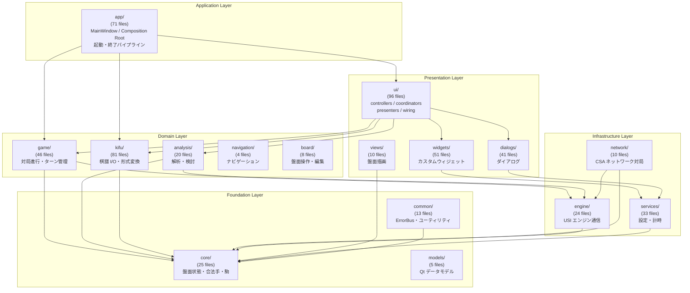
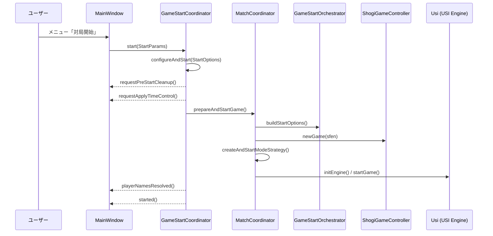
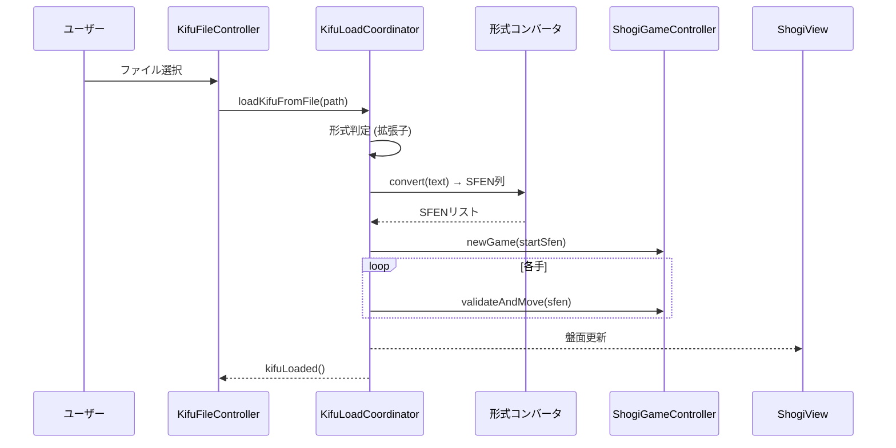
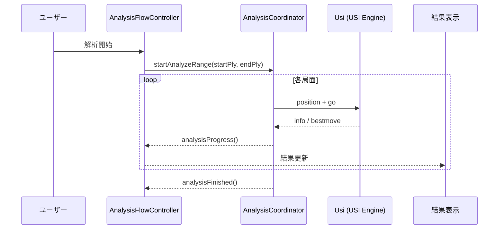
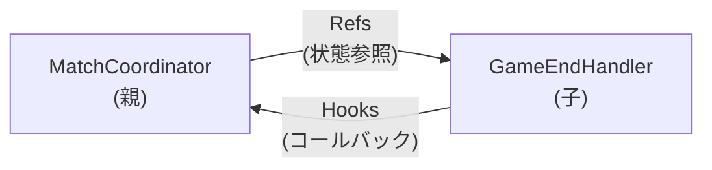
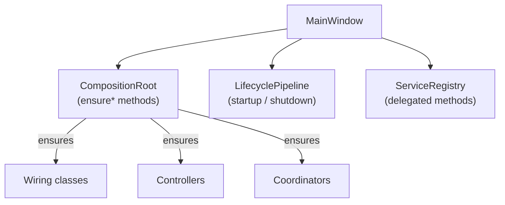

# アーキテクチャ概観

ShogiBoardQ のモジュール構成・依存関係・設計パターンを概観するドキュメント。
各モジュールの詳細な責務は [CLAUDE.md](../../CLAUDE.md) を参照。

## 1. レイヤー構成



## 2. 依存関係ルール

レイヤーテスト (`tst_layer_dependencies.cpp`) で以下の制約を強制:

| モジュール | 依存禁止先 |
|---|---|
| **core** | app, ui, dialogs, widgets, views |
| **kifu/formats** | app, dialogs, widgets, views |
| **engine** | app, dialogs, widgets, views |
| **game** | dialogs, widgets, views |
| **services** | app, dialogs, widgets, views |

**設計方針**: 下位レイヤーは上位レイヤーに依存しない。GUI 非依存の Domain/Foundation 層は Presentation 層をインクルードできない。

### モジュール間依存マトリックス（実測値）

include 解析に基づく主要な依存関係（ヘッダー参照数）:

| 依存元 → | core | game | kifu | engine | services | common | widgets | views | dialogs | ui | app |
|---|---|---|---|---|---|---|---|---|---|---|---|
| **core** | - | | | | | 2 | | | | | |
| **game** | 8 | - | 5 | 3 | 3 | 1 | 3 | 1 | 2 | 4 | 1 |
| **kifu** | 5 | 2 | - | | 1 | 3 | 3 | 1 | 1 | 3 | 1 |
| **engine** | 4 | 1 | 2 | - | 1 | 1 | | | 1 | | |
| **analysis** | 6 | 2 | | 4 | 2 | 3 | 6 | 1 | 3 | | |
| **network** | 5 | 1 | 1 | 3 | 1 | 1 | | 1 | | | |
| **app** | 6 | 8 | 14 | 2 | 4 | 1 | 6 | 1 | 2 | 36 | - |
| **ui** | 7 | 5 | 12 | 4 | 8 | 4 | 12 | 1 | 9 | - | 6 |

## 3. モジュール責務一覧

| モジュール | 責務 | Qt 依存 |
|---|---|---|
| **core** | 盤面状態、駒、合法手判定、SFEN 変換 | QObject のみ |
| **game** | 対局進行、ターン管理、終局処理、戦略パターン | QObject |
| **kifu** | 棋譜 I/O、7 形式のコンバータ、エクスポート | Widgets (ダイアログ) |
| **engine** | USI プロトコル、エンジンプロセス管理、設定 | QProcess |
| **analysis** | 棋譜解析、検討モード、解析結果表示 | Widgets |
| **network** | CSA プロトコル、ネットワーク対局 | QTcpSocket |
| **navigation** | 棋譜ナビゲーション制御 | QObject |
| **board** | 盤面インタラクション、局面編集、画像エクスポート | QGraphicsView |
| **app** | MainWindow Facade、Composition Root、起動/終了パイプライン | QMainWindow |
| **ui** | Presenter、Controller、Coordinator、Wiring | QObject |
| **views** | 盤面・駒の Qt Graphics View 描画 | QGraphicsView |
| **widgets** | カスタム UI ウィジェット（評価グラフ、棋譜欄等） | QWidget |
| **dialogs** | 各種ダイアログ（対局設定、エンジン登録等） | QDialog |
| **services** | 設定永続化、計時、通知 | QSettings |
| **common** | ErrorBus、持将棋計算、ログカテゴリ | 最小限 |
| **models** | Qt Item Model（通信ログ、思考ログ） | QAbstractItemModel |

## 4. 主要フロー

### 4.1 対局開始フロー



### 4.2 棋譜ロードフロー



**対応形式**: KIF, KI2, CSA, JKF, USEN, USI, BOD/SFEN（局面のみ）

### 4.3 解析フロー



## 5. 設計パターン

### 5.1 Deps / Hooks / Refs パターン

MatchCoordinator とその子ハンドラ間で使用される依存性注入パターン。



| 構造体 | 方向 | 用途 |
|---|---|---|
| **Refs** | 親 → 子 | 親の内部状態へのポインタ・プロバイダ関数 |
| **Hooks** | 子 → 親 | `std::function` コールバックで親メソッドを呼び出す |
| **Deps** | 外部 → 対象 | 依存オブジェクト + 遅延初期化コールバック |

```cpp
// Refs: 親の状態を読み取るための参照
struct Refs {
    ShogiGameController* gc = nullptr;
    std::function<Usi*()> usi1Provider;  // 動的変更に対応
};

// Hooks: 親のメソッドをコールバックで呼び出す
struct Hooks {
    std::function<void(const GameEndInfo&)> setGameOver;
    std::function<void()> appendKifuLine;
};

// Deps: 遅延初期化対応のダブルポインタ
struct Deps {
    Controller** controller = nullptr;                 // ダブルポインタ
    std::function<void()> ensureController;            // 遅延初期化
};
```

### 5.2 Wiring 層

`src/ui/wiring/` に配置。Signal/Slot の接続と依存性の構築を集約する。

| Wiring クラス | 責務 |
|---|---|
| MatchCoordinatorWiring | MC 生成・配線・GameStartCoordinator 管理 |
| PlayerInfoWiring | 対局者名・エンジン名の UI 反映 |
| CsaGameWiring | CSA ネットワーク対局の配線 |
| DialogCoordinatorWiring | ダイアログ起動・結果処理の配線 |
| ConsiderationWiring | 検討モードの配線 |
| AnalysisTabWiring | 解析タブの配線 |
| その他 13 クラス | メニュー操作・ナビゲーション等の配線 |

### 5.3 MVP (Model-View-Presenter)

`src/ui/presenters/` に配置。Model → View への表示データ変換のみを担当（リードオンリー）。

| Presenter | 責務 |
|---|---|
| BoardSyncPresenter | SFEN 適用・盤面同期・ハイライト |
| NavigationPresenter | ナビゲーションボタン状態 |
| TimeDisplayPresenter | 残り時間テキスト |
| GameRecordPresenter | 棋譜欄・手数記録 |
| EvalGraphPresenter | 評価値グラフ描画 |
| EngineAnalysisPresenter | エンジン分析結果表示 |
| KifuDisplayPresenter | 棋譜テキスト表示 |

### 5.4 Composition Root

`src/app/mainwindowcompositionroot.cpp` に配置。`ensure*()` メソッドによる遅延初期化パターンで、依存オブジェクトを初回アクセス時に生成する。



## 6. ファイル命名規約

| サフィックス | 用途 | 代表例 |
|---|---|---|
| **Controller** | ユーザー入力・UI 状態制御 | BoardInteractionController, GameStateController |
| **Coordinator** | 複数オブジェクト間の統合・オーケストレーション | GameStartCoordinator, DialogCoordinator |
| **Service** | 純粋ロジック・ポリシー判定 | PlayModePolicyService, SettingsService |
| **Manager** | リソース寿命・初期化/破棄管理 | EngineLifecycleManager, ConsiderationTabManager |
| **Handler** | 特定イベント・フロー処理 | GameEndHandler, MatchUndoHandler |
| **Presenter** | Model → View の表示データ変換 | BoardSyncPresenter, EvalGraphPresenter |
| **Wiring** | Signal/Slot 接続・依存性構築 | MatchCoordinatorWiring, CsaGameWiring |
| **Orchestrator** | 非 QObject のフロー制御 | GameStartOrchestrator, GameSessionOrchestrator |
