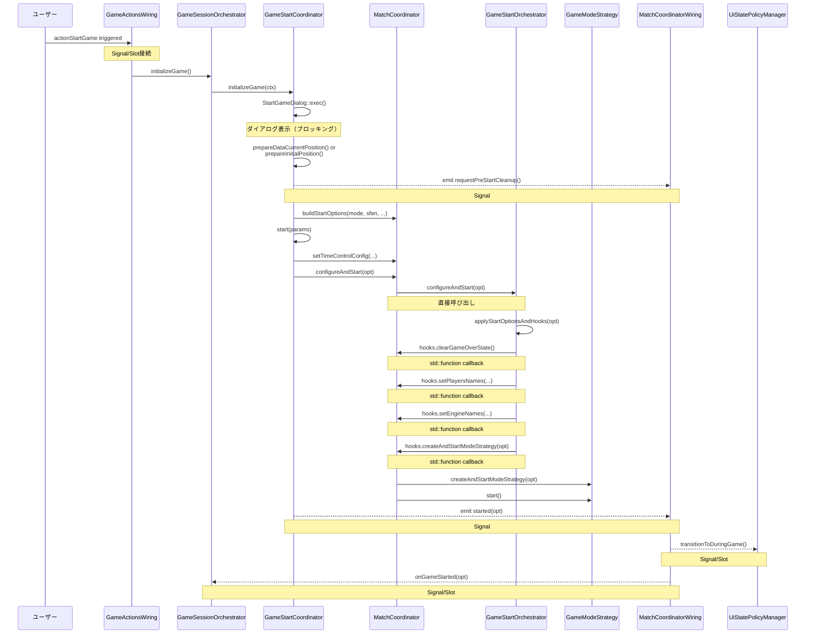
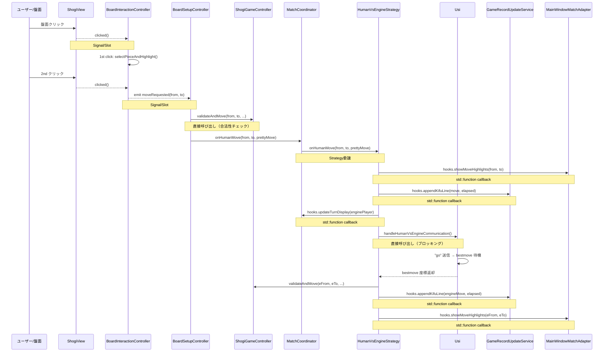
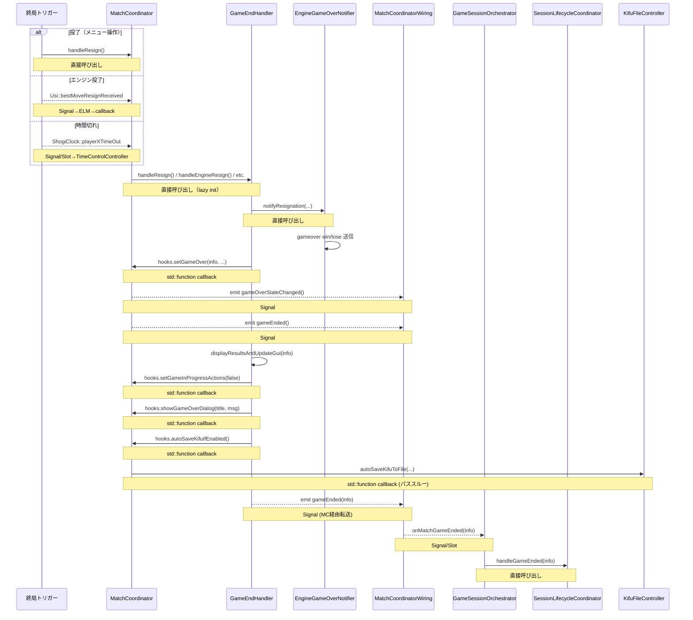
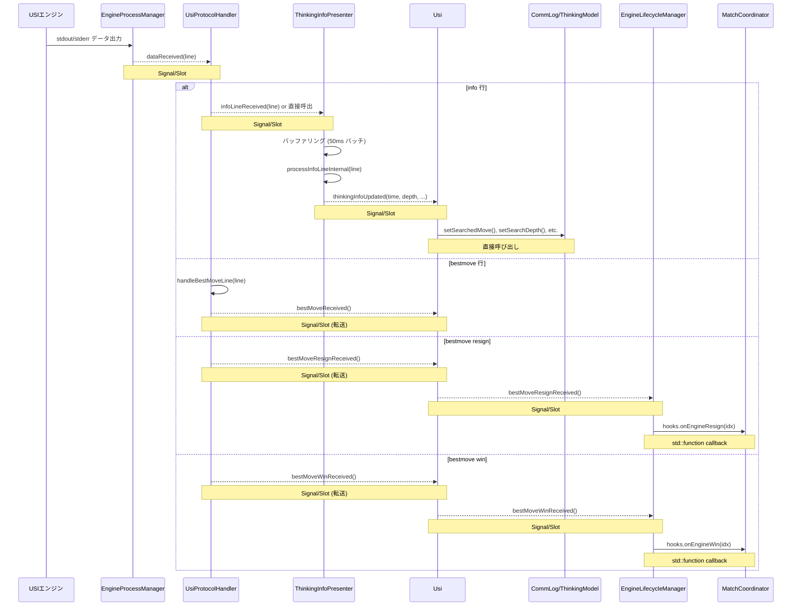

# Hooks/コールバックパターン分析

## 概要

プロジェクト全体で使用されている `std::function` コールバック（Hooks/Deps/Callbacks パターン）の全数調査、主要フローの呼び出しチェーン、削減候補の分析結果。

---

## 1. コールバック使用箇所の全数調査

### 1.1 カテゴリ別サマリ

| カテゴリ | 構造体数 | コールバック総数 | 主な用途 |
|---------|---------|----------------|---------|
| Game層 Hooks | 6 | 56 | MC/GEH/GSO/ELM/MTK/MUH の上位層コールバック |
| App層 Deps | 12 | 52 | Service/Coordinator の遅延初期化・依存注入 |
| UI/Wiring層 Deps | 8 | 55 | Wiring クラスの遅延初期化・オブジェクト取得 |
| Controller Callbacks | 5 | 18 | Controller の UI 操作コールバック |
| その他 (Model/Service) | 7 | 12 | 個別のコールバック・型エイリアス |
| **合計** | **38** | **~193** | |

### 1.2 Game層 Hooks 構造体

#### MatchCoordinator::Hooks (20 コールバック)
| コールバック名 | シグネチャ | 用途 | 配線元 |
|---------------|-----------|------|--------|
| `updateTurnDisplay` | `void(Player)` | 手番表示更新 | HooksFactory (lambda) |
| `setPlayersNames` | `void(QString, QString)` | 対局者名設定 | HooksFactory ← HookDeps |
| `setEngineNames` | `void(QString, QString)` | エンジン名設定 | HooksFactory ← HookDeps |
| `setGameActions` | `void(bool)` | 対局中メニュー ON/OFF | **未配線** |
| `renderBoardFromGc` | `void()` | GC→盤面描画 | HooksFactory ← HookDeps |
| `showGameOverDialog` | `void(QString, QString)` | 終局ダイアログ表示 | HooksFactory ← HookDeps |
| `log` | `void(QString)` | デバッグログ出力 | **未配線** |
| `showMoveHighlights` | `void(QPoint, QPoint)` | 指し手ハイライト表示 | HooksFactory ← HookDeps |
| `remainingMsFor` | `qint64(Player)` | 残り時間取得 | HooksFactory ← HookDeps |
| `incrementMsFor` | `qint64(Player)` | 加算時間取得 | HooksFactory ← HookDeps |
| `byoyomiMs` | `qint64()` | 秒読み時間取得 | HooksFactory ← HookDeps |
| `humanPlayerSide` | `Player()` | 人間側取得 | **未配線** |
| `sendGoToEngine` | `void(Usi*, GoTimes)` | go コマンド送信 | HooksFactory ← HookDeps |
| `sendStopToEngine` | `void(Usi*)` | stop コマンド送信 | HooksFactory ← HookDeps |
| `sendRawToEngine` | `void(Usi*, QString)` | 任意コマンド送信 | HooksFactory ← HookDeps |
| `initializeNewGame` | `void(QString)` | 新規対局初期化 | HooksFactory ← HookDeps |
| `appendKifuLine` | `void(QString, QString)` | 棋譜行追加 | HooksFactory ← HookDeps |
| `appendEvalP1` | `void()` | P1 評価値グラフ追加 | HooksFactory (lambda) |
| `appendEvalP2` | `void()` | P2 評価値グラフ追加 | HooksFactory (lambda) |
| `autoSaveKifu` | `void(QString, PlayMode, QString×4)` | 棋譜自動保存 | HooksFactory ← HookDeps |

#### GameEndHandler::Hooks (10 コールバック)
| コールバック名 | シグネチャ | 用途 | 配線元 |
|---------------|-----------|------|--------|
| `disarmHumanTimerIfNeeded` | `void()` | 人間タイマー停止 | MC lambda |
| `primaryEngine` | `Usi*()` | メインエンジン取得 | MC lambda |
| `turnEpochFor` | `qint64(Player)` | 手番開始時刻取得 | MC lambda |
| `setGameInProgressActions` | `void(bool)` | 対局中アクション切替 | MC lambda |
| `setGameOver` | `void(GameEndInfo, bool, bool)` | 対局終了状態設定 | MC lambda |
| `markGameOverMoveAppended` | `void()` | 終局手追記済みマーク | MC lambda |
| `appendKifuLine` | `void(QString, QString)` | 棋譜行追加 (パススルー) | MC→m_hooks.appendKifuLine |
| `showGameOverDialog` | `void(QString, QString)` | 終局ダイアログ (パススルー) | MC→m_hooks.showGameOverDialog |
| `log` | `void(QString)` | ログ (パススルー) | MC→m_hooks.log |
| `autoSaveKifuIfEnabled` | `void()` | 条件付き自動保存 | MC lambda |

#### GameStartOrchestrator::Hooks (11 コールバック)
| コールバック名 | シグネチャ | 用途 | 配線元 |
|---------------|-----------|------|--------|
| `initializeNewGame` | `void(QString)` | 新規対局初期化 (パススルー) | MC→m_hooks |
| `setPlayersNames` | `void(QString, QString)` | 対局者名設定 (パススルー) | MC→m_hooks |
| `setEngineNames` | `void(QString, QString)` | エンジン名設定 (パススルー) | MC→m_hooks |
| `setGameActions` | `void(bool)` | アクション切替 (パススルー) | MC→m_hooks |
| `renderBoardFromGc` | `void()` | 盤面描画 (パススルー) | MC→m_hooks |
| `clearGameOverState` | `void()` | 終局状態クリア | MC lambda |
| `updateTurnDisplay` | `void(Player)` | 手番表示更新 | MC lambda |
| `initializePositionStringsForStart` | `void(QString)` | 局面文字列初期化 | MC lambda |
| `createAndStartModeStrategy` | `void(StartOptions)` | 戦略作成・開始 | MC lambda |
| `flipBoard` | `void()` | 盤面反転 | MC lambda |
| `startInitialEngineMoveIfNeeded` | `void()` | 初手エンジン着手 | MC lambda |

#### EngineLifecycleManager::Hooks (7 コールバック)
| コールバック名 | シグネチャ | 用途 | 配線元 |
|---------------|-----------|------|--------|
| `log` | `void(QString)` | ログ (パススルー) | MC→m_hooks.log |
| `renderBoardFromGc` | `void()` | 盤面描画 (パススルー) | MC→m_hooks |
| `appendEvalP1` | `void()` | P1 評価値追加 (パススルー) | MC→m_hooks |
| `appendEvalP2` | `void()` | P2 評価値追加 (パススルー) | MC→m_hooks |
| `onEngineResign` | `void(int)` | エンジン投了通知 | MC lambda |
| `onEngineWin` | `void(int)` | エンジン勝ち宣言通知 | MC lambda |
| `computeGoTimes` | `GoTimes()` | 持ち時間計算 | MC lambda |

#### MatchTimekeeper::Hooks (3 コールバック)
| コールバック名 | シグネチャ | 用途 | 配線元 |
|---------------|-----------|------|--------|
| `remainingMsFor` | `qint64(int)` | 残り時間取得 | MC lambda |
| `incrementMsFor` | `qint64(int)` | 加算時間取得 | MC lambda |
| `byoyomiMs` | `qint64()` | 秒読み取得 | MC lambda |

#### MatchUndoHandler::UndoHooks (3 コールバック)
| コールバック名 | シグネチャ | 用途 | 配線元 |
|---------------|-----------|------|--------|
| `updateHighlightsForPly` | `void(int)` | 手数別ハイライト更新 | HooksFactory ← UndoDeps |
| `updateTurnAndTimekeepingDisplay` | `void()` | 手番・時計表示更新 | HooksFactory ← UndoDeps |
| `isHumanSide` | `bool(Player)` | 人間側判定 | HooksFactory ← UndoDeps |

#### AnalysisSessionHandler::Hooks (9 コールバック)
| コールバック名 | シグネチャ | 用途 | 配線元 |
|---------------|-----------|------|--------|
| `showGameOverDialog` | `void(QString, QString)` | ダイアログ (パススルー) | MC→m_hooks |
| `destroyEnginesKeepModels` | `void()` | エンジン破棄(モデル保持) | MC lambda |
| `isShutdownInProgress` | `bool()` | シャットダウン中判定 | MC lambda |
| `setPlayMode` | `void(PlayMode)` | プレイモード設定 | MC lambda |
| `destroyEnginesAll` | `void()` | エンジン全破棄 | MC lambda |
| `createAnalysisEngine` | `Usi*(AnalysisOptions)` | 解析エンジン作成 | MC lambda (複合) |
| `initAndStartEngine` | `void(int, QString, QString)` | エンジン初期化・開始 | MC lambda |
| `setEngineNames` | `void(QString, QString)` | エンジン名設定 | MC lambda |
| `setShutdownInProgress` | `void(bool)` | シャットダウンフラグ設定 | MC lambda |

### 1.3 App層 Deps 構造体

| クラス | 構造体名 | コールバック数 | 主なコールバック |
|--------|---------|-------------|----------------|
| GameSessionOrchestrator | Deps | 11 | ensure* (7), initMatchCoordinator, sfenRecord |
| SessionLifecycleCoordinator | Deps | 11 | clearGameStateFields, resetModels, startGame, etc. |
| KifuNavigationCoordinator | Deps | 5 | setCurrentTurn, updateJosekiWindow, ensureBoardSyncPresenter |
| BoardLoadService | Deps | 3 | setCurrentTurn, ensureBoardSyncPresenter, beginBranchNavGuard |
| TurnStateSyncService | Deps | 2 | updateTurnStatus, onTurnManagerCreated |
| GameRecordUpdateService | Deps | 2 | ensureRecordPresenter, ensureLiveGameSessionUpdater |
| GameRecordLoadService | Deps | 3 | ensureRecordPresenter, ensureGameRecordModel, sfenRecord |
| MainWindowMatchAdapter | Deps | 4 | initializeNewGame, ensure*AndGet* (3) |
| MainWindowCoreInitCoordinator | Deps | 4 | setupBoardInteractionController, setCurrentTurn, etc. |
| MainWindowResetService | SessionUiDeps | 1 | broadcastComment |
| MainWindowResetService | UiResetDeps | 1 | updateJosekiWindow |
| MainWindowDepsFactory | Callbacks×5 | 22 | Dialog/Kifu/GameState/BoardSetup/PositionEdit |

### 1.4 UI/Wiring層 Deps 構造体

| クラス | 構造体名 | コールバック数 | 主なコールバック |
|--------|---------|-------------|----------------|
| MatchCoordinatorWiring | Deps/BuilderInputs | 11 | ensure* (5), get* (4), connectBoardClicks |
| DialogLaunchWiring | Deps | 20 | get* (18), createMenuWindowDock |
| DialogCoordinatorWiring | Deps | 4 | getBoardFlipped, getConsiderationWiring, etc. |
| MainWindowSignalRouter | Deps | 6 | initialize/ensure* |
| UiActionsWiring | Deps | 1 | getKifuExportController |
| ConsiderationWiring | Deps | 1 | ensureDialogCoordinator |
| BranchNavigationWiring | Deps | 1 | ensureCommentCoordinator |
| MainWindowMatchWiringDepsService | Inputs | 29 | MC Hooks 全素材 + UndoHooks + ensure* |

### 1.5 Controller Callbacks

| クラス | コールバック数 | 主なコールバック |
|--------|-------------|----------------|
| GameStateController | 4 | enableArrowButtons, setReplayMode, refreshBranchTree, updatePlyState |
| BoardSetupController | 6 | ensurePositionEdit, ensureTimeController, updateGameRecord, redrawEngine*Graph |
| PositionEditCoordinator | 2 | applyEditMenuState, ensurePositionEdit |
| BoardInteractionController | 1 | isHumanTurnCb |
| PositionEditController | 4 | onShowEditExitButton, onEnterEditMenu, onHideEditExitButton, onLeaveEditMenu |

### 1.6 その他

| クラス | コールバック数 | 用途 |
|--------|-------------|------|
| KifuExportController | 1 | m_prepareCallback |
| GameRecordModel | 2 | commentUpdateCallback, bookmarkUpdateCallback |
| TimekeepingService | 2 | appendElapsedLine, updateTurnStatus |
| KifuLoadCoordinator | 3 | KifuParseFunc, KifuDetectSfenFunc, KifuExtractGameInfoFunc |
| LogViewFontManager | 1 | PostApplyCallback |
| ConsiderationFlowController | 3 | onError, onTimeSettingsReady, onMultiPVReady |
| AnalysisFlowController | 1 | displayError |
| TsumeSearchFlowController | 1 | onError |
| GameSessionFacade | 1 | ensureAndGetWiring |
| DialogCoordinator | 1 | KifuAnalysisContext::getBoardFlipped |
| KifuDisplayCoordinator | 1 | BoardSfenProvider |
| EngineGameOverNotifier | 1 | RawSender (type alias) |

---

## 2. 主要フローの呼び出しチェーン

### 2.1 対局開始フロー



### 2.2 指し手適用フロー



### 2.3 対局終了フロー



### 2.4 エンジン思考フロー



---

## 3. コールバック削減の検討

### 3.1 未配線コールバック (配線済みだが呼び出し元で null チェック)

| クラス | コールバック | 状態 | 呼び出し箇所 | 推奨 |
|--------|-----------|------|-------------|------|
| MC::Hooks | `log` | **未配線** | matchcoordinator.cpp:591, enginelifecyclemanager.cpp:78,81,281, gameendhandler.cpp:316, humanvs*.cpp:30,17,68 | qDebug() に置換検討 |
| MC::Hooks | `setGameActions` | **未配線** | matchcoordinator.cpp:307, gamestartorchestrator.cpp:291 | UiStatePolicyManager で代替済み？ |
| MC::Hooks | `humanPlayerSide` | **未配線** | humanvsenginestrategy.cpp:320-321 | null チェックで機能無効化済み |

### 3.2 パススルーコールバック (多層転送)

MC が上位から受け取った hooks をそのまま子ハンドラに転送しているケース:

| コールバック | 転送チェーン | 層数 | 削減可能性 |
|-------------|-------------|-----|-----------|
| `appendKifuLine` | HookDeps → MC::Hooks → GEH::Hooks | 3 | 低: 各層で異なるコンテキスト |
| `showGameOverDialog` | HookDeps → MC::Hooks → GEH::Hooks / ASH::Hooks | 3 | 低: 同上 |
| `renderBoardFromGc` | HookDeps → MC::Hooks → GSOrc::Hooks / ELM::Hooks | 3 | 低: 同上 |
| `log` | MC::Hooks → GEH::Hooks / ELM::Hooks | 2 | 高: 未配線のため転送不要 |
| `setPlayersNames` | HookDeps → MC::Hooks → GSOrc::Hooks | 2 | 低: 正常動作中 |
| `setEngineNames` | HookDeps → MC::Hooks → GSOrc::Hooks / ASH::Hooks | 2 | 低: 正常動作中 |

### 3.3 シグナル/スロット置換候補

QObject 同士の callback について、シグナル/スロットへの置換可否:

| callback 経路 | 提供元 | 消費先 | 置換可否 | 理由 |
|---------------|-------|--------|---------|------|
| ELM→MC: onEngineResign/Win | ELM (QObject) | MC (QObject) | **可能** | 両方 QObject、1:1 関係 |
| MTK→MC: remainingMsFor etc. | MTK (QObject) | MC (QObject) | **不可** | 戻り値あり (qint64) |
| GEH→MC: setGameOver etc. | GEH (QObject) | MC (QObject) | **可能だが非推奨** | 引数が複雑、パフォーマンス低下 |
| GSOrc→MC: createAndStartModeStrategy | GSOrc (非QObject) | MC (QObject) | **不可** | GSOrc は QObject でない |
| MUH→MC: updateHighlightsForPly etc. | MUH (非QObject) | MC (QObject) | **不可** | MUH は QObject でない |

### 3.4 ensure* コールバックパターン分析

全 26 の `ensure*` コールバックのうち:

| パターン | 数 | 例 |
|---------|---|-----|
| 真に遅延的（条件付き呼び出し） | ~18 | ensureDialogCoordinator, ensureKifuExportController |
| 常に呼び出される（非遅延） | ~5 | ensureTimeController, ensureEvaluationGraphController, ensureUsiCommandController |
| 未使用の可能性 | ~3 | 要追加調査 |

「常に呼び出される」ensure* は直接初期化に置換可能だが、コード変更量に対する効果が限定的。

### 3.5 削減推奨事項（優先度順）

#### P1: 未配線コールバックの整理
- **MC::Hooks::log**: 呼び出し箇所を `qDebug()` に置換し、Hooks から削除
- **MC::Hooks::setGameActions**: UiStatePolicyManager で代替されているか確認。代替済みなら削除
- **MC::Hooks::humanPlayerSide**: 機能が必要なら配線を追加。不要なら呼び出し箇所と共に削除
- 影響: ~15行の削除 + 追跡性の改善

#### P2: log パススルーチェーンの除去
- GEH::Hooks::log, ELM::Hooks::log は未配線の MC::Hooks::log を転送しているだけ
- 全て `qDebug()` に置換して callback を除去
- 影響: ~10行の削除

#### P3: ELM→MC の Signal/Slot 化検討
- `onEngineResign(int)` と `onEngineWin(int)` は callback から signal に変更可能
- 両方 QObject であり、引数も単純 (int)
- IDE の追跡性が大幅に改善
- 影響: ~10行の変更

---

## 4. アーキテクチャパターンの整理

### 4.1 使用パターン一覧

| パターン | 用途 | 使用箇所 | 特徴 |
|---------|------|---------|------|
| **Hooks (上向きコールバック)** | 子→親の呼び出し | MC→GEH/GSOrc/ELM/MTK/MUH/ASH | 子が親の状態を変更 |
| **Deps (遅延初期化)** | ensure* パターン | App層/Wiring層の全 Deps | lazy init + ダブルポインタ |
| **Deps (オブジェクト取得)** | get* パターン | DialogLaunchWiring, MCW | ファクトリ/アクセサ |
| **Refs (状態参照)** | 親の状態への直接参照 | GEH::Refs, GSOrc::Refs | ポインタ経由の読み取り |
| **Controller Callbacks** | UI操作コールバック | GameStateController, BSC, PEC | コンストラクタ注入 |
| **Type-alias Callbacks** | 関数型のエイリアス | KifuLoadCoordinator, BoardInteractionController | 単一コールバック |

### 4.2 パターン選択ガイドライン

```
呼び出し方向    → Signal/Slot が最適（Qt の追跡機能が利用可能）
                   ただし戻り値が必要な場合は std::function

子→親の呼び出し → Hooks パターン（循環依存の回避）

遅延初期化      → ensure* コールバック（必要時まで生成を遅延）

状態の読み取り  → Refs パターン（ポインタ経由の直接参照）
```

---

## 5. メカニズム統計

### 全フローにおける Signal/Slot vs Callback の割合

| フロー | Signal/Slot 接続 | std::function callback | 直接呼び出し |
|--------|-----------------|----------------------|-------------|
| 対局開始 | 5 | 6 | 8 |
| 指し手適用 | 2 | 5 | 5 |
| 対局終了 | 4 | 8 | 4 |
| エンジン思考 | 6 | 2 | 3 |
| **合計** | **17** | **21** | **20** |

Signal/Slot と std::function callback がほぼ同数で、適切に使い分けられている:
- **Signal/Slot**: イベント通知、UI 更新トリガー、非同期処理
- **std::function**: 子→親の呼び出し（循環依存回避）、遅延初期化、戻り値付き照会
