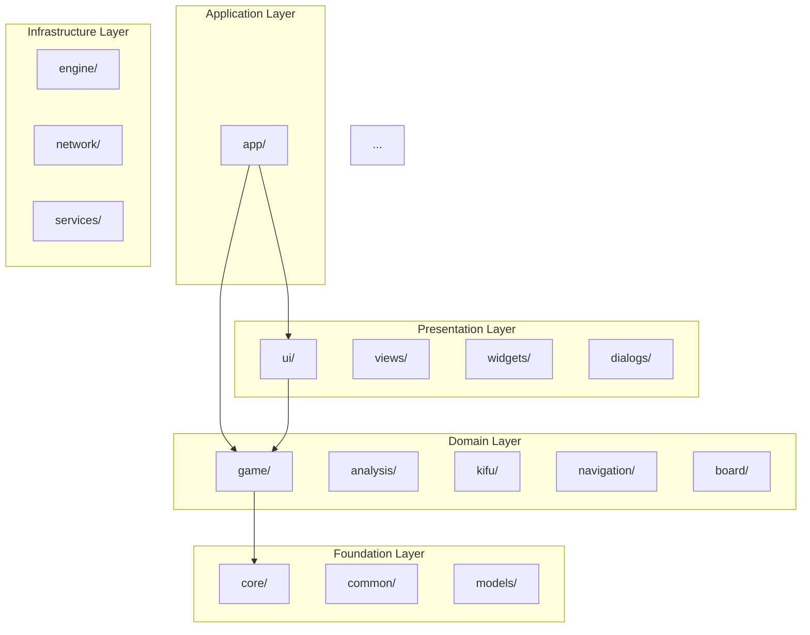
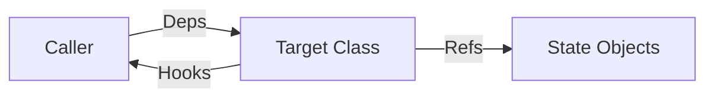

# Task 31: アーキテクチャ概観図作成（Phase 4: ドキュメント整備）

## 目的

モジュール間の依存関係とレイヤー構成を図示するアーキテクチャ概観ドキュメントを作成する。

## 背景

- `CLAUDE.md` と `developer-guide.md` にモジュール構成の説明はあるが、依存関係図がない
- 新規参画時にモジュール間の関係を把握するコストが高い
- レイヤー構成（core → game → app → ui）の明示がない
- 包括的改善分析 §10.2

## 成果物

- `docs/dev/architecture-overview.md`

## 事前調査

### Step 1: モジュール間の依存関係の計測

```bash
# 各モジュールが include しているモジュール
for mod in core game kifu engine analysis network navigation board app ui views widgets dialogs services common models; do
    echo "=== $mod ==="
    rg '#include "' src/$mod/ --type cpp --type-add 'header:*.h' --type header 2>/dev/null | \
        grep -oP 'src/\K[^/]+' | sort | uniq -c | sort -rn
done
```

### Step 2: レイヤー構成の確認

```bash
# tst_layer_dependencies の定義確認
cat tests/tst_layer_dependencies.cpp
```

### Step 3: 主要クラスの依存グラフ

```bash
# MainWindow の直接依存
rg '#include "' src/app/mainwindow.cpp | head -30

# MatchCoordinator の直接依存
rg '#include "' src/game/matchcoordinator.cpp | head -20
```

## 実装手順

### Step 4: レイヤー図の作成

Mermaid 形式で依存関係図を作成:

```markdown
## レイヤー構成



### Step 5: モジュール責務一覧の作成

各モジュールの責務を1-2行で記述。CLAUDE.md の情報を凝縮。

### Step 6: 主要フロー図の作成

以下の3フローをシーケンス図で記述:

1. **対局開始フロー**: ユーザー操作 → MainWindow → MatchCoordinator → Strategy → Engine
2. **棋譜ロードフロー**: ファイル選択 → KifuFileController → Converter → GameController → View
3. **解析フロー**: 解析開始 → AnalysisCoordinator → Engine → 結果表示

### Step 7: Deps/Hooks/Refs パターンの概要図



### Step 8: ドキュメントの構成

```markdown
# アーキテクチャ概観

## 1. レイヤー構成
(Mermaid図)

## 2. モジュール一覧
(責務表)

## 3. 依存関係ルール
(許可される依存方向)

## 4. 主要フロー
### 4.1 対局開始
### 4.2 棋譜ロード
### 4.3 解析

## 5. 設計パターン
### 5.1 Deps/Hooks/Refs
### 5.2 Wiring層
### 5.3 MVP (Model-View-Presenter)

## 6. ファイル命名規約
(Controller/Coordinator/Service/Handler/Presenter/Wiring の使い分け)
```

## 完了条件

- [ ] `docs/dev/architecture-overview.md` が作成されている
- [ ] レイヤー構成図（Mermaid）が含まれている
- [ ] モジュール責務一覧が含まれている
- [ ] 主要フロー図が最低1つ含まれている
- [ ] 実際のコード構造と整合している

## KPI変化目標

- アーキテクチャドキュメント: 0 → 1

## 注意事項

- Mermaid 図は GitHub Markdown でレンダリング可能な構文を使用する
- 過度に詳細にしない（概観レベルに留める）
- CLAUDE.md と重複する情報は参照リンクで対応し、コピーしない
- 図は実測データ（Step 1 の include 解析結果）に基づく
- 将来の変更に追従しやすいよう、自動生成可能な部分はスクリプト化を検討
