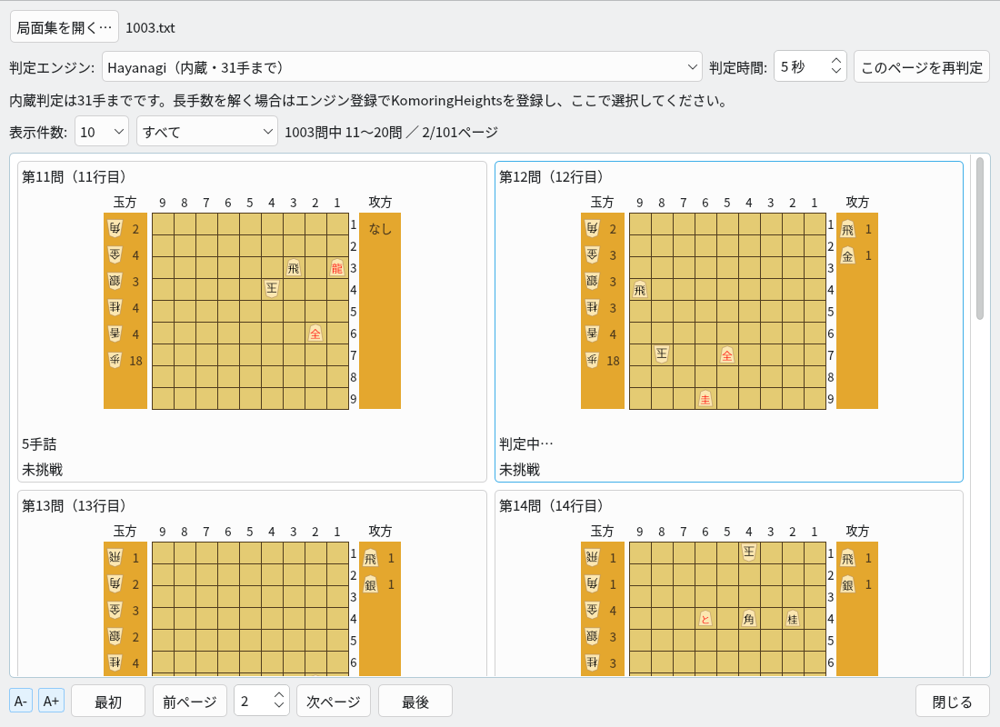
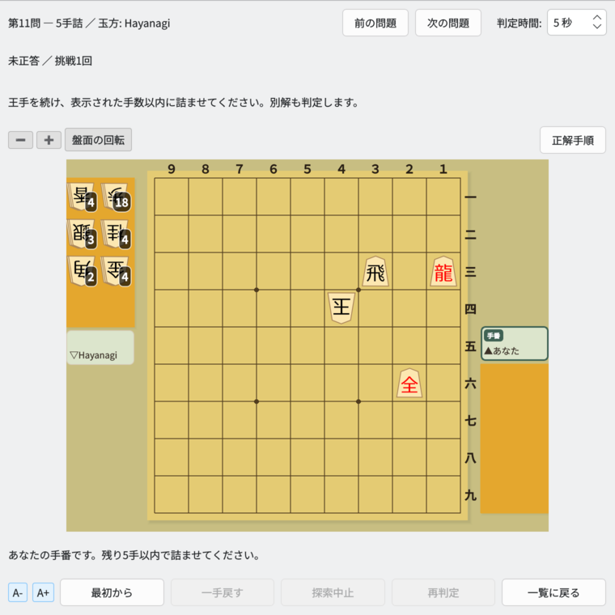
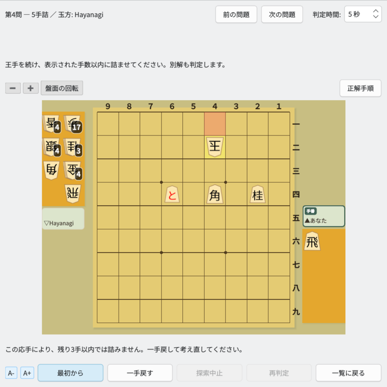
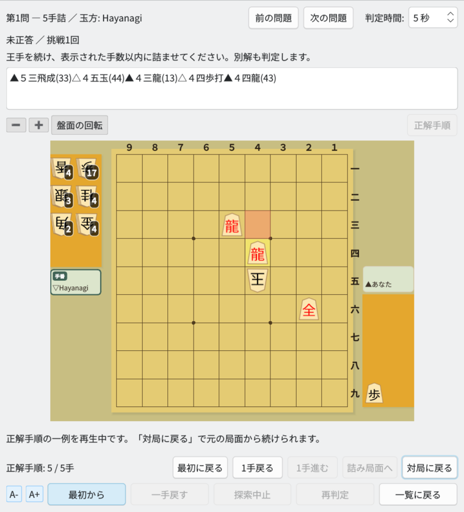

# 詰将棋対局

## 問題一覧から解く

「対局 → 詰将棋対局…」を開くと、最初に問題一覧が表示される。
「局面集を開く…」でファイルを選び、初期盤面のカードをクリックすると対局画面へ進む。

- カードには問題番号、元ファイルの行番号、初期盤面、攻方・玉方の持駒、詰み手数、挑戦状況を表示する。
- 表示件数は **10 / 20 / 50 / 100件**。最初・前・次・最後のページとページ番号で移動する。
  1000問を読み込んでも、盤面ウィジェットを作るのは現在のページだけ。
- 「すべて」「未挑戦」「挑戦済み・未正答」「正答済み」で絞り込める。
- 「一覧に戻る」で元のページ・絞り込み・スクロール位置へ戻り、履歴を更新する。
  絞り込み後に元のページがなくなった場合は最後のページへ移動する。
- 初期局面の判定は現在のページ内を1問ずつ実行する。ページ変更や対局開始時には
  一覧の判定を中止し、選んだ問題を優先する。
- 確定した結果は「5手詰」などと表示する。未判定の参考手順は「参考手順: 5手・未検証」、
  手順なしは「手数未判定」と表示する。時間切れ・異常応答は「判定不能」とし、
  時間を増やして「このページを再判定」できる。不詰が確認できた問題は対局開始を無効にする。

一覧のウィンドウサイズ、ファイル、ページ、表示件数、絞り込み、判定エンジン、判定時間を
設定ファイルへ保存する。対局画面のウィンドウサイズと盤のマスサイズも保持する。
対局・問題一覧の下部にある A−／A＋で文字サイズを8〜24ptの範囲で1ptずつ変更できる。
文字サイズは画面ごとに保存し、問題一覧ではページ切替後のカードにも適用する。
盤は Ctrl+ホイールで拡大・縮小できる。

## 読み込める局面集と手数

1行1局面のSFENに対応する。`sfen` / `position sfen` 接頭辞、UTF-8 BOM、空行、
`#` コメント、CRLF、タブ区切りを受け付ける。`moves ...` は参考手順として分離し、
開始局面へ適用しない。攻め方の玉は省略できる。後手攻めでは盤を反転表示する。
余った駒を玉方へ補完せず、SFENに記載された持駒を使う。

**初期局面だけのファイルでも、参考手順付きのファイルでも、同じ方式で対局できる。**
ファイル名や参考手順の長さを正解手数とはみなさず、初期局面を解析して確認した手数で出題する。
参考手順が101手でも、最短が短ければ確認した短い手数を表示する。
対局機能は唯一解を保証する検査ではなく、成立する別解も正解と認める。

komori-n氏が開発する **[KomoringHeights](https://github.com/komori-n/KomoringHeights)** を登録して一覧の「判定エンジン」で選ぶと、31手・63手の
内蔵探索上限を使わず、101手などの長手数も解析・対局の対象にできる。
エンジンが制限時間内に手数を確定できることが開始条件であり、あらゆる長編の完了を保証するものではない。
KomoringHeights未登録時は内蔵Hayanagiを選べるが、初期判定は従来どおり31手まで。
技巧・通常のやねうら王を詰将棋の判定用エンジンとしては選択しない。
KomoringHeights自体は配布物に同梱せず、通常の「エンジン登録」で登録する。

## 対局と判定

対局画面の操作には通常画面と同じ `ShogiView` を使う。盤上の駒または持駒、移動先の順に
クリックして指し、選択可能なら成りを確認する。王手でない手、二歩、打ち歩詰め、
自玉の王手放置は拒否する。
盤の上の「➖」「➕」または盤上の Ctrl＋ホイールで盤を縮小・拡大できる。
「盤面の回転」で向きを切り替えられ、回転後も着手・正解手順の再生ができる。
盤の大きさと、攻方を下にした向きからの回転状態は次回の対局画面にも引き継ぐ。

**玉方の合法手生成・着手はHayanagi、詰み判定はKomoringHeights** が担当する。
KomoringHeightsに玉方として指す機能を要求せず、Hayanagiで列挙した各応手後の
「攻方の手番の局面」に対して `go mate` で問い合わせる。

- 全応手で残り手数以内の詰みが証明されたら、その中で最長に抵抗する応手を指す。
- 不詰が証明された応手を見つけたら、その手を指して詰みを防いだことを通知する。
- 指定手数を超えることが確認された応手を見つけたら、その手を指して手数超過を通知する。
  例えば5手詰の問題を7手で詰ませる手は「残り手数以内では詰まない」と判定する。
- 不詰・手数超過の通知は、玉方の応手を描画した **1秒後** に表示する。
  待機中に一手戻す・最初から・一覧へ戻る・閉じる操作をすると通知を取り消す。
- 時間切れ、探索中止、起動失敗、異常応答、未確認の応手が残る場合は不正解と断定しない。
  対局を保留し、時間を増やして「再判定」するか、「一手戻す」ことができる。
- 「一手戻す」は攻方の直前の着手前へ、「最初から」は出題局面へ戻す。
  最終王手後に合法な応手がなければ正答とする。
- 画面上部の「前の問題」「次の問題」で、一覧へ戻らずに隣の問題へ移る。
  移動順は一覧の絞り込み後の表示順で、ページ境界をまたいでも続けて移動できる。
  一覧の先頭・末尾ではそれぞれのボタンを無効にする。移動時は対局中の手順・保留中の判定・
  正解手順の再生を破棄し、対局画面で変更した判定時間は次の問題にも引き継ぐ。
  出題した問題はすべて挑戦として記録し、一覧へ戻ったときに履歴と判定結果を更新する。

判定時間は既定5秒、1〜600秒。玉方応手の確認では全候補で時間枠を共有する
（外部プロセスの起動・USI初期化には別途上限15秒がある）。
未完了の解析はページ変更・画面終了時にキャンセルし、古い結果が新しい局面へ適用されないようにする。
内蔵Hayanagi選択時は従来の反復深化探索で判定と応手を行う。

## 正解手順の再生

対局画面の「正解手順」ボタンを押すと、盤の上に日本語表記の詰め手順の棋譜を表示し、
盤の下に再生ボタンを表示する。通常の対局中は棋譜・再生ボタンを隠す。
棋譜は長手数でもスクロールして全文を確認・コピーできる。
初期判定で詰み手数が確定すると操作でき、対局の応手を探索している間は無効になる。

| ボタン | 操作 |
|---|---|
| 最初に戻る | 正解手順の初期局面を表示 |
| 1手戻る | 攻方・玉方を区別せず1手だけ戻る |
| 1手進む | 正解手順を1手進める |
| 詰み局面へ | 正解手順の最後の局面を表示 |
| 対局に戻る | 棋譜・再生ボタンを隠し、再生前の対局局面・残り手数・待ったの履歴へ戻る |

再生中は盤面を閲覧専用にし、表示中の手数を「1 / 5手」のように表示する。
通常対局の「一手戻す」「最初から」とは別の操作であり、再生するだけでは
挑戦回数・正答回数を増やさない。「最初から」を押すと再生を終えて新しい挑戦を開始する。

ファイルの参考手順をそのまま正解とはせず、選択中の判定エンジンで検証した手順の一例を使う。
初期局面だけのファイルにも対応し、KomoringHeightsの検証済み手順はキャッシュから再利用する。
内蔵Hayanagiの場合は最短の攻手と最長に抵抗する応手を順に探索して手順を取得する。
初回取得は非同期で行い、時間切れなら判定時間を増やして「再判定」できる。
「探索中止」「対局に戻る」「最初から」「一覧に戻る」は取得中にも操作できる。
問題の変更や画面終了後に、古い再生結果が盤面へ適用されることはない。

## 履歴とキャッシュ

SQLiteをQt SQLの `QSQLITE` ドライバで利用する。配布スクリプトはQt SQLとSQLiteドライバの
同梱を確認するので、配布版の利用者がSQLiteサーバーやコマンドを別途入れる必要はない。
ソースからのビルドではQt SQLとそのSQLiteドライバが必要。

| 保存先 | 内容 | 増加の扱い |
|---|---|---|
| 既存設定ファイル | 画面サイズ、表示件数などのUI設定 | 問題ごとの記録は保存しない |
| `QStandardPaths::AppDataLocation/tsume_progress.sqlite` | 挑戦回数、正答回数、最終挑戦・正答日時 | 1局面1行の集計。各回の棋譜やイベント履歴は保存しない |
| `QStandardPaths::CacheLocation/tsume_cache.sqlite` | 確定した詰み手数・手順または不詰、エンジン識別情報 | 最大10000件、DB本体64 MiB。古い結果から削除 |

問題の識別子には、Hayanagiで正規化した盤面・手番・持駒を使用し、SFENの手数カウンターは含めない。
同一局面はファイル名・場所・行番号・参考手順が変わっても、また別ファイルに重複していても履歴を共有する。
先後や持駒が違う局面は別問題として扱う。

一覧の閲覧や自動解析だけでは挑戦回数を増やさない。対局を開いて初期判定が確定し、
指せる状態になった時点で1回記録する。「最初から」は新しい挑戦として数え、待った・再判定は同じ挑戦に含める。
正答は1挑戦につき1回だけ記録し、再挑戦中の失敗や中断で過去の正答済み状態は消さない。
履歴DBへの保存に失敗した場合は画面に表示する。

キャッシュの削除・容量制限は挑戦履歴に影響しない。時間切れなどの判定不能は永続キャッシュしない。
外部エンジンの実行ファイルのSHA-256、絶対パス、判定オプションの版をキーに含め、
外部エンジンを更新すると以前の結果を再利用しない。内蔵コアを更新する開発者は
`TsumePositionAnalyzer` の内蔵キャッシュ識別子も更新する。外部エンジンの詰み手順は初期解析・キャッシュ読出し時に
Hayanagiで合法性・連続王手・最終詰みを検証する。

## 実装構成

- `TsumeCollectionDialog`: 問題カード、ページと絞り込み、ページ内の順次解析。
- `TsumePositionPreview`: 表示中のページにのみ作る、軽量な盤面・持駒表示。
- `TsumePlayDialog` / `TsumeGameSession`: 入力と対局状態、応手選択、保留・待った。
- `TsumeSolutionReplay`: 検証済みの正解手順の取得と、対局状態から独立した手順再生。
- `TsumeMateEngine`: 非同期USI子プロセス。`TsumePositionAnalyzer`: 判定方式選択とキャッシュ。
- `TsumeProgressStore`: 設定ファイルとは独立したSQLite集計と解析キャッシュ。
- `TsumeshogiSettings`: SettingsServiceのドメイン設定としてUI設定を保存。

KomoringHeightsは `PostSearchLevel=MinLength`、`GenerateAllLegalMoves=true`、
`RootIsAndNodeIfChecked=false` を必須とし、対応オプションがあれば
`NodesLimit=0`、`MultiPV=1`、`Threads=1`、`USI_Hash=256` を指定する。
登録済みエンジンの一般対局用設定は変更せず、専用プロセス内だけで指定する。

KomoringHeights 1.1.0では最短化の途中で時間制限に達しても発見済み手順を返す場合があるため、
`go mate infinite` を送り、GUI側のタイマーで打ち切る。自然終了した結果だけを確定とし、
停止・時間切れ時の部分的な読み筋を最短手数として採用しない。
[KomoringHeightsのオプション](https://github.com/komori-n/KomoringHeights/blob/main/source/engine/user-engine/docs/EngineOptions.txt)
と [USI仕様](https://shogidokoro2.stars.ne.jp/usi.html)を参照。

Hayanagiの `Position` と内蔵探索コアはサブモジュールから静的リンクする。
今回、Hayanagiサブモジュール側のソース・参照コミットは変更していない。
独立したUSI実行ファイルも `build/Hayanagi/hayanagi` に生成される。

## 画面例









## Hayanagiの管理と更新

`Hayanagi/` は [独立したHayanagiリポジトリ](https://github.com/hnakada123/Hayanagi) を
参照するGitサブモジュール。導入時の参照先は、詰将棋対応を含む
`30cfce58e0a863f9f2d2144635f1d9e9d4e3e54f`。
ShogiBoardQにはHayanagiのソースをコピーして登録せず、検証済みコミットのIDを記録する。
ビルドではそのソースから詰将棋コアとUSI実行ファイルを生成する。

新しく取得するときは `git clone --recurse-submodules` を使用する。
既存のcloneやShogiBoardQの更新後は、リポジトリ直下で次を実行する。

```bash
git submodule update --init --recursive
git submodule status
```

Hayanagiの開発は独立した作業ディレクトリ（例: `/home/nakada/GitHub/Hayanagi`）で行い、
テストしてHayanagi側へコミット・pushする。その後、ShogiBoardQ側で採用する版を指定する。
以下の `30cfce5` は例なので、採用するコミットIDに置き換える。

```bash
git -C Hayanagi fetch origin
git -C Hayanagi checkout --detach 30cfce5
cmake -B build -S . -DBUILD_TESTING=ON
cmake --build build
ctest --test-dir build --output-on-failure
python3 Hayanagi/tests/test_engine.py build/Hayanagi/hayanagi
git add Hayanagi
git commit -m "Hayanagiの参照コミットを更新"
```

サブモジュールは通常、ブランチから離れた状態（detached HEAD）で固定する。
独立リポジトリへのpushだけではShogiBoardQの使用版は変わらず、上記の参照更新が必要。
通常の取得には `git submodule update --init --recursive` を使用し、
`--remote` による最新版への自動追従は行わない。

## 検証

```bash
cmake -B build -S . -DBUILD_TESTING=ON
cmake --build build -j 4
ctest --test-dir build --output-on-failure
python3 tests/gui/prepare.py
xvfb-run -a build/gui-audit/test-build/tst_tsume_play_gui
xvfb-run -a build/gui-audit/test-build/tst_tsume_collection_gui
# 任意: 実際のKomoringHeightsによる同じ応手検証
env SHOGI_REAL_KOMORING=/path/to/KomoringHeights build/tests/tst_tsume_play externalDefense
```

`tst_tsume_play` は5問、参考手順あり・なし、別解、不詰、手数超過、後手攻め、打ち歩詰め、
形式不正、外部USI応答の検証、中止と再判定、永続履歴、キャッシュ分離を検証する。
外部エンジンの異常・遅延応答は専用のテスト用実行ファイルで再現する。
`tst_tsume_play_gui` は盤クリック・成り選択・駒打ち・応手後1秒の結果表示を確認する。
正解手順の再生は内蔵・外部判定の両方で検証し、GUIでは各移動ボタン、途中対局への復帰、
再生中の着手禁止、正答履歴の不変、中断後の遅延応答破棄を確認する。
`tst_tsume_collection_gui` は1003問、各ページサイズ、末尾ページ、絞り込み、
閲覧時の履歴不変、対局開始・正答時の記録、一覧への復帰、絞り込み順での前後の問題への移動を確認する。
