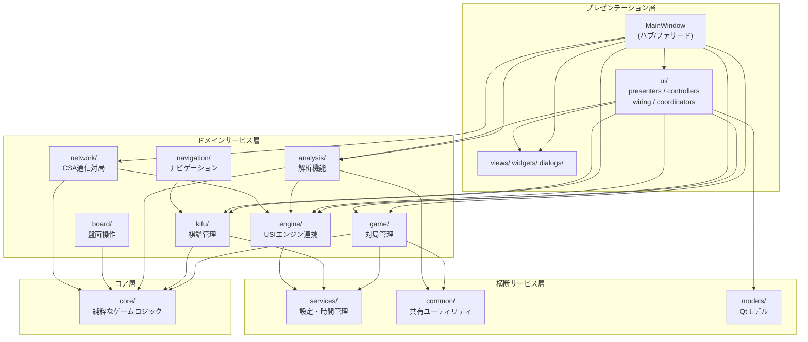
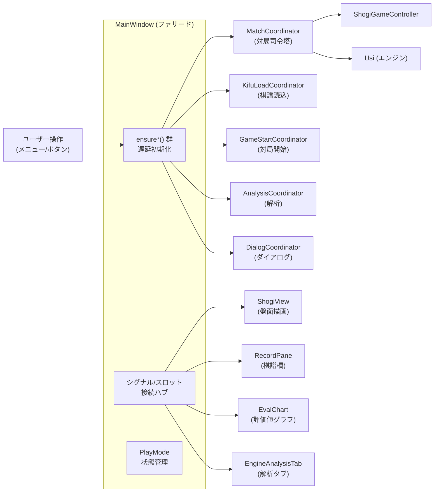
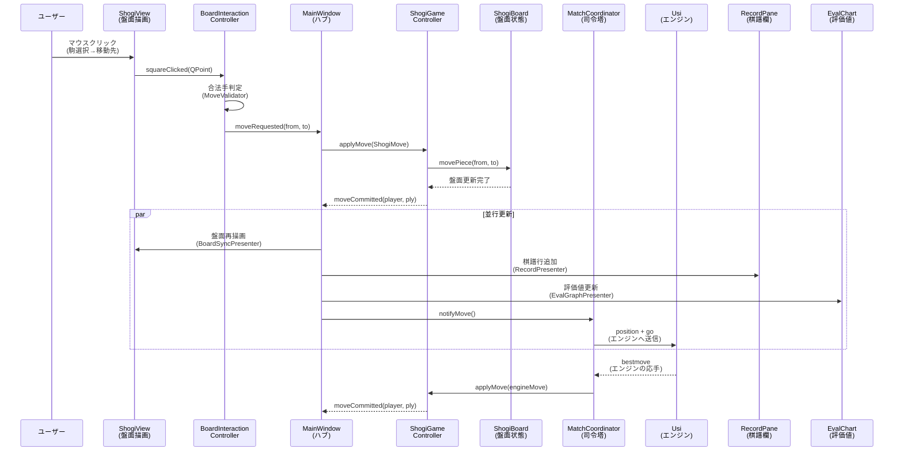
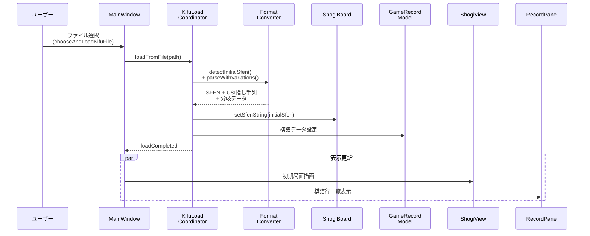

<!-- chapter-0-start -->
# ShogiBoardQ 開発者向けソースコード解説マニュアル

## 本マニュアルについて

**対象読者**: ShogiBoardQプロジェクトに新規参加する開発者

**前提知識**:
- C++17 の基本的な文法（`std::function`、構造化束縛、`std::optional` 等）
- Qt 6 の基礎（シグナル/スロット、`QWidget`、`QObject` の親子関係）
- CMake によるビルド経験
- 将棋のルールについては第2章で解説するため、事前知識は不要

**関連ドキュメント**:
- [CLAUDE.md](../CLAUDE.md) — プロジェクトの開発ガイドライン（ビルド手順、アーキテクチャ概要、コーディング規約）
- [commenting-style-guide.md](commenting-style-guide.md) — コメント記述のスタイルガイド

---

## 目次

| 章 | タイトル | 概要 |
|----|---------|------|
| [第0章](#第0章-表紙目次) | 表紙・目次 | 本ページ |
| [第1章](#第1章-プロジェクト概要とビルド手順) | プロジェクト概要とビルド手順 | 機能紹介、ビルド方法、ディレクトリ構造 |
| [第2章](#第2章-将棋のドメイン知識) | 将棋のドメイン知識 | SFEN、USI記法、駒表現、座標系 |
| [第3章](#第3章-アーキテクチャ全体図) | アーキテクチャ全体図 | レイヤー構造、データフロー、MainWindowの位置づけ |
| [第4章](#第4章-設計パターンとコーディング規約) | 設計パターンとコーディング規約 | Deps構造体、ensure*()、Wiring、MVP、コード規約 |
| [第5章](#第5章-core層純粋なゲームロジック) | core層：純粋なゲームロジック | ShogiBoard、ShogiMove、MoveValidator |
| [第6章](#第6章-game層対局管理) | game層：対局管理 | MatchCoordinator、TurnManager、GameStateController |
| [第7章](#第7章-engine層usiエンジン連携) | engine層：USIエンジン連携 | Usiファサード、プロトコルハンドラ、思考情報表示 |
| [第8章](#第8章-kifu層棋譜管理) | kifu層：棋譜管理 | 分岐ツリー、棋譜モデル、フォーマット変換 |
| [第9章](#第9章-analysis層解析機能) | analysis層：解析機能 | 検討・棋譜解析・詰将棋探索の3モード |
| [第10章](#第10章-ui層プレゼンテーション) | UI層：プレゼンテーション | Presenters/Controllers/Wiring/Coordinators |
| [第11章](#第11章-viewswidgetsdialogs層qt-ui部品) | views/widgets/dialogs層：Qt UI部品 | ShogiView描画、ウィジェット、ダイアログ |
| [第12章](#第12章-network層とservices層) | network層とservices層 | CSA通信、設定サービス、時間管理 |
| [第13章](#第13章-navigation層とboard層) | navigation層とboard層 | 棋譜ナビゲーション、盤面操作 |
| [第14章](#第14章-mainwindowの役割と構造) | MainWindowの役割と構造 | ensure*()群、委譲パターン、リファクタリング経緯 |
| [第15章](#第15章-機能フロー詳解) | 機能フロー詳解 | 5大ユースケースのシーケンス図 |
| [第16章](#第16章-国際化i18nと翻訳) | 国際化（i18n）と翻訳 | Qt Linguist、LanguageController |
| [第17章](#第17章-テストとデバッグ) | テストとデバッグ | テスト実行、TestAutomationHelper、整合性検証 |
| [第18章](#第18章-新機能の追加ガイド) | 新機能の追加ガイド | 実践チュートリアル |
| [第19章](#第19章-用語集索引) | 用語集・索引 | 将棋用語日英対応、クラス名逆引き |

---

## 改訂履歴

| 日付 | 内容 |
|------|------|
| 2026-02-08 | 初版作成（第0章・第1章） |
| 2026-02-08 | 第2章「将棋のドメイン知識」作成 |
| 2026-02-08 | 第3章「アーキテクチャ全体図」作成 |
| 2026-02-08 | 第4章「設計パターンとコーディング規約」作成 |
| 2026-02-08 | 第5章「core層：純粋なゲームロジック」作成 |

<!-- chapter-0-end -->

---

<!-- chapter-1-start -->
## 第1章 プロジェクト概要とビルド手順

### 1.1 ShogiBoardQとは

ShogiBoardQは、Qt 6とC++17で構築された将棋盤アプリケーションである。以下の主要機能を持つ。

| 機能カテゴリ | 内容 |
|-------------|------|
| **対局** | 人間 vs エンジン、エンジン vs エンジン、人間同士の対局。連続対局にも対応 |
| **棋譜管理** | KIF/KI2/CSA/JKF/USEN/USI形式の読み込み・保存、分岐棋譜の管理 |
| **エンジン解析** | USI対応エンジンによる局面検討、棋譜解析、詰将棋探索 |
| **CSA通信対局** | CSAプロトコルによるネットワーク対局 |
| **局面編集** | 任意の局面をGUIで作成、SFEN文字列からの読み込み |
| **盤面画像出力** | 現在の局面を画像ファイルとしてエクスポート |
| **定跡管理** | 定跡データの閲覧、結合、移動 |
| **国際化** | 日本語・英語の2言語対応（実行時切替可能） |

### 1.2 技術スタック

| 項目 | バージョン/仕様 |
|------|---------------|
| C++規格 | C++17（必須） |
| GUIフレームワーク | Qt 6（Qt 5 非対応） |
| Qt モジュール | Widgets, Charts, Network, LinguistTools |
| ビルドシステム | CMake 3.16以上 |
| エンジン通信 | USI（Universal Shogi Interface）プロトコル |
| ネットワーク対局 | CSA（Computer Shogi Association）プロトコル |

### 1.3 ビルド手順

#### 前提条件

- CMake 3.16 以上
- Qt 6 の開発パッケージ（Widgets, Charts, Network, LinguistTools）
- C++17 対応コンパイラ（GCC, Clang）

#### 基本ビルド

```bash
# 構成
cmake -B build -S .

# ビルド
cmake --build build

# Ninja使用（高速）
cmake -B build -S . -G Ninja
ninja -C build

# 実行
./build/ShogiBoardQ
```

#### 静的解析付きビルド

```bash
# clang-tidy（未使用コード検出）
cmake -B build -S . -DENABLE_CLANG_TIDY=ON
cmake --build build

# cppcheck（未使用関数検出）
cmake -B build -S . -DENABLE_CPPCHECK=ON
cmake --build build
```

clang-tidyは以下のチェックを実行する:
- `clang-diagnostic-unused-*` — 未使用の警告
- `misc-unused-*` — 未使用コードの検出
- `clang-analyzer-deadcode.*` — デッドコード解析
- `readability-redundant-*` — 冗長なコードの検出

cppcheckは `--enable=warning,unusedFunction` で未使用関数を検出する。

#### テストビルド

```bash
cmake -B build -S . -DBUILD_TESTING=ON
cmake --build build
ctest --test-dir build
```

#### 翻訳ファイルの更新

`tr()` でラップされた文字列を追加・変更した後に実行する:

```bash
lupdate src -ts resources/translations/ShogiBoardQ_ja_JP.ts resources/translations/ShogiBoardQ_en.ts
```

### 1.4 CMakeビルド構成の概要

`CMakeLists.txt` の主要な設定:

```cmake
# Qt自動処理（.ui, MOC, リソース）
set(CMAKE_AUTOUIC ON)
set(CMAKE_AUTOMOC ON)
set(CMAKE_AUTORCC ON)

# ソースファイルの自動収集（ディレクトリ別）
file(GLOB_RECURSE SRC_APP    CONFIGURE_DEPENDS src/app/*.cpp)
file(GLOB_RECURSE SRC_CORE   CONFIGURE_DEPENDS src/core/*.cpp)
# ... 全16ディレクトリ
```

**`GLOB_RECURSE`** を使用しているため、新しいソースファイルを追加する際に `CMakeLists.txt` を編集する必要はない。ファイルを適切なディレクトリに配置すれば自動的にビルド対象となる（CMake再構成時に検出される）。

**コンパイラ警告**: 以下の警告オプションが有効化されている:

```
-Wall -Wextra -Wpedantic -Wshadow -Wconversion -Wsign-conversion
-Wnon-virtual-dtor -Woverloaded-virtual -Wformat=2 -Wimplicit-fallthrough
-Wunused -Wunused-function -Wunused-variable -Wunused-parameter
```

### 1.5 ディレクトリ構造

#### プロジェクトルート

```
ShogiBoardQ/
├── CMakeLists.txt          # トップレベルビルド構成
├── CLAUDE.md               # 開発ガイドライン
├── README.md               # プロジェクト概要
├── .clang-tidy             # 静的解析設定
├── src/                    # ソースコード（後述）
├── tests/                  # テストコード
├── resources/              # リソースファイル
│   ├── shogiboardq.qrc     # Qt リソース定義ファイル
│   ├── icons/              # アプリケーションアイコン
│   ├── images/
│   │   ├── actions/        # メニュー/ツールバーアイコン
│   │   └── pieces/         # 駒画像
│   ├── platform/           # プラットフォーム固有ファイル
│   └── translations/       # 翻訳ファイル（.ts）
├── docs/                   # ドキュメント
├── scripts/                # ユーティリティスクリプト
└── build/                  # ビルド出力（git管理外）
```

#### ソースコード（`src/`）

ヘッダファイル（`.h`）は対応するソースファイル（`.cpp`）と同じディレクトリに配置される。

```
src/
├── app/                            # アプリケーションエントリーポイント
│   ├── main.cpp                    #   エントリーポイント
│   ├── mainwindow.cpp/.h/.ui       #   メインウィンドウ（ハブ/ファサード）
│   ├── commentcoordinator.cpp/.h   #   コメント機能の調整
│   ├── dockcreationservice.cpp/.h  #   ドックウィジェット生成
│   └── testautomationhelper.cpp/.h #   テスト自動化ヘルパー
│
├── core/                           # 純粋なゲームロジック（Qt GUI非依存）
│   ├── shogiboard.cpp/.h           #   盤面状態・駒管理
│   ├── shogimove.cpp/.h            #   指し手の表現
│   ├── movevalidator.cpp/.h        #   合法手判定
│   ├── shogiclock.cpp/.h           #   対局時計
│   ├── shogiutils.cpp/.h           #   ユーティリティ関数
│   ├── sfenutils.h                 #   SFEN文字列操作
│   ├── playmode.h                  #   プレイモード定義
│   └── legalmovestatus.h           #   合法手判定の状態
│
├── game/                           # 対局管理
│   ├── matchcoordinator.cpp/.h     #   対局全体の司令塔
│   ├── shogigamecontroller.cpp/.h  #   ゲームフロー制御
│   ├── gamestartcoordinator.cpp/.h #   対局開始フロー
│   ├── gamestatecontroller.cpp/.h  #   ゲーム状態制御
│   ├── turnmanager.cpp/.h          #   手番管理
│   ├── turnsyncbridge.cpp/.h       #   手番同期ブリッジ
│   ├── promotionflow.cpp/.h        #   成/不成の選択フロー
│   ├── prestartcleanuphandler.cpp/.h # 対局前クリーンアップ
│   └── consecutivegamescontroller.cpp/.h # 連続対局制御
│
├── kifu/                           # 棋譜管理
│   ├── gamerecordmodel.cpp/.h      #   棋譜データモデル
│   ├── kifubranchnode.cpp/.h       #   分岐ノード
│   ├── kifubranchtree.cpp/.h       #   分岐ツリー
│   ├── kifubranchtreebuilder.cpp/.h#   分岐ツリー構築
│   ├── livegamesession.cpp/.h      #   リアルタイム記録セッション
│   ├── kifuloadcoordinator.cpp/.h  #   棋譜読み込み調整
│   ├── kifusavecoordinator.cpp/.h  #   棋譜保存調整
│   ├── kifuioservice.cpp/.h        #   棋譜ファイルI/O
│   ├── kifuexportcontroller.cpp/.h #   棋譜エクスポート制御
│   ├── kifuclipboardservice.cpp/.h #   クリップボード操作
│   ├── kifucontentbuilder.cpp/.h   #   棋譜コンテンツ構築
│   ├── kifunavigationstate.cpp/.h  #   ナビゲーション状態
│   ├── kifreader.cpp/.h            #   棋譜ファイル読み込み
│   ├── shogiinforecord.cpp/.h      #   対局情報レコード
│   ├── kifdisplayitem.h            #   棋譜表示アイテム定義
│   ├── kifparsetypes.h             #   棋譜パース型定義
│   ├── kifutypes.h                 #   棋譜共通型定義
│   └── formats/                    #   フォーマット変換器
│       ├── kiftosfenconverter.cpp/.h   #   KIF → SFEN
│       ├── ki2tosfenconverter.cpp/.h   #   KI2 → SFEN
│       ├── csatosfenconverter.cpp/.h   #   CSA → SFEN
│       ├── jkftosfenconverter.cpp/.h   #   JKF → SFEN
│       ├── usentosfenconverter.cpp/.h  #   USEN → SFEN
│       └── usitosfenconverter.cpp/.h   #   USI → SFEN
│
├── analysis/                       # 解析機能
│   ├── analysiscoordinator.cpp/.h  #   解析オーケストレーション
│   ├── analysisflowcontroller.cpp/.h # 解析フロー制御
│   ├── considerationflowcontroller.cpp/.h # 検討モード制御
│   ├── considerationmodeuicontroller.cpp/.h # 検討UI制御
│   ├── tsumesearchflowcontroller.cpp/.h # 詰将棋探索制御
│   ├── analysisresultspresenter.cpp/.h # 解析結果表示
│   └── kifuanalysislistmodel.cpp/.h # 棋譜解析リストモデル
│
├── engine/                         # USIエンジン連携
│   ├── usi.cpp/.h                  #   エンジンファサード
│   ├── usiprotocolhandler.cpp/.h   #   USIプロトコル処理
│   ├── engineprocessmanager.cpp/.h #   エンジンプロセス管理
│   ├── enginesettingscoordinator.cpp/.h # エンジン設定調整
│   ├── shogiengineinfoparser.cpp/.h # エンジン情報パース
│   ├── shogienginethinkingmodel.cpp/.h # 思考情報Qtモデル
│   ├── thinkinginfopresenter.cpp/.h # 思考情報表示
│   ├── usicommlogmodel.cpp/.h      #   USI通信ログモデル
│   ├── engineoptiondescriptions.cpp/.h # エンジンオプション説明
│   ├── engineoptions.h             #   エンジンオプション定義
│   └── enginesettingsconstants.h   #   エンジン設定定数
│
├── network/                        # CSA通信対局
│   ├── csaclient.cpp/.h            #   CSAプロトコルクライアント
│   └── csagamecoordinator.cpp/.h   #   CSA対局調整
│
├── navigation/                     # ナビゲーション
│   ├── kifunavigationcontroller.cpp/.h # 棋譜ナビゲーション制御
│   └── recordnavigationhandler.cpp/.h # レコードペイン行変更ハンドラ
│
├── board/                          # 盤面操作
│   ├── boardinteractioncontroller.cpp/.h # 盤面インタラクション制御
│   ├── positioneditcontroller.cpp/.h # 局面編集制御
│   ├── boardimageexporter.cpp/.h   #   盤面画像エクスポート
│   └── sfenpositiontracer.cpp/.h   #   SFEN局面追跡
│
├── ui/                             # UI層
│   ├── presenters/                 #   MVPプレゼンター層
│   │   ├── boardsyncpresenter.cpp/.h   # 盤面同期
│   │   ├── evalgraphpresenter.cpp/.h   # 評価グラフ
│   │   ├── navigationpresenter.cpp/.h  # ナビゲーション表示
│   │   ├── recordpresenter.cpp/.h      # 棋譜表示
│   │   └── timedisplaypresenter.cpp/.h # 時間表示
│   ├── controllers/                #   UIイベントハンドラ
│   │   ├── boardsetupcontroller.cpp/.h     # 盤面セットアップ
│   │   ├── evaluationgraphcontroller.cpp/.h # 評価グラフ制御
│   │   ├── languagecontroller.cpp/.h       # 言語切替制御
│   │   ├── playerinfocontroller.cpp/.h     # 対局者情報制御
│   │   ├── pvclickcontroller.cpp/.h        # PVクリック制御
│   │   ├── replaycontroller.cpp/.h         # リプレイ制御
│   │   ├── timecontrolcontroller.cpp/.h    # 時間制御
│   │   ├── usicommandcontroller.cpp/.h     # USIコマンド制御
│   │   ├── nyugyokudeclarationhandler.cpp/.h # 入玉宣言処理
│   │   └── jishogiscoredialogcontroller.cpp/.h # 持将棋スコア
│   ├── wiring/                     #   シグナル/スロット接続
│   │   ├── uiactionswiring.cpp/.h      # UIアクション接続
│   │   ├── analysistabwiring.cpp/.h    # 解析タブ接続
│   │   ├── considerationwiring.cpp/.h  # 検討モード接続
│   │   ├── csagamewiring.cpp/.h        # CSA対局接続
│   │   ├── playerinfowiring.cpp/.h     # 対局者情報接続
│   │   ├── recordpanewiring.cpp/.h     # 棋譜ペイン接続
│   │   ├── menuwindowwiring.cpp/.h     # メニューウィンドウ接続
│   │   └── josekiwindowwiring.cpp/.h   # 定跡ウィンドウ接続
│   └── coordinators/               #   UI調整
│       ├── dialogcoordinator.cpp/.h     # ダイアログ調整
│       ├── gamelayoutbuilder.cpp/.h     # ゲームレイアウト構築
│       ├── docklayoutmanager.cpp/.h     # ドックレイアウト管理
│       ├── kifudisplaycoordinator.cpp/.h # 棋譜表示調整
│       ├── positioneditcoordinator.cpp/.h # 局面編集調整
│       └── aboutcoordinator.cpp/.h      # バージョン情報調整
│
├── views/                          # Qt Graphics View
│   └── shogiview.cpp/.h            #   将棋盤描画ビュー
│
├── widgets/                        # カスタムQtウィジェット
│   ├── recordpane.cpp/.h           #   棋譜表示ペイン
│   ├── engineanalysistab.cpp/.h    #   エンジン解析タブ
│   ├── evaluationchartwidget.cpp/.h #  評価値グラフウィジェット
│   ├── kifudisplay.cpp/.h          #   棋譜表示ウィジェット
│   ├── kifubranchdisplay.cpp/.h    #   分岐表示ウィジェット
│   ├── branchtreewidget.cpp/.h     #   分岐ツリーウィジェット
│   ├── gameinfopanecontroller.cpp/.h # 対局情報ペイン制御
│   ├── engineinfowidget.cpp/.h     #   エンジン情報ウィジェット
│   ├── kifuanalysisresultsdisplay.cpp/.h # 棋譜解析結果表示
│   ├── menubuttonwidget.cpp/.h     #   メニューボタン
│   ├── collapsiblegroupbox.cpp/.h  #   折りたたみグループボックス
│   ├── elidelabel.cpp/.h           #   省略ラベル
│   ├── flowlayout.cpp/.h           #   フローレイアウト
│   ├── globaltooltip.cpp/.h        #   グローバルツールチップ
│   ├── apptooltipfilter.cpp/.h     #   ツールチップフィルタ
│   ├── branchrowdelegate.cpp/.h    #   分岐行デリゲート
│   ├── longlongspinbox.cpp/.h      #   long long対応スピンボックス
│   └── numeric_right_align_comma_delegate.h # 数値右寄せデリゲート
│
├── dialogs/                        # ダイアログ実装
│   ├── startgamedialog.cpp/.h/.ui  #   対局開始ダイアログ
│   ├── considerationdialog.cpp/.h/.ui # 検討設定ダイアログ
│   ├── kifuanalysisdialog.cpp/.h/.ui # 棋譜解析ダイアログ
│   ├── csagamedialog.cpp/.h/.ui    #   CSA対局接続ダイアログ
│   ├── engineregistrationdialog.cpp/.h/.ui # エンジン登録ダイアログ
│   ├── changeenginesettingsdialog.cpp/.h/.ui # エンジン設定変更
│   ├── promotedialog.cpp/.h/.ui    #   成/不成選択ダイアログ
│   ├── versiondialog.cpp/.h/.ui    #   バージョン情報ダイアログ
│   ├── tsumeshogisearchdialog.cpp/.h # 詰将棋探索ダイアログ
│   ├── pvboarddialog.cpp/.h        #   読み筋盤面ダイアログ
│   ├── kifupastedialog.cpp/.h      #   棋譜貼り付けダイアログ
│   ├── csawaitingdialog.cpp/.h     #   CSA待機ダイアログ
│   ├── menuwindow.cpp/.h           #   メニューウィンドウ
│   ├── josekiwindow.cpp/.h         #   定跡ウィンドウ
│   ├── josekimergedialog.cpp/.h    #   定跡結合ダイアログ
│   └── josekimovedialog.cpp/.h     #   定跡移動ダイアログ
│
├── models/                         # Qtモデル
│   ├── abstractlistmodel.h         #   抽象リストモデル基底
│   ├── kifurecordlistmodel.cpp/.h  #   棋譜レコードリストモデル
│   └── kifubranchlistmodel.cpp/.h  #   分岐リストモデル
│
├── services/                       # クロスカッティングサービス
│   ├── settingsservice.cpp/.h      #   INI設定の読み書き
│   ├── timekeepingservice.cpp/.h   #   時間管理サービス
│   ├── playernameservice.cpp/.h    #   対局者名解決サービス
│   └── timecontrolutil.cpp/.h      #   時間制御ユーティリティ
│
└── common/                         # 共有ユーティリティ
    ├── errorbus.cpp/.h             #   エラー通知バス
    ├── jishogicalculator.cpp/.h    #   持将棋点数計算
    └── tsumepositionutil.cpp/.h    #   詰将棋局面ユーティリティ
```

### 1.6 コード規模

| ディレクトリ | ファイル数 | 行数 | 概要 |
|-------------|-----------|------|------|
| `app/` | 9 | 7,271 | メインウィンドウ、エントリーポイント |
| `core/` | 13 | 3,950 | 純粋ゲームロジック |
| `game/` | 18 | 7,887 | 対局管理 |
| `kifu/` | 31 | 10,282 | 棋譜管理（formatsを除く） |
| `kifu/formats/` | 12 | 7,651 | フォーマット変換器 |
| `engine/` | 20 | 5,709 | USIエンジン連携 |
| `analysis/` | 14 | 3,564 | 解析機能 |
| `network/` | 4 | 3,033 | CSA通信対局 |
| `navigation/` | 4 | 953 | ナビゲーション |
| `board/` | 8 | 1,536 | 盤面操作 |
| `ui/presenters/` | 10 | 1,380 | MVPプレゼンター |
| `ui/controllers/` | 20 | 3,466 | UIコントローラ |
| `ui/wiring/` | 16 | 2,921 | シグナル/スロット接続 |
| `ui/coordinators/` | 12 | 3,407 | UI調整 |
| `views/` | 2 | 4,158 | 将棋盤描画 |
| `widgets/` | 35 | 9,543 | カスタムウィジェット |
| `dialogs/` | 32 | 11,427 | ダイアログ |
| `models/` | 5 | 838 | Qtモデル |
| `services/` | 8 | 2,151 | 横断サービス |
| `common/` | 6 | 478 | 共有ユーティリティ |
| **合計** | **279** | **約91,600** | |

### 1.7 リソース構成

```
resources/
├── shogiboardq.qrc             # Qtリソース定義（画像・翻訳のバンドル）
├── icons/
│   ├── shogiboardq.icns        # macOS用アイコン
│   ├── shogiboardq.ico         # Windows用アイコン
│   └── shogiboardq.png         # 汎用アイコン
├── images/
│   ├── actions/                # ツールバー・メニューのアクションアイコン
│   └── pieces/                 # 駒画像（先手/後手、各駒種）
├── platform/
│   └── app.rc                  # Windows用リソーススクリプト
└── translations/
    ├── ShogiBoardQ_ja_JP.ts    # 日本語翻訳ソース
    └── ShogiBoardQ_en.ts       # 英語翻訳ソース
```

### 1.8 テスト構成

```
tests/
├── CMakeLists.txt                      # テスト用ビルド構成
├── fakes/                              # テスト用モック/フェイク実装
├── tst_kifudisplaycoordinator.cpp      # 棋譜表示調整テスト
├── tst_livegamesession.cpp             # ライブゲームセッションテスト
└── tst_prestartcleanuphandler.cpp      # 対局前クリーンアップテスト
```

テストの詳細は[第17章](#第17章-テストとデバッグ)で解説する。

### 1.9 開発環境

- **IDE**: Qt Creator を使用
- **ビルドジェネレータ**: Ninja 推奨（Makeより高速）
- **compile_commands.json**: `CMAKE_EXPORT_COMPILE_COMMANDS=ON` で自動生成（clang-tidy、IDE連携に利用）

<!-- chapter-1-end -->

---

<!-- chapter-2-start -->
## 第2章 将棋のドメイン知識

本章では、ShogiBoardQの開発に必要な将棋のデータ表現を解説する。将棋のルール自体の説明は省略し、コード上の座標系・文字列フォーマット・駒表現に焦点を当てる。

### 2.1 盤面座標系

将棋盤は9×9の81マスで構成される。座標は**筋**（file, 縦列）と**段**（rank, 横行）で表現される。

#### 筋と段の番号

```
  9   8   7   6   5   4   3   2   1    ← 筋（file）: 右から左へ 1〜9
┌───┬───┬───┬───┬───┬───┬───┬───┬───┐
│   │   │   │   │   │   │   │   │   │ 一段（rank 1）
├───┼───┼───┼───┼───┼───┼───┼───┼───┤
│   │   │   │   │   │   │   │   │   │ 二段（rank 2）
├───┼───┼───┼───┼───┼───┼───┼───┼───┤
│   │   │   │   │   │   │   │   │   │ 三段（rank 3）
├───┼───┼───┼───┼───┼───┼───┼───┼───┤
│   │   │   │   │   │   │   │   │   │ ...
├───┼───┼───┼───┼───┼───┼───┼───┼───┤
│   │   │   │   │   │   │   │   │   │ 九段（rank 9）
└───┴───┴───┴───┴───┴───┴───┴───┴───┘
```

- **筋（file）**: 1〜9。盤を先手側から見て**右から左**へ番号が増える
- **段（rank）**: 1〜9。盤を先手側から見て**上から下**へ番号が増える
- 先手の陣地は7〜9段目、後手の陣地は1〜3段目

#### 座標表記の変換

日本語の棋譜表記では筋を全角数字、段を漢数字で表す。`shogiutils.cpp` に変換関数がある。

```cpp
// src/core/shogiutils.cpp

// 段番号（1〜9）→ 漢字（"一"〜"九"）
QString transRankTo(const int rankTo)
{
    static const QStringList rankStrings = { "", "一", "二", "三", "四", "五", "六", "七", "八", "九" };
    // ...
    return rankStrings.at(rankTo);
}

// 筋番号（1〜9）→ 全角数字（"１"〜"９"）
QString transFileTo(const int fileTo)
{
    static const QStringList fileStrings = { "", "１", "２", "３", "４", "５", "６", "７", "８", "９" };
    // ...
    return fileStrings.at(fileTo);
}
```

例: 7筋六段 → `"７六"` (7筋=`"７"`, 6段=`"六"`)

#### 内部インデックスとの対応

コード内部では、`ShogiMove` の座標値は **0-indexed**（0〜8）で管理される。

```cpp
// src/core/shogimove.h
struct ShogiMove {
    QPoint fromSquare;   // 移動元（盤上:0-8、駒台:9=先手,10=後手）
    QPoint toSquare;     // 移動先（0-8）
    QChar movingPiece;   // 動かした駒（SFEN表記）
    QChar capturedPiece; // 取った駒（なければ ' '）
    bool isPromotion;    // 成りフラグ
};
```

| 表記系 | 筋の範囲 | 段の範囲 | 用途 |
|--------|---------|---------|------|
| 外部（SFEN/USI/棋譜） | 1〜9 | 1〜9（USIでは a〜i） | ファイルI/O、エンジン通信 |
| 内部（`ShogiMove`） | 0〜8 | 0〜8 | コード内の座標計算 |
| 駒台 | 9=先手, 10=後手 | 駒種別に割当 | 持ち駒管理 |

**変換式**: 内部値 + 1 = 外部値

```cpp
// src/core/shogiutils.cpp — moveToUsi() より
const int toFile = toX + 1;          // 0-indexed → 1-indexed
const QChar toRank = QChar('a' + toY); // 0 → 'a', 8 → 'i'
```

`ShogiBoard` の盤面データは1次元配列 `QVector<QChar> m_boardData`（81要素）で保持される。

```cpp
// src/core/shogiboard.cpp — インデックス計算
int index = (rank - 1) * files() + (file - 1);  // 1-indexed の file, rank から算出
```

| マス | file（筋） | rank（段） | 配列インデックス |
|------|-----------|-----------|---------------|
| 9一 | 9 | 1 | (1-1)*9 + (9-1) = 8 |
| 1一 | 1 | 1 | (1-1)*9 + (1-1) = 0 |
| 5五 | 5 | 5 | (5-1)*9 + (5-1) = 40 |
| 1九 | 1 | 9 | (9-1)*9 + (1-1) = 72 |

> **注意**: SFEN文字列の盤面パートは9一（左上）から1一（右上）へ左から右に読む。つまり筋が**9→1**の降順で並ぶ。`setPiecePlacementFromSfen()` ではこれに合わせて `file = fileCount; file > 0; --file` とループしている。

### 2.2 駒の表現方法

#### SFEN駒文字

駒は1文字のアルファベットで表現される。**大文字=先手（Black）**、**小文字=後手（White）**。

| 駒名 | 日本語 | 先手 | 後手 | 最大枚数 |
|------|--------|------|------|---------|
| 歩兵 | Pawn | `P` | `p` | 各9枚 |
| 香車 | Lance | `L` | `l` | 各2枚 |
| 桂馬 | Knight | `N` | `n` | 各2枚 |
| 銀将 | Silver | `S` | `s` | 各2枚 |
| 金将 | Gold | `G` | `g` | 各2枚 |
| 角行 | Bishop | `B` | `b` | 各1枚 |
| 飛車 | Rook | `R` | `r` | 各1枚 |
| 玉将 | King | `K` | `k` | 各1枚 |

#### 成駒の表現

SFEN標準では成駒を `+` 接頭辞で表すが、本プロジェクトではコード内部で1文字に変換して扱う。

| 成駒名 | 日本語 | SFEN標準 | 内部文字（先手） | 内部文字（後手） |
|--------|--------|---------|----------------|----------------|
| と金 | Promoted Pawn | `+P` / `+p` | `Q` | `q` |
| 成香 | Promoted Lance | `+L` / `+l` | `M` | `m` |
| 成桂 | Promoted Knight | `+N` / `+n` | `O` | `o` |
| 成銀 | Promoted Silver | `+S` / `+s` | `T` | `t` |
| 馬 | Horse (Promoted Bishop) | `+B` / `+b` | `C` | `c` |
| 龍 | Dragon (Promoted Rook) | `+R` / `+r` | `U` | `u` |

> **金将と玉将には成駒がない。**

この変換は `ShogiBoard::validateAndConvertSfenBoardStr()` で行われる。

```cpp
// src/core/shogiboard.cpp

const QStringList promotions = {"+P", "+L", "+N", "+S", "+B", "+R",
                                "+p", "+l", "+n", "+s", "+b", "+r"};
const QString replacements = "QMOTCUqmotcu";

for (qsizetype i = 0; i < promotions.size(); ++i) {
    initialSfenStr.replace(promotions[i], replacements[i]);
}
```

逆変換（内部文字 → SFEN文字列）は `convertPieceToSfen()` が担う。

```cpp
// src/core/shogiboard.cpp
QString ShogiBoard::convertPieceToSfen(const QChar piece) const
{
    static const QMap<QChar, QString> sfenMap = {
        {'Q', "+P"}, {'M', "+L"}, {'O', "+N"}, {'T', "+S"},
        {'C', "+B"}, {'U', "+R"}, {'q', "+p"}, {'m', "+l"},
        {'o', "+n"}, {'t', "+s"}, {'c', "+b"}, {'u', "+r"}
    };
    return sfenMap.contains(piece) ? sfenMap.value(piece) : QString(piece);
}
```

#### 駒台（持ち駒）

駒台は `QMap<QChar, int>` で管理される。キーは駒文字、値は枚数。

```cpp
// src/core/shogiboard.cpp — initStand()
static const QList<QChar> pieces = {'p', 'l', 'n', 's', 'g', 'b', 'r', 'k',
                                    'P', 'L', 'N', 'S', 'G', 'B', 'R', 'K'};
```

駒を取ったとき、成駒は元の駒に変換して相手の駒台に加える。

```cpp
// src/core/shogiboard.cpp — convertPieceChar()
// 成駒は相手の生駒に変換し、それ以外は大文字/小文字を反転する
static const QMap<QChar, QChar> conversionMap = {
    {'Q', 'p'}, {'M', 'l'}, {'O', 'n'}, {'T', 's'}, {'C', 'b'}, {'U', 'r'},
    {'q', 'P'}, {'m', 'L'}, {'o', 'N'}, {'t', 'S'}, {'c', 'B'}, {'u', 'R'}
};
```

#### 全駒リストと PieceType 列挙

`MoveValidator` では駒種を列挙型で定義している。

```cpp
// src/core/movevalidator.h
enum PieceType {
    PAWN,             // 歩   (P/p)
    LANCE,            // 香   (L/l)
    KNIGHT,           // 桂   (N/n)
    SILVER,           // 銀   (S/s)
    GOLD,             // 金   (G/g)
    BISHOP,           // 角   (B/b)
    ROOK,             // 飛   (R/r)
    KING,             // 玉   (K/k)
    PROMOTED_PAWN,    // と金 (Q/q)
    PROMOTED_LANCE,   // 成香 (M/m)
    PROMOTED_KNIGHT,  // 成桂 (O/o)
    PROMOTED_SILVER,  // 成銀 (T/t)
    HORSE,            // 馬   (C/c)
    DRAGON,           // 龍   (U/u)
    PIECE_TYPE_SIZE   // 駒種の総数 = 14
};
```

全28文字（先手14種 + 後手14種）がビットボード管理の対象となる。

```cpp
// src/core/movevalidator.cpp — コンストラクタ
m_allPieces = {'P', 'L', 'N', 'S', 'G', 'B', 'R', 'K', 'Q', 'M', 'O', 'T', 'C', 'U',
               'p', 'l', 'n', 's', 'g', 'b', 'r', 'k', 'q', 'm', 'o', 't', 'c', 'u'};
```

### 2.3 SFEN文字列フォーマット

SFEN（Shogi Forsyth-Edwards Notation）は局面を1行の文字列で表現するフォーマットである。チェスのFEN記法を将棋向けに拡張したもの。

#### 構造

SFEN文字列は**スペース区切り**の4つのフィールドからなる。

```
<盤面> <手番> <持ち駒> <手数>
```

**例**: 初期配置

```
lnsgkgsnl/1r5b1/ppppppppp/9/9/9/PPPPPPPPP/1B5R1/LNSGKGSNL b - 1
```

| フィールド | 値 | 説明 |
|-----------|-----|------|
| 盤面 | `lnsgkgsnl/1r5b1/...` | 駒配置（後述） |
| 手番 | `b` | `b`=先手（Black）、`w`=後手（White） |
| 持ち駒 | `-` | `-`=なし、それ以外は駒文字＋枚数 |
| 手数 | `1` | 次の手の番号（1以上の正整数） |

```cpp
// src/core/sfenutils.h — "startpos" を初期配置SFENに展開
inline QString normalizeStart(const QString& startPositionStr)
{
    if (startPositionStr == QStringLiteral("startpos")) {
        return QStringLiteral("lnsgkgsnl/1r5b1/ppppppppp/9/9/9/PPPPPPPPP/1B5R1/LNSGKGSNL b - 1");
    }
    return startPositionStr;
}
```

#### 盤面フィールド

盤面は `/` で9段に区切られ、各段は9一（左上、筋9）から1一（右上、筋1）へ**右から左**に読む。

- アルファベット文字: 駒（大文字=先手、小文字=後手）
- 数字（1〜9）: 連続する空マスの数
- `+`: 直後の駒文字が成駒であることを示す（`+P` = と金）

```
lnsgkgsnl    ← 1段目: 後手の 香桂銀金玉金銀桂香
/1r5b1/      ← 2段目: 空1 飛 空5 角 空1
ppppppppp    ← 3段目: 後手の歩×9
/9/9/9/      ← 4〜6段目: 全て空
PPPPPPPPP    ← 7段目: 先手の歩×9
/1B5R1/      ← 8段目: 空1 角 空5 飛 空1
LNSGKGSNL    ← 9段目: 先手の 香桂銀金玉金銀桂香
```

SFEN文字列の検証は `ShogiBoard::validateSfenString()` で行われる。

```cpp
// src/core/shogiboard.cpp
void ShogiBoard::validateSfenString(const QString& sfenStr,
                                     QString& sfenBoardStr, QString& sfenStandStr)
{
    QStringList sfenComponents = sfenStr.split(" ");
    if (sfenComponents.size() != 4) {
        // エラー: SFEN文字列は4要素で構成される必要がある
    }
    sfenBoardStr = sfenComponents.at(0);         // 盤面
    m_currentPlayer = sfenComponents.at(1);       // 手番 "b" or "w"
    sfenStandStr = sfenComponents.at(2);          // 持ち駒
    m_currentMoveNumber = sfenComponents.at(3).toInt(); // 手数
}
```

#### 持ち駒フィールド

持ち駒がない場合は `-`。ある場合は枚数＋駒文字を連結する（1枚の場合は数字を省略）。

| 持ち駒文字列 | 意味 |
|-------------|------|
| `-` | 持ち駒なし |
| `P` | 先手の歩1枚 |
| `2P` | 先手の歩2枚 |
| `RB2S3P2p` | 先手: 飛1 角1 銀2 歩3、後手: 歩2 |
| `10P` | 先手の歩10枚（2桁にも対応） |

出力順序は `R B G S N L P`（先手 → 後手）の順。

```cpp
// src/core/shogiboard.cpp — convertStandToSfen()
QList<QChar> keys = {'R', 'B', 'G', 'S', 'N', 'L', 'P'};
for (const auto& key : keys) {
    // 先手
    int value = m_pieceStand.value(key, 0);
    if (value > 0) {
        handPiece += (value > 1 ? QString::number(value) : "") + convertPieceToSfen(key);
    }
    // 後手（小文字）
    value = m_pieceStand.value(key.toLower(), 0);
    if (value > 0) {
        handPiece += (value > 1 ? QString::number(value) : "") + convertPieceToSfen(key.toLower());
    }
}
return handPiece.isEmpty() ? "-" : handPiece;
```

### 2.4 USI指し手表記

USI（Universal Shogi Interface）プロトコルで使用される指し手表記。座標は **筋=1〜9**（数字）、**段=a〜i**（アルファベット）で表す。

#### 座標系

| 段（rank） | 1段 | 2段 | 3段 | 4段 | 5段 | 6段 | 7段 | 8段 | 9段 |
|-----------|-----|-----|-----|-----|-----|-----|-----|-----|-----|
| USI表記 | a | b | c | d | e | f | g | h | i |

#### 指し手の3パターン

| 種類 | 書式 | 例 | 意味 |
|------|------|-----|------|
| 通常移動 | `<from_file><from_rank><to_file><to_rank>` | `7g7f` | 7七(7g)の駒を7六(7f)へ |
| 成り | `<from><to>+` | `8h2b+` | 8八(8h)から2二(2b)へ移動し成る |
| 駒打ち | `<PIECE>*<to_file><to_rank>` | `P*5e` | 歩を5五(5e)に打つ |

- 駒打ちの駒文字は常に**大文字**（先手・後手問わず）
- 駒打ちでは `fromSquare.x()` が `9`（先手駒台）または `10`（後手駒台）

```cpp
// src/core/shogiutils.cpp — moveToUsi()

QString moveToUsi(const ShogiMove& move)
{
    const int toFile = toX + 1;
    const QChar toRank = QChar('a' + toY);

    // 駒打ち: fromXが9（先手駒台）または10（後手駒台）
    if (fromX == 9 || fromX == 10) {
        QChar piece = move.movingPiece.toUpper();
        return QStringLiteral("%1*%2%3").arg(piece).arg(toFile).arg(toRank);
    }

    // 通常移動
    const int fromFile = fromX + 1;
    const QChar fromRank = QChar('a' + fromY);
    QString usi = QStringLiteral("%1%2%3%4")
                      .arg(fromFile).arg(fromRank).arg(toFile).arg(toRank);

    if (move.isPromotion) {
        usi += QLatin1Char('+');
    }
    return usi;
}
```

#### 変換の具体例

| 指し手 | 日本語表記 | USI表記 | ShogiMove の値 |
|--------|-----------|---------|---------------|
| ７六歩 | ▲７六歩 | `7g7f` | from=(6,6) to=(6,5) piece='P' |
| ８八角成 | ▲８八角成 | `2b8h+` | from=(1,1) to=(7,7) piece='b' promo=true |
| 歩打ち５五 | ▲５五歩打 | `P*5e` | from=(9,0) to=(4,4) piece='P' |

> **注意**: `ShogiMove` の座標は0-indexedなので、USI出力時に+1する。

### 2.5 棋譜フォーマットの比較

ShogiBoardQは6種類の棋譜フォーマットを読み込める。いずれも内部的にSFEN＋USI指し手列に変換される。変換器は `src/kifu/formats/` に配置されている。

#### 各フォーマットの概要

| フォーマット | 正式名称 | 種別 | 主な用途 |
|-------------|---------|------|---------|
| **KIF** | KIF（棋譜ファイル） | テキスト（日本語） | プロ棋譜、一般的な棋譜保存 |
| **KI2** | KI2（棋譜ファイル簡略版） | テキスト（日本語） | 書籍・雑誌向け簡略表記 |
| **CSA** | CSA（コンピュータ将棋協会） | テキスト（機械向け） | コンピュータ将棋大会 |
| **JKF** | JSON Kifu Format | JSON | Webアプリ、現代的なツール |
| **USEN** | URL Safe sfen-Extended Notation | Base36エンコード | Shogi Playground等のURL共有 |
| **USI** | Universal Shogi Interface | テキスト（プロトコル） | エンジン通信、解析記録 |

#### 指し手表記の比較

同じ指し手「先手が7七の歩を7六に進める」を各フォーマットで表すと:

| フォーマット | 表記例 | 特徴 |
|-------------|--------|------|
| KIF | `▲７六歩(77)` | 移動元を括弧内に記載 |
| KI2 | `▲７六歩` | 移動元なし（盤面から推定が必要） |
| CSA | `+7776FU` | `+`=先手、座標4桁、駒種2文字 |
| JKF | `{"to":{"x":7,"y":6},"piece":"FU"}` | JSON形式 |
| USEN | 3文字のBase36コード | `code = (from*81+to)*2 + promo` |
| USI | `7g7f` | 座標4文字（筋=数字、段=a-i） |

#### 詳細比較表

| 特性 | KIF | KI2 | CSA | JKF | USEN | USI |
|------|-----|-----|-----|-----|------|-----|
| **可読性** | 高（日本語） | 高（日本語） | 中 | 中（JSON） | 低 | 中 |
| **移動元情報** | あり | **なし** | あり | あり | あり | あり |
| **対局情報** | あり | あり | あり | あり | **なし** | **なし** |
| **時間情報** | あり | あり | あり | あり | **なし** | **なし** |
| **コメント** | あり | あり | あり | あり | **なし** | **なし** |
| **分岐** | あり | あり | なし | あり | あり | あり |
| **文字エンコーディング** | Shift-JIS/UTF-8 | Shift-JIS/UTF-8 | Shift-JIS/UTF-8 | UTF-8 | ASCII | ASCII |
| **パース難易度** | 中 | **高** | 中 | 中 | **高** | 低 |
| **拡張子** | `.kif` | `.ki2` | `.csa` | `.jkf` | (URL) | (なし) |
| **変換器** | `kiftosfenconverter` | `ki2tosfenconverter` | `csatosfenconverter` | `jkftosfenconverter` | `usentosfenconverter` | `usitosfenconverter` |

#### 各フォーマットの特記事項

**KIF**: 最も広く使われる棋譜フォーマット。移動先は全角数字＋漢数字（`７六`）、移動元は括弧内に半角数字（`(77)`）で記す。同じマスへの移動は「同」と表記する。コメントは `*` で始まる行。ヘッダにはKIFフォーマット固有の情報（対局日、棋戦名、対局者名等）を含む。

**KI2**: KIFの簡略版。移動元座標が省略されるため、パーサは現在の盤面を追跡し合法手から移動元を推定する必要がある（`inferSourceSquare()` ロジック）。複数の駒が同じマスに移動できる場合は「右」「左」「上」「引」「寄」「直」等の修飾語で区別する。

**CSA**: コンピュータ将棋大会の標準フォーマット。駒は2文字コード（`FU`=歩, `KY`=香, `KE`=桂, `GI`=銀, `KI`=金, `KA`=角, `HI`=飛, `OU`=玉, `TO`=と, `NY`=成香, `NK`=成桂, `NG`=成銀, `UM`=馬, `RY`=龍）。初期配置は `PI` 行または `P1`〜`P9` 行で記述。終了コードは `%TORYO`（投了）、`%SENNICHITE`（千日手）等。ネットワーク対局（CSAプロトコル）でも使用される。

**JKF**: JSON形式の現代的フォーマット。駒台（handicap）プリセット名 `HIRATE`（平手）、`KY`（香落ち）等をサポート。分岐もJSON配列で自然に表現できる。仕様は [json-kifu-format](https://github.com/na2hiro/json-kifu-format) を参照。

**USEN**: URLに埋め込み可能な超コンパクトフォーマット。指し手をBase36で3文字にエンコードする。計算式: `code = (from_sq * 81 + to_sq) * 2 + (promotion ? 1 : 0)`。マス番号は `(rank-1)*9 + (file-1)` で0〜80。駒打ちは `from_sq = 81 + 駒種番号`。バージョンプレフィックス `~0.` または `~.` で始まる。

**USI**: エンジン通信プロトコルの指し手部分をそのまま棋譜として保存する形式。`position startpos moves 2g2f 3c3d 7g7f` または `position sfen <SFEN> moves ...` の形式。終了コードは `resign`、`win`、`draw` 等。

#### 変換器の共通API

全変換器は以下の共通メソッドを持つ:

| メソッド | 説明 |
|---------|------|
| `detectInitialSfenFromFile()` | 初期局面のSFEN文字列を取得 |
| `convertFile()` | USI指し手列を抽出 |
| `extractMovesWithTimes()` | 時間情報付き指し手を抽出 |
| `parseWithVariations()` | 分岐を含む完全な棋譜ツリーを取得 |
| `extractGameInfo()` | 対局情報（対局者名、日時等）を抽出 |

### 2.6 座標変換の早見表

開発中に頻出する座標変換をまとめる。

| 変換 | 方法 | コード例 |
|------|------|---------|
| 内部(0-8) → USI筋 | +1 | `file + 1` → `1`〜`9` |
| 内部(0-8) → USI段 | 'a'+値 | `QChar('a' + rank)` → `a`〜`i` |
| 内部(0-8) → 日本語筋 | `transFileTo(file+1)` | → `"１"`〜`"９"` |
| 内部(0-8) → 日本語段 | `transRankTo(rank+1)` | → `"一"`〜`"九"` |
| 全角数字 → 数値 | `parseFullwidthFile(ch)` | `"１"` → `1` |
| 漢数字 → 数値 | `parseKanjiRank(ch)` | `"一"` → `1` |
| file,rank → 配列index | `(rank-1)*9 + (file-1)` | 1-indexed入力 |

<!-- chapter-2-end -->

---

<!-- chapter-3-start -->
## 第3章 アーキテクチャ全体図

本章では、ShogiBoardQのレイヤー構造、各層の責務、MainWindowの位置づけ、PlayModeによる動作分岐、およびデータフローの全体像を解説する。

### 3.1 レイヤー構造

ShogiBoardQは以下の5つのレイヤーで構成される。下位レイヤーは上位レイヤーに依存しない。



#### 各レイヤーの責務

| レイヤー | ディレクトリ | 責務 |
|---------|------------|------|
| **コア層** | `core/` | 将棋のルール・盤面・駒・指し手を純粋なC++で表現する（Qt GUI非依存） |
| **ドメインサービス層** | `game/`, `kifu/`, `analysis/`, `engine/`, `network/`, `navigation/`, `board/` | 対局進行・棋譜管理・解析・エンジン通信などのビジネスロジックを提供する |
| **横断サービス層** | `services/`, `common/`, `models/` | 設定永続化・時間管理・エラー通知など、層を横断して利用される共通機能を提供する |
| **プレゼンテーション層** | `app/`, `ui/`, `views/`, `widgets/`, `dialogs/` | ユーザー操作の受付、画面描画、シグナル/スロット配線を行う |

### 3.2 層間の依存ルール

依存は**上位→下位**の一方向のみ許可される。同一レイヤー内の横方向依存は限定的に許可される。

| 参照元（依存する側） | 参照可能な層 | 参照禁止 |
|-------------------|------------|---------|
| **コア層** (`core/`) | なし（外部依存なし） | 他の全層 |
| **ドメインサービス層** (`game/`, `kifu/` 等) | コア層、横断サービス層 | プレゼンテーション層 |
| **横断サービス層** (`services/`, `common/`) | コア層（必要時のみ） | ドメインサービス層、プレゼンテーション層 |
| **プレゼンテーション層** (`ui/`, `views/` 等) | 全層 | — |

**同一レイヤー内の依存例**:

- `analysis/` → `engine/`: 解析機能がUSIエンジンを利用する
- `network/` → `engine/`: CSA通信対局がUSIエンジンを利用する
- `navigation/` → `kifu/`: ナビゲーションが棋譜データにアクセスする
- `ui/presenters/` → `ui/controllers/`: プレゼンターがコントローラを参照する

**禁止される依存の例**:

- `core/` → `game/`: コア層がドメインサービス層のクラスを参照してはならない
- `game/` → `ui/`: ドメインサービス層がUI部品を直接操作してはならない
- `services/` → `game/`: 横断サービスがドメインロジックに依存してはならない

> **例外**: MainWindowは全層を横断するハブであるため、全てのレイヤーへの参照を持つ。これは設計上の意図的な選択であり、MainWindowがファサードとして各層を接続する役割を担うためである（3.3節参照）。

### 3.3 MainWindowの「ハブ/ファサード」としての位置づけ

MainWindow（`src/app/mainwindow.h/.cpp`）は、ShogiBoardQ全体のUI起点であると同時に、各レイヤーのコンポーネントを接続するハブとして動作する。



#### MainWindowの設計原則

1. **直接ロジックは最小化**: MainWindow自身にはビジネスロジックを書かず、`ensure*()` で遅延生成した専用クラスへ委譲する
2. **接続ハブ**: 各コントローラ/コーディネータ間のシグナル/スロット接続を MainWindow に集約する
3. **同期点**: 盤面、棋譜行、手番、評価値グラフの同期処理を MainWindow で行う
4. **遅延初期化**: 約40個の `ensure*()` メソッドで、必要になるまでオブジェクトを生成しない

#### MainWindowが接続する主要コンポーネント

| カテゴリ | コンポーネント | 役割 |
|---------|-------------|------|
| **対局進行** | `MatchCoordinator` | 対局全体の司令塔（手番管理、勝敗判定） |
| **対局開始** | `GameStartCoordinator` | ダイアログ表示→設定→対局開始の一連のフロー |
| **棋譜読込** | `KifuLoadCoordinator` | 棋譜ファイルの読み込みと盤面反映 |
| **ゲーム制御** | `ShogiGameController` | 指し手の適用、成り判定、合法手チェック |
| **盤面操作** | `BoardInteractionController` | マウスクリック→駒選択→移動の変換 |
| **UI配線** | `*Wiring` 群（8種） | 機能別のシグナル/スロット接続をカプセル化 |
| **プレゼンター** | `*Presenter` 群（5種） | Model→View の表示更新を仲介 |
| **UI調整** | `*Coordinator` 群（6種） | 複数ウィジェットにまたがるUI操作を調整 |

### 3.4 PlayMode列挙型

`PlayMode`（`src/core/playmode.h`）はアプリケーション全体の動作モードを定義する列挙型で、UIの有効/無効状態、エンジン通信の開始/停止、ナビゲーションの可否など、アプリ全体の振る舞いを切り替える最も重要な状態変数である。

#### 全PlayMode値

| PlayMode値 | 意味 | 分類 |
|------------|------|------|
| `NotStarted` | 起動直後、対局未開始。棋譜閲覧・編集のみ可能 | 初期状態 |
| `HumanVsHuman` | 人間 vs 人間（平手・駒落ち） | 対局モード |
| `EvenHumanVsEngine` | 平手・先手:人間 vs 後手:エンジン | 対局モード |
| `EvenEngineVsHuman` | 平手・先手:エンジン vs 後手:人間 | 対局モード |
| `EvenEngineVsEngine` | 平手・駒落ち・エンジン vs エンジン | 対局モード |
| `HandicapEngineVsHuman` | 駒落ち・下手:エンジン vs 上手:人間 | 対局モード |
| `HandicapHumanVsEngine` | 駒落ち・下手:人間 vs 上手:エンジン | 対局モード |
| `HandicapEngineVsEngine` | 駒落ち・エンジン vs エンジン | 対局モード |
| `AnalysisMode` | 棋譜解析モード（全指し手を自動評価） | 解析モード |
| `ConsiderationMode` | 検討モード（任意の局面をリアルタイム解析） | 解析モード |
| `TsumiSearchMode` | 詰将棋探索モード（詰み手順の探索） | 解析モード |
| `CsaNetworkMode` | CSA通信対局モード（ネットワーク越しの対局） | 通信モード |
| `PlayModeError` | エラー状態（不正な設定値の検出用） | エラー |

#### PlayModeによる動作分岐

PlayModeはアプリケーション全体の振る舞いを決定する中心的な状態変数であり、以下の領域に影響する。

**1. 盤面操作の制御**

| PlayMode | 人間の駒操作 | 備考 |
|----------|------------|------|
| `NotStarted` | 不可 | 棋譜閲覧モード |
| `HumanVsHuman` | 両手番で可能 | — |
| `*HumanVsEngine` | 人間側の手番のみ | エンジン側の手番では操作不可 |
| `*EngineVsHuman` | 人間側の手番のみ | エンジン側の手番では操作不可 |
| `*EngineVsEngine` | 不可 | エンジン同士の自動対局 |
| `ConsiderationMode` | 不可 | 棋譜ナビゲーションのみ |
| `CsaNetworkMode` | 自分の手番のみ | ネットワーク対戦 |

**2. エンジンの使用**

| PlayMode | エンジン1 | エンジン2 | 用途 |
|----------|----------|----------|------|
| `HumanVsHuman` | 不使用 | 不使用 | — |
| `EvenHumanVsEngine` | 不使用 | 対局用 | 後手エンジン |
| `EvenEngineVsHuman` | 対局用 | 不使用 | 先手エンジン |
| `*EngineVsEngine` | 対局用 | 対局用 | 両方対局用 |
| `ConsiderationMode` | 解析用 | — | 局面評価 |
| `AnalysisMode` | 解析用 | — | 全局面自動評価 |
| `TsumiSearchMode` | 探索用 | — | 詰み手順探索 |
| `CsaNetworkMode` | 対局用 | — | 通信対局 |

**3. ナビゲーション・UI状態**

| PlayMode | 棋譜ナビゲーション | 対局開始メニュー | 棋譜読込 |
|----------|-----------------|----------------|---------|
| `NotStarted` | 有効 | 有効 | 有効 |
| 対局モード全般 | **無効** | **無効** | **無効** |
| `ConsiderationMode` | 有効（局面移動で再解析） | **無効** | **無効** |
| `AnalysisMode` | **無効**（自動進行中） | **無効** | **無効** |

**4. PlayModeの遷移パターン**

```
NotStarted ──→ HumanVsHuman / *VsEngine / *VsHuman / *VsEngine
    ↑              │
    └──── 対局終了 ←┘

NotStarted ──→ ConsiderationMode / AnalysisMode / TsumiSearchMode
    ↑              │
    └──── 解析終了 ←┘

NotStarted ──→ CsaNetworkMode
    ↑              │
    └──── 通信終了 ←┘
```

全てのモードは終了時に `NotStarted` に戻る。PlayModeの遷移は `MainWindow::m_playMode` で管理され、`GameStartCoordinator` や `MatchCoordinator` が遷移をトリガーする。

### 3.5 データフロー概要

以下は、ユーザーが盤面上で駒を動かしてから表示が更新されるまでの主要なデータフローである。



#### フロー解説

1. **ユーザー操作**: `ShogiView` がマウスクリックを受け、`BoardInteractionController` に座標を通知する
2. **合法手判定**: `BoardInteractionController` が `MoveValidator` を使って合法手かどうかを判定する。成り/不成の選択が必要な場合は `PromotionFlow` が介入する
3. **指し手の適用**: `MainWindow` 経由で `ShogiGameController` に指し手が渡され、`ShogiBoard` の盤面状態が更新される
4. **表示の同期**: `moveCommitted` シグナルをトリガーに、MainWindowが以下を並行して更新する:
   - `ShogiView`: 駒の再描画とハイライト表示（`BoardSyncPresenter` 経由）
   - `RecordPane`: 棋譜行の追加と選択行の更新（`RecordPresenter` 経由）
   - `EvaluationChartWidget`: 評価値グラフの更新
5. **エンジン応答**: 対局モードの場合、`MatchCoordinator` がUSIエンジンに `position` + `go` コマンドを送信し、`bestmove` を受け取って次の指し手を適用する

#### 棋譜読み込みのデータフロー



棋譜ファイルは6種類のフォーマット（KIF/KI2/CSA/JKF/USEN/USI）のいずれかを自動判別し、対応する変換器（`*ToSfenConverter`）で内部表現（SFEN + USI指し手列）に統一変換される。

### 3.6 アーキテクチャの設計判断

#### なぜMainWindowがハブなのか

Qt Widgetsアプリケーションでは、`QMainWindow` がメニューバー、ツールバー、ドックウィジェット、セントラルウィジェットの所有者であるため、UI操作の起点が自然とMainWindowに集中する。ShogiBoardQでは、この構造を活かしつつ以下の戦略で複雑さを管理している:

- **Wiring クラス**: 機能別のシグナル/スロット接続をカプセル化（`CsaGameWiring`, `PlayerInfoWiring` 等）
- **Coordinator クラス**: 複数コンポーネントにまたがる操作を調整（`GameStartCoordinator`, `DialogCoordinator` 等）
- **Presenter クラス**: Model→View の表示更新ロジックを分離（`BoardSyncPresenter`, `RecordPresenter` 等）
- **ensure*() パターン**: 遅延初期化により、必要になるまでオブジェクトを生成しない

これらのパターンの詳細は[第4章](#第4章-設計パターンとコーディング規約)で解説する。

#### コア層の独立性

`core/` ディレクトリのコードは Qt GUI（`QWidget`, `QGraphicsView` 等）に依存せず、純粋なC++とQtのユーティリティクラス（`QString`, `QPoint`, `QMap` 等）のみを使用する。これにより:

- ゲームロジックの単体テストが容易になる
- UI変更がルールエンジンに影響しない
- 将来的にCLI版やWebバックエンドへの再利用が可能になる

<!-- chapter-3-end -->

---

<!-- chapter-4-start -->
## 第4章 設計パターンとコーディング規約

本章では、ShogiBoardQ全体で繰り返し使われる設計パターンと、守るべきコーディング規約を解説する。新規コードを書く際はこれらのパターンに従うこと。

### 4.1 Deps構造体パターン

#### 目的

クラスが必要とする外部オブジェクト（依存）を1つの構造体にまとめ、コンストラクタや `updateDeps()` メソッドで一括注入する。これにより以下の利点が得られる:

- **依存の明示化**: クラスが何に依存しているかがヘッダの `Deps` 定義を見るだけで分かる
- **遅延初期化との親和性**: MainWindowの `ensure*()` でオブジェクトが段階的に生成されるため、後から依存を差し替える必要がある
- **テスト容易性**: テスト時にモックやスタブを `Deps` 経由で注入できる

#### 基本構造

```cpp
class SomeClass : public QObject {
    Q_OBJECT
public:
    struct Deps {
        ObjectA* objA = nullptr;     ///< 説明（非所有）
        ObjectB* objB = nullptr;     ///< 説明（非所有）
        int*     sharedValue = nullptr;  ///< 共有状態（非所有）
    };

    explicit SomeClass(const Deps& deps, QObject* parent = nullptr);

    /// 依存オブジェクトを再設定する
    void updateDeps(const Deps& deps);

private:
    ObjectA* m_objA = nullptr;
    ObjectB* m_objB = nullptr;
    int*     m_sharedValue = nullptr;
};
```

**要点**:
- `Deps` はクラス内の `public` セクションに定義する
- 全フィールドに `nullptr` または適切なデフォルト値を設定する
- ポインタは全て**非所有**（`Deps` を受け取る側は所有権を持たない）
- `///<` でフィールドの説明を付ける

#### 実例: ConsiderationWiring

```cpp
// src/ui/wiring/considerationwiring.h

class ConsiderationWiring : public QObject {
    Q_OBJECT
public:
    struct Deps {
        QWidget* parentWidget = nullptr;
        EngineAnalysisTab* analysisTab = nullptr;
        ShogiView* shogiView = nullptr;
        MatchCoordinator* match = nullptr;
        DialogCoordinator* dialogCoordinator = nullptr;
        ShogiEngineThinkingModel* considerationModel = nullptr;
        UsiCommLogModel* commLogModel = nullptr;
        PlayMode* playMode = nullptr;
        QString* currentSfenStr = nullptr;
        std::function<void()> ensureDialogCoordinator;  // 遅延初期化コールバック
    };

    explicit ConsiderationWiring(const Deps& deps, QObject* parent = nullptr);
    void updateDeps(const Deps& deps);
    // ...
};
```

> **注目**: `std::function<void()> ensureDialogCoordinator` は遅延初期化コールバックである。Wiringクラスが自分では `ensureDialogCoordinator()` を呼べないため、MainWindow側の遅延初期化関数を `std::function` 経由で注入する。このパターンについては [4.3節](#43-hooksstdfunction-コールバックパターン) で詳述する。

#### updateDeps() メソッドの実装

`updateDeps()` は全フィールドを新しい値で上書きする。遅延初期化により依存オブジェクトが後から生成された場合に呼ばれる。

```cpp
// src/ui/wiring/considerationwiring.cpp

void ConsiderationWiring::updateDeps(const Deps& deps)
{
    m_parentWidget = deps.parentWidget;
    m_analysisTab = deps.analysisTab;
    m_shogiView = deps.shogiView;
    m_match = deps.match;
    m_dialogCoordinator = deps.dialogCoordinator;
    m_considerationModel = deps.considerationModel;
    m_commLogModel = deps.commLogModel;
    m_playMode = deps.playMode;
    m_currentSfenStr = deps.currentSfenStr;
    if (deps.ensureDialogCoordinator) {
        m_ensureDialogCoordinator = deps.ensureDialogCoordinator;
    }
}
```

#### 実例: MatchCoordinator::Deps

大規模なクラスでは `Deps` に加えて `Hooks` 構造体（コールバック群）も持つ:

```cpp
// src/game/matchcoordinator.h

struct Deps {
    ShogiGameController* gc = nullptr;         ///< ゲームコントローラ（非所有）
    ShogiClock*          clock = nullptr;       ///< 将棋時計（非所有）
    ShogiView*           view = nullptr;        ///< 盤面ビュー（非所有）
    Usi*                 usi1 = nullptr;         ///< エンジン1（非所有）
    Usi*                 usi2 = nullptr;         ///< エンジン2（非所有）
    UsiCommLogModel*           comm1 = nullptr;  ///< エンジン1通信ログ（非所有）
    ShogiEngineThinkingModel*  think1 = nullptr; ///< エンジン1思考情報（非所有）
    UsiCommLogModel*           comm2 = nullptr;  ///< エンジン2通信ログ（非所有）
    ShogiEngineThinkingModel*  think2 = nullptr; ///< エンジン2思考情報（非所有）
    Hooks                hooks;                  ///< UIコールバック群
    QStringList* sfenRecord = nullptr;           ///< SFEN履歴（非所有）
};
```

### 4.2 ensure*() 遅延初期化パターン

#### 目的

MainWindowは約40個の `ensure*()` メソッドを持ち、各コンポーネントを**初めて必要になった時点**で生成する。これにより:

- **起動時間の短縮**: 全オブジェクトを起動時に生成しない
- **循環依存の回避**: AがBに依存し、BがAに依存する場合も、使用時点で双方が存在すれば問題ない
- **メモリ節約**: 使用しない機能のオブジェクトは生成されない

#### ガードパターン

全ての `ensure*()` メソッドは同じパターンに従う:

```
1. ガード: 既に存在すれば即 return
2. 生成: new でオブジェクトを作成（親を this にして Qt の親子関係で寿命管理）
3. 依存設定: setter や Deps で依存オブジェクトを注入
```

#### 実例: MainWindowの ensure*() メソッド群

```cpp
// src/app/mainwindow.cpp

void MainWindow::ensureEvaluationGraphController()
{
    if (m_evalGraphController) return;  // ガード: 既に存在すればスキップ

    m_evalGraphController = new EvaluationGraphController(this);
    m_evalGraphController->setEvalChart(m_evalChart);
    m_evalGraphController->setMatchCoordinator(m_match);
    m_evalGraphController->setSfenRecord(m_sfenRecord);
    m_evalGraphController->setEngine1Name(m_engineName1);
}
```

```cpp
void MainWindow::ensureDialogCoordinator()
{
    if (m_dialogCoordinator) return;  // ガード

    m_dialogCoordinator = new DialogCoordinator(this, this);
    m_dialogCoordinator->setMatchCoordinator(m_match);
    m_dialogCoordinator->setGameController(m_gameController);
    // ... 追加の依存設定
}
```

```cpp
void MainWindow::ensureTimeController()
{
    if (m_timeController) return;  // ガード

    m_timeController = new TimeControlController(this);
    m_timeController->setTimeDisplayPresenter(m_timePresenter);
    m_timeController->ensureClock();
}
```

#### MainWindowの ensure*() 一覧（主要なもの）

| メソッド | 生成するクラス | 分類 |
|---------|-------------|------|
| `ensureBoardSyncPresenter()` | `BoardSyncPresenter` | Presenter |
| `ensureRecordPresenter()` | `GameRecordPresenter` | Presenter |
| `ensureAnalysisPresenter()` | `AnalysisResultsPresenter` | Presenter |
| `ensureGameStartCoordinator()` | `GameStartCoordinator` | Coordinator |
| `ensureDialogCoordinator()` | `DialogCoordinator` | Coordinator |
| `ensurePositionEditCoordinator()` | `PositionEditCoordinator` | Coordinator |
| `ensureConsiderationWiring()` | `ConsiderationWiring` | Wiring |
| `ensureCsaGameWiring()` | `CsaGameWiring` | Wiring |
| `ensurePlayerInfoWiring()` | `PlayerInfoWiring` | Wiring |
| `ensureGameStateController()` | `GameStateController` | Controller |
| `ensureReplayController()` | `ReplayController` | Controller |
| `ensureLanguageController()` | `LanguageController` | Controller |
| `ensureLiveGameSessionStarted()` | `LiveGameSession` | データモデル |
| `ensureGameRecordModel()` | `GameRecordModel` | データモデル |

#### Wiringクラス内での ensure*() パターン

Wiringクラスが内部で所有するコントローラにも同じパターンを適用する:

```cpp
// src/ui/wiring/considerationwiring.cpp

void ConsiderationWiring::ensureUIController()
{
    if (m_uiController) return;  // ガード

    m_uiController = new ConsiderationModeUIController(this);
    m_uiController->setAnalysisTab(m_analysisTab);
    m_uiController->setShogiView(m_shogiView);
    m_uiController->setMatchCoordinator(m_match);
    m_uiController->setConsiderationModel(m_considerationModel);
    m_uiController->setCommLogModel(m_commLogModel);

    // コントローラからのシグナルを接続
    connect(m_uiController, &ConsiderationModeUIController::stopRequested,
            this, &ConsiderationWiring::stopRequested);
    connect(m_uiController, &ConsiderationModeUIController::startRequested,
            this, &ConsiderationWiring::displayConsiderationDialog);
}
```

#### 遅延初期化の依存ギャップ問題

コードをMainWindowからWiringクラスへ抽出する際、元のメソッド内にあった `ensure*()` 呼び出しがWiringクラスからはアクセスできなくなる。この問題は `Deps` に `std::function` コールバックを追加することで解決する:

```cpp
// Deps に遅延初期化コールバックを定義
struct Deps {
    // ...
    std::function<void()> ensureDialogCoordinator;  // 遅延初期化コールバック
};

// 使用側（Wiringクラス）
void ConsiderationWiring::displayConsiderationDialog()
{
    // m_dialogCoordinator が未初期化の場合、コールバックで遅延初期化を実行
    if (!m_dialogCoordinator && m_ensureDialogCoordinator) {
        m_ensureDialogCoordinator();  // MainWindow::ensureDialogCoordinator() が呼ばれる
    }
    // ... 以降、m_dialogCoordinator を使用
}
```

MainWindow側で `Deps` を構築する際にコールバックをバインドする:

```cpp
// MainWindow側
ConsiderationWiring::Deps deps;
deps.ensureDialogCoordinator = [this]() {
    ensureDialogCoordinator();
    // updateDeps() で最新のポインタを反映
};
```

> **注意**: この `std::function` は `connect()` のラムダ禁止ルールとは無関係である。`connect()` でのラムダ禁止はシグナル/スロット接続に限定されたルールであり、`Deps` 構造体内のコールバック注入は許容される。

### 4.3 Hooks/std::function コールバックパターン

#### 目的

ドメインサービス層（`game/`, `analysis/` 等）のクラスがUI操作を行う必要がある場合、直接UIクラスに依存せずに `std::function` コールバック群（Hooks）を通じてUI操作を要求する。これにより:

- **層間の依存ルールを維持**: ドメインサービス層がプレゼンテーション層に依存しない
- **柔軟な差し替え**: テスト時にUI操作をモックに差し替えられる
- **責務の分離**: 「何をすべきか」はドメイン層が決定し、「どう表示するか」はUI層が決定する

#### 実例: MatchCoordinator::Hooks

```cpp
// src/game/matchcoordinator.h

/// UI/描画系の委譲コールバック群
struct Hooks {
    // --- UI/描画系 ---
    std::function<void(Player cur)> updateTurnDisplay;      ///< 手番表示/ハイライト更新
    std::function<void(const QString& p1, const QString& p2)> setPlayersNames; ///< 対局者名設定
    std::function<void(const QString& e1, const QString& e2)> setEngineNames;  ///< エンジン名設定
    std::function<void(bool inProgress)> setGameActions;    ///< NewGame/Resign等のON/OFF
    std::function<void()> renderBoardFromGc;                ///< gc→view反映
    std::function<void(const QString& title, const QString& message)> showGameOverDialog;
    std::function<void(const QString& msg)> log;            ///< ログ出力
    std::function<void(const QPoint& from, const QPoint& to)> showMoveHighlights;

    // --- 時計読み出し ---
    std::function<qint64(Player)> remainingMsFor;           ///< 残り時間（ms）
    std::function<qint64(Player)> incrementMsFor;           ///< フィッシャー加算（ms）
    std::function<qint64()> byoyomiMs;                      ///< 秒読み（共通、ms）

    // --- USI送受 ---
    std::function<void(Usi* which, const GoTimes& t)> sendGoToEngine;
    std::function<void(Usi* which)> sendStopToEngine;

    // --- 棋譜 ---
    std::function<void(const QString& text, const QString& elapsed)> appendKifuLine;
    std::function<void()> appendEvalP1;
    std::function<void()> appendEvalP2;

    // --- 棋譜自動保存 ---
    std::function<void(const QString& saveDir, PlayMode playMode,
                       const QString& humanName1, const QString& humanName2,
                       const QString& engineName1, const QString& engineName2)> autoSaveKifu;
};
```

#### Hooks と Deps の使い分け

| 構造体 | 格納するもの | 特徴 |
|--------|------------|------|
| **Deps** | 依存オブジェクトのポインタ | 参照を保持するだけ。`updateDeps()` で差し替え可能 |
| **Hooks** | `std::function` コールバック | 動作を注入する。UI操作やAPI差異の吸収に使用 |

`MatchCoordinator` は `Deps` 内に `Hooks` を含む形で両方を使用する:

```cpp
struct Deps {
    ShogiGameController* gc = nullptr;
    ShogiClock*          clock = nullptr;
    // ...
    Hooks                hooks;    ///< UIコールバック群（Deps の一部として格納）
};
```

### 4.4 Wiringクラスパターン

#### 目的

シグナル/スロット接続のコードはMainWindowに集中しがちである。Wiringクラスは、**機能単位**の接続ロジックをMainWindowから分離してカプセル化する。

#### 全Wiringクラス一覧

| クラス | ファイル | 責務 |
|-------|---------|------|
| `UiActionsWiring` | `ui/wiring/uiactionswiring.h` | メニュー/ツールバーのQAction→MainWindowスロット接続 |
| `ConsiderationWiring` | `ui/wiring/considerationwiring.h` | 検討モードの開始/停止/設定変更フロー |
| `CsaGameWiring` | `ui/wiring/csagamewiring.h` | CSA通信対局関連の接続 |
| `PlayerInfoWiring` | `ui/wiring/playerinfowiring.h` | 対局者情報/エンジン名の設定と表示 |
| `AnalysisTabWiring` | `ui/wiring/analysistabwiring.h` | 解析タブ関連の接続 |
| `RecordPaneWiring` | `ui/wiring/recordpanewiring.h` | 棋譜ペイン関連の接続 |
| `MenuWindowWiring` | `ui/wiring/menuwindowwiring.h` | メニューウィンドウ関連の接続 |
| `JosekiWindowWiring` | `ui/wiring/josekiwindowwiring.h` | 定跡ウィンドウ関連の接続 |

#### Wiringクラスの典型的な構造

```
Wiringクラス
├── Deps 構造体（依存オブジェクト群）
├── コンストラクタ（Deps を受け取って内部に保持）
├── updateDeps()（依存の差し替え）
├── wire() メソッド（一括接続を実行）
│   └── connect() 呼び出し群
└── public slots（接続先のスロットメソッド群）
```

#### 実例: UiActionsWiring

シンプルなWiringクラスの例。`wire()` メソッドで全接続を一括実行する:

```cpp
// src/ui/wiring/uiactionswiring.h

class UiActionsWiring : public QObject {
    Q_OBJECT
public:
    struct Deps {
        Ui::MainWindow* ui = nullptr;       ///< UIオブジェクト
        ShogiView*      shogiView = nullptr; ///< 盤面ビュー
        QObject*        ctx = nullptr;       ///< 受け側オブジェクト（MainWindow*）
    };

    explicit UiActionsWiring(const Deps& d, QObject* parent = nullptr);

    /// 全アクションのシグナル/スロット接続を実行する
    void wire();

private:
    Deps m_d;
};
```

```cpp
// src/ui/wiring/uiactionswiring.cpp（抜粋）

void UiActionsWiring::wire()
{
    auto* mw = qobject_cast<MainWindow*>(m_d.ctx);
    auto* ui = m_d.ui;

    // ファイル操作
    QObject::connect(ui->actionQuit,        &QAction::triggered,
                     mw, &MainWindow::saveSettingsAndClose, Qt::UniqueConnection);
    QObject::connect(ui->actionOpenKifuFile,&QAction::triggered,
                     mw, &MainWindow::chooseAndLoadKifuFile, Qt::UniqueConnection);
    QObject::connect(ui->actionSaveAs,      &QAction::triggered,
                     mw, &MainWindow::saveKifuToFile,       Qt::UniqueConnection);

    // 対局操作
    QObject::connect(ui->actionStartGame,   &QAction::triggered,
                     mw, &MainWindow::initializeGame,       Qt::UniqueConnection);
    QObject::connect(ui->actionResign,      &QAction::triggered,
                     mw, &MainWindow::handleResignation,    Qt::UniqueConnection);
}
```

#### 実例: ConsiderationWiring（スロットを持つWiring）

検討モードのように複雑なフローを扱うWiringクラスは、`wire()` だけでなく独自のスロットメソッドを持つ:

```cpp
// src/ui/wiring/considerationwiring.h（スロット部分）

public slots:
    void displayConsiderationDialog();           // 検討開始
    void onEngineSettingsRequested(int engineNumber, const QString& engineName);
    void onEngineChanged(int engineIndex, const QString& engineName);
    void onModeStarted();                        // 検討モード開始時
    void onTimeSettingsReady(bool unlimited, int byoyomiSec);
    void onMultiPVChangeRequested(int value);    // MultiPV変更
    void updateArrows();                         // 矢印更新
    void onShowArrowsChanged(bool checked);      // 矢印表示切替
```

このように、Wiringクラスは単なる接続コード置き場ではなく、接続のターゲットとなるスロットメソッド自体も保持できる。

### 4.5 MVPパターン: Presenter/Controller/Coordinator の使い分け

ShogiBoardQの `ui/` ディレクトリには3種類のクラスが存在する。それぞれの責務と命名規則を以下にまとめる。

#### 役割の比較

| 種類 | 命名規則 | 責務 | 例 |
|------|---------|------|-----|
| **Presenter** | `*Presenter` | **Model→View の表示更新**。データを受け取り、ウィジェットの表示を更新する | `BoardSyncPresenter`, `GameRecordPresenter` |
| **Controller** | `*Controller` | **ユーザー操作のハンドリング**。UIイベントを受け取り、適切なアクションを実行する | `EvaluationGraphController`, `LanguageController` |
| **Coordinator** | `*Coordinator` | **複数コンポーネントの調整**。複数のウィジェットやコントローラにまたがる操作を司る | `DialogCoordinator`, `KifuDisplayCoordinator` |

#### データフローの方向

```
  ユーザー操作 ──→ Controller ──→ ドメイン層
                                      │
                                      ↓
              View ←── Presenter ←── Model/データ変更
                                      │
                                      ↓
                   Coordinator ──→ 複数ウィジェット同期
```

#### Presenter の実例

**BoardSyncPresenter** — 盤面の表示同期を担当:

```cpp
// src/ui/presenters/boardsyncpresenter.h

class BoardSyncPresenter : public QObject {
    Q_OBJECT
public:
    struct Deps {
        ShogiGameController* gc = nullptr;
        ShogiView* view = nullptr;
        BoardInteractionController* bic = nullptr;
        const QStringList* sfenRecord = nullptr;
        const QVector<ShogiMove>* gameMoves = nullptr;
    };

    explicit BoardSyncPresenter(const Deps& deps, QObject* parent = nullptr);

    void applySfenAtPly(int ply) const;                // SFEN適用→盤描画
    void syncBoardAndHighlightsAtRow(int ply) const;   // 盤描画＋ハイライト一括
    void clearHighlights() const;                       // ハイライトクリア
    void loadBoardWithHighlights(const QString& currentSfen,
                                  const QString& prevSfen) const; // 分岐ナビゲーション用
};
```

**GameRecordPresenter** — 棋譜表示の更新を担当:

```cpp
// src/ui/presenters/recordpresenter.h

class GameRecordPresenter : public QObject {
    Q_OBJECT
public:
    struct Deps {
        KifuRecordListModel* model {nullptr};
        RecordPane*          recordPane {nullptr};
    };

    explicit GameRecordPresenter(const Deps& d, QObject* parent = nullptr);
    void updateDeps(const Deps& d);

    void clear();
    void presentGameRecord(const QList<KifDisplayItem>& disp);  // 棋譜全体を描画
    void appendMoveLine(const QString& prettyMove,
                        const QString& elapsedTime);             // 1手追記
};
```

**EvalGraphPresenter** — 名前空間として実装されたPresenter（状態を持たない場合）:

```cpp
// src/ui/presenters/evalgraphpresenter.h

namespace EvalGraphPresenter {
    void appendPrimaryScore(QList<int>& scoreCp, MatchCoordinator* match);
    void appendSecondaryScore(QList<int>& scoreCp, MatchCoordinator* match);
}
```

#### Controller の実例

**EvaluationGraphController** — 評価値グラフのUIイベントを処理
**LanguageController** — 言語切替操作を処理
**BoardSetupController** — 盤面セットアップ操作を処理

#### Coordinator の実例

**DialogCoordinator** — 各種ダイアログの表示を管理:

```cpp
// src/ui/coordinators/dialogcoordinator.h

class DialogCoordinator : public QObject {
    Q_OBJECT
public:
    explicit DialogCoordinator(QWidget* parentWidget, QObject* parent = nullptr);
    // バージョン情報、エンジン設定、成り選択、検討、詰み探索、
    // 棋譜解析、ゲームオーバー表示などのダイアログを統括
};
```

**KifuDisplayCoordinator** — 棋譜表示・分岐候補の再構築を管理
**GameLayoutBuilder** — ゲーム画面のレイアウト構築を管理

#### 命名ガイドライン

| やりたいこと | 使うべきクラス種 | 命名例 |
|-------------|---------------|--------|
| データをウィジェットに反映したい | Presenter | `FooPresenter` |
| ユーザー操作に反応したい | Controller | `FooController` |
| 複数コンポーネントを同期したい | Coordinator | `FooCoordinator` |
| シグナル/スロット接続を整理したい | Wiring | `FooWiring` |

### 4.6 ErrorBus: グローバルエラー通知

#### 仕組み

`ErrorBus` はシングルトンパターンのイベントバスで、アプリケーション内のどこからでもエラーを発行し、購読者に一斉配信する。

```cpp
// src/common/errorbus.h

class ErrorBus final : public QObject {
    Q_OBJECT
public:
    static ErrorBus& instance();

    /// エラーメッセージを発行する
    void postError(const QString& message) {
        emit errorOccurred(message);
    }

signals:
    /// エラーが発生した（→ MainWindow::onErrorBusOccurred）
    void errorOccurred(const QString& message);

private:
    explicit ErrorBus(QObject* parent = nullptr) : QObject(parent) {}
    Q_DISABLE_COPY_MOVE(ErrorBus)
};
```

```cpp
// src/common/errorbus.cpp

ErrorBus& ErrorBus::instance() {
    static ErrorBus inst;  // Meyers' Singleton
    return inst;
}
```

#### 使い方

**エラーの発行**（どのレイヤーからでも可能）:

```cpp
ErrorBus::instance().postError(tr("エンジンの起動に失敗しました"));
```

**エラーの受信**（MainWindowで接続）:

```cpp
connect(&ErrorBus::instance(), &ErrorBus::errorOccurred,
        this, &MainWindow::displayErrorMessage);
```

#### 設計上のポイント

- ドメインサービス層（`engine/`, `kifu/` 等）がUIに依存せずにエラーを通知できる
- MainWindowが `errorOccurred` シグナルを受けてダイアログ表示を行う
- `Q_DISABLE_COPY_MOVE` でコピー/ムーブを禁止し、シングルトンの一意性を保証する

### 4.7 コーディング規約

#### コンパイラ警告

全てのソースコードは以下の警告オプション付きでコンパイルされる:

```
-Wall -Wextra -Wpedantic -Wshadow -Wconversion -Wsign-conversion
-Wnon-virtual-dtor -Woverloaded-virtual -Wformat=2 -Wimplicit-fallthrough
-Wunused -Wunused-function -Wunused-variable -Wunused-parameter
```

**警告をエラーとして扱わないが、0警告を目標とする。**

#### connect() でのラムダ禁止

本プロジェクトでは `connect()` 文でのラムダ式使用を禁止している。

```cpp
// 正しい: メンバ関数ポインタ構文
connect(sender, &Sender::signal, receiver, &Receiver::slot);

// 禁止: ラムダ式
connect(sender, &Sender::signal, [this]() { /* ... */ });
```

**理由**:
- ラムダ内で `this` をキャプチャした場合、`sender` より先に `receiver` が破棄されるとダングリングポインタになる
- メンバ関数ポインタ構文では、`receiver` が破棄されると Qt が自動的に接続を切断する
- コードの追跡性（どこに接続されているかの `grep` による検索）が向上する
- デバッガでのスタックトレースが読みやすくなる

> **例外**: `Deps` 構造体内の `std::function` コールバックや `Hooks` の `std::function` はこのルールの対象外である。ラムダ禁止はあくまでも `connect()` に限定される。

#### std::as_const() の使用

Qt コンテナ（`QList`, `QMap` 等）を range-for ループで走査する際、暗黙的なデタッチ（コピー）を防ぐために `std::as_const()` を使用する:

```cpp
// 正しい: デタッチ防止
for (const auto& item : std::as_const(list)) { /* ... */ }

// 警告: clazy-range-loop-detach
for (const auto& item : list) { /* ... */ }
```

**理由**: Qt のコンテナは暗黙共有（implicit sharing）を採用しており、非const参照で走査するとコピーオンライトが発生する場合がある。`std::as_const()` で const 参照を強制することで、不要なコピーを確実に防止する。

#### 静的解析

`.clang-tidy` で以下のチェックが有効化されている:

| チェック | 検出対象 |
|---------|---------|
| `clang-diagnostic-unused-*` | 未使用の警告 |
| `misc-unused-*` | 未使用コードの検出 |
| `clang-analyzer-deadcode.*` | デッドコード解析 |
| `readability-redundant-*` | 冗長なコードの検出 |

cppcheck は `--enable=warning,unusedFunction` で未使用関数を検出する。

### 4.8 コメントスタイル

コメントの記述方針の詳細は [commenting-style-guide.md](commenting-style-guide.md) を参照。以下に要点を要約する。

#### 基本方針

| 項目 | 規約 |
|------|------|
| **言語** | 日本語 |
| **記法** | Doxygen 形式（`/** */`, `///`, `///<`） |
| **記述場所** | ヘッダファイル（`.h`）。`.cpp` には実装上の補足のみ |
| **原則** | **Why（なぜ）を書く。What（何）はコードが語る** |

#### 記法の使い分け

| 記法 | 用途 |
|------|------|
| `/** ... */` | クラス、メソッド、構造体のDoxygen複数行ドキュメント |
| `///` | 1行で収まるDoxygenドキュメント |
| `///<` | enum値・メンバ変数の行末コメント |
| `// ---` | セクション区切り内の小見出し |

#### 書かないコメント

- `// コンストラクタ`、`// デストラクタ` — 見れば分かる
- `// getter` / `// setter` — 命名規約から自明
- 変更履歴・日付コメント — Git で管理する
- コメントアウトしたコード — 削除して Git に任せる

#### 適用タグ

スタイルガイドを適用したファイルには以下のタグを付ける:

```cpp
/// @todo remove コメントスタイルガイド適用済み
```

リリース時に一括検出・除去する:
```bash
grep -rn "@todo remove コメントスタイルガイド適用済み" src/
```

詳細は [commenting-style-guide.md](commenting-style-guide.md) を参照。

<!-- chapter-4-end -->

---

<!-- chapter-5-start -->
## 第5章 core層：純粋なゲームロジック

core層（`src/core/`）は将棋のルールと盤面状態を表現する純粋なゲームロジック層である。Qt の GUI モジュール（`QtWidgets`、`QtCharts` 等）に依存せず、`QObject`・`QString`・`QVector` 等の QtCore モジュールのみを使用する。

### 5.1 core層の設計思想

#### GUI非依存の意義

core層が GUI に依存しないことで、以下のメリットが得られる。

| メリット | 説明 |
|---------|------|
| **テスタビリティ** | ウィンドウ生成なしで盤面操作・合法手判定をテストできる |
| **再利用性** | CLI ツール、別の GUI フレームワーク、エンジン内部などに転用可能 |
| **コンパイル高速化** | GUI ヘッダへの依存がないため、変更時の再コンパイル範囲が限定される |
| **関心の分離** | 「ルール」と「表示」が明確に分かれ、どちらかの変更が他方に波及しない |

#### ファイル構成

```
src/core/
├── shogiboard.h / .cpp      盤面データ管理
├── shogimove.h / .cpp        指し手データ構造
├── movevalidator.h / .cpp    合法手判定
├── shogiclock.h / .cpp       対局時計
├── playmode.h                対局モード列挙
├── legalmovestatus.h         合法手存在状態
├── sfenutils.h               SFEN文字列ユーティリティ
└── shogiutils.h / .cpp       座標変換・USI変換等の共通関数
```

### 5.2 ShogiBoard — 盤面データ管理

`ShogiBoard` は将棋盤の現在局面（駒配置・駒台・手番・手数）を保持し、SFEN文字列との相互変換を行う中核クラスである。

**ソース**: `src/core/shogiboard.h`, `src/core/shogiboard.cpp`

#### データ構造

```
┌──────────────────────────────────────────────┐
│  ShogiBoard                                  │
│                                              │
│  m_boardData : QVector<QChar>  [81要素]       │
│  ┌─────────────────────────┐                 │
│  │ index = rank * 9 + file │                 │
│  │ file: 0-8 (9筋→1筋)     │                 │
│  │ rank: 0-8 (1段→9段)     │                 │
│  └─────────────────────────┘                 │
│                                              │
│  m_pieceStand : QMap<QChar, int>             │
│  ┌─────────────────────────┐                 │
│  │ 'P'→3, 'L'→1, ...      │ (先手: 大文字)   │
│  │ 'p'→0, 'l'→0, ...      │ (後手: 小文字)   │
│  └─────────────────────────┘                 │
│                                              │
│  m_currentPlayer : QString   "b" or "w"      │
│  m_currentMoveNumber : int   手数             │
└──────────────────────────────────────────────┘
```

**盤面配列 `m_boardData`** は81要素の `QVector<QChar>` で、各マスの駒を1文字で表す。SFEN表記に準拠し、先手の駒は大文字（`P`, `L`, `N`, `S`, `G`, `B`, `R`, `K`）、後手の駒は小文字（`p`, `l`, `n`, `s`, `g`, `b`, `r`, `k`）、成駒はプレフィクス無しの別文字（`Q`=と金, `M`=成香, `O`=成桂, `T`=成銀, `C`=馬, `U`=龍 / 後手は対応する小文字）で表される。空きマスは空白文字 `' '` である。

**駒台 `m_pieceStand`** は `QMap<QChar, int>` で、駒文字をキーに所持枚数を値として持つ。先手・後手の駒は大文字/小文字で区別される。

#### 主要メソッド一覧

| カテゴリ | メソッド | 説明 |
|---------|---------|------|
| **SFEN変換** | `setSfen(sfenStr)` | SFEN文字列から盤面全体を復元する |
| | `convertBoardToSfen()` | 現在の盤面をSFEN形式の文字列に変換する |
| | `convertStandToSfen()` | 駒台をSFEN形式に変換する |
| | `addSfenRecord(...)` | 現局面のSFENレコードをリストに追加する |
| **盤面参照** | `getPieceCharacter(file, rank)` | 指定マスの駒文字を返す |
| | `boardData()` | 81マスの配列への const 参照を返す |
| | `getPieceStand()` | 駒台データへの const 参照を返す |
| | `currentPlayer()` | 現在の手番（`"b"` or `"w"`）を返す |
| **駒操作** | `movePieceToSquare(...)` | 盤上の駒を移動する（盤面配列のみ更新） |
| | `updateBoardAndPieceStand(...)` | 盤面と駒台を同時に更新する（局面編集用） |
| | `addPieceToStand(dest)` | 取った駒を駒台に追加する（成駒→元駒に変換） |
| | `decrementPieceOnStand(piece)` | 駒台から1枚減らす（駒打ち時） |
| **盤面リセット** | `resetGameBoard()` | 全駒を駒台に配置する（局面編集用） |
| | `flipSides()` | 先後の配置を反転する |

#### シグナル

| シグナル | 接続先 | 用途 |
|---------|-------|------|
| `boardReset()` | ShogiView | 盤面全体の再描画を要求する |
| `dataChanged(file, rank)` | ShogiView | 特定マスの再描画を要求する |
| `errorOccurred(msg)` | （未接続） | エラー通知（将来の拡張用） |

#### setSfen() の処理フロー

```
setSfen("lnsgkgsnl/1r5b1/ppppppppp/9/9/9/PPPPPPPPP/1B5R1/LNSGKGSNL b - 1")
  │
  ├── validateSfenString()       … SFEN文字列を盤面/駒台/手番/手数に分割・検証
  │     ├── sfenBoardStr = "lnsgkgsnl/1r5b1/..."
  │     └── sfenStandStr = "-"
  │
  ├── setPiecePlacementFromSfen()  … 盤面文字列を解析し m_boardData[0..80] に配置
  │     └── validateAndConvertSfenBoardStr() で1文字ずつパース
  │
  ├── setPieceStandFromSfen()      … 駒台文字列をパースし m_pieceStand に反映
  │
  └── emit boardReset()            … 盤面描画の全体更新を通知
```

### 5.3 ShogiMove — 指し手データ構造

`ShogiMove` は1手分の指し手情報を保持する構造体である。

**ソース**: `src/core/shogimove.h`, `src/core/shogimove.cpp`

#### フィールド

| フィールド | 型 | 説明 |
|-----------|-----|------|
| `fromSquare` | `QPoint` | 移動元座標。盤上: x,y = 0〜8。駒台: x = 9（先手）/ 10（後手） |
| `toSquare` | `QPoint` | 移動先座標（x,y = 0〜8） |
| `movingPiece` | `QChar` | 動かした駒のSFEN文字（例: `'P'`, `'r'`） |
| `capturedPiece` | `QChar` | 取った相手の駒（なければ空白 `' '`） |
| `isPromotion` | `bool` | 成りフラグ |

#### 座標体系

```
         盤上 (0-indexed)                   駒台
   file: 0  1  2  3  4  5  6  7  8
         ↓  ↓                     ↓     file=9 : 先手駒台
rank 0 [ ][l][n][s][g][k][g][s][n][l]   file=10: 後手駒台
rank 1 [ ][ ][r][ ][ ][ ][ ][b][ ][ ]   (rankは駒種のインデックス)
  ...
rank 8 [L][N][S][G][K][G][S][N][L]

  SFEN座標とのマッピング:
  USI file = 9 - QPoint.x()    (1-9)
  USI rank = 'a' + QPoint.y()  (a-i)
```

盤上の移動は `fromSquare` と `toSquare` がともに盤上座標（0〜8）となる。駒打ちの場合は `fromSquare.x()` が 9（先手駒台）または 10（後手駒台）となり、`toSquare` に打つ先の座標が入る。

#### USI文字列との変換

USI形式への変換は `ShogiUtils::moveToUsi()` が担当する。

| 指し手の種類 | USI表記例 | fromSquare | toSquare |
|-------------|----------|------------|----------|
| 盤上移動（不成） | `7g7f` | (2, 6) | (2, 5) |
| 盤上移動（成り） | `8h2b+` | (1, 7) | (7, 1) |
| 駒打ち | `P*3d` | (9, ※) | (6, 3) |

`moveToUsi()` は内部で座標系を0-indexed から USI の1-indexed/a-i表記に変換する。成りの場合は末尾に `+` を付加し、駒打ちの場合は `駒文字*移動先` の形式を生成する。

### 5.4 MoveValidator — 合法手判定

`MoveValidator` はビットボードを用いて駒の利きを計算し、合法手の判定・生成を行うクラスである。将棋の全ルール（王手回避、二歩、打ち歩詰め、行き所のない駒の禁止等）を考慮した完全な合法手判定を提供する。

**ソース**: `src/core/movevalidator.h`, `src/core/movevalidator.cpp`

#### 主要API

| メソッド | 戻り値 | 説明 |
|---------|--------|------|
| `isLegalMove(turn, boardData, pieceStand, move)` | `LegalMoveStatus` | 指定した指し手が合法かどうかを判定する |
| `generateLegalMoves(turn, boardData, pieceStand)` | `int` | 現局面の全合法手を生成し、総数を返す |
| `checkIfKingInCheck(turn, boardData)` | `int` | 王手の数を返す（0=なし, 1=王手, 2=両王手） |

#### LegalMoveStatus

`isLegalMove()` の戻り値は `LegalMoveStatus` 構造体で、「成り」と「不成」それぞれの合法性を表す。

```cpp
struct LegalMoveStatus {
    bool nonPromotingMoveExists;  // 不成での合法手が存在するか
    bool promotingMoveExists;     // 成りでの合法手が存在するか
};
```

この分離により、UI層では「成りますか？」ダイアログの表示判定を自然に行える。両方が `true` なら選択ダイアログを表示し、片方のみ `true` ならその手を自動適用する。

#### ビットボードによる合法手判定アルゴリズム

MoveValidator は `std::bitset<81>` をビットボードとして使用し、以下の手順で合法手を判定する。

```
isLegalMove(turn, boardData, pieceStand, move)
  │
  ├── [1] validateMoveComponents()
  │     入力値の整合性チェック（座標範囲、駒の存在、手番一致等）
  │
  ├── [2] generateBitboard()
  │     盤面配列 → 先手/後手 × 14駒種のビットボード配列を構築
  │     BoardStateArray = array<array<bitset<81>, 14>, 2>
  │
  ├── [3] isKingInCheck()
  │     相手駒の利きから自玉への王手判定
  │     ├── 王手なし → necessaryMovesBitboard = 全1（制約なし）
  │     ├── 王手1本 → 合駒/王手駒取りの必要マスをbitsetで算出
  │     └── 両王手  → 玉の移動のみ許可
  │
  ├── [4] 盤上移動 or 駒打ちで分岐
  │     ├── isBoardMoveValid(): 利きbitboardとnecessaryMovesの論理積で判定
  │     └── isHandPieceMoveValid(): 空きマスbitboard・二歩チェック
  │
  └── [5] filterLegalMovesList()
        仮適用後に自玉が王手されないかを検証（ピンの考慮）
        ├── applyMovesToBoard() で盤面コピーに指し手を適用
        ├── 適用後の盤面で相手の利きを再計算
        └── 自玉に利きがあれば非合法と判定
```

#### 駒種定義

```cpp
enum PieceType {
    PAWN, LANCE, KNIGHT, SILVER, GOLD,     // 歩, 香, 桂, 銀, 金
    BISHOP, ROOK, KING,                     // 角, 飛, 玉
    PROMOTED_PAWN, PROMOTED_LANCE,          // と金, 成香
    PROMOTED_KNIGHT, PROMOTED_SILVER,       // 成桂, 成銀
    HORSE, DRAGON,                          // 馬, 龍
    PIECE_TYPE_SIZE                          // 14種
};
```

各駒種に対してビットボードが生成され、個別の利き計算が行われる。飛び駒（香・角・飛・馬・龍）は方向リストと遮蔽判定による反復計算、跳び駒（桂）と短距離駒は固定オフセットで利きを求める。

#### 主な合法性チェック

| チェック項目 | 実装箇所 | 説明 |
|-------------|---------|------|
| **王手回避** | `isKingInCheck()` → `necessaryMovesBitboard` | 王手時は回避手のみ許可 |
| **ピン（釘付け）** | `filterLegalMovesList()` | 移動後に自玉が取られないか検証 |
| **二歩** | `generateBitboardForEmptyFiles()` | 同筋に自歩がない列のみ歩打ち許可 |
| **打ち歩詰め** | `isPawnInFrontOfKing()` + 後続チェック | 相手玉の直前への歩打ちで詰む場合は禁止 |
| **行き所なし** | `generateAllPromotions()` | 移動先で進めなくなる駒（1段目の歩・香、1-2段目の桂）は成りを強制 |

### 5.5 ShogiClock — 対局時計

`ShogiClock` は対局中の時間管理を行う。持ち時間制・秒読み制・フィッシャー制の3モードに対応し、着手ごとの考慮時間の記録と「待った」による巻き戻しも提供する。

**ソース**: `src/core/shogiclock.h`, `src/core/shogiclock.cpp`

#### 3つの時間制モード

```
┌─────────────────────────────────────────────────────────────┐
│  setPlayerTimes(time, time, byoyomi, byoyomi, binc, winc,  │
│                 isLimitedTime)                               │
│                                                             │
│  ┌──────────────┐  ┌──────────────┐  ┌──────────────┐      │
│  │ 持ち時間制   │  │ 秒読み制     │  │ フィッシャー │      │
│  │              │  │              │  │              │      │
│  │ time > 0     │  │ time ≥ 0     │  │ time ≥ 0     │      │
│  │ byoyomi = 0  │  │ byoyomi > 0  │  │ byoyomi = 0  │      │
│  │ binc = 0     │  │ binc = 0     │  │ binc > 0     │      │
│  │              │  │              │  │              │      │
│  │ 切れたら負け │  │ 切れたら     │  │ 着手ごとに   │      │
│  │              │  │ 秒読みへ移行 │  │ binc秒加算   │      │
│  └──────────────┘  └──────────────┘  └──────────────┘      │
└─────────────────────────────────────────────────────────────┘
```

| モード | 設定条件 | 動作 |
|--------|---------|------|
| **持ち時間制** | `time > 0`, `byoyomi = 0`, `binc = 0` | 持ち時間を消費し、0になった時点で時間切れ負け |
| **秒読み制** | `byoyomi > 0` | 持ち時間消費後、毎手 byoyomi 秒の秒読みに移行。秒読み内に着手すればリセット |
| **フィッシャー制** | `binc > 0` | 着手確定時に binc 秒が加算される。持ち時間が0以下で時間切れ |

秒読みとフィッシャーは排他的であり、両方を同時に指定することはできない。

#### 時間管理の仕組み

```
startClock()
  │
  ├── QTimer (50ms間隔) → updateClock() を定期呼び出し
  │
  └── QElapsedTimer でモノトニック時刻を計測
        │
        updateClock()
          ├── delta = 現在時刻 - m_lastTickMs
          ├── m_playerNTimeMs -= delta         (現手番の残り時間を減算)
          ├── m_playerNConsiderationTimeMs += delta  (考慮時間を加算)
          ├── 残り時間 ≤ 0 なら
          │     ├── 秒読みあり → m_byoyomiNApplied = true（1回目のみ）
          │     └── 秒読みなし → emit playerNTimeOut() → 時間切れ処理
          └── emit timeUpdated()              (表示更新通知)
```

`QTimer`（50ms刻み）と `QElapsedTimer`（モノトニッククロック）を組み合わせることで、システム時刻変更の影響を受けない精密な時間計測を実現している。

#### 着手確定時の処理

```
applyByoyomiAndResetConsideration1()  ← 先手が着手を確定
  │
  ├── 考慮時間を確定: m_player1TotalConsiderationTimeMs += m_player1ConsiderationTimeMs
  │
  ├── saveState()                     ← undo用に現在の全状態をスタックに保存
  │
  ├── 秒読みモード → m_player1TimeMs = m_byoyomi1TimeMs  (秒読みリセット)
  │
  ├── フィッシャーモード → m_player1TimeMs += m_bincMs    (加算)
  │
  └── m_player1ConsiderationTimeMs = 0  (次の手の考慮時間をリセット)
```

#### undo（待った）

`ShogiClock` は各着手時の状態を `QStack` に保存しており、`undo()` で2手分（自分と相手の1手ずつ）を巻き戻す。保存される状態は以下の通り。

| 保存対象 | 用途 |
|---------|------|
| `m_playerNTimeMs` | 残り時間 |
| `m_playerNConsiderationTimeMs` | 直近手の考慮時間 |
| `m_playerNTotalConsiderationTimeMs` | 総考慮時間 |
| `m_byoyomiNApplied` | 秒読み突入フラグ |
| `m_pNLastMoveShownSec` | GUI表示用キャッシュ |

#### シグナル

| シグナル | 接続先 | 用途 |
|---------|-------|------|
| `timeUpdated()` | TimeDisplayPresenter | 残り時間の表示更新 |
| `player1TimeOut()` | MatchCoordinator | 先手の時間切れ通知 |
| `player2TimeOut()` | MatchCoordinator | 後手の時間切れ通知 |
| `resignationTriggered()` | MatchCoordinator | 時間切れによる投了 |

### 5.6 PlayMode — 対局モード列挙

`PlayMode` はアプリケーション全体の現在の動作モードを表す列挙型（`enum class`）である。

**ソース**: `src/core/playmode.h`

```cpp
enum class PlayMode {
    NotStarted,               // 起動直後、対局未開始
    HumanVsHuman,             // 人間 vs 人間
    EvenHumanVsEngine,        // 平手 人間(先手) vs エンジン(後手)
    EvenEngineVsHuman,        // 平手 エンジン(先手) vs 人間(後手)
    EvenEngineVsEngine,       // 平手/駒落ち エンジン vs エンジン
    HandicapEngineVsHuman,    // 駒落ち エンジン(下手) vs 人間(上手)
    HandicapHumanVsEngine,    // 駒落ち 人間(下手) vs エンジン(上手)
    HandicapEngineVsEngine,   // 駒落ち エンジン vs エンジン
    AnalysisMode,             // 棋譜解析モード
    ConsiderationMode,        // 検討モード
    TsumiSearchMode,          // 詰将棋探索モード
    CsaNetworkMode,           // CSA通信対局モード
    PlayModeError             // エラー（不正な設定値の検出用）
};
```

この列挙型は game層・UI層・engine層の各所で参照され、「現在の対局形態がどれか」に応じて振る舞いを切り替えるキーとなる。たとえば、`MatchCoordinator` は着手後に次の手番がエンジンか人間かを `PlayMode` で判定し、エンジンへの思考開始指示や手番表示の切替を行う。

### 5.7 SfenUtils / ShogiUtils — ユーティリティ

#### SfenUtils

**ソース**: `src/core/sfenutils.h`（ヘッダオンリー）

`normalizeStart()` 関数のみを提供する。文字列 `"startpos"` を標準初期配置のSFEN文字列に展開し、既にSFEN形式であればそのまま返す。

```cpp
SfenUtils::normalizeStart("startpos")
// → "lnsgkgsnl/1r5b1/ppppppppp/9/9/9/PPPPPPPPP/1B5R1/LNSGKGSNL b - 1"
```

#### ShogiUtils

**ソース**: `src/core/shogiutils.h`, `src/core/shogiutils.cpp`

座標表記の変換、USI形式への指し手変換、棋譜ラベルの解析などの共通関数をまとめた名前空間である。

| 関数 | 説明 |
|------|------|
| `transRankTo(rank)` | 段番号（1〜9）→ 漢字（"一"〜"九"） |
| `transFileTo(file)` | 筋番号（1〜9）→ 全角数字（"１"〜"９"） |
| `moveToUsi(move)` | `ShogiMove` → USI文字列（例: `"7g7f"`, `"P*3d"`） |
| `parseFullwidthFile(ch)` | 全角数字 → 1-9 |
| `parseKanjiRank(ch)` | 漢数字 → 1-9 |
| `parseMoveLabel(label, &file, &rank)` | 指し手ラベルから移動先座標を解析 |
| `parseMoveCoordinateFromModel(model, row, &file, &rank)` | 棋譜モデルから座標を解析（「同」の遡り対応） |
| `startGameEpoch()` / `nowMs()` | 対局タイマーのリセット・経過時間取得（モノトニック） |

### 5.8 core層の他層との関係

core層は他の全層から参照されるが、core層自身は他層を参照しない。

```
             ┌──────────┐
             │  UI 層   │
             │ views/   │
             │ widgets/ │
             └────┬─────┘
                  │ uses
    ┌─────────┐   │   ┌───────────┐
    │ game 層 │───┼───│ engine 層 │
    └────┬────┘   │   └─────┬─────┘
         │        │         │
         ▼        ▼         ▼
    ┌─────────────────────────────┐
    │         core 層             │
    │  ShogiBoard  ShogiMove     │
    │  MoveValidator  ShogiClock │
    │  PlayMode  ShogiUtils      │
    └─────────────────────────────┘
         ↑ 依存なし（QtCore のみ）
```

| 参照元 | 使用するcore部品 | 用途 |
|--------|-----------------|------|
| **game層** | ShogiBoard, ShogiMove, MoveValidator, ShogiClock, PlayMode | 対局進行・合法手判定・時間管理 |
| **engine層** | ShogiMove, PlayMode | USI コマンド生成時の指し手変換 |
| **kifu層** | ShogiBoard, ShogiMove | 棋譜の読み込み・再生時に盤面を更新 |
| **analysis層** | PlayMode | 解析モードの判定 |
| **UI層** | ShogiBoard, ShogiClock | 盤面描画データの取得・時間表示 |
| **board層** | ShogiBoard, MoveValidator | 盤面編集・インタラクション |

<!-- chapter-5-end -->

---

<!-- chapter-6-start -->
## 第6章 game層：対局管理

*（後続セッションで作成予定）*

<!-- chapter-6-end -->

---

<!-- chapter-7-start -->
## 第7章 engine層：USIエンジン連携

*（後続セッションで作成予定）*

<!-- chapter-7-end -->

---

<!-- chapter-8-start -->
## 第8章 kifu層：棋譜管理

*（後続セッションで作成予定）*

<!-- chapter-8-end -->

---

<!-- chapter-9-start -->
## 第9章 analysis層：解析機能

*（後続セッションで作成予定）*

<!-- chapter-9-end -->

---

<!-- chapter-10-start -->
## 第10章 UI層：プレゼンテーション

*（後続セッションで作成予定）*

<!-- chapter-10-end -->

---

<!-- chapter-11-start -->
## 第11章 views/widgets/dialogs層：Qt UI部品

*（後続セッションで作成予定）*

<!-- chapter-11-end -->

---

<!-- chapter-12-start -->
## 第12章 network層とservices層

*（後続セッションで作成予定）*

<!-- chapter-12-end -->

---

<!-- chapter-13-start -->
## 第13章 navigation層とboard層

*（後続セッションで作成予定）*

<!-- chapter-13-end -->

---

<!-- chapter-14-start -->
## 第14章 MainWindowの役割と構造

*（後続セッションで作成予定）*

<!-- chapter-14-end -->

---

<!-- chapter-15-start -->
## 第15章 機能フロー詳解

*（後続セッションで作成予定）*

<!-- chapter-15-end -->

---

<!-- chapter-16-start -->
## 第16章 国際化（i18n）と翻訳

*（後続セッションで作成予定）*

<!-- chapter-16-end -->

---

<!-- chapter-17-start -->
## 第17章 テストとデバッグ

*（後続セッションで作成予定）*

<!-- chapter-17-end -->

---

<!-- chapter-18-start -->
## 第18章 新機能の追加ガイド

*（後続セッションで作成予定）*

<!-- chapter-18-end -->

---

<!-- chapter-19-start -->
## 第19章 用語集・索引

*（後続セッションで作成予定）*

<!-- chapter-19-end -->
